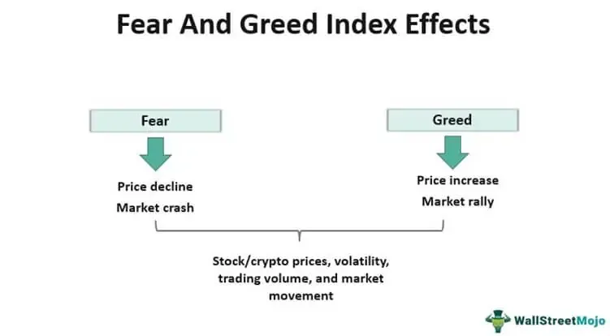

Investor sentiment plays a crucial role in determining the movements of the stock market. It reflects the collective emotions and attitudes of investors, which can significantly influence their buying and selling decisions. Understanding this sentiment is key for predicting market trends, as it can lead to fresh insights about potential bullish or bearish movements. One popular tool for gauging market sentiment is the Fear and Greed Index, which offers a snapshot of market emotions by measuring various factors such as volatility, stock price momentum, and the demand for safe-haven assets. This index ranges from 0, indicating extreme fear, to 100, indicating extreme greed.

Algorithmic trading, a strategy that employs computer programs to execute trades based on predefined criteria, often incorporates indicators like the Fear and Greed Index to enhance decision-making. By integrating sentiment indicators, algorithms can react to shifts in market emotions, thereby optimizing trading executions. The synergy between emotion-driven market indicators and algorithmic trading holds the potential to offer traders and investors a competitive edge. This article will explore the significance of investor sentiment, the function and usage of the Fear and Greed Index, and how these elements are applied in algorithmic trading to refine contemporary trading strategies.



## Table of Contents

## Understanding Investor Sentiment

Investor sentiment is a key element in the dynamics of financial markets. It encapsulates the aggregate attitude or mood of investors towards market conditions, influencing how assets are perceived and valued. This sentiment can be either positive or negative, reflecting optimism or pessimism, and is a critical driver of market trends. Positive sentiment typically correlates with rising markets, as investors feel confident and are more willing to buy assets, propelling prices upward. Conversely, negative sentiment can herald market declines, with investors opting to sell off assets, leading to falling prices or corrections.

Sentiment analysis is the methodological process of evaluating psychological and emotional factors that affect investor behavior. It provides insights into how collective emotions, such as fear or enthusiasm, can impact market dynamics. This analysis goes beyond mere price action, incorporating diverse inputs to evaluate sentiment comprehensively.

One common approach to measure investor sentiment is through surveys that query investors on their outlook and expectations. Popular surveys include the American Association of Individual Investors (AAII) Sentiment Survey and the University of Michigan Consumer Sentiment Index. These tools offer a direct measure of market mood and expectations.

Market data also plays a vital role in gauging sentiment. Analysts look at metrics such as trading volumes, the put-call ratio, and market breadth (the extent to which movement in the index is supported by movement in its components) to deduce sentiment levels. For example, a high trading volume accompanied by rising prices may indicate a bullish sentiment, while decreasing prices with high trading volumes might suggest bearish sentiment.

Another essential component in sentiment analysis is social media metrics. With the advent of digital communication platforms, online discussions and social media posts have become a rich source of data to assess collective investor mood. Advances in natural language processing and [machine learning](/wiki/machine-learning) have enabled the extraction of sentiment data from large volumes of text, offering real-time insights into market psychology. For example, the sentiment is frequently analyzed using machine learning algorithms that classify textual data into different sentiment categories, thereby providing a nuanced picture of investor sentiment.

In essence, understanding investor sentiment involves synthesizing quantitative data with qualitative assessments, offering a layered perspective on market movements and investor psychology. This understanding is invaluable for predicting shifts in market trends and making informed investment decisions.

 to the Fear and Greed Index

The Fear and Greed Index serves as a crucial barometer for assessing investor sentiment in the stock market. Developed by CNNMoney, this indicator amalgamates various market factors to provide a singular value depicting the prevailing emotional state of investors, ranging from extreme fear to extreme greed. The index evaluates seven distinct components: stock price [momentum](/wiki/momentum), stock price strength, stock price breadth, put and call options, market [volatility](/wiki/volatility-trading-strategies), safe haven demand, and junk bond demand. These components collectively reflect the underlying sentiment driving market behaviors.

Stock price momentum is gauged through the market's price movements in comparison to a set average, typically a 125-day moving average. Increased momentum can signify a greed-driven market, while dampened momentum may indicate fear. Stock price strength considers the [volume](/wiki/volume-trading-strategy) of stocks hitting 52-week highs and lows on the New York Stock Exchange, with higher frequencies of highs pointing to greed and lows signifying fear. Stock price breadth is measured by analyzing the advancing versus declining volume in the market, revealing the general market participation strength.

Options markets are also influential in sentiment analysis, specifically the put and call options ratio. An elevated ratio suggests fear, as investors hedge against potential downturns, while a lower ratio indicates greed. Another vital metric is market volatility, frequently assessed using the Volatility Index (VIX), where higher values depict uncertainty and fear. Conversely, the demand for safe haven assets, measured by the relative returns of stocks versus bonds, signals fear when investors favor bonds over equities. Lastly, junk bond demand evaluates the spread between yields on investment-grade bonds and junk bonds, with narrowing spreads symbolizing market confidence and expanding spreads indicating investor apprehension.

The index provides a comprehensive snapshot of market conditions by synthesizing these metrics into a single value on a scale from 0 to 100, representing states of extreme fear and extreme greed, respectively. Historical trends have demonstrated that market movements often intensify when the index approaches these extremities, offering investors an opportunity to make strategic decisions based on collective emotional states rather than isolated data points alone. By understanding the tendencies of market sentiment reflected through the Fear and Greed Index, investors can better navigate the complexities of stock market fluctuations.

## Role of the Fear and Greed Index in Algorithmic Trading

Algorithmic trading employs computer algorithms to execute trades based on predetermined criteria and strategies, often enabling trades at speeds and frequencies that are impossible for human traders. By integrating sentiment-based indicators like the Fear and Greed Index, [algorithmic trading](/wiki/algorithmic-trading) strategies can be enhanced with additional layers of market intelligence. The Fear and Greed Index helps traders understand the prevailing emotional sentiment of the market, providing a valuable perspective on potential market movements.

The Fear and Greed Index is particularly useful for these algorithmic systems as it distills complex market sentiment into a single numerical value that can trigger buy or sell signals. For example, when the index moves towards extreme fear (a value close to 0), algorithms can be programmed to buy, anticipating a potential upswing as market panic subsides. Conversely, when the index suggests extreme greed (a value close to 100), algorithms might automatically initiate sell orders to capitalize on anticipated downturns due to market overvaluation. 

To implement the Fear and Greed Index into algorithmic trading, a common approach involves [backtesting](/wiki/backtesting) strategies with historical sentiment data. Backtesting helps in assessing the effectiveness and reliability of a trading strategy by simulating trades based on past data. This process helps traders refine their algorithms, ensuring that they can handle various market conditions without succumbing to emotional biases. The formulae and code for backtesting might look as follows in Python:

```python
import pandas as pd

# Load backtesting data
data = pd.read_csv('market_data.csv')
fear_greed_index = data['fear_greed_index']

# Define strategy
def trading_strategy(index_value):
    if index_value < 20:
        return 'buy'
    elif index_value > 80:
        return 'sell'
    else:
        return 'hold'

# Backtest strategy
data['signal'] = fear_greed_index.apply(trading_strategy)

# Evaluate performance
initial_bal = 10000
balance = initial_bal
for i, signal in enumerate(data['signal']):
    if signal == 'buy':
        balance *= 1.02  # Hypothetical gain
    elif signal == 'sell':
        balance *= 0.98  # Hypothetical loss

```

However, one challenge algorithmic traders face when integrating the Fear and Greed Index is balancing sentiment-driven signals with other traditional market indicators. Sentiment signals, while informative, can sometimes lead to false positives due to market anomalies or unexpected global events. Thus, a comprehensive trading strategy often merges sentiment analysis with technical analysis and [fundamental analysis](/wiki/fundamental-analysis), creating a robust framework for decision-making that considers various market aspects.

In summary, the integration of the Fear and Greed Index into algorithmic trading can substantially enhance trading strategies by offering nuanced insights into market sentiment, potentially improving market entry and [exit](/wiki/exit-strategy) timing. Yet, the successful application hinges on robust backtesting and a well-rounded approach that balances sentiment with other critical market indicators.

## Benefits and Limitations of Using Sentiment Analysis in Trading

Sentiment analysis has emerged as an essential tool for traders, providing insights beyond what traditional market data can reveal. By examining the emotional and psychological factors driving market behavior, traders can better anticipate potential market movements. This predictive capability is a unique advantage of sentiment analysis, offering a window into the collective investor psyche. 

For instance, during periods when investor sentiment is overwhelmingly positive, there is often a concurrent increase in buying activity. Conversely, negative sentiment can signal impending sell-offs. This sentiment-connective framework is crucial for anticipating trends that might not be reflected purely in charts or balance sheets. This allows traders to make preemptive decisions, potentially maximizing returns or minimizing losses.

Despite its benefits, sentiment analysis is not devoid of challenges. One primary limitation is the volatility inherent in emotional responses. Sentiment can shift rapidly in reaction to external events such as geopolitical developments, economic reports, or unforeseen global crises. These swift changes make it difficult to rely solely on sentiment indicators for sustained trading strategies. 

Moreover, over-reliance on sentiment can result in an oversight of fundamental market aspects. Sentiment indicators may not fully capture the intrinsic value of assets or encompass broader economic conditions. Traders focused intensely on sentiment might overlook critical variables assessed through fundamental analysis, which considers financial statements, microeconomic factors, and broader economic indicators over a longer horizon.

Thus, an integrated approach that combines sentiment analysis with technical and fundamental analysis is often recommended. Such a strategy can effectively manage risk and offer a nuanced understanding of market conditions. This balanced approach allows traders to harness the predictive power of sentiment while grounding decisions in tangible data and market fundamentals. Modern trading platforms and algorithms can facilitate this synthesis, leveraging data analytics to provide comprehensive insights.

In conclusion, while sentiment analysis provides unique advantages in anticipating market trends driven by psychological factors, it necessitates a cautious and balanced application. When complemented by traditional trading techniques, it can significantly enhance decision-making efficacy in the ever-volatile landscape of financial markets.

## Case Studies and Examples

Investors and traders have increasingly relied on the Fear and Greed Index to strategically time their market entry and exit points. This index provides valuable insights into prevailing market sentiment, offering a guide on when to buy or sell based on emotional extremes. In recent years, algorithmic traders have leveraged these insights by creating scripts designed to capitalize on periods of extreme fear or greed.

For instance, during market phases of extreme fear, when the index hovers closer to 0, algorithmic trading systems may initiate buy orders, anticipating potential price recoveries as the market returns to a more neutral sentiment. Conversely, during periods of extreme greed, when the index approaches 100, these systems might trigger sell orders, expecting a market correction or downturn.

One historical example highlighting the effectiveness of sentiment-driven strategies occurred during the 2008 financial crisis. As fear gripped markets globally, the Fear and Greed Index indicated extreme fear, leading to oversold conditions. Savvy investors and algorithmic traders, recognizing these indicators, positioned themselves to capitalize on the subsequent market rebound.

Another significant instance was observed in late 2018, when fears of an economic slowdown resulted in a significant stock market selloff. During this period, the Fear and Greed Index recorded levels of extreme fear. Investors who utilized these sentiment cues were able to time their entries effectively, benefitting from the market's recovery in the following months.

Recent market cycles continue to demonstrate the utility of sentiment indicators. For example, throughout 2020 and 2021, the COVID-19 pandemic induced heightened volatility and rapid shifts in investor sentiment. Algorithmic traders utilized scripts and models that incorporated Fear and Greed Index readings to navigate these fluctuations, often with successful outcomes.

Despite these successes, there have also been notable challenges. Overreliance on sentiment indicators without considering fundamental market analysis can lead to suboptimal trades. For instance, during speculative bubbles, a high greed index might signal a potential correction, yet underlying market fundamentals could justify sustained growth, leading to premature exit strategies.

Lessons drawn from these experiences emphasize a balanced approach. Traders have learned that combining sentiment analysis with technical and fundamental evaluations offers a more comprehensive view, ultimately enhancing decision-making accuracy. This synthesis helps minimize risks associated with volatile sentiment shifts and ensures a strategic alignment with broader market conditions.

## Conclusion and Future Perspectives

Investor sentiment, along with instruments such as the Fear and Greed Index, are vital components for contemporary traders navigating the complexities of financial markets. These sentiment indicators provide insights into the underlying emotional states and collective behaviors of market participants, guiding traders in crafting strategies that align with prevailing market dynamics.

In recent years, the evolution of algorithmic trading has been closely intertwined with advancements in sentiment analysis. As more sophisticated data analytics tools and [artificial intelligence](/wiki/ai-artificial-intelligence) (AI) technologies emerge, the potential for enhanced sentiment-based trading strategies grows. Algorithms equipped with AI capabilities can process vast quantities of sentiment data from diverse sources, enabling traders to capture nuanced shifts in market mood more accurately and swiftly.

With the ongoing progression in AI and machine learning, future developments in sentiment analysis are likely to produce even more granular insights. This evolution promises to refine the precision of trading algorithms, allowing for real-time analysis of sentiment signals and more effective execution of trades. Enhanced sentiment data granularity will aid algorithms in differentiating between short-lived market reactions and genuine shifts in investor sentiment, thus optimizing trading outcomes.

Understanding and adapting to sentiment trends offer significant competitive advantages in the high-paced environment of modern investing. For traders and investors willing to integrate sentiment analysis comprehensively into their strategies, the potential to outperform traditional methodologies based solely on fundamental or technical analysis is substantial. As we move forward, those who leverage the growing capabilities of sentiment analytics will be better positioned to anticipate market movements, mitigate risks, and capitalize on emerging opportunities.

## References & Further Reading

[1]: ["Fear & Greed Index"](https://edition.cnn.com/markets/fear-and-greed) by CNNMoney

[2]: Barberis, N., & Thaler, R. (2003). ["A survey of behavioral finance."](https://www.nber.org/papers/w9222) Handbook of the Economics of Finance, Volume 1, Part B, 1053-1128.

[3]: Tetlock, P. C. (2007). ["Giving Content to Investor Sentiment: The Role of Media in the Stock Market."](https://onlinelibrary.wiley.com/doi/abs/10.1111/j.1540-6261.2007.01232.x) The Quarterly Journal of Economics, 122(3), 1145–1179.

[4]: Shiller, R. J. (2000). ["Irrational Exuberance."](https://press.princeton.edu/books/paperback/9780691173122/irrational-exuberance) Princeton University Press.

[5]: Bordino, I., Battiston, S., Caldarelli, G., Cristelli, M., Ukkonen, A., & Weber, I. (2012). ["Web Search Queries Can Predict Stock Market Volumes."](https://journals.plos.org/plosone/article?id=10.1371/journal.pone.0040014) PLOS ONE, 7(7), e40024.