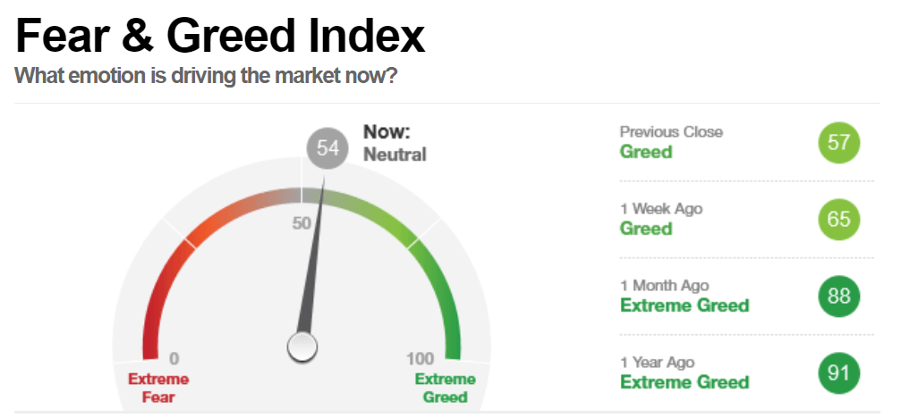

## Table of Contents

## What is the Fear and Greed Index?

The Fear and Greed Index is a tool that helps people understand the emotions driving the stock market. It measures how scared or excited investors are feeling about the market at any given time. The index uses a scale from 0 to 100, where a low number means investors are feeling a lot of fear, and a high number means they are feeling a lot of greed. This can help people make better decisions about buying or selling stocks.

The index looks at different things to figure out these feelings, like how much the stock market is going up or down, how many stocks are at their highest prices in a year, how people are feeling on social media, and how much people are buying or selling. By putting all this information together, the Fear and Greed Index gives a simple way to see if the market is being driven by fear or greed. This can be useful for anyone who wants to know more about what's moving the market and how to react to it.

## How is the Fear and Greed Index calculated?

The Fear and Greed Index is calculated by looking at several different things that show how investors are feeling. It uses seven main parts to figure out if people are scared or excited about the market. These parts include things like how much the stock market has moved recently, how many stocks are at their highest prices in the last year, how much people are putting into safe investments like bonds, how much people are buying or selling stocks, how people are feeling on social media, how many stocks are going up compared to down, and how much people are searching for certain words online.

Each of these parts is given a score from 0 to 100. A score of 0 means the market is very scared, and a score of 100 means it's very greedy. The final Fear and Greed Index number is the average of all these scores. This way, the index gives a simple number that shows if the market is being driven more by fear or by greed. By looking at this number, people can get a quick idea of the overall mood in the market and make better choices about buying or selling stocks.

## Why is the Fear and Greed Index important for investors?

The Fear and Greed Index is important for investors because it helps them understand how other people are feeling about the stock market. When a lot of people are scared, they might sell their stocks, which can make prices go down. On the other hand, when people are feeling greedy, they might buy a lot of stocks, pushing prices up. By knowing if the market is driven by fear or greed, investors can make smarter choices about when to buy or sell.

For example, if the Fear and Greed Index shows a lot of fear, it might be a good time to buy stocks because prices could be low. If the index shows a lot of greed, it might be a good time to sell because prices could be high and might go down soon. This way, the index can help investors find good times to make moves in the market and avoid making decisions based on their own emotions.

## What are the main components of the Fear and Greed Index?

The Fear and Greed Index looks at seven main things to figure out how investors are feeling. These include how much the stock market has gone up or down recently, how many stocks are at their highest prices in the last year, how much people are putting money into safe investments like bonds, how much people are buying or selling stocks, how people are feeling on social media, how many stocks are going up compared to down, and how much people are searching for certain words online. Each of these parts helps show if investors are scared or excited about the market.

By combining all these parts, the Fear and Greed Index gives a number from 0 to 100. A low number means investors are feeling a lot of fear, and a high number means they are feeling a lot of greed. This simple number helps people see the overall mood in the market and make better choices about buying or selling stocks. Knowing if the market is driven by fear or greed can help investors find good times to make moves and avoid making decisions based on their own emotions.

## How can the Fear and Greed Index be used to make investment decisions?

The Fear and Greed Index can help people make better choices about buying and selling stocks. If the index shows a lot of fear, it might be a good time to buy stocks. This is because when people are scared, they often sell their stocks, which can make prices go down. Buying when prices are low can be a smart move because prices might go back up later. On the other hand, if the index shows a lot of greed, it might be a good time to sell stocks. When people are feeling greedy, they often buy a lot of stocks, which can push prices up. Selling when prices are high can help people make more money before prices go down again.

Using the Fear and Greed Index can also help people avoid making choices based on their own feelings. Sometimes, people might feel scared or excited about the market and want to buy or sell quickly. But the index gives a clearer picture of what's really happening in the market. By looking at the index, people can see if others are feeling scared or excited too. This can help them make decisions that are based on facts, not just their own emotions. Knowing when to buy low and sell high, and not letting feelings get in the way, can make investing a lot easier and more successful.

## What historical patterns can be observed using the Fear and Greed Index?

The Fear and Greed Index can show us some interesting patterns when we look at it over time. When the index is very low, which means people are feeling a lot of fear, it often happens before the stock market starts to go up again. This is because when everyone is scared, they sell their stocks, making prices go down. But then, people who are less scared start to buy those cheap stocks, and the market begins to recover. For example, during big market crashes like the one in 2008, the Fear and Greed Index showed a lot of fear, and then the market started to go up again after a while.

On the other hand, when the index is very high, showing a lot of greed, it can mean that the market might go down soon. When everyone is excited and buying a lot of stocks, prices can get too high. Then, if something changes, people might start selling their stocks quickly, causing prices to fall. This pattern happened before the big market drop in 2000, when the dot-com bubble burst. By looking at these patterns, people can get a better idea of when might be good times to buy or sell stocks, based on how scared or excited everyone else is feeling.

## How does the Fear and Greed Index correlate with market performance?

The Fear and Greed Index can tell us a lot about how the stock market might do in the future. When the index shows a lot of fear, with a low number, it often means the stock market might start to go up soon. This is because when people are scared, they sell their stocks, making prices go down. But then, people who are less scared start buying these cheap stocks, and the market begins to recover. For example, during big market crashes like the one in 2008, the Fear and Greed Index was very low, showing a lot of fear, and then the market started to go up again after a while.

When the Fear and Greed Index is very high, showing a lot of greed, it can mean the stock market might go down soon. When everyone is excited and buying a lot of stocks, prices can get too high. Then, if something changes, people might start selling their stocks quickly, causing prices to fall. This happened before the big market drop in 2000, when the dot-com bubble burst. By looking at these patterns, people can get a better idea of when might be good times to buy or sell stocks, based on how scared or excited everyone else is feeling.

## Can the Fear and Greed Index predict market trends?

The Fear and Greed Index can help us guess what the stock market might do next, but it's not perfect. When the index shows a lot of fear, with a low number, it often means the stock market might start to go up soon. This is because when people are scared, they sell their stocks, making prices go down. But then, people who are less scared start buying these cheap stocks, and the market begins to recover. For example, during big market crashes like the one in 2008, the Fear and Greed Index was very low, showing a lot of fear, and then the market started to go up again after a while.

When the Fear and Greed Index is very high, showing a lot of greed, it can mean the stock market might go down soon. When everyone is excited and buying a lot of stocks, prices can get too high. Then, if something changes, people might start selling their stocks quickly, causing prices to fall. This happened before the big market drop in 2000, when the dot-com bubble burst. By looking at these patterns, people can get a better idea of when might be good times to buy or sell stocks, based on how scared or excited everyone else is feeling. But remember, the index is just one tool and it doesn't always predict the future exactly.

## What are the limitations of using the Fear and Greed Index?

The Fear and Greed Index can help us understand how people feel about the stock market, but it's not perfect. One big problem is that it only looks at the past and what's happening right now. It can't tell us for sure what will happen in the future. Just because the index shows a lot of fear or greed doesn't mean the market will always go up or down right away. Sometimes, other things can change the market, like big news or events that the index doesn't see coming.

Another issue is that the index is based on a few things, like how much the stock market is moving or what people are saying on social media. These things might not always show the whole picture. For example, if people are scared but still buying stocks for other reasons, the index might not catch that. Also, different people might react differently to the same level of fear or greed. So, while the Fear and Greed Index can be a useful tool, it's important not to rely on it too much when making choices about buying or selling stocks.

## How does the Fear and Greed Index vary across different markets globally?

The Fear and Greed Index can be different in various markets around the world because each market is influenced by its own set of news, events, and investor feelings. For example, if something big happens in the United States, like a change in interest rates, it might make the Fear and Greed Index for the U.S. market show a lot of fear or greed. But in another country like Japan, where the news might not affect them as much, their Fear and Greed Index might not change as much or might even show the opposite feeling.

Even though the basic idea of the Fear and Greed Index is the same everywhere, the way it's calculated might be a bit different in each country. This is because different markets look at different things to figure out how investors are feeling. For instance, in the U.S., the index might pay more attention to how much people are buying or selling stocks, while in Europe, it might focus more on how many stocks are at their highest prices in the last year. So, while the Fear and Greed Index can give us a good idea of how scared or excited investors are in different places, it's important to remember that these feelings can be different from one market to another.

## What advanced metrics or data sources are used in refining the Fear and Greed Index?

To make the Fear and Greed Index better, people use more advanced metrics and data sources. They look at things like how much people are searching for certain words online. This can tell us if more people are looking up words like "recession" or "bull market," which can show if they are scared or excited. They also use data from social media to see what people are saying about the market. If a lot of people are talking about how scared they are, the index might show more fear. Another thing they use is how much money is moving into or out of safe investments like bonds. If a lot of money is going into bonds, it might mean people are scared and want to keep their money safe.

Besides these, other advanced metrics include looking at how much the stock market is moving compared to what's normal. If the market is moving a lot more than usual, it might mean people are feeling more fear or greed. They also look at how many stocks are going up compared to how many are going down. If more stocks are going up, it might show greed, and if more are going down, it might show fear. By putting all these pieces together, the Fear and Greed Index can give a clearer picture of how investors are feeling, helping people make better choices about buying or selling stocks.

## How can algorithmic trading strategies be developed based on the Fear and Greed Index?

Algorithmic trading strategies can be developed using the Fear and Greed Index by setting up rules that tell a computer when to buy or sell stocks based on how scared or excited people are feeling. For example, if the index shows a lot of fear, meaning it has a low number, the computer can be programmed to buy stocks because prices might be low. On the other hand, if the index shows a lot of greed, with a high number, the computer can be told to sell stocks because prices might be high and could go down soon. By using these simple rules, the computer can make quick decisions without being influenced by emotions, helping to make smarter trades.

To make these strategies even better, the computer can look at more than just the Fear and Greed Index. It can also use other data, like how much the stock market is moving or what people are saying on social media, to get a fuller picture of the market. For instance, if the Fear and Greed Index shows fear but other signs suggest the market might stay stable, the computer might decide to wait before buying or selling. By combining the Fear and Greed Index with other information, [algorithmic trading](/wiki/algorithmic-trading) strategies can be more accurate and help make more money over time.

## References & Further Reading

[1]: ["Fear & Greed Index"](https://edition.cnn.com/markets/fear-and-greed) by CNNMoney

[2]: Barberis, N., & Thaler, R. (2003). ["A survey of behavioral finance."](https://www.nber.org/papers/w9222) Handbook of the Economics of Finance, Volume 1, Part B, 1053-1128.

[3]: Tetlock, P. C. (2007). ["Giving Content to Investor Sentiment: The Role of Media in the Stock Market."](https://onlinelibrary.wiley.com/doi/abs/10.1111/j.1540-6261.2007.01232.x) The Quarterly Journal of Economics, 122(3), 1145–1179.

[4]: Shiller, R. J. (2000). ["Irrational Exuberance."](https://press.princeton.edu/books/paperback/9780691173122/irrational-exuberance) Princeton University Press.

[5]: Bordino, I., Battiston, S., Caldarelli, G., Cristelli, M., Ukkonen, A., & Weber, I. (2012). ["Web Search Queries Can Predict Stock Market Volumes."](https://journals.plos.org/plosone/article?id=10.1371/journal.pone.0040014) PLOS ONE, 7(7), e40024.