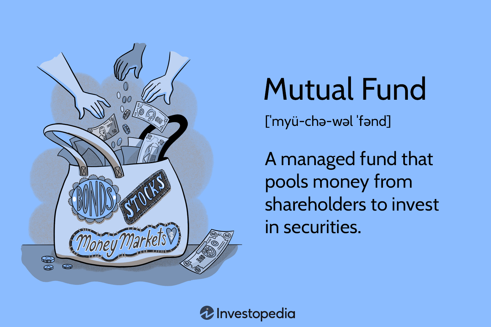

## Table of Contents

## What are mutual funds and how do they work?

Mutual funds are a type of investment where many people pool their money together to buy a variety of stocks, bonds, or other assets. This is managed by a professional who decides what to buy and sell. When you invest in a mutual fund, you are buying shares of the fund, not the individual stocks or bonds it holds. This makes it easier for people to invest in a diversified portfolio without having to pick each investment themselves.

The value of your investment in a mutual fund goes up or down based on how well the investments in the fund perform. If the stocks or bonds in the fund do well, the value of the fund increases, and so does the value of your shares. If they do poorly, the value of the fund and your shares goes down. Mutual funds also have fees, which are costs for managing the fund. These fees can affect your overall return, so it's important to understand them before investing.

## Can you make a living solely from trading mutual funds?

Yes, it is possible to make a living solely from trading mutual funds, but it can be challenging and risky. To do this, you would need to have a good understanding of the market and be able to pick mutual funds that perform well over time. You would also need to manage your investments carefully and be prepared for the ups and downs of the market. The returns from mutual funds can vary a lot, so you need to be ready to live with some uncertainty.

Making a living from trading mutual funds also requires a significant amount of capital to start with. This is because mutual funds often require a minimum investment, and you need to have enough money invested to generate enough income to live on. Additionally, you need to consider the fees associated with mutual funds, as these can eat into your profits. It's important to do your research and possibly consult with a financial advisor to see if this is a viable option for you.

## What are the risks involved in mutual fund trading?

Trading mutual funds can be risky because the value of the funds can go up and down a lot. This is called market risk. If the stocks or bonds in the mutual fund do not do well, the value of your investment can drop. This means you could lose money. Also, there is no guarantee that the fund manager will pick the right investments, which adds to the risk.

Another risk is that mutual funds have fees. These fees can be high and can reduce the amount of money you make from your investment. If the fees are too high, they might eat up all your profits. It's important to understand these fees before you start trading mutual funds.

Lastly, there is the risk of not being able to sell your mutual fund shares when you want to. This is called [liquidity](/wiki/liquidity-risk-premium) risk. Some mutual funds are harder to sell quickly than others. If you need your money back fast and can't sell your shares, this can be a problem. Always think about these risks before you decide to trade mutual funds.

## How much capital is needed to start trading mutual funds profitably?

The amount of capital you need to start trading mutual funds profitably can vary a lot. It depends on things like the minimum investment required by the mutual fund, how much you want to earn, and how much risk you are willing to take. Many mutual funds have minimum investments that can range from a few hundred to a few thousand dollars. To make a living from trading mutual funds, you would need to invest enough money to generate returns that can cover your living expenses. This often means you need a lot more than the minimum investment.

It's also important to think about the fees you will have to pay when trading mutual funds. These fees can eat into your profits, so you need to have enough capital to still make money after paying them. If you start with too little money, the fees might take up a big part of your returns, making it hard to be profitable. So, while it's possible to start with a small amount, having more capital can help you manage the risks and fees better, increasing your chances of trading mutual funds profitably.

## What are the key strategies for successful mutual fund trading?

To trade mutual funds successfully, it's important to pick the right funds. Look at the past performance of the fund, but remember that past results don't guarantee future success. Also, check the fees because high fees can eat into your profits. Diversify your investments by choosing different types of mutual funds, like those that invest in stocks, bonds, or a mix of both. This can help spread out the risk. 

Another key strategy is to keep an eye on the market and be ready to make changes to your investments. If a fund is not doing well, it might be smart to sell it and buy a different one that is doing better. But don't trade too often, because each trade can cost money in fees. It's also good to have a long-term plan. Mutual funds are often best for people who want to invest for many years, not just a few months. Patience can help you ride out the ups and downs of the market and potentially earn more over time.

## How does the performance of mutual funds compare to other investment options?

Mutual funds can be a good choice for people who want to invest their money but don't want to pick individual stocks or bonds. They offer a way to spread your money across many different investments, which can help lower your risk. Compared to investing in just one stock or bond, mutual funds can be safer because they are diversified. But, they might not grow as fast as some single stocks that do really well. Also, mutual funds have fees that can make your returns lower than if you had invested in something with lower costs, like an index fund or an [ETF](/wiki/etf-trading-strategies).

Compared to other investment options like real estate or starting your own business, mutual funds are usually less risky but might not offer the same high returns. Real estate can give you rental income and the chance for the property to go up in value, but it also needs a lot of money to start and can be hard to sell quickly. Starting a business can be very rewarding if it does well, but it's also very risky and can fail. Mutual funds are easier to buy and sell than real estate or a business, and they don't need as much work to manage. So, they can be a good middle ground for people who want to grow their money without taking on too much risk.

## What are the tax implications of earning income from mutual fund trading?

When you earn money from mutual fund trading, you have to pay taxes on your profits. There are two main types of taxes you might have to pay: capital gains tax and dividend tax. Capital gains tax is what you pay when you sell your mutual fund shares for more than you paid for them. If you hold the shares for less than a year, you pay a short-term capital gains tax, which is the same as your regular income tax rate. If you hold them for more than a year, you pay a long-term capital gains tax, which is usually lower. Dividend tax is what you pay on the money the mutual fund pays out to you from the earnings of the stocks or bonds it holds.

It's important to know that not all mutual funds are taxed the same way. Some mutual funds, like those that invest in municipal bonds, might be tax-free at the federal level, but you might still have to pay state taxes. Also, if you hold your mutual funds in a tax-advantaged account like an IRA or a 401(k), you might not have to pay taxes on your earnings until you take the money out. It's a good idea to talk to a tax advisor to understand how your mutual fund earnings will be taxed and how you can plan to pay less in taxes.

## How important is diversification in a mutual fund trading portfolio?

Diversification is very important when you trade mutual funds. It means spreading your money across different types of investments, like stocks, bonds, and other assets. When you diversify, you are less likely to lose a lot of money if one investment does badly. For example, if you only invest in tech stocks and the tech industry has a bad year, you could lose a lot. But if you also have money in other types of funds, like those that invest in healthcare or real estate, those might do better and help balance out your losses.

Having a mix of different mutual funds can also help you earn more money over time. Different types of investments do well at different times. By having a variety of mutual funds, you can take advantage of these ups and downs. This way, when one type of investment is not doing well, another might be doing better. Diversification doesn't guarantee you'll make money, but it can help you manage risk and possibly get better returns in the long run.

## What tools and resources are essential for effective mutual fund trading?

To trade mutual funds effectively, you need some important tools and resources. A good online brokerage account is key. This is where you can buy and sell mutual funds easily. Many brokerages also offer tools to help you research and pick the right funds. You should also use a financial news website or app to keep up with what's happening in the market. This can help you make smart choices about when to buy or sell your funds. Another useful tool is a portfolio tracker, which helps you keep an eye on how all your investments are doing.

It's also important to have some educational resources. Books, online courses, or even a financial advisor can teach you a lot about mutual funds and how to trade them well. Websites like Morningstar or the SEC's investor education site can give you good information about different funds and how they work. Lastly, having a clear investment plan and sticking to it can help you stay on track. This means knowing your goals, how much risk you're okay with, and how long you plan to invest. With these tools and resources, you can trade mutual funds more effectively.

## How can one analyze and select the best mutual funds for trading?

To analyze and select the best mutual funds for trading, you should start by looking at the fund's past performance. This means checking how well the fund has done over the last few years. But remember, just because a fund did well in the past doesn't mean it will do well in the future. You should also look at the fees the fund charges. High fees can eat into your profits, so try to pick funds with lower fees. Another important thing to consider is the fund's risk level. Some funds are riskier than others, so make sure the fund's risk matches what you're comfortable with.

You should also think about the fund's investment strategy. Some funds focus on certain types of stocks or bonds, like tech companies or government bonds. Choose funds that fit with your own investment goals. Diversification is also key. Instead of putting all your money into one type of fund, spread it across different types of mutual funds. This can help lower your risk. Lastly, use tools like Morningstar or your brokerage's research tools to compare different funds. These tools can give you a lot of helpful information to help you make a smart choice.

## What are the common mistakes to avoid in mutual fund trading?

One common mistake people make when trading mutual funds is not paying attention to fees. Mutual funds have different types of fees, like management fees and sales charges, which can really add up over time. If you don't watch out for these fees, they can eat into your profits and make it harder to make money. Another mistake is focusing too much on past performance. Just because a fund did well last year doesn't mean it will do well next year. It's better to look at the fund's overall strategy and how it fits with your goals.

Another big mistake is not diversifying your investments. Putting all your money into one type of mutual fund can be risky. If that type of fund does badly, you could lose a lot of money. It's smarter to spread your money across different types of funds to lower your risk. Also, some people trade too often, trying to time the market. This can lead to more fees and taxes, which can hurt your returns. It's usually better to have a long-term plan and stick with it.

## How do market conditions and economic cycles affect mutual fund trading strategies?

Market conditions and economic cycles can really change how you should trade mutual funds. When the economy is doing well, stocks usually go up, so you might want to put more money into stock mutual funds. But if the economy is slowing down or in a recession, bonds might be a safer bet. They don't go up as much when the economy is good, but they can help protect your money when things are bad. It's important to watch the news and understand what's happening in the economy so you can adjust your mutual fund trading strategy.

Economic cycles also affect how risky you want to be with your investments. In a growing economy, you might feel okay taking more risks because the chances of making money are higher. But when the economy is shaky, you might want to be more careful and move your money into less risky funds. This way, you can try to keep your money safe during tough times. Always keep an eye on economic indicators and be ready to change your strategy as the economy changes.

## References & Further Reading

[1]: Bergstra, J., Bardenet, R., Bengio, Y., & Kégl, B. (2011). ["Algorithms for Hyper-Parameter Optimization."](https://dl.acm.org/doi/10.5555/2986459.2986743) Advances in Neural Information Processing Systems 24.

[2]: ["Advances in Financial Machine Learning"](https://www.amazon.com/Advances-Financial-Machine-Learning-Marcos/dp/1119482089) by Marcos Lopez de Prado

[3]: ["Evidence-Based Technical Analysis: Applying the Scientific Method and Statistical Inference to Trading Signals"](https://www.amazon.com/Evidence-Based-Technical-Analysis-Scientific-Statistical/dp/0470008741) by David Aronson

[4]: ["Machine Learning for Algorithmic Trading"](https://github.com/stefan-jansen/machine-learning-for-trading) by Stefan Jansen

[5]: ["Quantitative Trading: How to Build Your Own Algorithmic Trading Business"](https://www.amazon.com/Quantitative-Trading-Build-Algorithmic-Business/dp/1119800064) by Ernest P. Chan