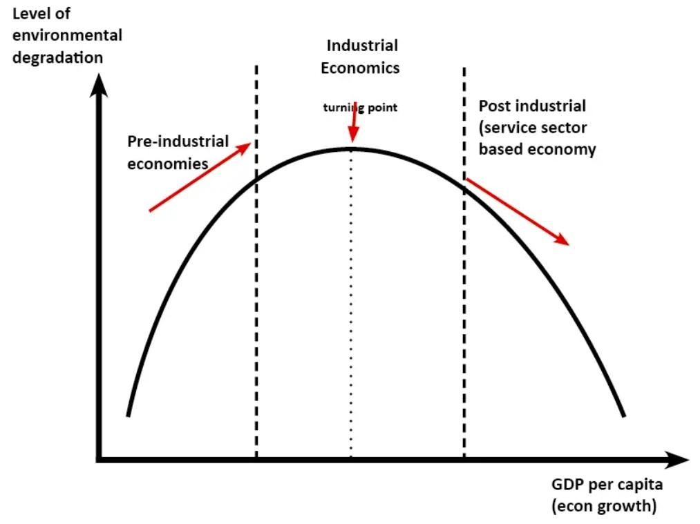

The intricate relationship between economic growth and sustainability presents a significant challenge, particularly on a planet with finite resources. Economic growth has been the cornerstone of modern development, enhancing living standards and accelerating technological advancements. However, the environmental repercussions of relentless pursuit of growth demand urgent attention. Finite natural resources and environmental degradation necessitate a shift towards sustainable practices that ensure long-term ecological balance while promoting economic prosperity.

Algorithmic trading, an emblem of technological advancement, has revolutionized modern economic systems by enhancing market efficiency and liquidity. Through the use of complex algorithms, vast amounts of trading decisions are executed at unprecedented speeds, transforming the financial landscape. Despite its benefits, algorithmic trading poses challenges such as market volatility and equitable access concerns. Understanding its role and implications is essential for aligning technological innovations with sustainable economic principles.

Balancing the demands of economic growth with the need for environmental sustainability is crucial. Economic systems must evolve to incorporate sustainable practices that respect ecological boundaries. This requires an interdisciplinary approach, integrating insights from economics, technology, and environmental science.

This article explores different aspects of economic development and sustainability. Initially, it delves into the historical context and current challenges of economic growth. Sustainable economic development principles and innovative models like the circular economy are examined. Subsequently, the steady-state economy model is discussed, alongside algorithmic trading's impact and the potential for aligning it with sustainable practices. The article also addresses strategies for balancing economic growth with environmental preservation, the role of technology, and collaborative efforts needed to foster sustainable development. Furthermore, it highlights challenges and opportunities in implementing sustainable economic models, bolstered by case studies. In conclusion, the necessity for embedding sustainability in economic paradigms and the potential role of algorithmic trading in promoting sustainable growth are emphasized, calling stakeholders to action towards prioritizing sustainability.

## Table of Contents

## Understanding Economic Growth

Economic growth refers to the increase in the production and consumption of goods and services, measured over a specified period, often represented as the percentage increase in a country's gross domestic product (GDP). Historically, economic growth has been pivotal in elevating the global standard of living, enabling improvements in healthcare, education, and infrastructure, and fostering technological advancements. The foundations of modern economic growth can be traced back to the Industrial Revolution in the 18th century, which marked a significant departure from agrarian economies to industrialized ones, leading to unprecedented increases in productivity and economic output.

The surge in the global standard of living is primarily attributed to the consistent pattern of economic growth over the past century. Innovations in technology, particularly during and after the Second World War, fueled massive industrial expansions and global trade, driving improvements in income levels, healthcare, education, and overall quality of life. For many countries, especially in the developed world, this period saw a shift from mere subsistence to comfort and, in many cases, affluence. However, this growth has not been uniform, with several developing nations still grappling with poverty and inequality despite overall global improvements.

The relentless pursuit of economic growth is not without challenges. Chief among these is the limitation posed by finite natural resources and the environmental degradation that accompanies unchecked growth. The excessive dependence on fossil fuels, deforestation, and over-exploitation of marine and terrestrial resources have contributed to environmental issues such as climate change, loss of biodiversity, and pollution. These phenomena threaten the ecosystems critical for human survival and underscore the pressing need to reconcile economic objectives with environmental sustainability.

Economic growth can be categorized primarily into two types: extensive and intensive. Extensive growth refers to an increase in the quantity of inputs, such as labor and capital, leading to higher overall output. This form of growth is typical in developing economies where untapped resources and labor can be mobilized to boost production. Intensive growth, on the other hand, involves enhancements in the efficiency of production processes and technological improvements that lead to increased outputs without necessarily expanding input quantitatively. Developed economies often experience intensive growth due to their focus on innovation, technological advancement, and improved labor productivity.

Understanding the dynamics of economic growth, particularly the balance between extensive and intensive growth, is critical in shaping policies that promote sustainable development. While growth has historically been synonymous with progress, the contemporary view emphasizes the need for a more inclusive and environmentally conscious approach that addresses the inherent limitations posed by our planet's finite resources.

## Sustainable Economic Development

Sustainable economic development is centered around balancing economic growth with environmental preservation, ensuring social equity, and efficiently utilizing resources. It is a guiding principle in reshaping economic systems to operate within the ecological boundaries of our planet while promoting prosperity and equity for current and future generations.

### Key Principles of Sustainable Economics

Sustainable economics is built on three interconnected pillars: economic viability, environmental protection, and social equity. These principles focus on meeting human needs and improving global living standards without compromising the natural systems essential for supporting life. The importance of these principles lies in their capacity to address the challenges of resource depletion, environmental degradation, and social inequalities, fostering resilience and adaptability in economies worldwide.

### The Role of Resource Efficiency

Resource efficiency plays a pivotal role in sustaining economic growth by optimizing the use of natural resources and minimizing waste and emissions. By enhancing energy efficiency and promoting the use of renewable resources, economies can decouple growth from environmental impacts. This approach not only reduces the ecological footprint of economic activities but also stimulates innovation and competitiveness. The implementation of resource-efficient practices contributes to reduced operational costs for businesses and decreases reliance on finite resources, securing a more sustainable future.

### Innovative Models like the Circular Economy

The circular economy model is an innovative framework that transforms traditional linear economic systems—where resources are consumed and waste is generated—into systems that prioritize regeneration and reuse. In a circular economy, products and materials are kept in use for as long as possible, through processes such as recycling, refurbishing, and remanufacturing. This approach minimizes waste and pollution while preserving the value of resources, thus promoting economic and environmental sustainability. The benefits of adopting a circular economy include reduced environmental impacts, decreased demand for new resources, and the creation of new business opportunities and jobs.

### Integrating Environmental Considerations into Economic Policies

Incorporating environmental considerations into economic policies is essential for achieving sustainable economic development. Policymakers can use a variety of strategies, such as implementing carbon pricing, establishing green taxes, and providing incentives for sustainable practices, to encourage businesses and consumers to make environmentally responsible choices. Environmental economic policies should also focus on protecting ecosystems and biodiversity, essential for maintaining the natural services that support economic activities. Engaging diverse stakeholders in the policy-making process ensures that environmental policies are comprehensive and effectively address the needs and challenges of different sectors.

Through these approaches, sustainable economic development promotes a holistic view of growth, aspiring to meet the needs of the present without compromising the ability of future generations to satisfy their own needs. By prioritizing sustainability, economies can be restructured to support long-term ecological balance, social equity, and economic prosperity.

## The Steady-State Economy Model

The steady-state economy is a concept in ecological economics that envisions a stable and sustainable economic system which ensures long-term equilibrium with the environment. Unlike traditional models that focus on perpetual growth, a steady-state economy is designed to operate within ecological limits, balancing human demands with the planet's capacity to regenerate resources and absorb waste.

At the core of the steady-state economy is the principle of maintaining a constant stock of physical capital and a stable population size. This model emphasizes sufficient and equitable distribution rather than continuous accumulation of wealth. It integrates key components such as sustainable resource management, waste minimization, and social well-being, thus acknowledging that economic operations must be ecologically sound.

Ecological balance is crucial for this model as it prevents the over-utilization of resources and environmental degradation. Activities are structured to ensure that the rate of resource consumption does not exceed the rate of natural replenishment. This often involves adopting renewable resource usage, energy efficiency, and technological innovations that minimize environmental impact.

The implementation of a steady-state economy offers numerous benefits. It fosters economic stability by reducing dependency on volatile resource markets and mitigating environmental risks associated with overconsumption. Socially, it aims to reduce inequality by advocating for equitable resource distribution and prioritizing public well-being over corporate profits. The model also promotes long-term resilience by preserving biodiversity and natural ecosystems, which are vital for maintaining life-supporting environmental services.

However, transitioning from traditional growth-centric models to a steady-state economy presents various challenges. The predominant economic structures are ingrained in growth paradigms that advocate increased production and consumption. Overcoming these entrenched systems requires substantial policy shifts, cultural changes, and redefined metrics of success beyond Gross Domestic Product (GDP). Economic, political, and social inertia can obstruct this transformation, necessitating coordinated efforts across all sectors including government, business, and civil society.

Further challenges involve convincing stakeholders of the long-term benefits over short-term gains prevalent in greed-driven growth models. It demands new governance frameworks that integrate ecological and economic goals, and potential reallocation of resources that might affect vested interests. Despite these hurdles, a steady-state economy offers a compelling alternative, combining economic stability with ecological integrity, ensuring a sustainable future for the planet and its inhabitants.

## Algorithmic Trading: Impact and Implications

Algorithmic trading involves the use of computer algorithms to execute trades based on predefined criteria. It emerged during the late 20th century as technological advancements allowed for high-frequency trading ([HFT](/wiki/high-frequency-trading-strategies)) and real-time data processing. Initially, [algorithmic trading](/wiki/algorithmic-trading) aimed to automate trading processes, reduce transaction costs, and capitalize on even small market inefficiencies.

Algorithmic trading enhances market efficiency and [liquidity](/wiki/liquidity-risk-premium) by increasing the [volume](/wiki/volume-trading-strategy) and frequency of trades. Algorithms can process large datasets rapidly, making trades that human traders might miss due to sheer volume. This increased activity reduces bid-ask spreads and market [volatility](/wiki/volatility-trading-strategies), contributing to efficient price discovery mechanisms. A study by Hendershott et al. (2011) indicated that algorithmic trading improves market quality by enhancing liquidity and adjusting prices to reflect information more promptly.

Despite its benefits, algorithmic trading poses challenges regarding market stability and equitable access. The speed and complexity of algorithms can trigger flash crashes, characterized by rapid price declines and recoveries, often in just minutes. For instance, the May 6, 2010, flash crash led to a brief loss of about $1 trillion in market value. Furthermore, the competitive advantages provided by high-frequency trading raise concerns about unfair access, as only firms with substantial resources can afford the necessary technology and expertise.

Algorithmic trading can also play a role in sustainable investment practices. By analyzing environmental, social, and governance ([ESG](/wiki/esg-investing)) data, algorithms can make informed trading decisions that align with sustainability goals. These decisions can steer capital towards companies that adhere to high ESG standards, thus supporting environmental and societal well-being. Algorithms can optimize portfolios to minimize carbon footprints or avoid investing in firms with poor environmental records.

While algorithmic trading offers a promising avenue for promoting sustainable financial practices, there remain significant hurdles. The framework for integrating ESG considerations into algorithms is still evolving, requiring robust ESG data and models that account for non-financial metrics. Moreover, the automation inherent in algorithmic trading necessitates strict regulatory oversight to ensure ethical standards and transparency are maintained. 

Overall, the implications of algorithmic trading encompass a spectrum from increased market efficiency to systemic risks, while offering potential pathways for integrating sustainable practices into modern financial systems.

## Balancing Economic Growth and Environmental Integrity

Balancing economic growth with environmental integrity involves implementing strategies that ensure development does not compromise ecological health. This balance is crucial for sustaining natural resources and preventing long-term environmental degradation.

One effective strategy is incorporating technology and innovation. Technological advancements can lead to increased resource efficiency, reduced waste, and the development of sustainable products and services. Innovations such as renewable energy technologies, energy-efficient processes, and waste-reducing mechanisms contribute to a more sustainable growth model. For instance, solar and wind power reduce reliance on fossil fuels, cutting greenhouse gas emissions.

Collaboration is also necessary for integrating sustainable economic practices. Cooperation among governments, businesses, non-governmental organizations, and civil society can facilitate knowledge exchange and the implementation of best practices. Collaborative efforts often lead to the development of environmental standards and certifications, encouraging companies to adopt environmentally friendly practices. Multilateral agreements, such as the Paris Agreement, reflect international collaboration efforts to address and mitigate climate change impacts.

Algorithmic trading presents potential in promoting sustainable investments. Algorithmic trading refers to the use of computer algorithms to manage trading activities quickly and efficiently. By incorporating environmental, social, and governance (ESG) criteria, algorithms can identify and prioritize sustainable investment opportunities. This approach encourages companies to improve their sustainability metrics to attract investments. Furthermore, algorithmic trading systems can process vast amounts of data, allowing for enhanced evaluations of companies' environmental impact and fostering transparency in sustainable performance.

To effectively align economic growth with environmental integrity, stakeholders must prioritize sustainable development, invest in technological innovations, and foster collaborative efforts. These strategies support creating a balanced economic system that accommodates both growth and environmental preservation.

## Challenges and Opportunities Ahead

Implementing sustainable economic models faces notable challenges, one of the primary barriers being the entrenched reliance on traditional growth paradigms that prioritize short-term gains over long-term sustainability. Economic systems frequently prioritize GDP growth without accounting for the degradation of natural capital, leading to unsustainable consumption and resource exhaustion. Moreover, transitioning to sustainable models requires substantial initial investments, which can deter businesses and governments, particularly in regions with limited financial resources. This predicament is exacerbated by the lack of widespread awareness and understanding of sustainability principles among policymakers and the general public, often resulting in resistance to change.

Despite these barriers, significant opportunities exist for innovation and global cooperation in promoting sustainable economic practices. Technological advancements present prospects for improving resource efficiency and reducing ecological footprints. For example, smart grid technologies enhance energy distribution efficiency, while innovations in agricultural methods, like precision farming, optimize resource utilization. Globally, cooperative frameworks such as the Paris Agreement demonstrate the potential for international collaboration in addressing sustainability challenges. These frameworks can be expanded to facilitate knowledge sharing, capacity building, and financing for sustainable initiatives across borders.

Examining case studies of successful sustainable practices further illustrates the potential for achieving economic and environmental goals concurrently. The implementation of renewable energy solutions in countries like Denmark, which has become a leader in wind energy, highlights the benefits of committing to sustainability. Similarly, Costa Rica's policies prioritizing forest conservation have resulted in significant biodiversity preservation and carbon sequestration, alongside economic advantages through eco-tourism.

The roles of policymakers, businesses, and society are pivotal in fostering change towards sustainable economic models. Policymakers can enact legislation that incentivizes sustainable practices and penalizes unsustainable behaviors. Introducing tax credits for renewable energy adoption or establishing stringent environmental regulations are examples of effective governmental interventions. Businesses, on their part, can adopt circular economy principles, minimizing waste and maximizing resource utilization. Corporate social responsibility initiatives can drive industry standards towards sustainability, encouraging competitors to prioritize eco-friendly practices.

Moreover, societal involvement remains crucial; public demand for sustainable products and practices can shift market dynamics favorably towards sustainability. Education and advocacy play critical roles in raising awareness about environmental issues and driving collective action.

In summary, while the shift toward sustainable economic models is fraught with challenges, the opportunities for innovation, collaboration, and societal engagement offer promising pathways. Addressing barriers requires concerted efforts from all stakeholders—governments, businesses, and communities—to cultivate a future where economic growth aligns harmoniously with environmental integrity.

## Conclusion

In an era characterized by mounting ecological concerns and finite planetary resources, the necessity of integrating sustainability into economic models has become increasingly clear. The conventional pursuit of unfettered economic growth is proving to be unsustainable in the long term due to its inherent dependency on resource exploitation and its contribution to environmental degradation. Thus, a paradigm shift towards economic models that prioritize ecological balance is imperative.

Algorithmic trading, a relatively recent advancement in financial markets, holds potential for promoting sustainable growth. As algorithms can process vast amounts of data swiftly, they are capable of identifying and acting upon sustainable investment opportunities. This technology, if applied correctly, could direct capital flows towards enterprises and projects that prioritize environmental, social, and governance (ESG) factors. Future algorithms could be designed to include sustainability metrics, thereby incentivizing companies to adopt sustainable practices to attract investment. Moreover, algorithmic trading could enhance transparency in markets, which is crucial for identifying and mitigating environmental risks associated with various investments.

Achieving a balance between economic growth and ecological health remains a multifaceted challenge. It necessitates an interdisciplinary approach involving technological innovation, economic policy reform, and societal shifts in consumption and production patterns. It is essential that this balance respects the earth's ecological limits while addressing human development needs. This aligns with the concept of a "doughnut economy", where economic activities are conducted within the boundaries of planetary health and social equity.

Stakeholders across all sectors must prioritize sustainable development to ensure a viable future. This call to action encompasses policymakers, businesses, financial institutions, and society at large to commit to sustainable practices. Policymakers are encouraged to enact policies that incentivize green technologies and penalize harmful environmental practices. Businesses have a role in adopting sustainable operations, and financial institutions can accelerate this transition by factoring ESG criteria into investment decisions.

In conclusion, integrating sustainability into economic models is not just beneficial but essential for safeguarding our planet's future. The smart application of algorithmic trading towards sustainability offers a beacon of hope, but it requires concerted efforts from all facets of society to realize its full potential. Embracing this responsibility is crucial for achieving a balanced coexistence between economic advancement and ecological stewardship.

## References & Further Reading

[1]: Hendershott, T., Jones, C. M., & Menkveld, A. J. (2011). ["Does Algorithmic Trading Improve Liquidity?"](https://onlinelibrary.wiley.com/doi/full/10.1111/j.1540-6261.2010.01624.x) American Economic Review, 101(1), 1-20.

[2]: Daly, H. E. (1991). ["Steady-State Economics: Second Edition With New Essays"](https://www.amazon.com/Steady-State-Economics-2nd-Herman-Daly/dp/155963071X) Island Press.

[3]: Raworth, K. (2017). ["Doughnut Economics: Seven Ways to Think Like a 21st-Century Economist"](https://www.amazon.com/Doughnut-Economics-Seven-21st-Century-Economist/dp/1603586741) Chelsea Green Publishing.

[4]: Pearce, D. W., & Turner, R. K. (1990). ["Economics of Natural Resources and the Environment"](https://archive.org/details/economicsofnatur0000pear) Johns Hopkins University Press.

[5]: Ellen MacArthur Foundation. (2013). ["Towards the Circular Economy Vol. 1: Economic and Business Rationale for an Accelerated Transition"](https://www.ellenmacarthurfoundation.org/towards-the-circular-economy-vol-1-an-economic-and-business-rationale-for-an)

[6]: Steffen, W., et al. (2015). ["Planetary boundaries: Guiding human development on a changing planet"](https://www.science.org/doi/10.1126/science.1259855) Science, 347(6223), 1259855.

[7]: Jackson, T. (2009). ["Prosperity Without Growth: Economics for a Finite Planet"](https://www.taylorfrancis.com/books/mono/10.4324/9781849774338/prosperity-without-growth-tim-jackson) Routledge.