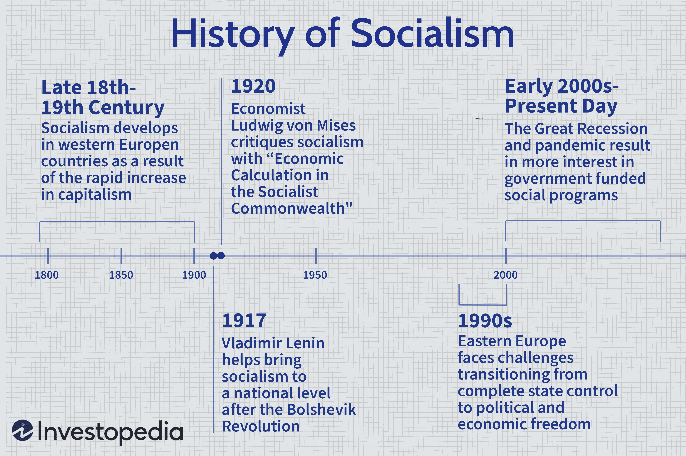

Political systems are structures that govern a country's social, economic, and political activities, shaping the policies that affect daily life. These systems define how power and resources are distributed and managed within a nation. They determine who makes decisions, how decisions are made, and how individuals and groups interact with each other and the state. Political systems range from democracies to authoritarian regimes, each with varying degrees of public involvement and state control. 

Socialism is a political and economic theory advocating for collective ownership and control over the means of production, rather than private ownership. It emphasizes equitable distribution of wealth and opportunities, aiming to reduce social inequalities. Socialist principles can manifest in various forms, including democratic socialism, where social ownership is achieved through democratic processes, and more centralized approaches with state control. In the U.S., socialism has historically been associated with efforts to expand social welfare and protect workers' rights, with figures such as Eugene V. Debs and movements that gained prominence in the early 20th century.

The historical context of socialism in the United States encompasses several waves of interest and support. In the early 20th century, the Socialist Party of America, led by influential figures like Debs, advocated for workers' rights and social ownership. Although socialism never gained mainstream political power, its ideologies influenced the formation of labor unions and the introduction of the New Deal in the 1930s, which included programs designed to enhance economic security. In recent years, socialist ideas have resurfaced in discussions around healthcare, education, and economic inequality, with political figures such as Bernie Sanders drawing attention to these issues.

Algorithmic trading, or algo trading, refers to the use of computer programs and algorithms to execute trades at high speeds and volumes, with minimal human intervention. It relies on quantitative models to determine the timing, price, and quantity of trades. This method has become increasingly relevant in financial markets due to its capability to analyze vast datasets and execute complex trading strategies more efficiently than human traders. Algorithmic trading can increase market liquidity, reduce transaction costs, and enhance the speed of trading, but also poses challenges such as market volatility and ethical concerns about fairness and transparency.

Exploring the intersection of socialism, political systems, and algorithmic trading in the U.S. context raises questions about how redistributive policies might interact with advanced financial technologies. As socialism emphasizes equitable resource distribution, it is critical to examine how these principles could influence the regulation and operation of algorithmic trading platforms. This evaluation also considers whether socialist policies might impose new frameworks for financial technology, impacting the development and implementation of algo trading strategies. Understanding this intersection is vital for grasping potential shifts in economic models and their implications for investors, policymakers, and society.

## Table of Contents

## Understanding Political Systems: A Focus on Socialism

Socialism is defined as a political and economic system where the means of production, distribution, and exchange are collectively owned or regulated by the community as a whole. The core principles of socialism include collective ownership, equitable distribution of resources, and the prioritization of social welfare over individual profit. Socialism seeks to diminish economic inequalities by redistributing wealth and ensuring that everyone has access to fundamental needs such as healthcare, education, and housing.

There are several forms of socialism, each with unique characteristics and levels of implementation across different countries. Democratic socialism combines political democracy with social ownership, aiming to preserve democratic systems while pursuing socialistic economic reforms. Sweden and Norway, with their extensive social welfare systems, are often cited as examples of democratic socialism in practice. On the other hand, Marxist-Leninist socialism, which emphasizes a central planning authority and the elimination of capitalist structures, has historically been exemplified by countries such as the former Soviet Union and Maoist China.

In contemporary U.S. political discourse, socialism has been a point of contention and debate, particularly with the emergence of political figures like Bernie Sanders and Alexandria Ocasio-Cortez, who advocate for policies reflecting democratic socialist values. These figures have brought discussions on healthcare reform, minimum wage increases, and wealth taxation to the forefront of American politics. The rise of such discourse has contributed to a broader understanding and, at times, acceptance of socialist principles, especially among younger demographics who are more open to alternative economic models.

However, socialism in the United States also faces significant opposition. Critics argue that socialist policies undermine individual freedoms and economic incentives by imposing heavy regulations and taxes. They warn that such policies could stifle innovation and economic growth, drawing parallels with historical instances where socialist systems led to economic inefficiencies or authoritarian governance. Prominent critics, such as economist Milton Friedman and conservative political groups, stress the importance of maintaining a free market system to ensure economic prosperity and individual liberty.

The evolving discourse around socialism in the United States represents a dynamic intersection of political ideologies, reflecting broader debates about the future of American economic and social policies. Understanding this interplay can provide valuable insights into the potential implications of socialist policies on the nation's political and economic landscape.

## Socialism in the United States: A Historical Perspective

Socialism in the United States has experienced fluctuating levels of influence and acceptance throughout its history, with roots dating back to the early 20th century. The socialist movement in America has been shaped by various notable figures and events, leaving a significant impact on national policies, particularly during critical periods like the New Deal era.

In the early 1900s, the rise of industrialization and labor movements laid the foundation for socialist ideas to gain traction. Eugene V. Debs, a key proponent of socialism, ran for the presidency multiple times as the candidate of the Socialist Party of America. Debs advocated for workers' rights and the collective ownership of production means, which resonated with many laborers and activists of the time.

The Great Depression of the 1930s marked a pivotal era for socialism in the U.S. The economic crisis revealed significant flaws in the capitalist system, prompting citizens and policymakers to consider alternative models. President Franklin D. Roosevelt's New Deal programs were influenced by socialist principles, as they focused on government intervention and social welfare. While not explicitly socialist, the New Deal introduced social security, unemployment insurance, and various labor protections, indicating a shift toward more collective economic measures.

Throughout the mid-20th century, socialist movements in the U.S. were often marginalized due to Cold War tensions and anti-communist sentiments. However, the Civil Rights Movement and opposition to the Vietnam War rekindled interest in socialist ideas, particularly among younger generations.

In recent decades, socialism has experienced a resurgence in American politics. Figures such as Bernie Sanders and Alexandria Ocasio-Cortez have brought democratic socialism into mainstream discourse, advocating for policies like Medicare for All and the Green New Deal. Their influence reflects growing concerns about economic inequality and environmental sustainability, issues that resonate with many Americans, especially younger voters.

The modern iteration of socialism in the U.S. focuses on integrating socialist principles within a democratic framework, emphasizing social justice, equitable resource distribution, and increased government involvement in addressing societal challenges. This resurgence illustrates an evolving political landscape where socialist ideologies continue to shape public debate and policymaking.

The impact of socialist movements in the United States underscores their historical significance and ongoing relevance in shaping national discourse, providing a lens through which to assess the intersection of politics and economic policy in a rapidly changing world.

## Exploring Algorithmic Trading (Algo Trading)

Algorithmic trading, often abbreviated as algo trading, refers to the use of computer algorithms to automate the process of buying and selling financial instruments in the markets. This approach relies heavily on mathematical models, advanced statistical methods, and computer programming to execute trades at speeds and frequencies unmanageable by human traders. The technological underpinnings of [algorithmic trading](/wiki/algorithmic-trading) mostly involve data analysis, historical data mining, and real-time market data processing to identify trading opportunities and execute trades based on pre-defined criteria.

In financial markets, algorithmic trading operates primarily through high-frequency trading ([HFT](/wiki/high-frequency-trading-strategies)) strategies, [arbitrage](/wiki/arbitrage), market-making, and trend-following. Algorithmic systems can monitor market conditions and execute orders across various exchanges within milliseconds, providing significant speed advantages. For instance, algorithms employ [statistical arbitrage](/wiki/statistical-arbitrage) to exploit short-term price inefficiencies between correlated financial instruments. Trend-following algorithms, on the other hand, utilize moving averages to determine optimal entry and [exit](/wiki/exit-strategy) points based on observed market trends.

Algo trading offers numerous advantages to investors. Among the key benefits are increased trade execution speed, reduced transaction costs due to minimized human intervention, and improved market [liquidity](/wiki/liquidity-risk-premium) as algorithms can facilitate more trades. Additionally, algorithms mitigate the impact of human emotions and errors in trading decisions. However, challenges remain, including the complexity of developing and maintaining robust algorithms and the potential for significant financial loss due to erroneous or unchecked algorithmic decisions. The so-called "flash crashes," where market values plummet due to the cascading effects of algorithms, represent a well-documented risk associated with algos.

The regulatory environment surrounding algorithmic trading in the United States is evolving, as authorities aim to balance innovation in financial technology with market stability and protection against systemic risks. The U.S. Securities and Exchange Commission (SEC) and the Commodity Futures Trading Commission (CFTC) play crucial roles in regulating algo trading activities. The SEC, for instance, mandates compliance with the Market Access Rule, requiring broker-dealers to implement risk controls and supervisory procedures. Similarly, the CFTC oversees the regulation of algo trading in derivatives markets through various initiatives, including proposing risk management frameworks for automated trading systems. These regulatory measures are designed to mitigate potential hazards associated with high-frequency and algorithmic trading while promoting transparency and fairness in financial markets.

In conclusion, advancements in technology have allowed algorithmic trading to become a predominant force in modern financial markets. While the benefits are considerable, investors and policymakers must remain vigilant in addressing the inherent challenges and ensuring a regulatory environment that supports innovation while preserving market integrity.

## The Intersection of Socialism and Algorithmic Trading

The intersection of socialism and algorithmic trading in the United States presents a dynamic space where political ideologies and technological advancements converge. Socialist policies particularly emphasize collective ownership and equitable distribution of resources. These principles could significantly influence the operational landscape of algorithmic trading (algo trading) within the country.

One of the primary impacts of socialist policies would be on redistributive economic strategies. If implemented, such policies might require financial technology and trading platforms to operate under stricter regulations aimed at reducing economic inequality. This could involve mandates for trading platforms to disclose their algorithmic strategies to ensure fairness and transparency, potentially affecting the proprietary nature of these technologies. For example, the introduction of higher taxes on short-term capital gains or trading profits can be envisioned, aiming to promote wealth redistribution in line with socialist principles. As a result, algo trading firms might need to recalibrate their strategies to accommodate these financial changes.

Socialist ideologies gaining traction could also lead to regulatory changes designed to protect smaller investors and ensure market stability. Such regulations may include limitations on high-frequency trading practices to curb market [volatility](/wiki/volatility-trading-strategies) or restrictions on leveraging to prevent systemic risks. Furthermore, the implementation of transaction taxes has been discussed in various political circles as a means to slow down excess trading and generate public revenue, aligning with socialist goals of wealth redistribution.

Ethical considerations arise from the blending of socialist frameworks with algorithmic trading. Socialist ethics focus on reducing disparities and ensuring fairness. Therefore, questions could be raised about the inherent nature of algo trading that often favors high-speed, well-capitalized participants, potentially exacerbating inequality. It's pertinent to consider whether trading algorithms should incorporate ethical constraints or guidelines that reflect equitable access and opportunities for all market participants, akin to public utilities subject to political oversight.

Moreover, as financial systems increasingly intertwine with societal values, there is a growing discourse on whether algo trading should adhere to social responsibility standards. This could involve algo trading firms focusing on environmentally and socially conscious investments, aligning their operations with broader societal goals as prescribed by socialist doctrines.

In conclusion, the intersection of socialism and algorithmic trading necessitates a reevaluation of how technology, capital, and regulatory frameworks interact. The potential for socialist policies to reshape the financial trading landscape in the U.S. might lead to more inclusive and equitable market conditions, although it also presents challenges in balancing innovation with social equity.

## Future Prospects: Socialism, Political Systems, and Algo Trading in the U.S.

The future of socialism in American politics and its potential impacts on financial markets is an intriguing prospect. Socialism, as a growing influence, might lead to policies that regulate financial markets more stringently, aiming to reduce income disparity through wealth redistribution mechanisms. Such policies could introduce taxes on financial transactions or impose limits on speculative trading, which might be embraced by segments advocating for greater market stability and fairness.

Advancements in technology further complicate this intersection as they constantly reshape the financial landscape. Blockchain, [artificial intelligence](/wiki/ai-artificial-intelligence), and [machine learning](/wiki/machine-learning) are not only enhancing trading efficiencies but are also redefining how financial systems operate. The integration of these technologies in algo trading continues to increase execution speed and accuracy, potentially challenging socialist policies that require greater oversight and transparency.

Emerging hybrid economic models could possibly blend socialist ideologies with sophisticated trading technologies. For instance, a socio-algorithmic approach might involve using algorithms to ensure equitable access to trading opportunities, or designing platforms that support cooperatively-owned financial ventures. Such innovations would necessitate new regulatory frameworks and potentially foster more inclusive financial environments.

Understanding the intersection of socialism, political systems, and advanced financial technologies is critical for investors and policymakers. As various political ideologies influence economic strategies, comprehending these dynamics will help in designing policies that harness technology for equitable growth while managing potential disruptions in financial markets. The interplay between these elements underscores the necessity for informed discourse, sustained research, and strategic foresight to navigate the future economic landscape effectively.

## Conclusion

This article explores the interplay between socialism, political systems, and algorithmic trading in the U.S., providing a comprehensive overview of their interconnectedness. Socialism, as a political and economic ideology, promotes collective ownership and equitable distribution of resources. Its influence on U.S. political discourse has both historical roots and contemporary relevance, reflected in the ongoing debates surrounding redistributive policies and their societal implications.

Algorithmic trading, with its technological foundation, represents a significant innovation in financial markets. Its ability to execute trades with precision has revolutionized investment strategies, though it brings challenges such as regulatory oversight and ethical considerations. The intersection of socialism and algorithmic trading is a compelling area of study, especially regarding potential regulatory shifts that could arise if socialist policies gain [momentum](/wiki/momentum) in the U.S.

This intersection highlights the importance of understanding how political ideologies shape financial environments. Changes in policy could significantly impact trading technologies and platforms, affecting investors and markets alike. Additionally, as technology continues to advance, the relationship between political systems and financial mechanisms will likely evolve. Hybrid economic models that fuse socialism with cutting-edge trading technologies may emerge as viable alternatives to existing systems.

Encouraging further research into this intersection is crucial for advancing our understanding of how political and economic theories can coexist with technological innovations. For readers interested in political economics and financial technologies, this exploration offers valuable insights into potential future developments in the U.S.

In conclusion, recognizing the dynamic interaction between socialism, political systems, and algorithmic trading provides valuable perspectives for investors and policymakers. Engaging in discourse and research on these topics will enhance our grasp of their implications, facilitating informed decision-making in an ever-evolving economic landscape.

## References & Further Reading

[1]: Bergstra, J., Bardenet, R., Bengio, Y., & Kégl, B. (2011). ["Algorithms for Hyper-Parameter Optimization."](https://papers.nips.cc/paper/4443-algorithms-for-hyper-parameter-optimization) Advances in Neural Information Processing Systems 24.

[2]: ["Advances in Financial Machine Learning"](https://www.amazon.com/Advances-Financial-Machine-Learning-Marcos/dp/1119482089) by Marcos Lopez de Prado

[3]: ["Evidence-Based Technical Analysis: Applying the Scientific Method and Statistical Inference to Trading Signals"](https://www.amazon.com/Evidence-Based-Technical-Analysis-Scientific-Statistical/dp/0470008741) by David Aronson

[4]: ["Machine Learning for Algorithmic Trading"](https://github.com/stefan-jansen/machine-learning-for-trading) by Stefan Jansen

[5]: ["Quantitative Trading: How to Build Your Own Algorithmic Trading Business"](https://www.amazon.com/Quantitative-Trading-Build-Algorithmic-Business/dp/1119800064) by Ernest P. Chan