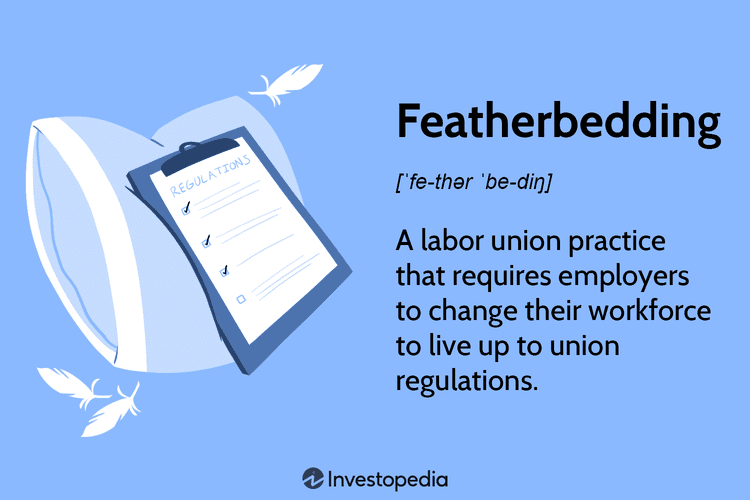

In a constantly evolving economic landscape, business practices and employment strategies are crucial topics for both companies and workers. Featherbedding labor practices have been a contentious issue between unions and employers for decades. This practice involves requiring employers to hire more workers than necessary, adhering to union rules or agreements. It aims to protect jobs, particularly in industries facing technological advancements and automation. Critics argue that featherbedding hinders efficiency and increases operational costs, while proponents claim it helps redistribute wealth within an organization.

At the intersection of employment tactics and modern trading methods is the advent of algorithmic trading. This method automates trading processes using advanced algorithms and software, enhancing market efficiency and liquidity. However, it also diminishes the demand for traditional trading roles, presenting an apparent clash with featherbedding practices. The interaction between these labor practices and algo trading presents a complex web of economic implications that affect companies, the stock market, and employment dynamics.

Understanding these dynamics is essential for companies, investors, and policymakers who navigate the challenges and opportunities they present. As employment and trading methods evolve, it is crucial to assess the economic impacts of featherbedding and to strike a balance that ensures both technological efficiency and job security. The ongoing dialogue between unions, employers, and regulatory bodies remains vital in navigating these complexities and positioning stakeholders for future success.

## Table of Contents

## Understanding Featherbedding Labor Practices

Featherbedding refers to the practice where employers are compelled to employ more workers than necessary, often due to union rules or agreements. This increases labor costs without necessarily boosting productivity. Historically, featherbedding has been associated with industries undergoing significant technological transformation, such as railroads, printing, and manufacturing. The motive behind this practice primarily roots in the protective instincts of unions to safeguard their members' jobs amid advancing automation and technological change.

For instance, in the railroad industry, unions have historically negotiated to maintain crew sizes that exceeded the operational requirements brought about by streamlined technologies. This action ensured job preservation for workers potentially displaced by automation but resulted in heightened payroll expenses for employers. Such scenarios underscore the tension between technological efficiency and job security.

Critics of featherbedding argue that it fundamentally undermines organizational efficiency. The additional workforce, being non-essential, does not contribute to enhanced productivity, which theoretically is calculated as:

$$
\text{Productivity} = \frac{\text{Output}}{\text{Labor Input}}
$$

In scenarios of featherbedding, while labor input increases, output may remain constant, consequently reducing overall productivity.

On the contrary, proponents of featherbedding suggest that this practice plays a role in redistributing income within an organization, thus ensuring broader workforce welfare. They argue that preserving employment through featherbedding can sustain consumer spending levels, which can be beneficial for economic stability. However, this comes at the expense of creating an operational environment less responsive to competitive pressures, which could hinder innovation and efficiency growth.

In conclusion, while featherbedding secures jobs and potentially safeguards workers' livelihood in the face of automation, it poses significant debates on efficiency and economic sustainability within affected industries.

## Economic Impacts of Featherbedding

Featherbedding labor practices primarily impact a company’s operational costs, leading to increased expenses without a corresponding rise in productivity. When businesses are compelled to hire more workers than necessary due to union agreements, labor costs rise significantly. This can be represented mathematically as:

$$
\text{Total Labor Costs} = \sum (\text{Wages}_i + \text{Benefits}_i) + \text{Featherbedding Cost}
$$

where $\text{Wages}_i$ and $\text{Benefits}_i$ represent the salaries and benefits of the necessary workforce, and $\text{Featherbedding Cost}$ is the additional expense due to surplus labor. This increase in operational costs can erode a company's competitive edge. 

Higher labor costs can reduce the firm's ability to price products competitively in the market. Businesses typically operate with profit margins that reflect both their cost efficiency and pricing strategy. Increased expenses due to featherbedding result in reduced net operating income, affecting metrics such as:

$$
\text{Operating Margin} = \frac{\text{Operating Income}}{\text{Revenue}}
$$

A lower operating margin, resulting from increased operational costs, can negatively influence a company’s stock performance. Investors analyze financial statements to gauge a company's health, and operational inefficiencies reflected in these documents can make the firm less attractive. When inefficiencies are high, reflected by reduced profitability ratios, investors may shy away from these stocks. This is particularly significant in industries where profit margins are already thin, and any additional costs could substantially impact overall profitability.

Investment deterrence is another possible consequence of featherbedding. Potential investors might regard inflated labor costs as a risk [factor](/wiki/factor-investing). In investment decision-making, potential returns are weighed against associated risks. Featherbedding introduces uncertainties about a firm’s ability to maintain competitive profitability, which could deter investment. This deterrence is particularly pressing for industries that rely heavily on innovation and efficiency to grow.

Overall, while featherbedding aims to protect employment, it challenges companies to control costs while maintaining productivity and investor confidence.

## Algorithmic Trading and Employment Tactics

Algorithmic trading, often referred to as algo trading, represents a technological evolution in the trading sector, characterized by the use of algorithms and sophisticated software to execute trades at speeds and efficiencies that far exceed human capabilities. The automation embedded in [algorithmic trading](/wiki/algorithmic-trading) systems enables the execution of large-[volume](/wiki/volume-trading-strategy) trades and complex strategies across global markets in mere milliseconds, an advantage that has significantly enhanced market [liquidity](/wiki/liquidity-risk-premium) and operational efficiency. As a result, these systems can react to market conditions with unparalleled speed, optimizing transaction costs and improving overall market dynamics.

Despite these advantages, algo trading introduces significant challenges, particularly concerning employment in traditional trading roles. The automation offered by algo trading reduces the necessity for floor traders, brokers, and other personnel traditionally associated with manual trading activities. This reduction in demand for human traders not only impacts employment levels but also necessitates a shift in required skills within the workforce, as firms increasingly value technical and analytical expertise over traditional trading acumen.

The juxtaposition between featherbedding practices and algorithmic trading underscores a critical tension within the labor market: the need to balance the preservation of employment against the pursuit of technological efficiency. Featherbedding, a practice ensuring more labor than necessary, contrasts sharply with the streamlined operations achieved through algorithmic trading. Consequently, organizations face complex decisions about workforce optimization—keeping employment levels stable may necessitate resistance to full automation, while embracing technological advancements can lead to significant labor reductions.

As organizations navigate these competing priorities, they must remain cognizant of labor regulations that govern employment practices. For firms engaged in algo trading, understanding and adapting to these regulations is crucial. Compliance not only involves adhering to trading rules and standards but also ensuring that employment practices do not contravene protections offered to workers, potentially mitigating the adverse effects of automation-induced job displacements.

Overall, while algorithmic trading offers substantial efficiency and market benefits, its integration into financial markets necessitates thoughtful consideration of employment implications and regulatory constraints. Successful navigation of these challenges requires companies to harmonize technological adoption with socially responsible labor practices, aligning operational efficiency with a sustainable workforce strategy.

## Striking a Balance: The Role of Regulation

Regulatory bodies play a critical role in balancing the demands of technological advancement with the need for fair labor practices. In the United States, the National Labor Relations Board (NLRB) is one such institution that mediates between unions and employers, helping to navigate the often contentious terrain of featherbedding. By enforcing labor laws, the NLRB helps ensure that employers adhere to fair practices, which can limit the potential negative impacts of featherbedding. This practice of mandating higher employment levels than necessary can lead to increased costs without commensurate productivity gains. Regulations are thus vital in ensuring that companies do not exploit the system or place undue financial strain on their operations, while simultaneously protecting workers' rights and promoting equitable employment conditions.

Striking a balance between job security and technological growth is imperative for sustainable economic progress. As industries evolve and automation becomes increasingly prevalent, regulatory frameworks must adapt to address the changing landscape. This is particularly crucial as sectors incorporate more advanced technologies, such as algorithmic trading in financial markets. Here, the reduction in demand for traditional roles is evident, presenting a challenge in maintaining employment levels without hindering technological efficiency. Regulations that define and enforce standards for transparency and ethical trading practices are essential. Such provisions ensure that the benefits of technological advancements are equitably distributed and that market integrity is upheld.

Moreover, regulations that promote transparency in algorithmic trading can help mitigate risks associated with high-frequency trades and ensure that these trading methods do not lead to unfair market practices or systemic instability. By implementing standards that require firms to disclose their trading algorithms and strategies, regulatory bodies can enhance market fairness and protect individual investors from the potential adverse effects of technology-driven trading disruptions.

Overall, the role of regulation is crucial in achieving a harmonious integration of labor practices and technological advancements. Regulatory bodies must continue to evolve alongside technological progress to provide a framework where both economic growth and workers' rights are preserved. Through ongoing oversight and adaptation, stakeholders can ensure that the benefits of new technologies are realized while maintaining a fair and equitable workplace.

## Conclusion

Featherbedding labor practices and algorithmic trading represent key aspects of contemporary employment and economic strategies, each posing distinct challenges and potential advantages. On one hand, featherbedding seeks to uphold job security, yet it can introduce inefficiencies and inflate operational costs. On the other hand, algorithmic trading optimizes market operations and enhances liquidity but can reduce traditional trading roles, prompting concerns over job displacement.

These contrasting elements underscore the necessity for constructive dialogue among companies, workers, and policymakers to strike a balance between maintaining employment levels and harnessing technological advancements. Effective regulatory oversight remains crucial for navigating and managing the impacts of these practices. Regulations can mitigate the negative effects of featherbedding by ensuring fair labor practices and can guide algo trading by setting standards for transparency and ethical conduct.

Understanding these dynamics is pivotal for stakeholders aiming to align their strategies with modern economic conditions. By adapting to evolving practices, companies can sustain competitiveness, workers can secure favorable employment conditions, and policymakers can facilitate environments conducive to both innovation and economic stability. Such adaptability will ultimately enable a more robust and sustainable economic ecosystem for the future.

## References & Further Reading

[1]: ["Featherbedding: Historical and Economic Analysis"](https://www.jstor.org/stable/2521240?read-now=1) by Robert G. Gallamore, Journal of Economic History.

[2]: Dufresne, A. (1981). ["The Featherbedding Problem: A Study of Wage and Employment Practices in the Railroad Industry"](https://www.jstor.org/stable/pdf/1818498.pdf). Journal of Economic History, 41(2), 279-303.

[3]: ["The Impact of Automation on Employment: Just the Facts"](https://www.mdpi.com/2071-1050/10/5/1661) by Brookings Institution.

[4]: Huang, Wei, and Andrew W. Lo. (2000). ["The Simple Rules of Exchange Rate Forecasting"](https://www.researchgate.net/profile/Andrew-Lo-5) NBER Working Paper Series, Working Paper No. 250.

[5]: ["The High-Frequency Trading Debate: Perspectives from Industry and Policy"](https://onlinelibrary.wiley.com/doi/full/10.1111/joes.12434) by Reuters.

[6]: National Labor Relations Board (NLRB). ["Protecting Employees, Employers, and the Public around Employee Rights and Fair Labor Practices"](https://en.wikipedia.org/wiki/National_Labor_Relations_Board).

[7]: O'Hara, M. (2015). ["High-Frequency Trading and Its Impact on Markets"](https://rpc.cfainstitute.org/research/financial-analysts-journal/2014/high-frequency-trading-and-its-impact-on-markets) Annual Review of Financial Economics, Vol. 7: 133-152.

[8]: ["Market Efficiency and High-Frequency Trading"](https://www.globalmainstreamjournal.com/index.php/IJBM/article/view/166) by Jonathan Brogaard, Terrence Hendershott, and Ryan Riordan, Financial Review. 

[9]: ["Global Perspectives on Featherbedding and Its Economic Implications"](https://www.jstor.org/stable/pdf/2521240.pdf) by Brown University Department of Economics.