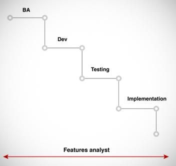

## Table of Contents

## What is a feature analyst?

A feature analyst is someone who looks at data to find important details and patterns. They work in many fields, like business, technology, and science. Their job is to collect data, study it, and then explain what they find to others. This helps companies make better decisions and improve their products or services.

Feature analysts use special tools and methods to analyze data. They might use software to sort through large amounts of information and find trends. After they find these trends, they make reports or presentations to share their findings. This helps people understand complex data in a simple way, so they can use the information to solve problems or make plans for the future.

## What are the primary responsibilities of a feature analyst?

A feature analyst's main job is to gather and look at data to find important patterns and details. They use special tools and software to go through a lot of information quickly. This helps them see trends that might not be easy to spot at first. They also need to make sure the data they are working with is correct and useful for what they need to do.

Once they have analyzed the data, feature analysts need to share what they found with others. They do this by making reports or giving presentations. They have to explain the data in a way that is easy to understand, so people who are not experts in data can still use the information. This helps companies make better choices about their products or services, and plan for the future.

In some cases, feature analysts might also help decide which features of a product or service are most important to customers. They use their data analysis skills to figure out what people like or need. This can lead to changes or improvements in what the company offers. By doing this, feature analysts play a key role in helping businesses grow and succeed.

## What skills are required to become a feature analyst?

To become a feature analyst, you need to be good at looking at data and finding patterns. This means you should know how to use special computer programs that help you sort through a lot of information quickly. You also need to be able to check if the data you are working with is correct and useful. Being good at math and understanding numbers is important too. You should also be able to think in a logical way and solve problems as you find them in the data.

Another important skill is being able to explain what you find to others. This means you need to be good at writing reports and making presentations. You should be able to take complex data and explain it in a simple way that anyone can understand. Good communication skills are key because you will need to work with other people in the company and help them make decisions based on the data you analyzed.

Lastly, it helps to be curious and always wanting to learn more. The world of data is always changing, and new tools and methods are always coming out. Being able to learn and adapt to these changes will make you a better feature analyst. Also, knowing a bit about the field you are working in, like business or technology, can help you understand the data better and make your analysis more useful.

## How does a feature analyst contribute to product development?

A feature analyst helps product development by looking at data to find out what customers want and need. They use special tools to study information about how people use the product and what they like or don't like about it. This helps the team know which parts of the product are important and need to be improved. By understanding customer behavior and preferences, the feature analyst can suggest changes that will make the product better and more useful for people.

Once the feature analyst finds important patterns in the data, they share their findings with the product development team. They make reports and presentations that explain the data in a simple way, so everyone can understand. This helps the team decide what features to add or change in the product. By using the insights from the feature analyst, the team can create a product that meets customer needs and stands out in the market.

## What tools and technologies are commonly used by feature analysts?

Feature analysts use many tools and technologies to help them look at data. Some common ones are Microsoft Excel and Google Sheets, which are good for organizing and analyzing data. They also use more advanced software like SQL for working with databases and Python or R for doing complex data analysis. These tools help feature analysts sort through a lot of information quickly and find important patterns and trends.

Another important set of tools are data visualization programs like Tableau and Power BI. These help feature analysts make charts and graphs that show data in a way that is easy to understand. This is really helpful when they need to share their findings with others. Feature analysts might also use special software for tracking customer behavior, like Google Analytics, to see how people use a product or service.

Overall, the tools and technologies used by feature analysts are always changing and improving. They need to keep learning about new tools to stay good at their job. By using these tools, feature analysts can make sure they are looking at the data in the best way possible and helping their company make smart decisions.

## How does a feature analyst gather and analyze user data?

A feature analyst gathers user data by using different tools and methods. They might use surveys, customer feedback forms, or software like Google Analytics to collect information about how people use a product or service. They also look at data from databases using tools like SQL to find out more about user behavior. Once they have all this information, they organize it so they can start analyzing it.

After gathering the data, a feature analyst uses special programs to analyze it. They might use Excel or Google Sheets to sort through the data and find patterns. For more complex analysis, they could use programming languages like Python or R. They look for trends and important details that can help the company understand what users want. Once they find these patterns, they make reports or presentations to share their findings with the team, so everyone can use this information to improve the product or service.

## What is the difference between a feature analyst and a product manager?

A feature analyst and a product manager both help make products better, but they do different jobs. A feature analyst looks at data to find out what customers want and need. They use special tools to study information about how people use the product and what they like or don't like about it. This helps the team know which parts of the product are important and need to be improved. By understanding customer behavior and preferences, the feature analyst can suggest changes that will make the product better and more useful for people.

On the other hand, a product manager is in charge of the whole product. They make plans for the product, decide what features it should have, and make sure it gets made on time. The product manager uses the information from the feature analyst to help make these decisions. They work with different teams, like the design team and the engineering team, to bring the product to life. While the feature analyst focuses on data and analysis, the product manager looks at the bigger picture and leads the product from start to finish.

## How do feature analysts prioritize features in product development?

Feature analysts help decide which features are most important for a product by looking at data about how people use it. They use special tools to find out what customers like and need. By studying this data, they can see which features people use a lot and which ones they don't care about. They also look at feedback from users to see what they want changed or added. This helps them understand what will make the product better for everyone.

Once they have all this information, feature analysts make a list of features sorted by how important they are. They think about things like how much a feature will help the product and how hard it will be to add it. They share this list with the product team, who then decide what to work on next. By using data to guide these decisions, feature analysts make sure the product gets the changes that will make it more useful and popular with customers.

## What are some common challenges faced by feature analysts?

Feature analysts often face the challenge of dealing with a lot of data. They need to sort through huge amounts of information to find the important patterns and trends. This can be hard because not all data is good or useful. They have to make sure they are using the right data and that it is correct. Sometimes, the data they need might not be easy to get, so they have to find new ways to collect it.

Another challenge is explaining what they find to others. Feature analysts need to take complex data and make it simple so everyone can understand it. They have to write reports and give presentations that clearly show what the data means. This can be tough because not everyone is good at understanding numbers and charts. They also have to work with different teams, like product managers and developers, who might have different ideas about what is important.

Lastly, feature analysts need to keep up with new tools and methods. The world of data is always changing, and new software and ways of analyzing data come out all the time. They have to learn these new things to stay good at their job. This means they need to be curious and always ready to learn. It can be hard to keep up, but it is important for helping their company make the best decisions.

## How can a feature analyst measure the success of a feature?

A feature analyst measures the success of a feature by looking at data about how people use it. They check things like how many people use the feature, how often they use it, and if it helps them do what they need to do. They might also look at feedback from users to see if they like the feature and if it makes the product better for them. By studying this information, the feature analyst can tell if the feature is working well and making people happy.

Sometimes, feature analysts also look at how the feature affects other parts of the product. They see if it makes people use the product more or if it helps the company make more money. They use special tools to gather all this data and then make reports to share what they find. This helps the product team know if they should keep the feature, change it, or maybe even remove it if it's not helping.

## What advanced techniques can feature analysts use to optimize feature performance?

Feature analysts can use advanced techniques like A/B testing to optimize feature performance. A/B testing means showing different versions of a feature to different groups of users and seeing which one works better. By doing this, feature analysts can find out what changes make the feature more useful or popular. They also use machine learning to predict how people might use a feature in the future. This helps them make the feature better before it even goes out to everyone.

Another technique is cohort analysis, where feature analysts look at how different groups of users interact with the feature over time. This helps them see if the feature is more popular with certain types of users and why. They can then make changes to the feature to make it better for everyone. By using these advanced methods, feature analysts can make sure the feature is as good as it can be and really helps the product succeed.

## How do feature analysts stay updated with industry trends and user needs?

Feature analysts stay updated with industry trends and user needs by always learning and looking at new information. They read articles, reports, and blogs about their field to know what is happening. They also go to conferences and workshops where people talk about the latest ideas and technologies. By doing this, feature analysts can understand what is new and important in their industry. They also talk to other people in their field to share ideas and learn from each other.

Another way feature analysts keep up is by listening to what users say. They use tools like surveys and feedback forms to find out what people like and need. They also look at data about how people use the product to see what is working well and what could be better. By paying attention to user feedback, feature analysts can make sure they are working on features that really help people. This helps them stay in touch with what users want and need, so they can keep making the product better.

## References & Further Reading

[1]: Bergstra, J., Bardenet, R., Bengio, Y., & Kégl, B. (2011). ["Algorithms for Hyper-Parameter Optimization."](https://papers.nips.cc/paper/4443-algorithms-for-hyper-parameter-optimization) Advances in Neural Information Processing Systems 24.

[2]: ["Advances in Financial Machine Learning"](https://www.amazon.com/Advances-Financial-Machine-Learning-Marcos/dp/1119482089) by Marcos Lopez de Prado

[3]: ["Evidence-Based Technical Analysis: Applying the Scientific Method and Statistical Inference to Trading Signals"](https://www.amazon.com/Evidence-Based-Technical-Analysis-Scientific-Statistical/dp/0470008741) by David Aronson

[4]: ["Machine Learning for Algorithmic Trading"](https://github.com/stefan-jansen/machine-learning-for-trading) by Stefan Jansen

[5]: ["Quantitative Trading: How to Build Your Own Algorithmic Trading Business"](https://books.google.com/books/about/Quantitative_Trading.html?id=j70yEAAAQBAJ) by Ernest P. Chan