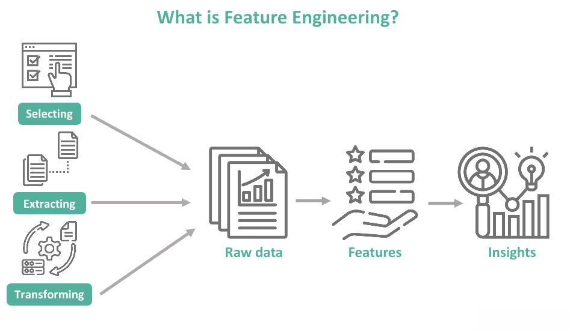

Algorithmic trading has significantly reshaped the financial markets by employing advanced computational techniques and data analytics. This evolution has enabled traders to execute orders faster and more efficiently than traditional trading methods. A fundamental aspect of optimizing algorithmic trading strategies is feature engineering—the process of transforming raw data into informative variables that can improve predictive models. These refined variables, or "features," are pivotal in capturing market dynamics and enhancing trading strategies’ overall performance.

Central to feature engineering is the role of feature analysts. These professionals specialize in selecting and refining features to maximize a model's predictive capability and robustness. Their work requires a deep understanding of both financial markets and advanced statistical methods, enabling them to choose features that best represent underlying market signals and trends.

This article explores the role of feature analysts in algorithmic trading, aiming to highlight their critical contribution to the field. We will discuss their responsibilities, such as data cleaning, feature selection, dimensionality reduction, and feature creation—tasks that ensure trading models are equipped with high-quality inputs.

Feature analysts are essential in achieving trading success as they collaborate closely with quantitative researchers and data scientists. They improve model performance by identifying and engineering impactful features, thus bolstering the predictive power of trading algorithms. As trading environments are constantly evolving, feature analysts face ongoing challenges, including adapting to market changes and maintaining the long-term effectiveness of features.

This discussion will also cover key strategies employed by feature analysts to overcome these challenges, ensuring that trading models remain pertinent and advantageous in current market conditions. By addressing these elements, the article captures the essence of feature analysts' role in creating more dynamic, data-driven trading environments.

## Table of Contents

## Understanding the Role of Feature Analysts

Feature analysts serve as a vital link between data science and finance, focusing on converting raw data into actionable insights for [algorithmic trading](/wiki/algorithmic-trading). Their role is pivotal in ensuring that trading models are equipped with high-quality inputs, which are essential for effective decision-making.

One of the core responsibilities of feature analysts is data cleaning. This involves identifying and rectifying inaccuracies and inconsistencies in the data, thus ensuring that the inputs into trading models are accurate and reliable. Clean data is foundational to any data-driven approach, as errors and noise can significantly distort model outcomes.

Feature selection is another critical task handled by feature analysts. This process involves identifying the most relevant attributes from a larger dataset, thus reducing the dimensionality and complexity of the model without compromising accuracy. Techniques such as correlation analysis, mutual information, and feature importance scores calculated through tree-based algorithms are commonly employed. By selecting the most informative features, analysts can enhance the model's focus, thereby increasing its predictive accuracy.

Dimensionality reduction is employed to manage large datasets by reducing the number of random variables under consideration. Methods such as Principal Component Analysis (PCA) and t-Distributed Stochastic Neighbor Embedding (t-SNE) help in retaining the essential characteristics of the data while discarding redundant or irrelevant information. This step is crucial in maintaining computational efficiency and preventing the curse of dimensionality.

Feature creation, or feature engineering, involves the generation of new attributes from the existing dataset to enhance model performance. This might include calculating financial ratios, aggregating transactional data, or encoding categorical variables. A well-engineered feature set can significantly improve model accuracy by revealing hidden patterns or refining existing data interpretations.

Collaboration with quantitative researchers and data scientists is essential for feature analysts. This collaboration involves iterative experimentation and model tuning to ensure optimal performance. By working together, they can leverage broader expertise, leading to more robust model designs that capitalize on diverse market factors.

To excel, feature analysts must combine a robust understanding of market dynamics with statistical methodologies. This includes knowledge of trading practices, economic indicators, and financial instruments, along with proficiency in statistical tools and algorithms. Such expertise enables them to identify features that truly capture market movements, ultimately boosting the predictive power of trading algorithms.

## Importance of Features in Algorithmic Trading

Features are the building blocks of algorithmic trading models, and their selection and engineering play a critical role in determining the model's efficacy and accuracy. Properly engineered features have the capacity to capture market trends and patterns, which can lead to more informed and strategic trading decisions. The process of developing these features is an integral part of building a robust algorithmic trading strategy.

A key part of this process is ensuring the quality and relevance of the features used within the models. High-quality features can significantly influence the robustness and profitability of an algorithmic trading strategy. To achieve this, feature analysts employ a variety of techniques such as data normalization, principal component analysis (PCA), and encoding to optimize model inputs. Normalization helps in scaling the features to a consistent range, which is crucial for algorithms that are sensitive to the magnitude of data. PCA reduces dimensionality by identifying the most important components of the data, thereby simplifying the model without losing critical information.

Moreover, there is a significant emphasis on feature importance and selection. The primary goal is to reduce overfitting, which occurs when a model becomes too complex and captures noise in the data rather than the underlying trend. By focusing on selecting relevant features, feature analysts aim to maximize returns and enhance the predictive accuracy of trading algorithms. This involves continuously assessing which features contribute most to the model's predictive power and discarding those that do not provide value.

Feature engineering is not a static process; it requires continuous monitoring and adjustments to adapt to evolving market conditions. As data streams change and market dynamics shift, feature analysts must regularly update and refine the features to maintain the effectiveness of trading models. This dynamic nature of feature engineering ensures that algorithmic trading strategies remain competitive and resilient over time.

In conclusion, the importance of features in algorithmic trading cannot be overstated. They serve as the foundation for model performance, and their careful engineering and selection are paramount for achieving long-term trading success. By continuously refining these building blocks, feature analysts help shape adaptive and profitable trading strategies.

## Challenges Faced by Feature Analysts

Feature analysts in algorithmic trading face numerous challenges due to the dynamic nature of financial markets. A primary concern is the continuous evolution of market conditions, which demands that features and models are regularly updated. Failure to adapt these elements can result in reduced model accuracy and profitability over time. 

One of the critical tasks for feature analysts is addressing feature and model decay. Over time, the predictive power of certain features may diminish, necessitating recalibration or replacement to maintain effectiveness. This issue is acute in volatile markets where rapid shifts can occur, causing previously relevant features to lose their significance. 

Data quality and availability pose another challenge. The validity of features depends heavily on the integrity and completeness of the dataset used. Inaccurate or incomplete data can lead to erroneous feature selection and model underperformance. Analysts must employ robust data cleansing practices and establish sound data governance to mitigate these risks.

Balancing model complexity with computational efficiency is also crucial. While complex models can capture intricate market patterns, they require more computational resources, potentially leading to inefficiencies. Simplifying models without sacrificing accuracy is a delicate balancing act that analysts must manage. Employing techniques such as Principal Component Analysis (PCA) for dimensionality reduction can help streamline models while retaining essential information.

Data-mining bias is another critical issue, where models are overfitted to historical data, resulting in poor generalization to new data. Feature analysts need to utilize best practices in [machine learning](/wiki/machine-learning), such as cross-validation and regularization, to minimize this bias. Ensuring that models are validated on out-of-sample data and not just on historical datasets is vital for mitigating this risk.

In overcoming these challenges, feature analysts enable more robust and adaptable algorithmic trading models, ensuring ongoing competitiveness and profitability in the financial markets.

## Strategies to Enhance Feature Engineering

Regular reviews and updates of data and features are crucial in maintaining the relevance of models amidst evolving market conditions. Financial markets are dynamic, and feature engineering must adapt to reflect these changes accurately. By periodically assessing both data quality and feature sets, feature analysts can ensure that trading models remain attuned to current market behaviors, optimizing decision-making processes.

Implementing advanced data analysis techniques, such as machine learning and AI, can significantly enhance feature engineering efforts. These technologies can identify novel and powerful features that may not be immediately apparent through traditional analysis. For example, machine learning algorithms can detect intricate patterns and correlations within large datasets, offering fresh insights into market dynamics. Unsupervised learning techniques, like clustering, can be used to group similar market conditions and uncover hidden structures in trading data.

Collaboration between feature analysts and financial experts is vital for more informed feature selection. By working closely with quantitative researchers, traders, and domain experts, feature analysts can incorporate a diverse array of insights and perspectives. This collaboration fosters a comprehensive understanding of different financial variables, ultimately leading to the creation of more robust features. As an illustration, integrating traders’ intuition and empirical knowledge with a feature analyst’s technical skills can yield features that are both empirically and theoretically sound.

Adopting ensemble methods is another effective strategy to bolster the robustness of algorithmic trading models. By employing multiple models, each with its own strengths and weaknesses, feature analysts can mitigate the risk of model decay. Ensemble methods such as bagging, boosting, and stacking combine diverse predictions to improve accuracy and reduce overfitting. For example, the Random Forest algorithm, an ensemble of decision trees, can provide a more stable prediction by averaging the outputs of individual trees.

Continuous validation and performance testing are essential for ensuring the integrity and efficiency of developed features. Regular [backtesting](/wiki/backtesting) of trading strategies, utilizing historical data, allows feature analysts to evaluate the performance and stability of features over time. Validation techniques such as cross-validation can also detect overfitting, ensuring that models generalize well to unseen data. By closely monitoring performance metrics, analysts can make timely adjustments to feature sets, thereby optimizing model efficacy.

Automation and AI tools play a crucial role in enabling rapid adaptation of features in response to new market insights. Tools powered by AI can quickly process vast amounts of data, identifying relevant features and adjusting models with minimal human intervention. For instance, automated feature selection algorithms can sift through countless potential features, pinpointing those that offer the greatest predictive value.

In sum, enhancing feature engineering involves a multi-faceted approach that leverages the latest in data science and collaboration. By integrating advanced technologies, fostering interdisciplinary cooperation, employing ensemble methods, and maintaining rigorous validation practices, feature analysts can significantly improve the predictive power and resilience of algorithmic trading models.

## Conclusion

Feature analysts are integral to algorithmic trading success, focusing on refining and optimizing input data within trading models. Their specialized skills in selecting and engineering features play a critical role in improving both the performance and sustainability of trading strategies. With financial markets in a state of constant evolution, the function of feature analysts becomes even more essential, ensuring that trading operations remain competitive.

One of the primary roles of feature analysts is to proactively address challenges presented by dynamic market conditions. By employing cutting-edge analytical strategies, such as machine learning and data normalization techniques, they can provide trading models with a competitive edge. These methods allow feature analysts to identify and focus on the most influential features, minimizing risks like overfitting and data-mining bias, thus securing the reliability and efficacy of the trading models over time.

Furthermore, feature analysts contribute significantly by integrating their analysis with broader market insights, facilitating adaptable and robust trading frameworks. This integration enables the development of models that can quickly respond to changing market dynamics, thereby maintaining the integrity and consistency of trading outcomes.

Ultimately, feature analysts shape increasingly dynamic, data-driven trading environments designed to maximize returns. By continuously optimizing feature inputs and leveraging advanced technology and statistical methods, they not only enhance the predictive capability of trading algorithms but also ensure their strategies are poised for long-term success in capturing market opportunities.

## References & Further Reading

[1]: Bergstra, J., Bardenet, R., Bengio, Y., & Kégl, B. (2011). ["Algorithms for Hyper-Parameter Optimization."](https://papers.nips.cc/paper/4443-algorithms-for-hyper-parameter-optimization) Advances in Neural Information Processing Systems 24.

[2]: ["Advances in Financial Machine Learning"](https://www.amazon.com/Advances-Financial-Machine-Learning-Marcos/dp/1119482089) by Marcos Lopez de Prado

[3]: ["Evidence-Based Technical Analysis: Applying the Scientific Method and Statistical Inference to Trading Signals"](https://www.amazon.com/Evidence-Based-Technical-Analysis-Scientific-Statistical/dp/0470008741) by David Aronson

[4]: ["Machine Learning for Algorithmic Trading"](https://github.com/stefan-jansen/machine-learning-for-trading) by Stefan Jansen

[5]: ["Quantitative Trading: How to Build Your Own Algorithmic Trading Business"](https://books.google.com/books/about/Quantitative_Trading.html?id=j70yEAAAQBAJ) by Ernest P. Chan