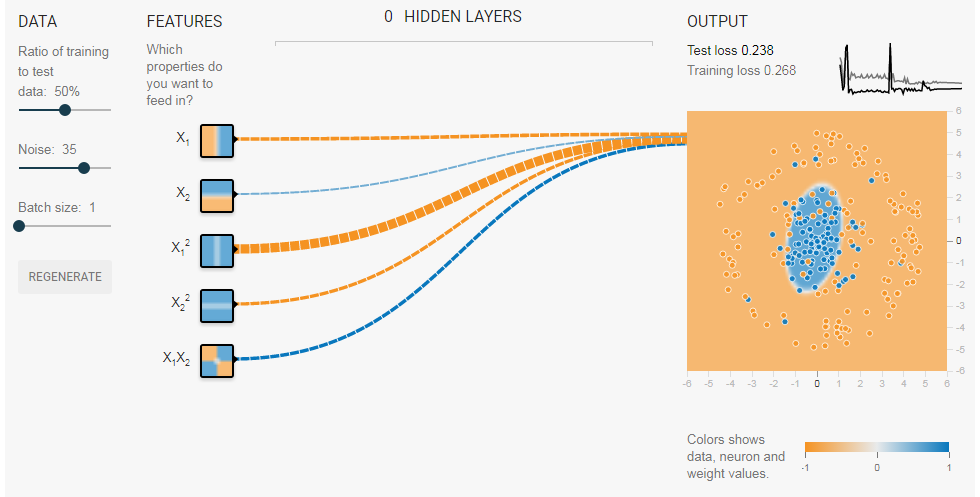

## Table of Contents

## What is a feature cross in machine learning?

A feature cross in machine learning is when you combine two or more features to create a new feature. This new feature can help the model learn patterns that it might not see if you just used the original features alone. For example, if you have data about the day of the week and the time of day, you can create a new feature that is a combination of both, like "Monday morning" or "Friday evening". This can help the model understand that certain behaviors might happen more often during specific times.

Feature crosses are useful because they can capture interactions between different features. Imagine you are trying to predict house prices, and you have features like the number of bedrooms and the size of the house. By creating a feature cross of these two, like $$ \text{bedrooms} \times \text{size} $$, you can help the model understand that a larger house with more bedrooms might be more valuable than a smaller house with the same number of bedrooms. This way, the model can make better predictions by considering how features work together.

To create a feature cross in code, you might use a simple operation like multiplication or concatenation. Here's an example in Python:

```python
# Original features
day_of_week = 'Monday'
time_of_day = 'morning'

# Creating a feature cross
feature_cross = day_of_week + '_' + time_of_day

print(feature_cross)  # Output: Monday_morning
```

This code shows how you can combine 'day_of_week' and 'time_of_day' to create a new feature called 'feature_cross'.

## Why are feature crosses important in machine learning models?

Feature crosses are important in [machine learning](/wiki/machine-learning) because they help models understand relationships between different pieces of data. When you create a feature cross, you're making a new feature that combines two or more existing features. This can help the model see patterns that it might miss if it only looked at the original features separately. For example, if you're trying to predict how many ice creams will be sold, knowing just the temperature or the time of day might not be enough. But if you create a feature cross like "hot afternoon," the model can learn that ice cream sales go up during hot afternoons.

Another reason feature crosses are useful is that they can improve the accuracy of predictions. By capturing the interactions between features, the model can make better guesses about what might happen. For instance, in a house price prediction model, you might have features like the number of bedrooms and the size of the house. If you create a feature cross like $$ \text{bedrooms} \times \text{size} $$, the model can understand that a large house with many bedrooms might be more valuable than a smaller house with the same number of bedrooms. This helps the model make more accurate predictions by considering how different features work together.

## How do feature crosses help in capturing non-linear relationships?

Feature crosses help in capturing non-linear relationships by creating new features that represent the interaction between existing features. For example, if you're trying to predict how much people will spend on a shopping trip, knowing just the day of the week or the time of day might not be enough. But if you create a feature cross like "Saturday afternoon," the model can learn that people tend to spend more during those times. This is a non-linear relationship because the effect of the day and time together is different from the effect of each one alone.

In a more technical sense, feature crosses can be thought of as adding polynomial terms to a model. For example, if you have two features, $$ x_1 $$ and $$ x_2 $$, a feature cross like $$ x_1 \times x_2 $$ allows the model to capture non-linear effects that a simple linear combination of $$ x_1 $$ and $$ x_2 $$ cannot. This is important because many real-world relationships are not linear, and feature crosses give the model the flexibility to learn these more complex patterns.

## Can you explain the process of creating a feature cross?

Creating a feature cross involves combining two or more existing features to make a new one. This new feature helps the model understand how different pieces of data work together. For example, if you have data about the day of the week and the time of day, you can create a feature cross like "Monday morning" or "Friday evening." This helps the model see that certain things might happen more often during specific times.

To create a feature cross, you can use simple operations like multiplication or concatenation. For instance, if you have features for the number of bedrooms and the size of a house, you can make a feature cross by multiplying these two values, like $$ \text{bedrooms} \times \text{size} $$. This helps the model understand that a bigger house with more bedrooms might be more valuable. Here's how you might do it in Python:

```python
# Original features
day_of_week = 'Monday'
time_of_day = 'morning'

# Creating a feature cross
feature_cross = day_of_week + '_' + time_of_day

print(feature_cross)  # Output: Monday_morning
```

This code shows how you can combine 'day_of_week' and 'time_of_day' to create a new feature called 'feature_cross'.

## What are some common examples of feature crosses in real-world applications?

In real-world applications, feature crosses are often used to capture important patterns. For example, in a weather prediction model, you might have features like temperature and humidity. By creating a feature cross like $$ \text{temperature} \times \text{humidity} $$, the model can better understand how these two factors together affect the weather. This is helpful because it can predict things like the likelihood of rain or heatwaves more accurately.

Another common example is in recommendation systems, like those used by streaming services or online stores. If you have features like the user's age and the genre of a movie or product, you can create a feature cross like "young_adult_comedy" or "senior_drama." This helps the model see that certain age groups might prefer specific genres, making its recommendations more personalized and accurate. 

In healthcare, feature crosses can be used to predict patient outcomes. For instance, if you have data on a patient's age and blood pressure, creating a feature cross like $$ \text{age} \times \text{blood pressure} $$ can help the model understand how these factors together impact the risk of certain diseases. This can lead to better diagnosis and treatment plans.

## How do feature crosses differ from feature engineering?

Feature crosses are a specific type of feature engineering. Feature engineering is the process of creating new features from existing data to improve a machine learning model's performance. It can involve many different techniques, like scaling numbers, turning words into numbers, or creating new features by combining or transforming existing ones. Feature crosses are one of these techniques, where you combine two or more features to make a new one that captures how they work together. For example, if you have the day of the week and the time of day, you can create a feature cross like "Monday morning" or "Friday evening."

The main difference between feature crosses and other types of feature engineering is that feature crosses focus on capturing interactions between features. While other feature engineering methods might involve scaling a single feature or turning a word into a number, feature crosses are specifically about combining features to create a new one that shows how they interact. For instance, in a house price prediction model, you might have the number of bedrooms and the size of the house. By creating a feature cross like $$ \text{bedrooms} \times \text{size} $$, the model can understand that a larger house with more bedrooms might be more valuable. This helps the model make better predictions by considering how different pieces of data work together.

## What are the potential challenges and limitations of using feature crosses?

Using feature crosses can make your model better at understanding how different pieces of data work together. For example, if you have data about the day of the week and the time of day, creating a feature cross like "Monday morning" or "Friday evening" can help the model see that certain things might happen more often during those times. However, there are challenges to using feature crosses. One big challenge is that they can make your model more complicated. When you add lots of feature crosses, the model has to learn from many more pieces of data, which can take longer and might not always help the model make better predictions.

Another limitation is that feature crosses might not always capture the right relationships between features. For instance, if you create a feature cross like $$ \text{bedrooms} \times \text{size} $$ in a house price prediction model, it might help the model understand that a bigger house with more bedrooms is more valuable. But if the relationship between bedrooms and size is not actually important for predicting house prices, then the feature cross might not help and could even make the model worse. It's important to think carefully about which feature crosses to use and to test them to see if they really help the model make better predictions.

## How can one evaluate the effectiveness of a feature cross in a model?

To evaluate the effectiveness of a feature cross in a model, you can look at how the model's performance changes when you add the feature cross. For example, if you're trying to predict house prices and you add a feature cross like $$ \text{bedrooms} \times \text{size} $$, you can compare the model's accuracy before and after adding this feature cross. If the model's accuracy improves, that's a good sign that the feature cross is helpful. You can use metrics like mean squared error or R-squared to measure this change. If the model performs better with the feature cross, it means the new feature is capturing important relationships between the original features.

Another way to evaluate a feature cross is by using cross-validation. This means you split your data into different parts and train the model multiple times, each time using a different part of the data for testing. By doing this, you can see if the feature cross consistently improves the model's performance across different sets of data. If the feature cross helps the model make better predictions every time, it's likely a good addition. If the performance doesn't improve or even gets worse, you might need to rethink whether the feature cross is capturing the right relationships between the features.

## What techniques can be used to automatically generate feature crosses?

One technique to automatically generate feature crosses is to use a grid search. This means you try combining different features in different ways and see which combinations help the model the most. For example, if you have features like the day of the week and the time of day, you can automatically create feature crosses like "Monday morning" or "Friday evening" and test them to see if they improve the model's predictions. You can use a simple loop in code to try out different combinations and measure how well the model does with each one.

Another technique is to use machine learning algorithms that can automatically find useful feature crosses. For example, some models like gradient boosting machines or [deep learning](/wiki/deep-learning) neural networks can learn which features to combine without you having to tell them exactly which ones to use. These models can figure out that a feature cross like $$ \text{bedrooms} \times \text{size} $$ might be helpful for predicting house prices. This can save a lot of time because you don't have to manually try out different feature crosses and see which ones work best.

## How do feature crosses interact with different types of machine learning algorithms?

Feature crosses can work differently with various types of machine learning algorithms. For example, in linear models like linear regression, feature crosses can help the model capture non-linear relationships between features. If you have features like the number of bedrooms and the size of a house, creating a feature cross like $$ \text{bedrooms} \times \text{size} $$ can help the model understand that a larger house with more bedrooms might be more valuable. This is because linear models can only learn linear relationships on their own, so feature crosses give them the ability to learn more complex patterns.

In more advanced models like decision trees or random forests, feature crosses can also be useful, but these models can sometimes learn the interactions between features without needing explicit feature crosses. For instance, a decision tree might naturally split the data based on both the number of bedrooms and the size of the house, effectively capturing the same information as the feature cross $$ \text{bedrooms} \times \text{size} $$. However, explicitly adding feature crosses can still help these models by making the relationships between features more obvious and potentially improving the model's performance.

## Can you discuss advanced methods for optimizing feature crosses in large datasets?

When working with large datasets, one advanced method for optimizing feature crosses is to use dimensionality reduction techniques like Principal Component Analysis (PCA) or t-SNE. These methods can help you find the most important feature crosses by reducing the number of features while keeping the most useful information. For example, if you have lots of features like the day of the week, time of day, and temperature, you can use PCA to create new features that capture the most important relationships between these original features. This helps the model work faster and more efficiently because it doesn't have to deal with as many features.

Another method is to use automated feature selection algorithms like Recursive Feature Elimination (RFE) or feature importance from tree-based models like Random Forests. These algorithms can help you figure out which feature crosses are the most helpful for your model. For instance, if you create a feature cross like $$ \text{bedrooms} \times \text{size} $$ in a house price prediction model, RFE can tell you if this cross is really important for predicting house prices. By focusing on the most important feature crosses, you can make your model more accurate and faster to train, which is really helpful when you're working with large datasets.

## What are the latest research developments in the field of feature crosses?

Recent research in the field of feature crosses has focused on improving the efficiency and effectiveness of these techniques in large-scale machine learning models. One notable development is the use of deep learning to automatically generate and optimize feature crosses. For example, researchers have explored [neural network](/wiki/neural-network) architectures that can learn to combine features in ways that traditional manual methods might miss. These models can identify complex interactions between features without the need for explicit feature engineering, making them particularly useful in applications like recommendation systems and natural language processing where the relationships between features can be highly non-linear.

Another area of research is the integration of feature crosses with advanced statistical methods to better understand their impact on model performance. Techniques like Bayesian optimization have been used to systematically search for the best feature crosses in a given dataset. This approach helps in identifying which combinations of features are most likely to improve the model's predictive power, reducing the need for extensive manual testing. By combining these advanced methods, researchers aim to make feature crosses more accessible and effective, even for those without deep expertise in machine learning.

## References & Further Reading

[1]: Potdar, K., Pardawala, T. S., & Pai, C. D. (2017). ["A Comparative Study of Categorical Variable Encoding Techniques for Neural Network Classifiers."](https://www.ijcaonline.org/archives/volume175/number4/potdar-2017-ijca-915495.pdf) International Journal of Computer Applications, 175(4).

[2]: Guo, C., & Berkhahn, F. (2016). ["Entity Embeddings of Categorical Variables."](https://arxiv.org/abs/1604.06737) arXiv preprint arXiv:1604.06737.

[3]: Rendle, S. (2010). ["Factorization machines."](https://ieeexplore.ieee.org/document/5694074) IEEE International Conference on Data Mining.

[4]: Chollet, F. (2018). ["Deep Learning with Python"](https://www.amazon.com/Deep-Learning-Python-Francois-Chollet/dp/1617294438) (1st Ed.). Manning Publications.

[5]: He, H., Zhang, Y., & Zhang, M. (2014). ["Data Mining with Big Data."](https://www.sciencedirect.com/science/article/pii/S0020025514000346) IEEE Transactions on Knowledge and Data Engineering, 26(1), 97-107.