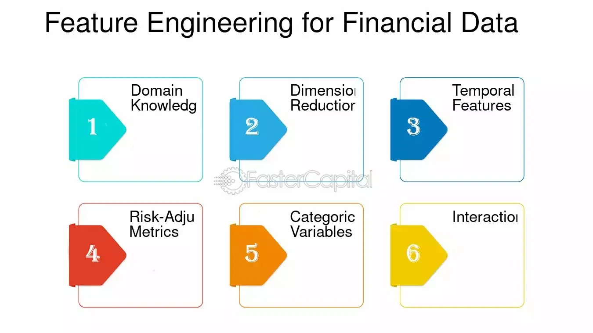

## Table of Contents

## What is feature engineering and why is it important in financial models?

Feature engineering is the process of creating new variables or features from existing data to improve the predictive power of a model. In financial models, this means taking raw data like stock prices, trading volumes, or economic indicators and turning them into more useful information that can help predict future trends or outcomes. For example, you might create a new feature that measures the volatility of a stock by calculating the standard deviation of its daily returns over a period of time.

This process is important in financial models because it can significantly improve the accuracy and reliability of predictions. By creating features that capture important patterns or relationships in the data, financial analysts can build models that better reflect the complexities of financial markets. This can lead to better investment decisions, risk management, and overall financial performance. Without good feature engineering, a model might miss key information, leading to poor predictions and potentially costly mistakes.

## How do you identify relevant features for a financial model?

To identify relevant features for a financial model, you first need to understand what you're trying to predict. For example, if you're trying to forecast stock prices, you might look at past prices, trading volumes, and news about the company. Start by thinking about what information could help make a good prediction. Talk to experts or read research papers to get ideas on what data might be important.

Next, you can use data analysis techniques to see which features are actually useful. This can involve looking at correlations between different pieces of data and your target variable, or using statistical tests to see which features have a strong relationship with what you're trying to predict. You might also try building a simple model with different sets of features and see which ones improve the model's accuracy. This process helps you focus on the most important information and avoid using data that doesn't help your predictions.

Remember, the goal is to find features that capture important patterns or trends in the data. Sometimes, you might need to create new features by combining or transforming existing data. For example, you might calculate the average price change over the last month to see if it helps predict future price movements. By carefully selecting and engineering features, you can build a financial model that makes more accurate and reliable predictions.

## What are common data sources used for feature engineering in finance?

In finance, people often use stock market data to create new features for their models. This includes things like daily stock prices, trading volumes, and information about dividends. For example, you might use the closing price of a stock each day to calculate how much the price has changed over time. This can help you understand trends and predict where the price might go next. Other important data comes from financial statements, like a company's earnings reports, which can tell you about the company's health and performance.

Another common source of data is economic indicators, which give you information about the overall economy. Things like unemployment rates, inflation, and interest rates can affect how the stock market behaves. By including these in your model, you can better understand how big economic changes might impact specific stocks or the market as a whole. You can also use news and social media data to see how public opinion and events might influence stock prices. For instance, if a company gets a lot of bad press, it might affect its stock price, so including news sentiment as a feature could improve your model's predictions.

Lastly, [alternative data](/wiki/best-alternative-data) sources are becoming more popular. These can include things like satellite imagery to track how busy a company's parking lot is, or credit card transaction data to see how people are spending money. This kind of data can give you unique insights that traditional financial data might miss. By combining all these different types of data, you can create a more complete picture of what's happening in the financial world and build better models to make predictions.

## Can you explain the process of data cleaning and preprocessing in feature engineering?

Data cleaning and preprocessing are important steps in feature engineering. They help make sure the data you use is accurate and ready for your model. First, you need to check for missing values in your data. If you find any, you can either fill them in with a guess, like the average of other values, or you might decide to remove the rows with missing data. You also need to look for errors or strange values that don't make sense. For example, if you see a stock price that's way too high or too low, you might need to fix it or remove it from your data.

Next, you need to make sure all your data is in the right format. Sometimes, data comes in different forms, like dates or categories, and you need to change them into numbers that your model can understand. This might mean turning a date into the number of days since a certain point in time, or turning categories like "high," "medium," and "low" into numbers like 2, 1, and 0. You also need to make sure all your data is on the same scale. If one feature has very big numbers and another has very small numbers, it can confuse your model. You can fix this by normalizing the data, which means changing the numbers so they're all on a similar scale.

By cleaning and preprocessing your data carefully, you make sure your features are as useful as possible for your financial model. This helps your model make better predictions and gives you more confidence in the results.

## What are some basic feature engineering techniques for financial data?

Feature engineering for financial data involves creating new pieces of information that can help predict things like stock prices or market trends. One common technique is to calculate moving averages, which smooth out price data over time. For example, you might take the average closing price of a stock over the last 50 days. This can help you see the overall trend and ignore short-term ups and downs. Another technique is to create features that measure [volatility](/wiki/volatility-trading-strategies), like the standard deviation of daily returns. This can show how much a stock's price moves around, which is useful for understanding risk.

Another basic technique is to create features from financial ratios, like the price-to-earnings (P/E) ratio, which compares a company's stock price to its earnings per share. This can give you a sense of whether a stock is overvalued or undervalued. You can also use lagged features, where you take past values of a variable and use them to predict future values. For example, you might use the stock price from last month to help predict next month's price. By creating these new features, you can capture important patterns in the data that might not be obvious from looking at raw numbers alone.

Lastly, you can engineer features by combining different types of data. For instance, you might combine stock market data with economic indicators like inflation rates or interest rates. This can help you understand how broader economic trends might affect specific stocks. You could also use sentiment analysis on news articles or social media posts to create a feature that measures public opinion about a company. By mixing and matching different data sources and creating new features, you can build a more complete picture of the financial landscape and make better predictions.

## How do domain knowledge and financial theory influence feature engineering?

Domain knowledge and financial theory play a big role in feature engineering. When you know a lot about finance, you can make better guesses about what data might be important for your model. For example, if you understand that interest rates affect stock prices, you might decide to include [interest rate](/wiki/interest-rate-trading-strategies) data as a feature. Financial theories, like the Efficient Market Hypothesis, can also guide you. This theory says that stock prices reflect all available information, so you might look for features that capture how new information spreads through the market.

Using domain knowledge and financial theory helps you create features that make sense and are more likely to improve your model's predictions. For instance, knowing that companies with high debt might be riskier can lead you to create a feature that measures a company's debt-to-equity ratio. This can help your model better understand and predict how different companies might perform. By combining your understanding of finance with data, you can build a stronger model that takes into account the complex factors that drive financial markets.

## What advanced statistical methods can be used to create new features in financial models?

Advanced statistical methods can help you create new features that make your financial models better. One method is principal component analysis (PCA). PCA takes a bunch of related data and turns it into a smaller set of new features that still capture the important patterns. For example, if you have data on different stock prices, PCA can help you find the main trends that affect all those stocks and create new features based on those trends. This can make your model simpler and more accurate because you're focusing on what really matters.

Another method is time series decomposition, which breaks down data that changes over time into different parts like trends, seasonal patterns, and random noise. By understanding these parts, you can create new features that focus on the most important aspects of your data. For instance, if you're looking at stock prices, you might use time series decomposition to separate out the long-term trend from short-term ups and downs. This can help your model predict future prices more accurately by paying attention to the right patterns.

## How do you validate the effectiveness of engineered features in a financial model?

To validate the effectiveness of engineered features in a financial model, you need to see if they actually help the model make better predictions. One way to do this is by splitting your data into a training set and a test set. You use the training set to build your model with the new features, and then you use the test set to see how well the model predicts new data. If the model does better with the new features than without them, it means the features are helping.

Another way to check is by using cross-validation. This means you split your data into several parts and build the model many times, each time using a different part of the data to test the model. If the model consistently does better with the new features across all these tests, you can be more confident that the features are useful. By trying these methods, you can make sure your engineered features are really improving your financial model's predictions.

## What are the challenges of feature engineering in time-series financial data?

Feature engineering in time-series financial data can be tricky because the data changes over time. One big challenge is dealing with trends and seasonality. For example, stock prices might go up and down in certain patterns throughout the year, and you need to figure out how to capture these patterns in your features. If you don't account for these trends, your model might miss important information and make bad predictions. Another challenge is handling missing data or gaps in your time series. If you have missing values, you need to decide whether to fill them in or ignore them, and either choice can affect how well your model works.

Another difficulty is avoiding lookahead bias, which happens when you accidentally use future data to predict the past. This can make your model seem better than it really is because it's using information it shouldn't have. To avoid this, you need to be careful about how you create your features and make sure they only use information that would have been available at the time you're trying to predict. Finally, time-series data can be affected by sudden events or shocks, like a company announcing bad news or a big economic change. These events can throw off your model's predictions, so you need to create features that can handle these surprises and still make good guesses about what will happen next.

## How can machine learning algorithms assist in feature engineering for financial models?

Machine learning algorithms can help a lot with feature engineering in financial models. They can automatically find patterns and relationships in the data that might be hard for people to see. For example, algorithms like decision trees or random forests can tell you which features are most important for making good predictions. This can save time because you don't have to guess which data might be useful. Instead, the algorithm can show you the best features to use, making your model more accurate and easier to build.

Another way [machine learning](/wiki/machine-learning) helps is by creating new features on its own. Techniques like [deep learning](/wiki/deep-learning) can take raw data and turn it into new features that capture complex patterns. For instance, a [neural network](/wiki/neural-network) might look at stock prices and trading volumes and create new features that show how these things are connected. This can help your model understand the data better and make better predictions. By using machine learning to help with feature engineering, you can build financial models that are more powerful and reliable.

## What are the ethical considerations in feature engineering for financial applications?

When you create new features for financial models, you need to think about ethics. One big thing is making sure you don't use data that could hurt people or invade their privacy. For example, if you use personal information without permission, it's not only wrong but also illegal. You should always be clear about where your data comes from and make sure you have the right to use it. Another ethical issue is being fair. If your model uses features that treat some people differently because of things like their race or gender, that's not right. You need to check your model to make sure it's not biased and treats everyone the same way.

Another important ethical consideration is transparency. People who use your financial model should know how it works and what data it uses. If your model makes decisions that affect people's money, they deserve to understand why those decisions were made. This means you should be open about your feature engineering process and explain how you created your features. By being honest and fair, you can build trust in your financial models and make sure they're used in a way that's good for everyone.

## How do you keep feature engineering processes up-to-date with evolving financial markets?

Keeping feature engineering processes up-to-date with evolving financial markets means you need to keep learning and changing your methods. Financial markets are always changing because of new rules, technology, and world events. To stay current, you should regularly check your data sources and see if there are new types of information that could help your model. For example, if a new economic report starts coming out, you might want to include it in your features. Also, talking to experts and reading about the latest financial theories can give you ideas for new features that capture what's happening in the market right now.

Another way to keep your feature engineering up-to-date is by using machine learning to help you find new patterns in the data. As the market changes, new relationships between different pieces of data might appear. Machine learning algorithms can automatically find these new patterns and suggest new features that you might not have thought of. By combining your own knowledge with what the algorithms find, you can keep your financial model working well even as the market changes. This way, your model stays useful and accurate over time.

## References & Further Reading

[1]: ["Advances in Financial Machine Learning"](https://www.amazon.com/Advances-Financial-Machine-Learning-Marcos/dp/1119482089) by Marcos Lopez de Prado

[2]: ["Feature Engineering for Machine Learning: Principles and Techniques for Data Scientists"](https://www.amazon.com/Feature-Engineering-Machine-Learning-Principles/dp/1491953241) by Alice Zheng and Amanda Casari

[3]: [Kumar, A., & Boyd, D. (2005). "Forecasting financial markets using engineering techniques."](https://www.linkedin.com/in/dilipsharma2005) Proceedings of the International Conference on Information and Communication Technologies

[4]: ["Python for Finance: Analyze Big Financial Data"](https://www.amazon.com/Python-Finance-Analyze-Financial-Data/dp/1491945281) by Yves Hilpisch

[5]: ["Machine Learning for Algorithmic Trading: Predictive Models to Extract Signals from Market and Alternative Data for Systematic Trading Strategies with Python"](https://www.amazon.com/Machine-Learning-Algorithmic-Trading-alternative/dp/1839217715) by Stefan Jansen

[6]: ["Evidence-Based Technical Analysis: Applying the Scientific Method and Statistical Inference to Trading Signals"](https://www.amazon.com/Evidence-Based-Technical-Analysis-Scientific-Statistical/dp/0470008741) by David Aronson