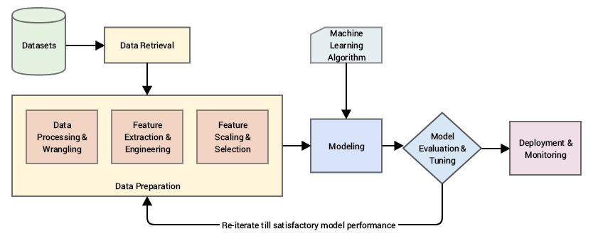

## Table of Contents

## What is feature engineering in the context of machine learning?

Feature engineering is the process of creating new features or modifying existing ones to make machine learning models work better. It's like preparing ingredients before cooking a meal. In machine learning, the data you start with might not be in the best form for your model to learn from. So, you change or create new features to help the model understand the patterns in the data more easily.

For example, if you're trying to predict house prices, you might start with features like the number of bedrooms and the size of the house. But you could create a new feature by dividing the size of the house by the number of bedrooms to get the average size of each bedroom. This new feature might help the model predict house prices more accurately because it gives more specific information about the house. Feature engineering is important because it can make a big difference in how well your model performs, often more than just using more complex models.

## Why is feature engineering important for improving model performance?

Feature engineering is important because it helps machine learning models understand the data better. When you change or create new features, you're giving the model more useful information to work with. This can make the model's predictions more accurate. For example, if you're trying to predict how much a house will sell for, just knowing the number of bedrooms might not be enough. But if you create a new feature that shows the average size of each bedroom, the model can use this to make better guesses about the house's price.

Another reason feature engineering is important is that it can help models learn from the data more easily. Sometimes, the data you start with might be too complicated or messy for the model to figure out on its own. By creating simpler or more relevant features, you're making it easier for the model to see the patterns in the data. This can lead to better performance without needing to use a more complicated model. For example, if you're trying to predict whether it will rain, turning the time of day into a simple "morning," "afternoon," or "evening" category can help the model see how time affects the weather more clearly.

## What are some common techniques used in feature engineering?

One common technique in feature engineering is creating new features from existing ones. For example, if you have data about houses, you might create a new feature by dividing the total square footage by the number of bedrooms to get the average size of each bedroom. This can help a model predict house prices more accurately because it gives more specific information. Another way to create new features is by combining different pieces of data. For instance, if you have the day of the week and the time of day, you could create a new feature that shows whether it's a weekday morning or a weekend afternoon. This can help a model understand patterns in the data better.

Another technique is transforming features to make them easier for the model to understand. One way to do this is by normalizing or standardizing the data. Normalizing means changing the values so they all fall between 0 and 1, while standardizing means changing them so they have a mean of 0 and a standard deviation of 1. This can help the model learn from the data more easily because it makes all the features comparable. Another way to transform features is by using logarithms or other mathematical functions. For example, if you're working with income data, taking the logarithm of the income can make the data more normally distributed, which can help the model perform better.

A third technique is encoding categorical variables. Sometimes, the data you're working with includes categories like "red," "blue," and "green" for colors. To use this data in a model, you need to turn these categories into numbers. One way to do this is one-hot encoding, where you create a new feature for each category and set it to 1 if the data belongs to that category and 0 otherwise. For example, if you have a feature for color, you might create three new features: "is_red," "is_blue," and "is_green." This can help the model understand the data better because it can now use these new features to learn from the categories.

## How does one identify which features to engineer for a specific dataset?

To identify which features to engineer for a specific dataset, start by understanding the problem you're trying to solve and the data you have. Look at the existing features and think about how they relate to what you want to predict. For example, if you're predicting house prices, you might have features like the number of bedrooms and the total square footage. You could create a new feature by dividing the total square footage by the number of bedrooms to get the average size of each bedroom. This new feature might help your model understand the data better because it gives more specific information about the house.

Another way to identify features to engineer is by analyzing the data. Look for patterns or relationships between the features and the target variable. For instance, if you're trying to predict whether it will rain, you might notice that the time of day affects the likelihood of rain. You could create a new feature that categorizes the time into "morning," "afternoon," or "evening." This can help your model see the pattern more clearly. You can also use statistical methods or visualizations to find out which features are most important or how they interact with each other. By doing this, you can figure out which new features might help your model perform better.

## What is the difference between feature selection and feature extraction?

Feature selection and feature extraction are two different ways to improve a [machine learning](/wiki/machine-learning) model by working with the data's features. Feature selection is like [picking](/wiki/asset-class-picking) the best fruits from a basket. You look at all the features you have and choose the ones that are most important or useful for your model. This means you keep some features and throw away others. For example, if you're predicting house prices, you might choose to keep features like the number of bedrooms and the size of the house, but throw away less important ones like the color of the front door. Feature selection helps make your model simpler and faster because it uses fewer features.

Feature extraction, on the other hand, is like making a new recipe from the ingredients you have. Instead of choosing which features to keep, you create new features from the ones you already have. This can help your model understand the data better. For example, if you have the total size of a house and the number of bedrooms, you might create a new feature by dividing the size by the number of bedrooms to get the average size of each bedroom. Feature extraction can help find hidden patterns in the data that the original features might not show. Both methods can improve your model, but they do it in different ways: feature selection by choosing, and feature extraction by creating.

## Can you explain how to handle categorical variables in feature engineering?

Handling categorical variables in feature engineering is important because machine learning models usually need numbers to work with, not words or categories. One common way to handle categorical variables is through one-hot encoding. This means you create a new feature for each category in your data. For example, if you have a feature for color with categories "red," "blue," and "green," you would create three new features: "is_red," "is_blue," and "is_green." If a data point is red, you set "is_red" to 1 and the other two to 0. This way, the model can understand and use the information about color.

Another way to handle categorical variables is label encoding. This is simpler than one-hot encoding because you just turn each category into a number. For example, if you have the categories "low," "medium," and "high," you might turn them into 1, 2, and 3. This can be useful if the categories have a natural order, like sizes or levels of something. But be careful, because the model might think that the difference between 1 and 2 is the same as the difference between 2 and 3, which might not be true. So, you need to choose the right method based on your data and what you're trying to predict.

## What are some ways to deal with missing data during feature engineering?

When you're working with data, you might find some pieces are missing. This is common, and there are ways to handle it during feature engineering. One way is to simply remove the rows or columns with missing data. If you have a lot of data and only a few missing pieces, this might be okay. But if you lose too much data this way, it could hurt your model's performance. Another way is to fill in the missing data with a guess. You could use the average or the most common value for that feature. For example, if you're missing some house sizes, you could fill them in with the average size of all the other houses.

Another approach is to create a new feature that shows whether the data was missing. This can help your model understand that the missing data might mean something important. For example, if people often don't fill in their income, that might tell you something about them. You could add a new feature called "income_missing" and set it to 1 if the income is missing and 0 if it's not. This way, your model can use this information to make better predictions. Each method has its pros and cons, so you need to choose the one that works best for your data and your goals.

## How do you scale and normalize features, and why is it necessary?

Scaling and normalizing features are important steps in feature engineering to make sure all your data is on the same level. When you scale features, you change them so they all fit within a certain range, often between 0 and 1. This is called normalization. You can do this using the formula $$ x_{\text{normalized}} = \frac{x - x_{\min}}{x_{\max} - x_{\min}} $$. Another way to scale features is standardization, where you change the data so it has a mean of 0 and a standard deviation of 1. You can do this with the formula $$ x_{\text{standardized}} = \frac{x - \mu}{\sigma} $$, where $$\mu$$ is the mean and $$\sigma$$ is the standard deviation. Both methods help make sure no single feature has too much power over the others just because its numbers are bigger.

Scaling and normalizing features is necessary because it helps machine learning models work better. If one feature has much bigger numbers than the others, it might seem more important to the model, even if it's not. For example, if you're predicting house prices and one feature is the size of the house in square feet (which can be a big number) and another is the number of bedrooms (which is a smaller number), the model might pay too much attention to the size of the house. By scaling or normalizing the features, you make sure the model treats all features fairly. This can lead to better predictions because the model can see the true patterns in the data more easily.

## What are advanced feature engineering techniques like polynomial features and interaction terms?

Advanced feature engineering techniques like polynomial features and interaction terms help models understand more complex relationships in the data. Polynomial features involve creating new features by raising existing features to different powers. For example, if you have a feature for the age of a house, you might create new features like age squared ($$ \text{age}^2 $$) or age cubed ($$ \text{age}^3 $$). This can help the model capture non-linear patterns, like how the value of a house might not decrease at a steady rate as it gets older. Interaction terms, on the other hand, are created by multiplying two or more features together. For instance, if you have features for the size of a house and the number of bedrooms, you could create an interaction term by multiplying these two features ($$ \text{size} \times \text{bedrooms} $$). This can help the model see how these features work together to affect the house's price.

Both polynomial features and interaction terms can make your model more accurate by giving it more detailed information about the data. But they can also make the model more complicated and harder to understand. It's important to use these techniques carefully and check if they really help your model perform better. Sometimes, adding too many new features can make the model overfit, which means it learns the training data too well but doesn't work as well on new data. So, you should always test your model with and without these new features to see if they're really helping.

## How can domain knowledge be incorporated into feature engineering?

Domain knowledge is really important for feature engineering because it helps you understand what the data means and how it relates to what you're trying to predict. For example, if you're predicting house prices, knowing about real estate can help you create better features. You might know that the distance to the nearest school or the age of the house's roof can affect its price. So, you could create new features for these things. This way, your model can use information that's important in the real world to make better predictions.

Using domain knowledge also helps you make sense of the data and find patterns that might not be obvious. For instance, if you're working with medical data, knowing about different diseases and treatments can help you create features that show how these things affect each other. You might create an interaction term by multiplying a feature for a patient's age by a feature for their blood pressure, because you know that age can change how blood pressure affects health. By using what you know about the subject, you can create features that help your model understand the data better and make more accurate predictions.

## What tools and libraries are commonly used for feature engineering in Python and R?

In Python, one of the most popular libraries for feature engineering is Pandas. It's great for handling and transforming data. You can use Pandas to create new features by combining existing ones, like making a new feature for the average size of a bedroom in a house by dividing the total square footage by the number of bedrooms. Another useful library is Scikit-learn, which has tools for scaling and normalizing features. For example, you can use Scikit-learn to normalize your data so all the features are between 0 and 1 with the formula $$ x_{\text{normalized}} = \frac{x - x_{\min}}{x_{\max} - x_{\min}} $$. Scikit-learn also has functions for creating polynomial features and interaction terms, which can help your model understand more complex relationships in the data.

In R, the tidyverse collection of packages is commonly used for feature engineering. The dplyr package within tidyverse is great for creating new features and transforming existing ones. For instance, you can use dplyr to create a new feature that shows the average size of each bedroom in a house. The caret package is another useful tool in R for feature engineering. It has functions for scaling and normalizing features, as well as for creating dummy variables from categorical data using one-hot encoding. For more advanced techniques like creating polynomial features and interaction terms, you can use the poly function in R to create polynomial features like $$ \text{age}^2 $$ or $$ \text{age}^3 $$, which can help capture non-linear patterns in the data.

## How do you evaluate the effectiveness of your feature engineering efforts?

To evaluate the effectiveness of your feature engineering efforts, you need to see if the new features you've created help your model make better predictions. One way to do this is by comparing the performance of your model before and after you add the new features. You can use metrics like accuracy, precision, recall, or the mean squared error to see if the model's predictions have gotten better. For example, if you're predicting house prices, you might check if adding a new feature for the average size of each bedroom makes the model's predictions closer to the actual prices. If the model's performance improves, it means your feature engineering was effective.

Another way to evaluate your feature engineering is by looking at how important each new feature is to the model's predictions. You can use techniques like feature importance scores or permutation importance to see which features have the biggest impact on the model's performance. For instance, if you've added a new feature for the age of a house's roof and it turns out to be one of the most important features for predicting the house's price, then you know your feature engineering was successful. By checking these things, you can figure out if your new features are helping the model understand the data better and make more accurate predictions.

## References & Further Reading

[1]: Bishop, C. M. (2006). ["Pattern Recognition and Machine Learning"](https://www.cs.uoi.gr/~arly/courses/ml/tmp/Bishop_book.pdf). Springer.

[2]: Géron, A. (2019). ["Hands-On Machine Learning with Scikit-Learn, Keras, and TensorFlow"](https://books.google.com/books/about/Hands_On_Machine_Learning_with_Scikit_Le.html?id=HHetDwAAQBAJ). O'Reilly Media.

[3]: Kuhn, M., & Johnson, K. (2013). ["Applied Predictive Modeling"](https://link.springer.com/book/10.1007/978-1-4614-6849-3). Springer.

[4]: ["Feature Engineering for Machine Learning: Principles and Techniques for Data Scientists"](https://www.amazon.com/Feature-Engineering-Machine-Learning-Principles/dp/1491953241) by Alice Zheng, Amanda Casari

[5]: Hastie, T., Tibshirani, R., & Friedman, J. (2009). ["The Elements of Statistical Learning: Data Mining, Inference, and Prediction"](https://link.springer.com/book/10.1007/978-0-387-84858-7) (2nd ed.). Springer.

[6]: [Kaggle's Guide to Feature Engineering](https://www.kaggle.com/code/prashant111/a-reference-guide-to-feature-engineering-methods)