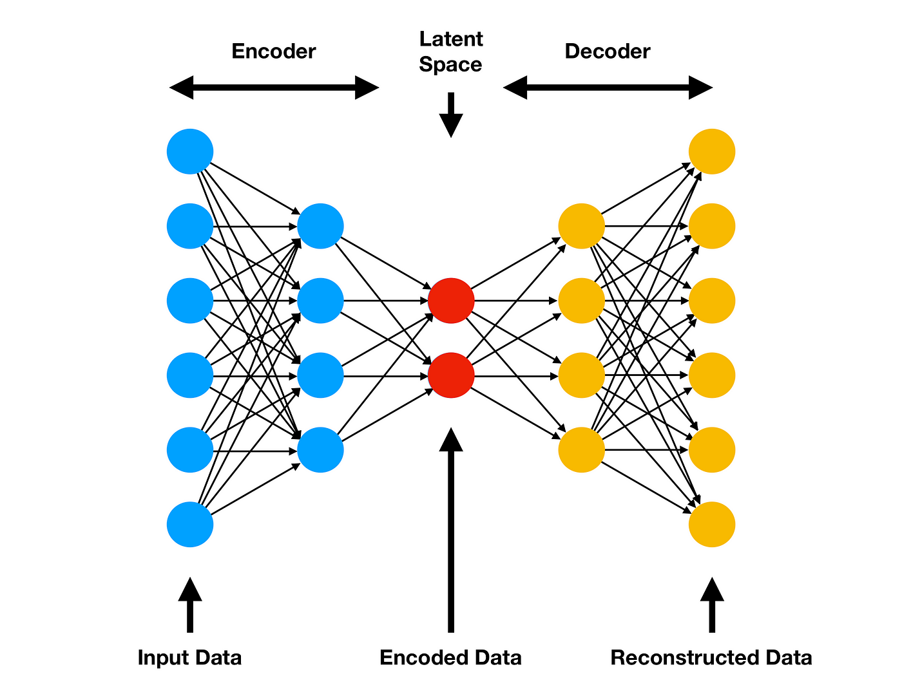

## Table of Contents

## What is feature extraction in machine learning?

Feature extraction in machine learning is a process where we take raw data and turn it into a set of features that are easier for machines to understand and work with. Imagine you have a picture of a cat. Instead of using the whole picture, feature extraction might pull out important parts like the shape of the ears, the color of the fur, or the size of the eyes. These features help the machine learning model focus on what's important and ignore what's not.

This process is important because it can make models work better and faster. By reducing the amount of data the model needs to look at, we can train the model more quickly and it can make predictions more accurately. For example, in text analysis, instead of looking at every word in a document, we might use feature extraction to focus on key words or phrases that tell us what the document is about. This way, the model doesn't get overwhelmed by too much information and can do its job better.

## Why is feature extraction important in machine learning?

Feature extraction is important in machine learning because it helps to simplify the data that the model needs to process. When we have a lot of raw data, like a big picture or a long document, it can be hard for a machine learning model to find the important parts. By using feature extraction, we can pull out the key pieces of information, like the shape of an object in a picture or the main topics in a document. This makes it easier for the model to focus on what matters and ignore the rest.

Another reason feature extraction is important is that it can make the model work better and faster. When we reduce the amount of data the model needs to look at, it can train more quickly and make predictions more accurately. For example, if we are trying to recognize different types of animals in pictures, feature extraction can help the model focus on features like the shape of the ears or the pattern of the fur. This way, the model doesn't get overwhelmed by too much information and can do its job more effectively.

## What are the common techniques used for feature extraction?

One common technique for feature extraction is Principal Component Analysis (PCA). PCA helps to reduce the number of features in a dataset while keeping as much information as possible. Imagine you have a lot of different measurements about something, like the length, width, and height of a box. PCA can help you find new measurements that are a combination of these, but fewer in number, so the machine learning model can work with them more easily. For example, PCA might combine length and width into a new feature that captures the size of the box's base.

Another technique is Linear Discriminant Analysis (LDA). LDA is used to find features that separate different classes of data as much as possible. If you are trying to tell apart different types of flowers, LDA can help you find features like the length of the petals or the width of the leaves that make it easy to tell one type of flower from another. LDA works by looking at the differences between the classes and creating new features that highlight these differences.

Other techniques include Independent Component Analysis (ICA) and t-distributed Stochastic Neighbor Embedding (t-SNE). ICA is used to separate mixed signals into their original sources, like separating different voices in a noisy room. t-SNE is good for visualizing high-dimensional data in two or three dimensions, helping us see patterns that are hard to spot otherwise. Each of these methods has its own way of pulling out important features, making it easier for machine learning models to learn and make good predictions.

## How does Principal Component Analysis (PCA) work for feature extraction?

Principal Component Analysis (PCA) works by finding new features, called principal components, that are a combination of the original features. Imagine you have a lot of data about different things, like the size and weight of fruits. PCA helps you find new ways to measure these fruits that capture the most important information. It does this by looking for directions in the data where the variation is the largest. These directions are the principal components. The first principal component captures the most variation, the second captures the next most, and so on. By using these new components, you can reduce the number of features you need to look at while keeping the most important information.

To do PCA, you start by calculating the mean of each feature and then subtracting it from the data to center it around zero. Next, you find the covariance matrix, which shows how the features change together. Then, you find the eigenvalues and eigenvectors of this matrix. The eigenvectors with the largest eigenvalues are the principal components. You can choose how many components to keep based on how much of the total variation you want to capture. For example, if you want to keep 95% of the variation, you keep the components that add up to 95% of the total eigenvalues. This way, you end up with a smaller set of features that still represent your data well.

## Can you explain Linear Discriminant Analysis (LDA) as a feature extraction method?

Linear Discriminant Analysis (LDA) is a way to find new features that help tell different groups of data apart. Imagine you have different types of fruits, like apples and oranges, and you want to find the best way to tell them apart. LDA looks at features like the size and color of the fruits and finds new features that make the difference between apples and oranges as clear as possible. These new features are called linear discriminants. By using these new features, a machine learning model can more easily see the differences between the groups and make better predictions.

To do LDA, you first calculate the mean of each feature for each group of data. Then, you find the within-class scatter matrix, which shows how the features vary within each group, and the between-class scatter matrix, which shows how the means of the groups differ from each other. The goal is to find linear combinations of the original features that maximize the ratio of the between-class variance to the within-class variance. This can be done by solving the eigenvalue problem for the matrix $$ S_W^{-1} S_B $$, where $ S_W $ is the within-class scatter matrix and $ S_B $ is the between-class scatter matrix. The eigenvectors corresponding to the largest eigenvalues are the linear discriminants. By using these new features, you can reduce the number of features while keeping the information that is most useful for separating the groups.

## What is the difference between feature selection and feature extraction?

Feature selection and feature extraction are two ways to make data easier for machine learning models to work with, but they do it differently. Feature selection is like picking the best apples from a tree. You look at all the apples (features) and choose the ones that are the most useful or important. You keep the original features but just use fewer of them. For example, if you're trying to predict house prices, you might choose features like the number of bedrooms and the size of the house, but ignore less important features like the color of the walls.

Feature extraction, on the other hand, is like making a new kind of apple by mixing different apples together. Instead of choosing from the original features, you create new features that are a combination of the old ones. This can help capture important information in a way that's easier for the model to understand. For example, in Principal Component Analysis (PCA), you might combine the length and width of a house into a new feature that represents the overall size. This new feature can help the model focus on what's important without getting overwhelmed by too much data.

Both methods can make machine learning models work better and faster, but they do it in different ways. Feature selection keeps the original features but uses fewer of them, while feature extraction creates new features that are easier for the model to use. Choosing between them depends on what kind of data you have and what you're trying to do with it.

## How do you choose the right feature extraction technique for a specific dataset?

Choosing the right feature extraction technique for a specific dataset depends on what you want to do with your data and what the data looks like. If you are trying to reduce the number of features while keeping as much information as possible, Principal Component Analysis (PCA) might be a good choice. PCA is great for datasets where you want to capture the most variation, like when you're looking at measurements of different objects. On the other hand, if you're trying to separate different groups of data, like telling apples from oranges, Linear Discriminant Analysis (LDA) could be better. LDA focuses on finding features that make the differences between groups as clear as possible.

Sometimes, you might need to look at how the features are related to each other. Independent Component Analysis (ICA) is useful when you want to separate mixed signals into their original sources, like picking out different voices in a noisy room. If you're working with high-dimensional data and want to see patterns that are hard to spot, t-distributed Stochastic Neighbor Embedding (t-SNE) can help by showing the data in a way that's easier to understand. The best technique often depends on trying different methods and seeing which one works best for your specific problem. By understanding your data and what you want to achieve, you can pick the right tool for the job.

## What are some challenges faced when applying feature extraction?

Applying feature extraction can be tricky because it's not always clear which technique will work best for your data. You might have to try different methods, like PCA or LDA, to see which one gives you the best results. This can take a lot of time and effort. Also, if your data is very complicated or has a lot of noise, it can be hard to find the right features. Sometimes, the new features you create might not capture all the important information, which can make your model less accurate.

Another challenge is that feature extraction can sometimes make your data harder to understand. When you create new features, they might not be as easy to explain as the original ones. For example, if you use PCA, the new features are combinations of the old ones, which can be hard to interpret. This can be a problem if you need to explain your model to others. Also, choosing how many new features to keep can be difficult. If you keep too few, you might miss important information, but if you keep too many, your model might not get any simpler or faster.

## How can feature extraction improve the performance of machine learning models?

Feature extraction can make machine learning models work better by simplifying the data they need to look at. When you have a lot of information, like a big picture or a long list of numbers, it can be hard for a model to find what's important. By using feature extraction, you can pull out the key pieces of information, like the shape of an object or the main topics in a document. This helps the model focus on what matters and ignore the rest. For example, if you're trying to recognize different animals in pictures, feature extraction can help the model focus on features like the shape of the ears or the pattern of the fur. This way, the model doesn't get overwhelmed and can do its job more effectively.

Another way feature extraction improves performance is by making the model train faster and make predictions more accurately. When you reduce the number of features, the model has less data to process, which speeds up training. For example, in Principal Component Analysis (PCA), you might combine the length and width of a house into a new feature that represents the overall size. This new feature can help the model focus on what's important without getting bogged down by too much data. By keeping only the most important information, feature extraction helps the model learn faster and make better predictions.

## What role does feature extraction play in dimensionality reduction?

Feature extraction plays a big role in dimensionality reduction by turning a lot of data into a smaller set of important features. Imagine you have a big picture with lots of details. Instead of looking at every tiny part, feature extraction helps you focus on the important parts like the shape of objects or the color of the sky. This makes it easier for machine learning models to understand the data without getting overwhelmed. For example, in Principal Component Analysis (PCA), you might combine the length and width of a box into a new feature that shows its size. This way, you reduce the number of features but keep the most important information.

By using feature extraction for dimensionality reduction, you can make your machine learning models work better and faster. When you have fewer features to look at, the model can train more quickly and make predictions more accurately. For example, if you're trying to tell apart different types of flowers, Linear Discriminant Analysis (LDA) can help you find features like the length of the petals or the width of the leaves that make it easy to tell one type from another. By focusing on these key features, the model doesn't get confused by too much information and can do its job more effectively.

## How do advanced techniques like t-SNE and autoencoders contribute to feature extraction?

t-SNE, or t-distributed Stochastic Neighbor Embedding, is a way to make high-dimensional data easier to understand by showing it in two or three dimensions. Imagine you have a lot of data points that are hard to see because they're in a high-dimensional space. t-SNE helps by finding a way to put these points on a flat surface or in a 3D space so you can see patterns that were hard to spot before. It does this by trying to keep similar points close together and different points far apart. This can be really helpful for feature extraction because it lets you see which features are important for separating different groups of data. For example, if you're looking at different types of flowers, t-SNE can help you see which features, like the length of the petals or the width of the leaves, are most important for telling them apart.

Autoencoders are another advanced technique for feature extraction. They are a type of neural network that learns how to compress data into a smaller set of features and then reconstruct it back to its original form. Think of it like packing a suitcase: you want to fit everything in but use as little space as possible. The autoencoder learns to pack the data into a smaller space, which is called the latent space, and then unpack it back to the original data. The features in the latent space are the new, compressed features that capture the most important information. This can be really useful for feature extraction because it helps you find new features that are easier for machine learning models to work with. For example, if you're trying to recognize different types of animals in pictures, an autoencoder can help you find new features that make it easier to tell a cat from a dog.

## What are the latest research trends in feature extraction for machine learning?

Recent research trends in feature extraction for machine learning focus a lot on using deep learning techniques. One big trend is using neural networks like autoencoders and convolutional neural networks (CNNs) to pull out important features from data. These methods can find complex patterns that older methods like PCA and LDA might miss. For example, in image recognition, CNNs can automatically find features like edges, textures, and shapes that help tell different objects apart. Researchers are also working on making these deep learning methods more efficient and able to work with different types of data, like text, sound, and even videos.

Another trend is using unsupervised learning to find new features without needing labeled data. Techniques like t-SNE and autoencoders are popular for this because they can find patterns in data without knowing what the data means. This is really useful when you have a lot of data but don't have the time or resources to label it all. Researchers are also looking at how to combine different feature extraction methods to get even better results. For example, they might use PCA to reduce the number of features and then use a neural network to find even more useful features from the reduced set. This way, they can make the most of their data and help machine learning models work better and faster.