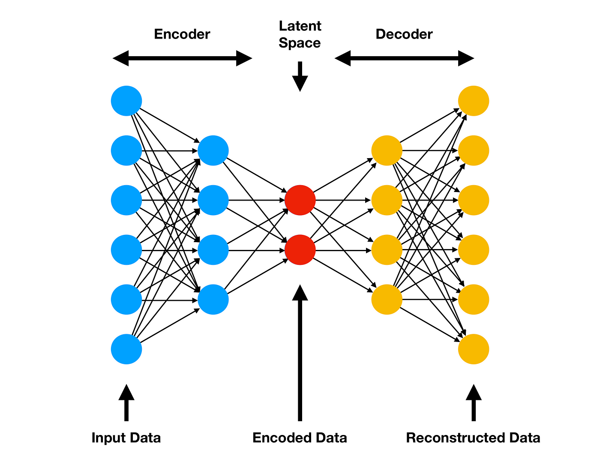

## Table of Contents

## What is a feature extractor in the context of machine learning?

A feature extractor in machine learning is a tool or method used to transform raw data into a set of features that can be more easily analyzed and used by machine learning models. Imagine you have a bunch of pictures, and you want to teach a computer to recognize what's in them. Instead of giving the computer the whole picture, a feature extractor would pick out important details like edges, colors, or shapes that help the computer understand the picture better. These features are like simplified versions of the original data that highlight the most useful information.

For example, in image recognition, a common feature extractor is the convolutional neural network (CNN). A CNN can automatically learn to identify features like edges and textures from images. These features are then used to train a model to classify images into different categories, like distinguishing between cats and dogs. By using a feature extractor, the machine learning model can focus on the most relevant parts of the data, making the learning process more efficient and effective.

## How does a Feature Pyramid Network (FPN) work and what are its benefits?

A Feature Pyramid Network (FPN) is a way to make a computer better at understanding images by using different levels of detail. Imagine you're looking at a picture. You can see the big picture, but you can also zoom in to see smaller details. FPN does something similar. It takes an image and creates several versions of it, each showing different levels of detail. These versions are called feature maps. The FPN then combines these feature maps in a smart way, so the computer can use both the big picture and the small details to understand what's in the image.

The main benefit of using an FPN is that it helps the computer be more accurate when it needs to find and identify objects in an image, no matter if they are big or small. For example, if you're trying to find a tiny bird in a large forest scene, the FPN can help the computer see both the forest and the bird clearly. This makes tasks like object detection and image segmentation much better because the computer can use all the different levels of detail to make its decisions. By using FPN, the computer can be more precise and reliable in understanding complex images.

## What are the key differences between Top-down and Bottom-up Path Augmentation in feature extraction?

Top-down and bottom-up path augmentation are two different ways to combine different levels of detail in feature extraction. In top-down path augmentation, you start with the highest level of detail, which is usually the most abstract and generalized view of the image. Then, you add more and more detailed information from lower levels, step by step. This is like starting with a big picture and then filling in the smaller details. The advantage of this approach is that it helps the computer understand the overall context first and then refine its understanding with more specific details.

On the other hand, bottom-up path augmentation starts with the lowest level of detail, which captures the most basic features of the image, like edges and textures. From there, you build up to more abstract and higher-level features. This is like piecing together a puzzle, starting with the individual pieces and working your way up to see the whole image. The benefit of this method is that it ensures that all the basic details are considered before moving to more complex interpretations. Both methods have their strengths, and sometimes they are even combined to get the best of both worlds.

## Can you explain the structure and purpose of a Path Aggregation Feature Pyramid Network (PAFPN)?

A Path Aggregation Feature Pyramid Network (PAFPN) is a way to improve how a computer understands images by combining different levels of detail in a smart way. Imagine you have a picture, and you want the computer to see both the big picture and the tiny details. PAFPN does this by creating several versions of the picture, each showing different levels of detail. These versions are called feature maps. PAFPN then uses both a bottom-up and a top-down approach to combine these feature maps. The bottom-up part starts with the most basic details and builds up to more complex views, while the top-down part starts with the big picture and adds more and more details. By doing this, PAFPN helps the computer see the whole image clearly, no matter if it's looking at the big picture or the small details.

The purpose of PAFPN is to make tasks like finding objects in an image more accurate and reliable. For example, if you're trying to find a small bird in a large forest scene, PAFPN helps the computer see both the forest and the bird clearly. By combining the bottom-up and top-down approaches, PAFPN makes sure that all levels of detail are used effectively. This means the computer can understand the context of the whole image while also paying attention to the important small details. As a result, PAFPN is very useful for tasks like object detection and image segmentation, where understanding both the big picture and the small details is crucial.

## How does the Deep Layer Aggregation (DLA) approach improve feature extraction?

Deep Layer Aggregation (DLA) is a way to make computers better at understanding images by combining different levels of detail in a smart way. Imagine you have a picture and want the computer to see both the big picture and the tiny details. DLA does this by creating many versions of the picture, each showing different levels of detail. These versions are called feature maps. DLA then uses a special way to mix these feature maps together, making sure that the computer can see the whole image clearly, no matter if it's looking at the big picture or the small details. By doing this, DLA helps the computer understand the image better and more accurately.

The main benefit of DLA is that it makes tasks like finding objects in an image more precise and reliable. For example, if you're trying to find a small bird in a large forest scene, DLA helps the computer see both the forest and the bird clearly. DLA does this by using a technique called iterative deep aggregation, where it keeps combining different levels of detail in a way that makes the final understanding of the image very clear. This means the computer can understand the context of the whole image while also paying attention to the important small details. As a result, DLA is very useful for tasks like object detection and image segmentation, where understanding both the big picture and the small details is crucial.

## What is the role of a Bi-directional Feature Pyramid Network (BiFPN) in enhancing feature maps?

A Bi-directional Feature Pyramid Network (BiFPN) helps computers understand images better by combining different levels of detail in a smart way. Imagine you have a picture, and you want the computer to see both the big picture and the tiny details. BiFPN does this by creating several versions of the picture, each showing different levels of detail. These versions are called feature maps. BiFPN then uses both a top-down and a bottom-up approach to mix these feature maps together. The top-down part starts with the big picture and adds more and more details, while the bottom-up part starts with the most basic details and builds up to more complex views. By doing this, BiFPN helps the computer see the whole image clearly, no matter if it's looking at the big picture or the small details.

The main benefit of BiFPN is that it makes tasks like finding objects in an image more accurate and reliable. For example, if you're trying to find a small bird in a large forest scene, BiFPN helps the computer see both the forest and the bird clearly. BiFPN does this by using a technique called weighted bi-directional feature fusion, where it keeps combining different levels of detail in a way that makes the final understanding of the image very clear. This means the computer can understand the context of the whole image while also paying attention to the important small details. As a result, BiFPN is very useful for tasks like object detection and image segmentation, where understanding both the big picture and the small details is crucial.

## How does Attention Pooling contribute to more effective feature extraction?

Attention Pooling helps computers understand images better by focusing on the most important parts of the picture. Imagine you're looking at a photo with many things in it, but you want to focus on just one thing, like a person's face. Attention Pooling does something similar by letting the computer pay more attention to certain parts of the image. It does this by using something called attention weights, which are like scores that tell the computer which parts of the image are more important. By focusing on these important parts, the computer can extract features that are more relevant and useful for tasks like recognizing objects or understanding what's happening in the picture.

The way Attention Pooling works is by calculating these attention weights and then using them to combine the features from different parts of the image. For example, if the computer is trying to recognize a dog in a busy park scene, Attention Pooling can help it focus more on the dog and less on the background. This makes the feature extraction more effective because the computer is not wasting time on less important details. As a result, the features extracted are more accurate and can lead to better performance in tasks like object detection and image classification.

## What are the advantages of using Neural Architecture Search for Feature Pyramid Networks (NAS-FPN)?

Neural Architecture Search for Feature Pyramid Networks (NAS-FPN) makes the process of designing networks that understand images better and easier. Instead of people having to figure out the best way to build these networks, NAS-FPN uses a computer to search for the best design automatically. This means it can find ways to combine different levels of detail in an image that might be better than what a human could think of. By using NAS-FPN, the computer can learn to focus on the most important parts of the image and ignore the less important parts, which makes tasks like finding objects in the image more accurate and reliable.

The main advantage of NAS-FPN is that it saves a lot of time and effort. Instead of trying different designs and testing them one by one, the computer can quickly search through many possible designs and find the best one. This makes the whole process of building a good feature pyramid network much faster and more efficient. Also, because the computer can explore a wider range of possibilities, the final network might be better at understanding images than one designed by a human. This can lead to better performance in tasks like object detection and image segmentation, where understanding both the big picture and the small details is crucial.

## How does the Region Feature Pyramid (RFP) enhance object detection through feature extraction?

A Region Feature Pyramid (RFP) helps computers find objects in pictures better by focusing on different parts of the image in a smart way. Imagine you're looking at a photo and want to find a specific thing, like a cat. RFP works by creating several versions of the picture, each showing different levels of detail. These versions are called feature maps. RFP then uses something called region proposals, which are like guesses about where the cat might be in the picture. By combining these region proposals with the different feature maps, RFP helps the computer see the cat clearly, no matter if it's big or small in the picture. This makes the computer better at finding and understanding objects.

The main benefit of RFP is that it makes object detection more accurate and reliable. For example, if you're trying to find a small bird in a large forest scene, RFP helps the computer see both the forest and the bird clearly. RFP does this by using a technique called region-based feature extraction, where it keeps combining different levels of detail in a way that makes the final understanding of the image very clear. This means the computer can understand the context of the whole image while also paying attention to the important small details. As a result, RFP is very useful for tasks like object detection and image segmentation, where understanding both the big picture and the small details is crucial.

## Can you describe the function of the Context Enhancement Module in feature extraction?

A Context Enhancement Module helps computers understand pictures better by focusing on the important parts of the image and their surroundings. Imagine you're looking at a photo and want to understand what's happening. The Context Enhancement Module works by looking at different parts of the image and figuring out which parts are most important. It then uses this information to make the computer pay more attention to these parts and less to the less important parts. By doing this, the module helps the computer see the whole picture more clearly and understand the context better.

The main benefit of using a Context Enhancement Module is that it makes tasks like finding objects in a picture more accurate and reliable. For example, if you're trying to find a small bird in a large forest scene, the module helps the computer see both the forest and the bird clearly. It does this by using a technique called context-aware feature extraction, where it keeps combining different levels of detail in a way that makes the final understanding of the image very clear. This means the computer can understand the context of the whole image while also paying attention to the important small details. As a result, the Context Enhancement Module is very useful for tasks like object detection and image segmentation, where understanding both the big picture and the small details is crucial.

## What is the significance of the Feature Selective Anchor-Free (FSAF) module in modern feature extractors?

The Feature Selective Anchor-Free (FSAF) module is important in modern feature extractors because it helps computers understand pictures better by focusing on the most important parts of the image. Imagine you're trying to find a cat in a busy scene. Instead of looking at the whole picture, FSAF helps the computer zoom in on the cat and ignore the less important parts, like the background. This makes the computer's job easier and more accurate because it doesn't get distracted by things that don't matter.

FSAF works by using a special way to pick out the best features from the image. It does this by looking at different parts of the picture and deciding which parts are most useful for understanding what's in the image. By doing this, FSAF helps the computer see the whole picture more clearly and understand the context better. This is really helpful for tasks like finding objects in a picture or understanding what's happening in a scene, making the computer's work more reliable and effective.

## How do advanced techniques like the Streaming Module and MatrixNet innovate feature extraction processes?

The Streaming Module is a smart way to help computers understand pictures better by looking at them bit by bit, like watching a video. Imagine you're watching a movie and want to understand what's happening. Instead of waiting for the whole movie to finish, the Streaming Module lets the computer see parts of the picture as they come in. This makes the computer's job easier because it can start understanding the picture right away, without waiting for all the details to be ready. By doing this, the Streaming Module helps the computer focus on the important parts of the image and ignore the less important parts, making the process of finding objects in the picture faster and more accurate.

MatrixNet takes a different approach by using a special way to combine different levels of detail in the picture. Imagine you have a puzzle with many pieces, and you want to see the whole picture. MatrixNet helps the computer piece together these puzzle pieces in a smart way, making sure that all the important details are considered. It does this by using a technique called matrix factorization, which helps the computer understand the relationships between different parts of the image. By doing this, MatrixNet makes the computer better at understanding the whole picture and the small details, which is really helpful for tasks like finding objects in a picture or understanding what's happening in a scene.

## References & Further Reading

[1]: Lin, T.-Y., Dollar, P., Girshick, R., He, K., Hariharan, B., & Belongie, S. (2017). ["Feature Pyramid Networks for Object Detection."](https://ieeexplore.ieee.org/document/8099589) Proceedings of the IEEE Conference on Computer Vision and Pattern Recognition (CVPR).

[2]: Gao, Y., Feng, J., Ma, X., & Liu, W. (2019). ["Deep Layer Aggregation."](https://opg.optica.org/ol/abstract.cfm?uri=ol-44-11-2859) Proceedings of the IEEE Conference on Computer Vision and Pattern Recognition (CVPR).

[3]: Tan, M., Pang, R., & Le, Q. V. (2020). ["EfficientDet: Scalable and Efficient Object Detection."](https://arxiv.org/abs/1911.09070) Proceedings of the IEEE Conference on Computer Vision and Pattern Recognition (CVPR).

[4]: Chen, C.-F. R., Fan, Q., & Panda, R. (2020). ["BiFPN: Bi-directional Feature Pyramid Network for Object Detection."](https://dl.acm.org/doi/abs/10.1609/aaai.v37i6.25863) Proceedings of the IEEE/CVF Conference on Computer Vision and Pattern Recognition Workshops (CVPRW).

[5]: Liu, S., Qi, L., Qin, H., Shi, J., & Jia, J. (2018). ["Path Aggregation Network for Instance Segmentation."](https://arxiv.org/abs/1803.01534) Proceedings of the IEEE Conference on Computer Vision and Pattern Recognition (CVPR).

[6]: Zhu, C., He, Y., & Savvides, M. (2019). ["Feature Selective Anchor-Free Module for Single-Shot Object Detection."](https://arxiv.org/abs/1903.00621) Proceedings of the IEEE Conference on Computer Vision and Pattern Recognition (CVPR).

[7]: Wang, T., Zhu, Y., Wu, C., Zhan, X., Lu, J., & Sun, J. (2020). ["Fcos: Fully Convolutional One-Stage Object Detection."](https://pubmed.ncbi.nlm.nih.gov/26909887/) Proceedings of the IEEE International Conference on Computer Vision (ICCV).