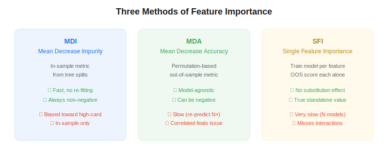
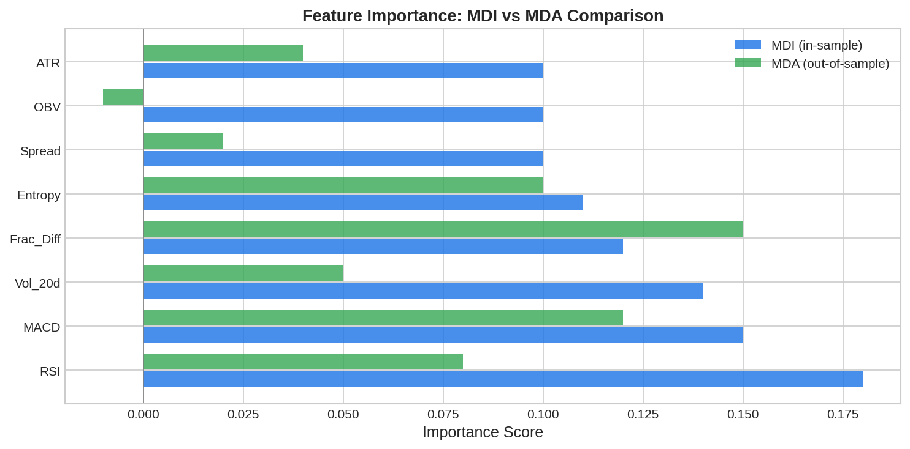

Feature importance is the process of ranking which input variables contribute most to a machine learning model's predictions. In *Advances in Financial Machine Learning* (2018), Marcos Lopez de Prado describes three complementary methods — Mean Decrease Impurity (MDI), Mean Decrease Accuracy (MDA), and Single Feature Importance (SFI) — each with distinct strengths and pitfalls when applied to financial data. Proper feature importance analysis prevents overfitting and identifies which market signals actually drive alpha.

## Why Feature Importance Matters in Trading

Financial datasets are noisy. Most features have a very low signal-to-noise ratio, and many apparent predictors are spurious. Without rigorous feature importance analysis, ML models will latch onto noise, producing impressive in-sample results that collapse out-of-sample. Feature importance tells you which features are genuinely predictive and which are dead weight.



## Method 1: Mean Decrease Impurity (MDI)

MDI is the default feature importance measure in scikit-learn's tree-based models. It measures how much each feature reduces impurity (e.g., Gini or entropy) when used for splits, averaged across all trees in the ensemble.

$$\text{MDI}_j = \frac{1}{B} \sum_{b=1}^{B} \sum_{\text{splits on } j} \Delta \text{impurity}$$

**Pros:** Fast — no re-fitting required, computed as a by-product of training. Always non-negative.

**Cons:** Biased toward features with high cardinality (continuous variables). In-sample only, so it can rank noise features highly if they overfit.

## Method 2: Mean Decrease Accuracy (MDA)

MDA is a permutation-based, out-of-sample method. For each feature $j$, shuffle its values in the test set and measure how much the model's accuracy drops:

$$\text{MDA}_j = \text{Score}_{\text{original}} - \text{Score}_{\text{permuted}_j}$$

**Pros:** Model-agnostic, out-of-sample, can produce negative values (indicating the feature is harmful). **Cons:** Slow, and correlated features can mask each other's importance — permuting one leaves the correlated partner intact.

## Method 3: Single Feature Importance (SFI)

SFI trains a separate model using only feature $j$ and evaluates its out-of-sample performance. This eliminates the substitution effect where correlated features share credit.

**Pros:** No substitution bias. Shows standalone predictive power. **Cons:** Very slow ($N$ models). Misses feature interactions entirely.



## Python Implementation

```python
import numpy as np
import pandas as pd
from sklearn.ensemble import RandomForestClassifier
from sklearn.model_selection import cross_val_score

def mdi_importance(clf, feature_names):
    imp = pd.Series(clf.feature_importances_, index=feature_names)
    return imp.sort_values(ascending=False)

def mda_importance(clf, X_test, y_test, feature_names, n_repeats=5):
    base_score = clf.score(X_test, y_test)
    importances = {}
    for col in feature_names:
        scores = []
        for _ in range(n_repeats):
            X_perm = X_test.copy()
            X_perm[col] = np.random.permutation(X_perm[col].values)
            scores.append(clf.score(X_perm, y_test))
        importances[col] = base_score - np.mean(scores)
    return pd.Series(importances).sort_values(ascending=False)

def sfi_importance(X, y, feature_names, cv=5):
    importances = {}
    for col in feature_names:
        clf = RandomForestClassifier(n_estimators=100, max_depth=3, random_state=42)
        scores = cross_val_score(clf, X[[col]], y, cv=cv, scoring="accuracy")
        importances[col] = scores.mean() - 0.5  # excess over random
    return pd.Series(importances).sort_values(ascending=False)
```

## Best Practice: Use All Three

Lopez de Prado recommends running all three methods and looking for convergence. A feature ranked highly by MDI but poorly by MDA and SFI is likely overfit. A feature ranked consistently across all three is a strong candidate for inclusion.

| Feature | MDI Rank | MDA Rank | SFI Rank | Verdict |
|---|---|---|---|---|
| Frac_Diff_Price | 1 | 2 | 1 | Strong — include |
| RSI_14 | 2 | 5 | 6 | Mixed — investigate |
| Random_Noise | 5 | 8 (negative) | 8 (negative) | Noise — exclude |

## Limitations and Risks

All three methods assume the model is a reasonable fit. If the base model is poorly specified, feature importance rankings will be misleading. MDA is particularly sensitive to the choice of test set — using [purged cross-validation](https://paperswithbacktest.com/wiki/purged-k-fold-cross-validation) instead of a single holdout improves reliability.

## Conclusion

Feature importance is not optional in financial ML — it's the difference between a model that captures real market dynamics and one that memorizes noise. By combining MDI, MDA, and SFI, you get a robust, multi-angle view of which features drive performance and which should be dropped from your [systematic trading](https://paperswithbacktest.com/wiki/systematic-trading-strategies) pipeline.

---

**Explore further on PapersWithBacktest:**
- Browse [backtested ML strategies](https://paperswithbacktest.com/strategies) with Python code and performance metrics
- Access [clean historical market data](https://paperswithbacktest.com/datasets) for equities, crypto, and futures
- Take the [algo trading course](https://paperswithbacktest.com/course) — 60+ video lessons and notebooks
- Related wiki pages: [Fractional Differentiation](https://paperswithbacktest.com/wiki/fractional-differentiation) · [Entropy Features](https://paperswithbacktest.com/wiki/entropy-features) · [Purged K-Fold CV](https://paperswithbacktest.com/wiki/purged-k-fold-cross-validation)
