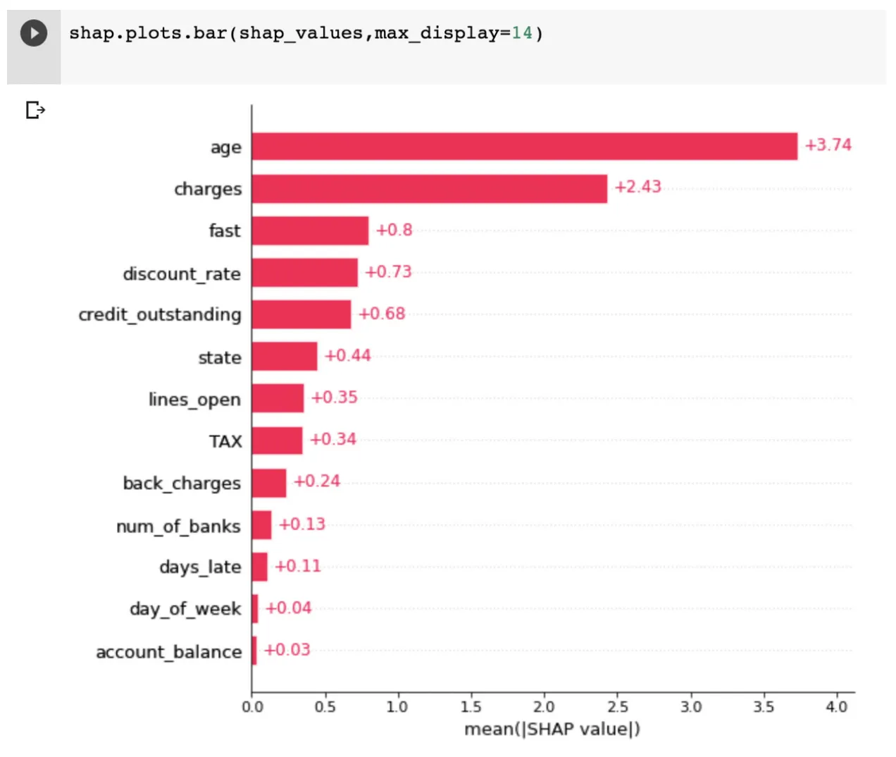

## Table of Contents

## What is feature importance in machine learning?

Feature importance in machine learning is a way to figure out which pieces of information, or features, are most helpful when making predictions or decisions. Imagine you're trying to guess if it will rain based on the weather. You might look at things like humidity, temperature, and cloud cover. Feature importance helps you understand which of these factors matters the most for your prediction. In machine learning models, this can be very useful because it shows us which data points we should pay more attention to, helping to make our models simpler and more effective.

There are different ways to measure feature importance, depending on the type of model you're using. For example, in decision trees, feature importance can be calculated by seeing how much each feature helps to split the data into different groups. In other models like random forests or gradient boosting machines, it's often done by looking at how much using a feature improves the model's accuracy. By understanding feature importance, we can make better decisions about which data to collect and use, and even simplify our models by removing less important features, which can make them work faster and be easier to understand.

## Why is feature importance useful for data analysis?

Feature importance is useful for data analysis because it helps us understand which pieces of information are the most important for making predictions or decisions. When we analyze data, we often have a lot of different pieces of information, and it can be hard to know which ones matter the most. By figuring out the importance of each feature, we can focus on the ones that really make a difference, which makes our analysis simpler and more effective. This is especially helpful when we want to explain our findings to others, because we can show them the key factors that drive our results.

Another reason feature importance is useful is that it can help us improve our models and make them more efficient. If we know which features are not very important, we can choose to leave them out, which can make our models run faster and be easier to understand. This is important in many real-world situations where time and resources are limited. By using feature importance, we can create models that are not only accurate but also practical to use, helping us make better decisions based on our data.

## How does feature importance help in model interpretation?

Feature importance helps in model interpretation by showing us which pieces of information are the most important for making predictions. When we look at a model's results, it can be hard to understand why it made certain decisions. By knowing which features matter the most, we can see the key factors that influenced the model's output. This makes it easier to explain the model to others and to understand how it works. For example, if a model predicts house prices and we see that the number of bedrooms is the most important feature, we can explain that the model relies heavily on this information to make its predictions.

Using feature importance also helps us trust the model more. When we can see which features are important and why, we feel more confident that the model is making decisions based on relevant information. This is especially helpful in fields like healthcare or finance, where understanding why a model makes a certain prediction can be very important. By focusing on the most important features, we can also check if the model is using the right information in the right way, which helps us make sure the model is reliable and accurate.

## What are the common methods to calculate feature importance?

One common way to calculate feature importance is by using decision trees. In a decision tree, the importance of a feature is based on how much it helps to split the data into different groups. If a feature splits the data in a way that makes the groups more pure or more similar to each other, it's considered more important. This method is easy to understand because it shows us exactly how each feature is used in the decision-making process. Random forests, which are made up of many decision trees, also use this idea but combine the results from all the trees to get a more reliable measure of feature importance.

Another method is used in models like gradient boosting machines. In these models, feature importance is calculated by looking at how much using a feature improves the model's accuracy. If adding a feature makes the model's predictions better, that feature is considered important. This method can be more complex because it involves looking at how the model changes as it learns from the data, but it can give us a good idea of which features are most helpful for making accurate predictions.

There's also a simpler method called permutation importance, which can be used with any type of model. In this method, we mix up the values of one feature and see how much it affects the model's accuracy. If mixing up a feature makes the model's predictions worse, that feature is important. This method is easy to use because it doesn't depend on how the model works inside, and it can give us a clear picture of which features are really making a difference.

## Can you explain how the Random Forest algorithm determines feature importance?

The Random Forest algorithm determines feature importance by looking at how each feature is used in all the decision trees that make up the forest. Imagine a forest with many trees, and each tree is a decision-making tool that splits the data based on different pieces of information. When the Random Forest algorithm calculates feature importance, it checks how much each feature helps to make these splits in all the trees. If a feature often helps to split the data in a way that makes the groups more similar to each other, it's considered more important.

To be more specific, the Random Forest algorithm measures feature importance by calculating the total reduction in a measure called "impurity" that happens when a feature is used to split the data. Impurity is a way to measure how mixed up the data is. If a feature helps to make the data less mixed up, it's seen as important. The algorithm adds up all these reductions across all the trees in the forest to get a final importance score for each feature. This way, we get a reliable measure of which features are most helpful for making accurate predictions.

## What is the difference between permutation importance and impurity-based importance?

Permutation importance and impurity-based importance are two ways to figure out which pieces of information, or features, are most important in a model. Permutation importance works by mixing up the values of one feature and seeing how it changes the model's accuracy. If mixing up a feature makes the model's predictions worse, that feature is important. This method can be used with any type of model, and it's easy to understand because it shows us how much each feature matters by messing with the data.

Impurity-based importance, on the other hand, is used mostly with decision trees and random forests. It looks at how much a feature helps to split the data into groups that are more similar to each other. If a feature helps to make these groups more pure, or less mixed up, it's considered important. This method adds up all the times a feature helps to make these splits across all the trees in a forest, giving us a score for each feature's importance. While it's a bit more complex, it's very useful for understanding which features are key in these types of models.

## How does feature importance vary across different machine learning models?

Feature importance can change a lot depending on the type of machine learning model you're using. For example, in decision trees and random forests, feature importance is calculated by looking at how much each feature helps to split the data into groups that are more similar. This means that if a feature often helps to make the data less mixed up, it's seen as important. In these models, we can see exactly how each feature is used in the decision-making process, which makes it easy to understand why some features matter more than others.

On the other hand, in models like linear regression or logistic regression, feature importance is often based on the size of the coefficients for each feature. If a feature has a big coefficient, it means it has a strong effect on the model's predictions, so it's considered important. These models give us a clear number that shows how much each feature matters, but they don't show us the step-by-step process like decision trees do. This can make it a bit harder to explain why some features are more important, but it's still very useful for understanding which pieces of information drive the model's decisions.

In more complex models like neural networks, figuring out feature importance can be trickier. These models work in a way that's hard to see inside, so we often use methods like permutation importance to see how mixing up a feature affects the model's accuracy. This helps us understand which features are important, even if the model itself is hard to explain. Each type of model has its own way of calculating feature importance, and understanding these differences can help us pick the right model for our needs and explain our results better.

## What are the limitations of using feature importance in model analysis?

Using feature importance in model analysis has some limits we need to know about. One big problem is that feature importance can be different depending on the type of model we use. What's important in one model might not be as important in another. This can make it hard to trust the results if we're not sure which model to use. Also, feature importance might not tell the whole story. Some features might work together in ways that make them important, but if we look at them one by one, they might not seem that important. This can lead us to miss important information if we focus too much on the importance scores.

Another limit is that feature importance can be affected by how we set up our model. For example, if we change some settings in a decision tree, the importance of features can change too. This means we need to be careful about how we interpret the results, because small changes can make a big difference. Also, in some models like neural networks, it can be really hard to figure out feature importance because these models are so complex. We might need to use special methods to get a good idea of which features matter, but even then, the results might not be very clear or easy to understand.

## How can feature importance be used to improve model performance?

Feature importance can help us make our models better by showing us which pieces of information are most important. When we know which features matter the most, we can focus on those and ignore the ones that don't help much. This can make our models simpler and faster because we're only using the information that really makes a difference. For example, if we're trying to predict house prices and we see that the number of bedrooms is really important but the color of the house isn't, we can leave out the color and make our model easier to use.

Using feature importance can also help us find and fix problems in our data. If a feature seems important but we know it shouldn't be, it might mean there's something wrong with our data or our model. By looking at feature importance, we can spot these issues and make our models more accurate. For example, if the day of the week is really important for predicting something that shouldn't depend on it, we might need to check our data for mistakes or think about why this is happening. By using feature importance to improve our models, we can make better predictions and decisions.

## What advanced techniques exist for feature importance in deep learning models?

In deep learning models, figuring out feature importance can be tricky because these models are really complex. But there are some smart ways to do it. One way is called SHAP (SHapley Additive exPlanations). SHAP looks at how each feature affects the model's predictions by trying different combinations of features. It's like playing a game to see which pieces of information make the biggest difference. This method can help us understand which features are important, even in really complicated models like neural networks.

Another technique is called LIME (Local Interpretable Model-agnostic Explanations). LIME works by making a simpler model that tries to copy what the deep learning model does for a specific prediction. By looking at this simpler model, we can see which features are important for that prediction. LIME is useful because it can explain why a model made a certain decision, which is really helpful when we need to understand and trust the model's results. Both SHAP and LIME help us make sense of deep learning models by showing us which pieces of information matter the most.

## How do you handle correlated features when assessing feature importance?

When we have features that are related to each other, or correlated, it can be hard to figure out which one is really important. Imagine you're trying to guess if someone will like a movie based on how long it is and how many scenes it has. If these two things are often the same, like longer movies usually having more scenes, it can be tricky to tell which one matters more. In this case, if we just look at feature importance, we might think both are important, but really, they're just telling us the same thing.

To handle this, we can use some smart tricks. One way is to group the correlated features together and treat them as one big feature. This can help us see if they're really important together, rather than trying to figure out which one is more important on its own. Another way is to use methods like SHAP or LIME, which can show us how each feature affects the model's predictions, even if they're related to each other. By using these techniques, we can get a better idea of which features are truly helpful for making accurate predictions, even when they're correlated.

## What are the best practices for communicating feature importance to stakeholders?

When you need to tell stakeholders about which pieces of information, or features, are important in your model, it's best to keep things simple and clear. Start by explaining what feature importance means in a way that's easy to understand. You might say something like, "Feature importance helps us see which pieces of information our model uses the most to make its predictions." Then, use examples that relate to their work or interests. For instance, if you're talking to a team that sells houses, you could say, "In our model, the number of bedrooms is more important than the color of the house when predicting the price."

It's also helpful to use pictures or charts to show feature importance. A bar chart, for example, can make it easy to see which features are the most important at a glance. When you show these visuals, walk stakeholders through them step by step, explaining what each part means. Make sure to answer any questions they have and be ready to explain things in different ways if they're still confused. By keeping your explanations simple and using examples and visuals, you can help stakeholders understand and trust your model's results.

## What are the techniques to determine feature importance?

Feature importance is integral to optimizing trading algorithms by identifying which variables significantly impact their performance. Among the many techniques used to determine feature importance, permutation importance, SHAP values, and Recursive Feature Elimination (RFE) are prevalent due to their effectiveness and versatility.

**Permutation Importance** is a straightforward yet powerful method for assessing the contribution of individual variables to a model's predictive power. This technique involves shuffling the values of each feature one at a time and observing the change in the model's performance. The rationale is that if permuting the values of a feature considerably degrades the model's accuracy, the feature is deemed important. Formally, for a model $f$ and a dataset $D$, the change in performance (often measured using error metric $E$) when permuting feature $i$ can be denoted as:

$$
\text{Importance}_i = E(f, D) - E(f, D_{\text{permuted } i})
$$

where $D_{\text{permuted } i}$ represents the dataset with the $i$-th feature permuted. This method is model-agnostic, making it applicable across different algorithmic paradigms.

**SHAP (Shapley Additive Explanations) Values** provide a unified approach to quantify feature contributions through concepts borrowed from cooperative game theory. SHAP values allocate importance to each feature by considering all possible feature combinations. This results in a summarized measure of each feature's contribution to the prediction, ensuring fairness and consistency. The SHAP framework is grounded on three principles: local accuracy, missingness, and consistency, offering clear insight into model predictions. The SHAP value for a feature $i$ is calculated by:

$$
\phi_i = \sum_{S \subseteq N \setminus \{i\}} \frac{|S|! (|N|-|S|-1)!}{|N|!} \left[ f(S \cup \{i\}) - f(S) \right]
$$

where $N$ is the set of all features, $S$ is a subset of features not containing $i$, and $f$ represents the prediction function. SHAP values are particularly valuable in algorithmic trading for their coherent interpretation of a model's outputs.

**Recursive Feature Elimination (RFE)** is an efficient feature selection algorithm that works by iteratively removing the least important features based on a specified criterion, typically utilizing the weights from an estimator (e.g., coefficients in regression or feature importance in tree-based models). The process involves the following steps:
1. Train the model on the current set of features.
2. Rank features based on their importance.
3. Remove the least important feature(s).
4. Repeat until the desired number of features is reached or performance criteria are satisfied.

Here is a simplified Python example using RFE with a Support Vector Machine (SVM):
```python
from sklearn.feature_selection import RFE
from sklearn.svm import SVR

# Assuming X, y are the feature matrix and target vector
model = SVR(kernel="linear")
rfe = RFE(estimator=model, n_features_to_select=5)
fit = rfe.fit(X, y)

# Output results
print("Selected features:", fit.support_)
print("Feature ranking:", fit.ranking_)
```

Each of these techniques offers different insights and can be selected based on the specific requirements of the trading strategy and data characteristics. The correct application and interpretation of these methods are crucial for the effective optimization of trading algorithms.

## References & Further Reading

[1]: Bergstra, J., Bardenet, R., Bengio, Y., & Kégl, B. (2011). ["Algorithms for Hyper-Parameter Optimization."](https://papers.nips.cc/paper/4443-algorithms-for-hyper-parameter-optimization) Advances in Neural Information Processing Systems 24.

[2]: ["Advances in Financial Machine Learning"](https://www.amazon.com/Advances-Financial-Machine-Learning-Marcos/dp/1119482089) by Marcos Lopez de Prado

[3]: ["Evidence-Based Technical Analysis: Applying the Scientific Method and Statistical Inference to Trading Signals"](https://www.amazon.com/Evidence-Based-Technical-Analysis-Scientific-Statistical/dp/0470008741) by David Aronson

[4]: ["Machine Learning for Algorithmic Trading"](https://github.com/PacktPublishing/Machine-Learning-for-Algorithmic-Trading-Second-Edition) by Stefan Jansen

[5]: ["Quantitative Trading: How to Build Your Own Algorithmic Trading Business"](https://books.google.com/books/about/Quantitative_Trading.html?id=j70yEAAAQBAJ) by Ernest P. Chan