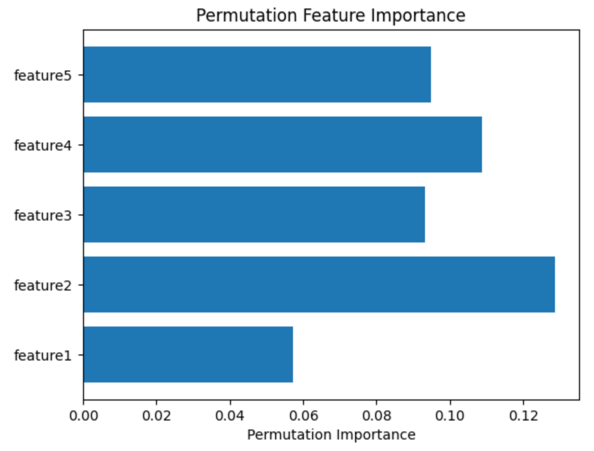

## Table of Contents

## What are feature importances in machine learning?

Feature importances in machine learning help us understand which pieces of data are most helpful in making predictions. Imagine you're trying to guess if it will rain based on the weather data you have. Some pieces of data, like humidity and cloud cover, might be more useful than others, like the day of the week. Feature importance tells us which of these pieces of data, or "features," are the most important for making accurate predictions.

In many machine learning models, like decision trees and random forests, we can directly see which features are most important. For example, if a decision tree often splits on humidity first, it means humidity is a very important feature for that model. Other models, like linear regression, use the size of the coefficients to show feature importance. If the coefficient for humidity is large, it means humidity has a big impact on the prediction. Understanding feature importance helps us focus on collecting the most useful data and can make our models simpler and more effective.

## Why are feature importances important for model interpretation?

Feature importances are important for model interpretation because they help us understand which pieces of data, or features, are most useful in making predictions. When we know which features are important, we can explain to others why the model makes certain decisions. For example, if a model predicts house prices and finds that the number of bedrooms is the most important feature, we can tell people that the number of bedrooms has a big impact on the price. This makes the model's decisions easier to understand and trust.

Additionally, knowing feature importances can help us improve our models. If we see that some features are not important, we might decide to remove them, which can make our model simpler and faster. On the other hand, if we find that some important features are missing, we can collect more data about those features to make our model better. By focusing on the most important features, we can create models that are not only more accurate but also easier to explain and maintain.

## How can feature importances help in feature selection?

Feature importances help in feature selection by showing us which pieces of data are most helpful for making predictions. When we know which features are important, we can choose to keep those and remove the ones that don't help much. This makes our model simpler and can make it work better because it focuses on the most useful information. For example, if we're trying to predict if someone will buy a product, and we see that their age is much more important than their favorite color, we might decide to only use age in our model.

By using feature importances for feature selection, we can also save time and resources. If we have a lot of data, collecting and processing all of it can be expensive and slow. But if we know which features are important, we can focus on collecting and using only those. This can make our data collection process more efficient and help us build models that are easier to understand and maintain. In the end, feature importances help us create better models by focusing on what really matters.

## What are some common methods to calculate feature importances?

One common method to calculate feature importances is by using decision trees and random forests. In these models, feature importance is often measured by how much the model's accuracy decreases when we remove a feature or mix up its values. For example, if we take away the feature for "humidity" and the model's predictions get worse, it means humidity is important. Random forests also give us a score for each feature that shows how often it's used in the trees and how much it helps split the data. This helps us see which features are most useful for making good predictions.

Another method is using the coefficients in linear models like linear regression. In these models, the size of the coefficients tells us how much each feature affects the prediction. If the coefficient for a feature like "number of bedrooms" is big, it means that feature has a strong impact on the prediction. We can use the absolute value of the coefficient to compare the importance of different features. For example, if the coefficient for "number of bedrooms" is larger than the coefficient for "square footage," it means "number of bedrooms" is more important for predicting house prices.

Some other methods include using permutation importance, where we mix up the values of a feature and see how it affects the model's performance, and using techniques like LASSO (Least Absolute Shrinkage and Selection Operator) which can shrink the coefficients of less important features to zero. These methods help us understand which features are most helpful for making accurate predictions and can guide us in selecting the best features for our model.

## Can you explain how Random Forests determine feature importance?

Random Forests determine feature importance by looking at how much each feature helps to make good predictions. They do this by checking how often a feature is used in the trees and how much it helps to split the data into different groups. When a feature is used to split the data, it means that feature is important for making decisions. The more often a feature is used and the better it splits the data, the more important it is. This way, Random Forests can tell us which pieces of data are the most helpful for making accurate predictions.

For example, if we have a Random Forest that's trying to predict if it will rain, it might use features like humidity, temperature, and wind speed. If humidity is used in many of the trees and it helps to split the data into groups that are very different from each other (like high humidity leading to rain and low humidity leading to no rain), then humidity will have a high importance score. This score is calculated by averaging the importance of the feature across all the trees in the forest. By doing this, Random Forests can show us which features, like humidity, are the most important for making good predictions.

## How does feature importance in gradient boosting machines like XGBoost work?

In gradient boosting machines like XGBoost, feature importance is calculated by looking at how much each feature helps to reduce the error in the model's predictions. When XGBoost builds a tree, it splits the data into different groups based on the features. The feature that helps to make the best split, reducing the error the most, gets a higher importance score. This process is repeated for each tree in the model, and the importance scores are added up across all the trees. So, features that are used often and help a lot in making good splits will have high importance scores.

For example, if we're using XGBoost to predict house prices, it might use features like the number of bedrooms, square footage, and the age of the house. If the number of bedrooms is used in many trees and helps to split the data into groups that are very different in price, it will have a high importance score. XGBoost calculates this by looking at how much the error decreases when it uses the number of bedrooms to split the data. By doing this for all features, XGBoost can tell us which ones, like the number of bedrooms, are the most important for making accurate predictions.

## What are the limitations of using feature importance scores?

Using feature importance scores can be helpful, but they have some limitations. One big problem is that feature importance scores can be different depending on the model we use. For example, if we use a decision tree, it might say that one feature is the most important, but if we use a different model like XGBoost, it might say a different feature is the most important. This can make it hard to know which feature is really the most important. Also, feature importance scores can be affected by how we prepare our data. If we change our data in some way, like by adding or removing features, the importance scores can change too.

Another limitation is that feature importance scores don't always tell the whole story. They can show which features are helpful for making predictions, but they don't explain how the features work together. For example, two features might not be very important on their own, but when we use them together, they can be very helpful. Feature importance scores can miss this kind of information. Also, if we have features that are related to each other, like the length and width of a room, the scores might not show the true importance of these features because they can be confused about which one is really helping the most.

## How can feature importances be visualized effectively?

One effective way to visualize feature importances is by using a bar chart. In a bar chart, each bar represents a feature, and the length of the bar shows how important that feature is. The bars are usually sorted from the most important feature to the least important one, so it's easy to see which features matter the most. For example, if we're trying to predict house prices, the bar chart might show that the number of bedrooms is the most important feature, followed by square footage, and then the age of the house. This kind of chart is simple to understand and helps people quickly see which pieces of data are most helpful for making predictions.

Another good way to visualize feature importances is with a heat map. A heat map uses colors to show how important each feature is, with darker or brighter colors indicating higher importance. This can be especially useful when we want to see how feature importance changes over time or across different groups. For example, if we're looking at how important different weather features are for predicting rain in different seasons, a heat map can show us that humidity is very important in the summer but less important in the winter. Heat maps can help us understand more complex patterns in feature importance and make it easier to spot trends and differences.

## What are permutation importance and how does it differ from traditional feature importance?

Permutation importance is a way to find out how important each piece of data, or feature, is for making predictions. It works by mixing up the values of one feature and seeing how it affects the model's predictions. If the model's predictions get worse when you mix up the values of a feature, it means that feature is important. For example, if you're trying to predict if it will rain and you mix up the humidity values, and the predictions get a lot worse, it shows that humidity is an important feature.

Permutation importance is different from traditional feature importance because it doesn't depend on how the model was built. Traditional feature importance, like the kind you get from decision trees or random forests, looks at how the model uses the features to make splits or decisions. But permutation importance works with any kind of model. It just looks at how the predictions change when you mess up the values of a feature. This makes permutation importance a good choice when you want to understand feature importance in a way that's not tied to the specifics of how the model works.

## How can feature importance be used to improve model performance?

Feature importance helps us make our models better by showing us which pieces of data matter the most for making predictions. When we know which features are important, we can focus on collecting and using those features, and maybe even ignore the ones that don't help much. This can make our model simpler and faster because it only uses the most useful information. For example, if we're trying to predict if someone will buy a product, and we see that their age is much more important than their favorite color, we might decide to only use age in our model. This can make our predictions more accurate because we're focusing on what really matters.

Using feature importance also helps us find new ways to improve our model. If we see that some important features are missing, we can collect more data about those features to make our model better. On the other hand, if we find that some features are not important, we might decide to remove them. This can make our model easier to understand and maintain. By focusing on the most important features, we can create models that are not only more accurate but also simpler and more efficient.

## What are some advanced techniques for calculating feature importances in deep learning models?

In deep learning models, calculating feature importances can be tricky because these models are like complicated puzzles with many pieces. One advanced technique is called SHAP (SHapley Additive exPlanations). SHAP values help us understand how each piece of data, or feature, affects the model's predictions. It does this by looking at all the different ways the features can be combined and figuring out how much each feature contributes to the final prediction. For example, if we're using a deep learning model to predict house prices, SHAP can show us that the number of bedrooms has a big impact on the price, while the color of the house doesn't matter much.

Another technique is using techniques like Integrated Gradients. Integrated Gradients work by looking at how the model's predictions change as we slowly change the input from a starting point to the actual values. This helps us see how much each feature is pushing the prediction up or down. For example, if we're predicting if it will rain and we slowly change the humidity from zero to the real value, Integrated Gradients can show us how much humidity affects the prediction. Both SHAP and Integrated Gradients help us understand deep learning models better by showing which features are most important for making accurate predictions.

## How can one validate the reliability of feature importance measures in complex models?

Validating the reliability of feature importance measures in complex models can be tricky, but there are some good ways to do it. One way is to use cross-validation. This means we split our data into different parts, build the model many times with different parts of the data, and see if the feature importance scores stay the same each time. If the scores are similar across all the different models, it means the feature importance measures are reliable. Another way is to use different methods to calculate feature importance, like SHAP values and permutation importance, and see if they agree with each other. If different methods give us similar results, it makes us more confident that the feature importance measures are reliable.

Another way to check the reliability of feature importance is by looking at how the model's performance changes when we remove or change the features. If we take away a feature that the model says is important and the model's predictions get a lot worse, it means the feature importance measure is probably right. On the other hand, if removing a feature doesn't change the model's performance much, it might mean the feature importance measure is not very reliable. By using these different checks, we can feel more sure about which pieces of data are really important for making good predictions with our complex models.