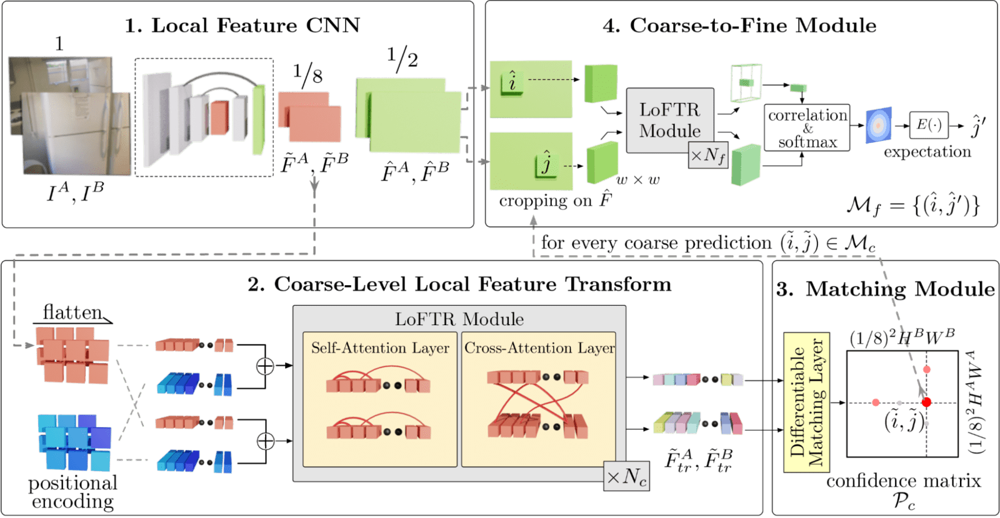

## Table of Contents

## What is feature matching in the context of machine learning?

Feature matching in machine learning is a technique used to identify and compare similar features or patterns between different data sets or images. It's like finding matching pieces in a puzzle. For example, in image recognition, feature matching can help identify objects by comparing specific characteristics, such as edges or corners, from one image to another. This process is crucial for tasks like object recognition, where the goal is to find and label objects within an image by matching their features to a known database of features.

The process of feature matching involves extracting features from the data, which could be keypoints in images or specific attributes in datasets. Once these features are extracted, algorithms like the Scale-Invariant Feature Transform (SIFT) or the Speeded Up Robust Features (SURF) can be used to compare and match these features across different data sets. These algorithms help in determining how similar the features are, even if the images or data sets are taken from different angles or under different conditions. By doing so, feature matching enables more accurate and robust recognition and classification in various machine learning applications.

## Why is feature matching important in computer vision and image processing?

Feature matching is really important in computer vision and image processing because it helps computers understand and recognize things in pictures or videos. Imagine you're trying to find your friend in a crowd. You might look for their unique features like their hair color or the shape of their face. In the same way, computers use feature matching to find and recognize objects by comparing specific parts of images, like edges or corners, to a database of known features. This is super helpful for tasks like tracking objects in videos, stitching together photos to make panoramas, or even helping self-driving cars recognize road signs and obstacles.

This technique is also crucial because it can work well even when images are taken from different angles or in different lighting conditions. For example, if you take a photo of a building from the front and then from the side, feature matching can still help identify it as the same building by matching common features in both images. This makes feature matching a powerful tool for tasks like 3D reconstruction, where multiple images are used to create a detailed model of an object or a scene. By being able to match features accurately, computers can perform these tasks more reliably, making them essential in many real-world applications.

## What are the basic steps involved in the feature matching process?

The first step in the feature matching process is to extract features from the images or data sets you're working with. These features could be things like corners, edges, or specific patterns that are unique to the objects you're trying to recognize. Once you have these features, you use algorithms like SIFT (Scale-Invariant Feature Transform) or SURF (Speeded Up Robust Features) to describe them in a way that the computer can understand. These algorithms create a kind of "fingerprint" for each feature, which helps in comparing them later.

After extracting and describing the features, the next step is to match these features between different images or data sets. This involves comparing the "fingerprints" of the features from one image to those of another image. The goal is to find pairs of features that are very similar, indicating that they likely belong to the same object or scene. Algorithms like the nearest neighbor search or the RANSAC (Random Sample Consensus) method are often used to find these matches. Once the matches are found, you can use them to recognize objects, track movement, or even stitch images together to create panoramas or 3D models.

## How does feature matching contribute to object recognition and tracking?

Feature matching helps computers recognize and track objects by finding and comparing special parts of images, like corners or edges. Imagine you're trying to find your favorite toy in a messy room. You might look for its unique colors or shapes. In the same way, computers use feature matching to find objects by matching these special parts to a list of known features. This is really helpful for tasks like recognizing faces in photos or tracking cars in traffic videos. By matching features, computers can tell if an object in one image is the same as an object in another image, even if the images are taken from different angles or in different lighting.

For tracking objects, feature matching is key because it allows computers to follow an object as it moves from one frame to the next in a video. For example, if you're watching a soccer game on TV, the computer can track the ball by matching its features in each frame. This helps in understanding the movement and path of the ball throughout the game. By using feature matching, computers can keep an eye on objects over time, making it easier to analyze and understand what's happening in videos or live feeds.

## What are some common algorithms used for feature matching, such as SIFT and SURF?

SIFT, or Scale-Invariant Feature Transform, is a popular algorithm used for feature matching. It works by finding special points in an image, called keypoints, and then creating a unique description for each keypoint. These descriptions are like fingerprints that help match the same object in different images, even if the images are taken from different angles or in different lighting. SIFT is really good at recognizing objects because it can handle changes in scale, rotation, and even some changes in viewpoint. This makes it very useful for tasks like object recognition and image stitching.

SURF, or Speeded Up Robust Features, is another algorithm used for feature matching. It's similar to SIFT but faster, which makes it great for real-time applications. SURF also finds keypoints in an image and creates descriptions for them, but it uses a different method that's quicker to compute. This speed advantage makes SURF useful for tasks like tracking objects in videos or helping robots navigate in real-time. Both SIFT and SURF are powerful tools that help computers understand and recognize objects by matching their features.

## How can feature matching be used to improve the reliability of machine learning models?

Feature matching can improve the reliability of [machine learning](/wiki/machine-learning) models by helping them recognize objects more accurately. When a model uses feature matching, it looks for special parts of an image, like corners or edges, and compares these parts to a list of known features. This helps the model identify objects even if they are in different positions or lighting conditions. For example, if a model is trained to recognize cars, feature matching can help it spot a car in a new picture by matching the car's features to ones it has seen before. This makes the model's predictions more reliable because it can better handle changes in the environment.

Additionally, feature matching can make machine learning models more robust by improving their ability to track objects over time. In tasks like video analysis, where objects move from one frame to the next, feature matching helps the model follow these objects by matching their features across different frames. This is useful in applications like surveillance or sports analytics, where tracking the movement of people or objects is important. By using feature matching, the model can keep a more consistent and accurate track of objects, leading to more reliable results and better performance in real-world scenarios.

## What challenges are associated with feature matching, particularly in varying lighting and scale conditions?

Feature matching can be tricky when the lighting changes or when objects appear at different sizes in images. Imagine trying to find your friend in a crowd at different times of the day. If it's sunny in one picture and dark in another, it might be hard to spot them because their features look different. The same thing happens with computers. Algorithms like SIFT and SURF help a lot, but they can still struggle when the light changes a lot. This is because the features that the computer looks for, like edges or corners, can look very different under different lighting conditions.

Another challenge is when objects appear at different scales. If you take a picture of a building from far away and then up close, the building's features will look very different in size. This makes it hard for the computer to match these features across the images. Algorithms like SIFT are designed to handle changes in scale, but they can still have trouble if the scale difference is too big. To make feature matching work better in these situations, researchers are always working on improving these algorithms and sometimes use additional techniques like image normalization or multi-scale analysis to help the computer better recognize objects no matter the lighting or scale.

## How does the concept of 'Good Feature Matching' enhance the performance of feature matching algorithms?

Good feature matching means finding the best matches between features in different images or data sets. This is really important because it helps computers recognize and track objects more accurately. When the matches are good, the computer can be more sure that it's looking at the same object, even if the images are taken from different angles or in different lighting. This makes the whole process more reliable. For example, if a computer is trying to find a specific car in a parking lot, good feature matching can help it spot the car's unique features, like its shape or color, no matter where it's parked or how the light is hitting it.

To achieve good feature matching, algorithms like SIFT and SURF work hard to find the best possible matches. They do this by creating detailed descriptions of the features, kind of like fingerprints, and then comparing these descriptions across images. The better the descriptions, the easier it is to find good matches. This is why researchers keep working on improving these algorithms. By making them better at handling changes in scale, rotation, and lighting, good feature matching can make computers much smarter at tasks like object recognition and tracking, leading to more accurate and useful results in real-world applications.

## What role does MaskFlownet play in feature matching, especially in the context of optical flow?

MaskFlownet is a special kind of [neural network](/wiki/neural-network) that helps with feature matching by figuring out how things move between two images. It's really good at understanding optical flow, which is like drawing arrows to show how each part of an image moves from one frame to the next. By using MaskFlownet, computers can match features more accurately because they can see how these features move over time. This is super helpful for tasks like tracking objects in videos or helping self-driving cars understand the movement of other vehicles on the road.

In the context of optical flow, MaskFlownet works by creating masks that highlight different parts of the images. These masks help the network focus on specific features and understand how they move. By doing this, MaskFlownet can match features even when they are moving or changing shape. This makes it a powerful tool for improving the accuracy of feature matching in real-world situations where things are always moving and changing.

## How can feature balancing be applied to optimize feature matching in complex scenes?

Feature balancing is a way to make feature matching work better in scenes that have lots of different things going on. Imagine you're looking at a busy street with cars, people, and buildings. Some parts of the scene, like the buildings, might have lots of clear features, while others, like the people, might have fewer. Feature balancing helps by making sure the computer pays attention to all parts of the scene equally. It does this by adjusting how important each feature is, so the computer doesn't focus too much on the easy-to-see features and miss the harder ones.

To apply feature balancing, you can use techniques that weigh the features differently based on how common they are in the scene. For example, if there are too many features from the buildings, you might lower their importance so the computer can also see the features from the people. This way, the feature matching algorithm can find matches more accurately across the whole scene, not just in the parts with the most features. By balancing the features, the computer can understand and recognize objects in complex scenes more reliably.

## What advanced techniques can be used to handle occlusions and deformations in feature matching?

Handling occlusions and deformations in feature matching can be tricky because objects can be partly hidden or change shape. One advanced technique to deal with this is using deformable part models. These models break down an object into smaller parts and allow each part to move or change shape independently. This helps the computer recognize an object even if it's partly covered or looks different because of how it's bent or twisted. For example, if a person is partially hidden behind a tree, the computer can still match the visible parts of the person to known features.

Another technique is using optical flow algorithms like MaskFlownet, which can track how features move over time. This is helpful because it can predict where a hidden part of an object might be based on how the visible parts are moving. By understanding the flow of features, the computer can better guess what's behind an occlusion or how an object might look after it deforms. This makes feature matching more reliable in real-world situations where things are constantly moving and changing.

## How can one evaluate and compare the performance of different feature matching methods in practical applications?

To evaluate and compare the performance of different feature matching methods, you can look at how well they work in real situations. One way to do this is by using metrics like precision and recall. Precision tells you how many of the matches the method found are actually correct, while recall tells you how many of the correct matches the method was able to find. For example, if you're trying to match features between two images of a building, you want a method that can find most of the correct matches (high recall) and not too many wrong ones (high precision). You can also measure the speed of the method, which is important for applications that need to work in real-time, like tracking objects in videos.

Another way to compare feature matching methods is by testing them on different kinds of images or data sets. You might use images with different lighting conditions, angles, or even scenes with lots of objects to see how well each method handles these challenges. For instance, you could test how well a method matches features in a busy street scene versus a simple indoor setting. By running these tests and comparing the results, you can see which method is best for your specific needs. This helps you choose the right feature matching method for tasks like object recognition, tracking, or image stitching in practical applications.

## References & Further Reading

[1]: Lowe, D. G. (2004). ["Distinctive Image Features from Scale-Invariant Keypoints."](https://link.springer.com/article/10.1023/B:VISI.0000029664.99615.94) International Journal of Computer Vision, 60(2), 91-110.

[2]: Bay, H., Ess, A., Tuytelaars, T., & Van Gool, L. (2008). ["SURF: Speeded Up Robust Features."](https://www.sciencedirect.com/science/article/pii/S1077314207001555) Computer Vision and Image Understanding, 110(3), 346-359.

[3]: Dosovitskiy, A., Fischer, P., Ilg, E., Häusser, P., Hazirbas, C., Golkov, V., . . . & Brox, T. (2015). ["Flownet: Learning Optical Flow with Convolutional Networks."](https://arxiv.org/abs/1504.06852) In Proceedings of the IEEE International Conference on Computer Vision (ICCV).

[4]: Rosten, E., & Drummond, T. (2006). ["Machine Learning for High-Speed Corner Detection."](https://link.springer.com/chapter/10.1007/11744023_34) In European Conference on Computer Vision (ECCV), 430-443.

[5]: Mikolajczyk, K., & Schmid, C. (2005). ["A Performance Evaluation of Local Descriptors."](https://ieeexplore.ieee.org/document/1498756) IEEE Transactions on Pattern Analysis and Machine Intelligence, 27(10), 1615-1630.

[6]: Zhang, L., & Koch, R. (2012). ["An Efficient and Robust Line Segment Matching Approach Based on LBD Descriptor and Pairwise Geometric Consistency."](https://www.sciencedirect.com/science/article/pii/S1047320313000874) Journal of Visual Communication and Image Representation, 24(7), 794-805.