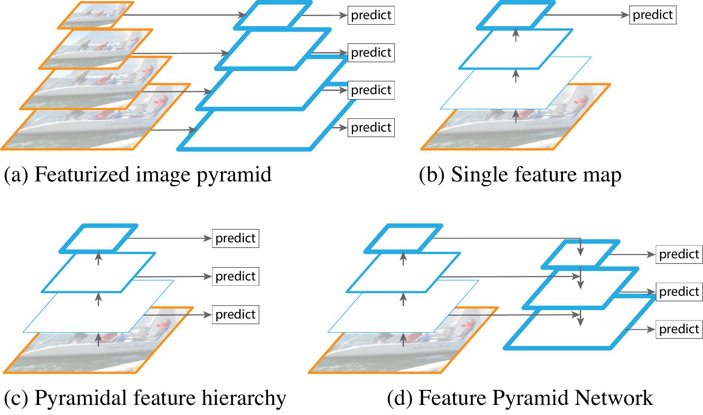

## Table of Contents

## What is a Feature Pyramid Block in the context of machine learning?

A Feature Pyramid Block is a part of a neural network that helps in processing images at different scales. In simple terms, when we look at an image, we can see both the big picture and the small details. A Feature Pyramid Block makes sure the network can understand both these aspects. It does this by creating a set of feature maps at different levels, where each level captures different details of the image. This is especially useful in tasks like object detection, where recognizing objects of varying sizes is important.

The way a Feature Pyramid Block works is by taking the output from different layers of a neural network and combining them in a smart way. Imagine you have a tall building with many floors, and each floor gives you a different view of the surroundings. The Feature Pyramid Block takes these views and merges them to give a complete picture. This merging process usually involves upsampling the lower-level features to match the size of higher-level features, and then combining them. By doing this, the network can better understand and process images, leading to more accurate results in tasks like image classification and object detection.

## How does a basic Feature Pyramid Network (FPN) work?

A basic Feature Pyramid Network (FPN) works by creating a pyramid of feature maps from an image. It starts with a backbone network, like a convolutional neural network (CNN), that processes the image and produces feature maps at different levels. These levels are like different floors of a building, where the lower floors capture fine details and the higher floors capture broader context. The FPN takes these feature maps and builds a pyramid by combining them in a smart way. It does this by taking the feature map from the highest level and upsampling it to match the size of the next lower level. Then, it adds the feature map from this lower level to the upsampled one. This process continues down the pyramid, creating a set of feature maps that have both detailed and broad information.

Once the pyramid is built, the FPN uses these feature maps for tasks like object detection. Each level of the pyramid is used to detect objects of different sizes. For example, the higher levels might be better at detecting large objects, while the lower levels are better at detecting smaller ones. This way, the network can find objects of all sizes in the image. The final output of the FPN is a set of predictions for each level of the pyramid, which are then combined to give the overall result. This approach helps the network to be more accurate and efficient in understanding images at different scales.

## What are the main components of a Feature Pyramid Block?

The main components of a Feature Pyramid Block are the bottom-up pathway, the top-down pathway, and the lateral connections. The bottom-up pathway is the part of the network that processes the image and creates feature maps at different levels. It's like looking at the image from different distances, where the closer you are, the more details you see. The top-down pathway takes the highest-level feature map and makes it bigger step by step, matching the size of the lower-level feature maps. This is like zooming in on a picture, but doing it in a way that keeps the important information.

The lateral connections are what make the Feature Pyramid Block special. They connect the top-down pathway with the bottom-up pathway by adding the feature maps from the bottom-up pathway to the upsampled feature maps from the top-down pathway. This is like mixing the detailed view from the bottom-up pathway with the broad view from the top-down pathway, creating a new feature map that has the best of both worlds. These new feature maps are then used for tasks like object detection, where understanding objects at different scales is important.

## What is the difference between FPN and PAFPN?

A Feature Pyramid Network (FPN) and a Path Aggregation Feature Pyramid Network (PAFPN) are both used to help computers understand images at different sizes. FPN works by taking the output from different layers of a network and combining them to create a pyramid of feature maps. It starts with the highest level and makes it bigger, then adds it to the next level down, and keeps doing this until it reaches the bottom. This way, FPN can see both the big picture and the small details in an image.

PAFPN is like FPN but with an extra step. After FPN creates its pyramid, PAFPN adds another pathway that goes from the bottom of the pyramid back up to the top. This extra pathway helps the network to better understand how the different parts of the image are connected. By going both up and down the pyramid, PAFPN can share information more effectively, which can make it better at tasks like finding objects in an image.

## How does Bottom-up Path Augmentation enhance feature pyramids?

Bottom-up Path Augmentation helps make feature pyramids better by adding more information to them. In a normal feature pyramid, we start at the top with a big picture view and then go down, making the picture bigger and adding more details from lower levels. But with Bottom-up Path Augmentation, we don't just go down; we also go back up. This means we take the detailed information from the bottom and add it to the big picture view at the top. By doing this, the feature pyramid gets a mix of both the broad view and the fine details, which can help the computer understand the image better.

This technique is especially useful for tasks like finding objects in pictures. When we go back up the pyramid, we can share the detailed information from the bottom with the higher levels. This way, the higher levels, which usually see the big picture, can also see the small details. This makes the feature pyramid more powerful because it can use all the information it has to make better guesses about what's in the picture. So, Bottom-up Path Augmentation makes the feature pyramid stronger and more accurate.

## What is BiFPN and how does it improve upon traditional FPNs?

BiFPN, which stands for Bidirectional Feature Pyramid Network, is a way to make feature pyramids even better at understanding images. It's like a smart upgrade to the traditional Feature Pyramid Network (FPN). In a regular FPN, we go from the top of the pyramid down, making the picture bigger and adding more details from lower levels. BiFPN does this too, but it also goes back up the pyramid, sharing information from the bottom to the top. This back-and-forth movement helps the network see both the big picture and the small details at the same time. It's like having a conversation where everyone shares their thoughts, making the whole group smarter.

BiFPN improves upon traditional FPNs by using a few clever tricks. First, it uses something called "weighted feature fusion." This means it gives more importance to the parts of the image that are more useful, kind of like focusing on the most important parts of a story. Second, BiFPN can repeat the process of going up and down the pyramid several times, which helps the network learn even better. This repetition is like practicing a skill until you get really good at it. By doing these things, BiFPN can understand images more accurately and help with tasks like finding objects in pictures more effectively.

## What role does Attention Pooling play in Feature Pyramid Blocks?

Attention Pooling helps make Feature Pyramid Blocks better at understanding images by focusing on the most important parts. Imagine you're looking at a picture with lots of things in it. Attention Pooling is like telling the computer to pay more attention to the parts of the picture that matter most, like the main objects, and less attention to the background or less important details. This helps the computer to see the image more clearly and understand it better.

In a Feature Pyramid Block, Attention Pooling works by creating special maps that show which parts of the image are important. These maps are then used to guide the network to focus on those parts when it's processing the image. By doing this, the Feature Pyramid Block can use its resources more efficiently and make better predictions about what's in the picture. This is especially helpful in tasks like object detection, where knowing which parts of the image to focus on can make a big difference in how well the computer does its job.

## How does NAS-FPN utilize neural architecture search to optimize feature pyramids?

NAS-FPN, which stands for Neural Architecture Search Feature Pyramid Network, uses a smart way to find the best way to build feature pyramids. It does this by trying out different ways to connect the different levels of the pyramid and seeing which one works best. This is like trying out different recipes to see which one makes the tastiest cake. NAS-FPN uses a special method called neural architecture search to do this. It starts with a basic idea of how the pyramid should look and then changes it little by little, testing each change to see if it makes the pyramid better at understanding images. By doing this over and over, NAS-FPN can find a really good way to build the pyramid that helps the computer see both the big picture and the small details in an image.

Once NAS-FPN finds a good way to build the pyramid, it can use this to help with tasks like finding objects in pictures. The way it builds the pyramid is like a special recipe that makes the computer smarter. This recipe is made up of different steps, like how to go up and down the pyramid and how to combine the different levels. By using the best recipe found by NAS-FPN, the feature pyramid can do its job better and help the computer understand images more accurately. This makes tasks like object detection easier and more precise.

## What is the purpose of Recursive Feature Pyramid (RFP) and how is it implemented?

The Recursive Feature Pyramid (RFP) is designed to improve how a computer understands images by making the feature pyramid smarter. It does this by going through the pyramid several times, each time adding more details and making the pyramid better at seeing both the big picture and the small details. This is like reading a book several times to understand it better. By repeating the process, RFP helps the computer to find objects in pictures more accurately.

RFP works by taking the feature maps from different levels of the pyramid and mixing them together in a special way. It starts at the top of the pyramid and goes down, making the feature maps bigger and adding more details from lower levels. Then, it goes back up the pyramid, sharing the detailed information from the bottom with the higher levels. This back-and-forth movement helps the pyramid to use all the information it has to make better guesses about what's in the picture. By doing this several times, RFP makes the feature pyramid stronger and more accurate.

## How does the Balanced Feature Pyramid approach address the issue of feature scale?

The Balanced Feature Pyramid (BFP) approach helps computers understand images better by making sure all parts of the feature pyramid are equally important. In a regular feature pyramid, the top levels might be more important because they see the big picture, while the bottom levels, which see the small details, might not get as much attention. BFP fixes this by giving all levels of the pyramid a fair chance to contribute. It does this by mixing the feature maps from different levels in a special way, so that the computer can use both the big picture and the small details to understand the image.

BFP works by taking the feature maps from different levels and combining them in a balanced way. It starts by adding up all the feature maps from different levels to create a new map that has information from all levels. Then, it takes this new map and adds it back to each level of the pyramid. This way, every level gets a bit of information from all the other levels, making sure that no level is left out. By doing this, BFP helps the computer see the image more clearly and understand it better, which is really helpful for tasks like finding objects in pictures.

## What are the advantages of using Feature Pyramid Grouping (FPG) in object detection tasks?

Feature Pyramid Grouping (FPG) helps computers find objects in pictures more accurately by grouping similar features together. Imagine you're looking for apples in a big orchard. FPG is like sorting the apples into different baskets based on their size and color, so it's easier to find them. By doing this, the computer can focus on the most important parts of the picture and ignore the less important ones. This makes it easier for the computer to spot objects, even if they are small or hidden among other things.

FPG works by taking the feature maps from different levels of the pyramid and grouping them in a smart way. It looks at the features and puts similar ones together, kind of like organizing a messy room. This helps the computer to see the big picture and the small details at the same time. By using FPG, the computer can understand the picture better and find objects more accurately, making tasks like object detection easier and more precise.

## How do advanced models like MLFPN, ASFF, and Exact Fusion Model further refine feature pyramid architectures?

Advanced models like MLFPN (Multi-Level Feature Pyramid Network), ASFF (Adaptive Spatial Feature Fusion), and the Exact Fusion Model take feature pyramid architectures to the next level by making them even smarter at understanding images. MLFPN does this by using multiple levels of the pyramid and combining them in a way that captures both the big picture and the small details. It's like having several different views of the same scene and putting them together to get a complete picture. ASFF, on the other hand, focuses on adapting the way it combines features based on where they are in the image. It's like adjusting the focus of a camera to see different parts of the picture more clearly. The Exact Fusion Model goes a step further by precisely combining features from different levels, making sure that every detail is accounted for. This is like carefully mixing ingredients to make a perfect recipe.

These advanced models help computers understand images better by fine-tuning how they use the feature pyramid. MLFPN uses a technique where it takes the feature maps from different levels and combines them in a way that makes the most sense for the task at hand. ASFF looks at the spatial information in the image and adjusts how it combines features, making sure that the important parts of the image get more attention. The Exact Fusion Model uses a method where it carefully aligns and merges the features from different levels, ensuring that the final feature map is as accurate as possible. By using these techniques, these models can help computers find objects in pictures more accurately and efficiently, making tasks like object detection easier and more precise.

## References & Further Reading

[1]: Lin, T.-Y., Dollár, P., Girshick, R., He, K., Hariharan, B., & Belongie, S. (2017). ["Feature Pyramid Networks for Object Detection."](https://ieeexplore.ieee.org/document/8099589) Proceedings of the IEEE Conference on Computer Vision and Pattern Recognition (CVPR).

[2]: Tan, M., Pang, R., & Le, Q. V. (2020). ["EfficientDet: Scalable and Efficient Object Detection."](https://arxiv.org/abs/1911.09070) Proceedings of the IEEE/CVF Conference on Computer Vision and Pattern Recognition (CVPR).

[3]: Ghiasi, G., Lin, T.-Y., & Le, Q. V. (2019). ["NAS-FPN: Learning Scalable Feature Pyramid Architecture for Object Detection."](https://arxiv.org/abs/1904.07392) Proceedings of the IEEE/CVF Conference on Computer Vision and Pattern Recognition (CVPR).

[4]: Liu, S., Qi, L., Qin, H., Shi, J., & Jia, J. (2018). ["Path Aggregation Network for Instance Segmentation."](https://arxiv.org/abs/1803.01534) Proceedings of the IEEE Conference on Computer Vision and Pattern Recognition (CVPR).

[5]: Tan, M., Pang, R., & Le, Q. V. (2020). ["EfficientDet: Scalable and Efficient Object Detection."](https://arxiv.org/abs/1911.09070) Proceedings of the IEEE/CVF Conference on Computer Vision and Pattern Recognition (CVPR).

[6]: Jung, H., Heo, B., Park, H., Choi, T. Y., & Yoo, D. (2020). ["Feature Pyramid Transformer for Object Detection."](https://ieeexplore.ieee.org/document/1269422) In Proceedings of the European Conference on Computer Vision (ECCV).