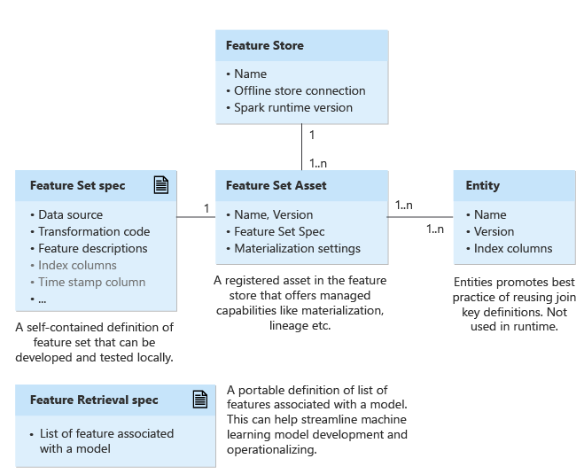

## Table of Contents

## What is a Feature Spec in machine learning?

A Feature Spec in machine learning is a detailed description of how to process and transform raw data into a format that can be used by a machine learning model. It outlines the steps needed to convert different types of data, like text, numbers, or images, into features that the model can understand and use to make predictions. Think of it as a recipe that tells the computer how to prepare the data before feeding it into the model.

For example, if you're working with text data, the Feature Spec might include instructions to convert words into numerical values using techniques like one-hot encoding or word embeddings. This helps the model recognize patterns and relationships in the text. By following the Feature Spec, you ensure that the data is consistently and correctly prepared, which is crucial for the model to learn effectively and make accurate predictions.

## Why are Feature Specs important in machine learning models?

Feature Specs are important in machine learning models because they help make sure that the data is prepared in a consistent way. Imagine you're baking a cake. If you follow the same recipe every time, you'll get similar results. In the same way, a Feature Spec is like a recipe for your data. It tells the computer exactly how to change the raw data into something the model can use. This consistency helps the model learn better and make more accurate predictions.

Another reason Feature Specs are important is that they make it easier to work with different types of data. For example, if you're using text, numbers, and images in your model, the Feature Spec will explain how to handle each type. This means you can mix and match different kinds of data without worrying about how to prepare them. By having a clear set of instructions, you can focus on building a better model instead of spending time figuring out how to process the data.

## How do you create a Feature Spec for a machine learning project?

To create a Feature Spec for a [machine learning](/wiki/machine-learning) project, you first need to understand your data. Look at the different types of data you have, like numbers, text, or images. For each type, decide how you want to change it into a form that your model can use. For example, if you have text, you might want to use a technique like one-hot encoding to turn words into numbers. If you have images, you might need to resize them or change them into a different format. Write down these steps clearly, so anyone can follow them to prepare the data the same way.

Once you have your steps, you can start writing your Feature Spec. This is like writing a recipe for your data. You'll describe each step in detail, making sure to include any special rules or conditions. For example, you might say that missing values in a certain column should be filled with the average value of that column. You can use code to make this process easier. For instance, in Python, you might use a library like TensorFlow to define your Feature Spec:

```python
import tensorflow as tf

# Define feature spec for a numeric feature
numeric_feature = tf.feature_column.numeric_column('age')

# Define feature spec for a categorical feature
categorical_feature = tf.feature_column.categorical_column_with_vocabulary_list(
    'color', ['red', 'green', 'blue'])

# Define feature spec for a text feature
text_feature = tf.feature_column.embedding_column(
    tf.feature_column.categorical_column_with_hash_bucket('text', hash_bucket_size=1000),
    dimension=16)
```

By following these steps and writing a clear Feature Spec, you make sure that your data is prepared consistently and correctly, which helps your machine learning model perform better.

## What are the common elements included in a Feature Spec?

A Feature Spec usually includes details about how to handle different types of data, like numbers, text, and images. For numbers, it might say how to deal with missing values, like filling them with an average or a specific number. For text, the Feature Spec might explain how to turn words into numbers, using methods like one-hot encoding or word embeddings. For images, it could describe how to resize them or change them into a different format. The Feature Spec also includes any special rules or conditions, like what to do if a certain value is too high or too low.

Another important part of a Feature Spec is how to combine different types of data. If your model uses both numbers and text, the Feature Spec will explain how to prepare each type so they can work together. This might involve scaling the numbers so they fit well with the text data. The Feature Spec also helps make sure that the data is prepared the same way every time, which is important for the model to learn and make good predictions. By following the Feature Spec, you can focus on building a better model instead of worrying about how to process the data.

## Can you explain the difference between a Feature Spec and a Feature Engineering?

A Feature Spec and Feature Engineering are two important but different parts of preparing data for a machine learning model. A Feature Spec is like a recipe that tells you exactly how to change your raw data into something the model can use. It includes detailed steps on how to handle different types of data, like numbers, text, or images, and makes sure that the data is prepared the same way every time. This consistency helps the model learn better and make more accurate predictions.

Feature Engineering, on the other hand, is the process of creating new features from the existing data to improve the model's performance. It's about finding ways to make the data more useful for the model. For example, if you have a date, you might create new features like the day of the week or the month, which could help the model understand patterns better. Feature Engineering is more creative and involves trying different ways to transform the data until you find what works best for your model.

Both Feature Spec and Feature Engineering are crucial for a successful machine learning project. The Feature Spec ensures that the data is processed consistently and correctly, while Feature Engineering helps in discovering new ways to represent the data that can lead to better model performance. Together, they make sure that the data is ready for the model to learn and make accurate predictions.

## How does a Feature Spec impact model performance and accuracy?

A Feature Spec helps make sure that the data used to train a machine learning model is always prepared the same way. This consistency is really important because it helps the model learn better. If the data is prepared differently each time, the model might get confused and not learn as well. By following the same steps every time, like how to handle missing numbers or turn words into numbers, the model can focus on finding patterns in the data. This leads to better performance and more accurate predictions.

Feature Engineering, which often goes hand-in-hand with a Feature Spec, can also improve model performance. When you create new features from the existing data, you give the model more information to work with. For example, if you have a date, you might create new features like the day of the week or the month. These new features can help the model understand the data better and make more accurate predictions. Together, a good Feature Spec and smart Feature Engineering make sure the data is ready for the model to learn and perform well.

## What tools and libraries are commonly used to manage Feature Specs?

A common tool for managing Feature Specs in machine learning projects is TensorFlow. TensorFlow provides a way to define and use Feature Specs through its `tf.feature_column` module. This module allows you to specify how to handle different types of data, like numbers, text, and categories, making it easier to prepare your data consistently. For example, you can use `tf.feature_column.numeric_column` for numeric data, `tf.feature_column.categorical_column_with_vocabulary_list` for categorical data, and `tf.feature_column.embedding_column` for text data. By using TensorFlow, you can ensure that your data is processed in the same way every time, which helps your model learn better and make more accurate predictions.

Another useful library for managing Feature Specs is scikit-learn. While scikit-learn doesn't have a specific module called "Feature Spec," it offers various tools for preprocessing data that can be used to create a Feature Spec. For instance, you can use `StandardScaler` to normalize numeric data, `OneHotEncoder` to handle categorical data, and `TfidfVectorizer` for text data. By combining these tools, you can write a set of instructions that tells the computer how to prepare your data. This consistent preparation helps improve the performance and accuracy of your machine learning model.

Both TensorFlow and scikit-learn are popular choices because they make it easier to handle different types of data and ensure that the data is prepared in a consistent way. This consistency is crucial for the model to learn effectively and make accurate predictions. By using these libraries, you can focus on building a better model instead of spending time figuring out how to process the data.

## How do you validate and test a Feature Spec?

To validate and test a Feature Spec, you first need to make sure it works correctly with your data. This means checking that the steps in your Feature Spec do what you expect them to do. For example, if your Feature Spec says to fill missing values with an average, you should check that the missing values are indeed filled correctly. You can do this by comparing the data before and after applying the Feature Spec. If you're using a tool like TensorFlow, you might write some code to check the output of your Feature Spec:

```python
import tensorflow as tf
import pandas as pd

# Sample data
data = pd.DataFrame({'age': [25, 30, None, 35]})

# Define Feature Spec
feature_spec = tf.feature_column.numeric_column('age', default_value=30)

# Apply Feature Spec
transformed_data = tf.feature_column.input_layer(data, [feature_spec])

# Check the transformed data
print(transformed_data.numpy())
```

Once you're sure your Feature Spec works as expected, you need to test how it affects your model's performance. This means training your model with the data prepared by your Feature Spec and then seeing how well the model does. You can use a part of your data, called a validation set, to check the model's accuracy. If the model performs well on the validation set, it's a good sign that your Feature Spec is helping. But if the model doesn't do well, you might need to change your Feature Spec. Keep testing and adjusting until you find the best way to prepare your data for your model.

## What are the best practices for maintaining and updating Feature Specs over time?

Keeping Feature Specs up to date is important because data and models change over time. You should regularly check your Feature Specs to make sure they still work well with your data. If you find that your model's performance is getting worse, it might be time to look at your Feature Specs. Maybe new types of data have come in, or maybe the old ways of handling data don't work as well anymore. By keeping an eye on how your Feature Specs affect your model, you can make changes to keep your model working its best.

When you update your Feature Specs, it's a good idea to test them carefully. Start by testing the new Feature Specs on a small part of your data to see if they work as expected. If they do, then you can use them on all your data. Remember to keep track of the changes you make. Write down what you changed and why, so you can remember later. This way, if something goes wrong, you can go back and see what might have caused it. Keeping good notes helps you keep your Feature Specs in good shape over time.

## How can Feature Specs be used to ensure consistency across different models and datasets?

Feature Specs help keep things the same across different models and datasets by giving a clear set of rules on how to prepare data. Imagine you have different teams working on different parts of a project. If everyone follows the same Feature Spec, they'll all prepare the data the same way. This means that no matter who is working on the model or which dataset they're using, the data will be consistent. This consistency makes it easier to compare results and work together, because everyone is starting from the same place.

When you use Feature Specs across different models and datasets, you can also make sure that new data is handled the same way as old data. If you get new data, you just follow the Feature Spec to prepare it. This way, your models can keep learning and making good predictions even as the data changes. By using Feature Specs, you make sure that all your data is treated the same, which helps keep your models working well and making accurate predictions over time.

## What are the challenges faced when scaling Feature Specs in large machine learning systems?

When scaling Feature Specs in large machine learning systems, one of the main challenges is keeping everything consistent. As more data and more models get added, it can be hard to make sure that all the data is prepared the same way. If different teams or different parts of the system use different Feature Specs, the data might not match up. This can make it hard for the models to learn well and make good predictions. Keeping track of all the different Feature Specs and making sure they all work together can be a big job.

Another challenge is handling changes over time. As new types of data come in or as the way data is collected changes, the Feature Specs might need to be updated. But updating Feature Specs in a large system can be tricky. You have to make sure that the new Feature Specs still work with all the old data and all the different models. If you change the Feature Specs without thinking about how it will affect everything else, you might end up with problems. It's important to test the changes carefully and make sure they don't break anything in the system.

## How do advanced techniques like automated feature engineering integrate with Feature Specs?

Automated feature engineering is a way to automatically find new ways to change your data to make your machine learning model work better. It uses special methods to look at your data and come up with new features that might help the model learn more. When you use automated feature engineering, you still need a Feature Spec to make sure that the data is prepared the same way every time. The Feature Spec tells the computer exactly how to handle the raw data before the automated feature engineering starts. This way, the new features that are created will be based on data that is prepared consistently, which helps the model learn better.

Even though automated feature engineering can find new features, the Feature Spec is still important. It makes sure that the data is always prepared the same way, no matter what new features are added. This consistency helps keep your model working well, even as you try out new ways to change the data. By using both automated feature engineering and a good Feature Spec, you can make your model more accurate and easier to work with.