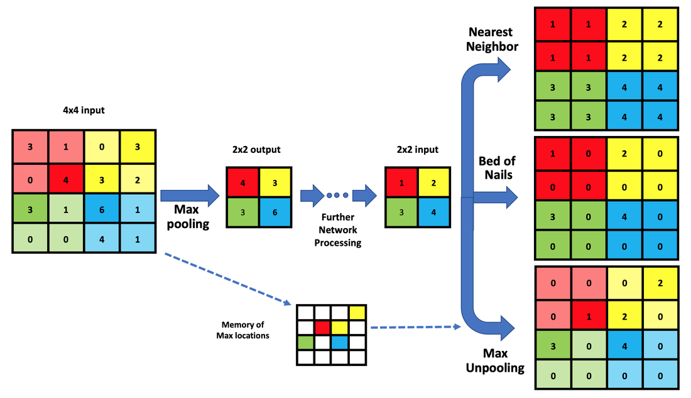

## Table of Contents

## What is feature upsampling in machine learning?

Feature upsampling in machine learning is a technique used to increase the resolution or detail of data, especially in tasks like image processing or computer vision. When working with images, for example, you might start with a low-resolution image and want to create a higher-resolution version. Upsampling helps by adding more pixels to the image, making it larger and more detailed. This is important in tasks like image reconstruction or super-resolution, where the goal is to enhance the quality of the image.

In neural networks, upsampling can be achieved through various methods, such as using transposed convolutions or interpolation techniques. Transposed convolutions, also known as deconvolutions, are a popular method because they can learn how to best upsample the data during training. On the other hand, simpler methods like bilinear interpolation can also be used, which involve estimating new pixel values based on the values of nearby pixels. Both approaches aim to increase the size of the feature maps, allowing the network to capture finer details and improve the overall performance of the model.

## Why is feature upsampling important in neural networks?

Feature upsampling is important in neural networks because it helps to increase the resolution of data, which is crucial for tasks like image processing and computer vision. When you start with a low-resolution image, upsampling can add more pixels to make the image larger and more detailed. This is really helpful in applications where you need to see more details, like in medical imaging or satellite imagery. By making the image bigger and clearer, neural networks can better understand and process the information, leading to more accurate results.

In neural networks, upsampling is often used in architectures like autoencoders or generative models. For example, in a [convolutional [neural network](/wiki/neural-network)](/wiki/convolutional-neural-network) (CNN) used for image reconstruction, upsampling can help to reverse the downsampling process that happens in the earlier layers. This allows the network to go from a compressed, lower-dimensional representation back to a high-resolution image. By doing this, the network can learn to capture and recreate finer details, which is essential for tasks like image super-resolution or generating new images. Overall, feature upsampling plays a key role in improving the performance and capabilities of neural networks in various applications.

## What are the common methods used for feature upsampling?

One common method for feature upsampling is interpolation. This method involves estimating new pixel values based on the values of nearby pixels. There are different types of interpolation, like bilinear interpolation, which uses a weighted average of the four nearest pixels to create a new pixel. This method is simple and fast, making it popular for quick upsampling tasks. Another type is bicubic interpolation, which uses a 4x4 neighborhood of pixels to create a smoother and more detailed upsampled image.

Another method is transposed convolution, also known as deconvolution. This method is more complex and can be learned by a neural network during training. Transposed convolution involves using a set of learned filters to upsample the data, allowing the network to capture and recreate finer details. This method is often used in [deep learning](/wiki/deep-learning) models for tasks like image super-resolution or generating new images. The formula for a 2D transposed convolution can be expressed as $$y[i, j] = \sum_{m}\sum_{n}x[m, n] \cdot k[i - m, j - n]$$, where $$y$$ is the output, $$x$$ is the input, and $$k$$ is the kernel.

Both interpolation and transposed convolution have their uses. Interpolation is quick and works well for simple upsampling tasks. Transposed convolution, on the other hand, is more powerful and can be fine-tuned by the neural network to produce better results in complex tasks. Choosing the right method depends on the specific needs of the project and the desired outcome.

## How does bilinear interpolation work in feature upsampling?

Bilinear interpolation is a way to make an image bigger by adding new pixels between the old ones. Imagine you have a small image and you want to make it bigger. Bilinear interpolation looks at the four closest pixels around where you want to add a new pixel. It then uses a simple math formula to figure out what color the new pixel should be. This method is like taking an average of the colors of those four pixels, but it's a bit smarter because it weighs them based on how close they are to the new spot.

The formula for bilinear interpolation is pretty straightforward. If you want to find the value of a new pixel at position (x, y), you first find the values at the four corners of the square that contains (x, y). Let's call these values $$Q_{11}, Q_{12}, Q_{21},$$ and $$Q_{22}$$. Then, you can calculate the new pixel value with this formula: $$Q(x, y) = (1 - x)(1 - y)Q_{11} + x(1 - y)Q_{21} + (1 - x)yQ_{12} + xyQ_{22}$$. This formula mixes the values of the four nearby pixels to create a smooth transition, making the upsampled image look more natural and less blocky.

## What are the limitations of traditional upsampling methods like bilinear interpolation?

Traditional upsampling methods like bilinear interpolation have some limitations. One big problem is that they can make the image look blurry or soft. When you use bilinear interpolation to make an image bigger, it tries to guess the color of new pixels by looking at the nearby ones. This can smooth out the image too much, making it lose sharp details and edges. For example, if you have a picture of a tree, the leaves might start to look fuzzy instead of clear and crisp.

Another limitation is that bilinear interpolation doesn't understand the content of the image. It just uses a simple math formula to figure out the new pixel values. This means it can't tell the difference between important details and less important ones. For instance, if you're trying to upsample a medical image, bilinear interpolation might not do a good job at keeping the important parts clear. It's like trying to read a book with blurry text - you can see the words, but they're hard to make out. This is why more advanced methods, like using neural networks with transposed convolutions, are often used to get better results.

## What is CARAFE and how does it differ from traditional upsampling methods?

CARAFE, which stands for Content-Aware ReAssembly of FEatures, is a new way to make images bigger and clearer. It's different from traditional methods like bilinear interpolation because it pays attention to what's actually in the image. Instead of just guessing new pixel values based on nearby pixels, CARAFE looks at the content of the image and tries to keep important details sharp. It does this by using a special process that involves breaking down the image into smaller parts, figuring out what's important, and then putting it back together in a way that makes the image look better.

The main difference between CARAFE and traditional upsampling methods is that CARAFE uses a neural network to learn how to make the image bigger. This means it can get better at keeping details clear over time. Traditional methods like bilinear interpolation use simple math formulas to guess new pixel values, which can make the image look blurry. CARAFE, on the other hand, can understand the content of the image and make smarter decisions about how to upsample it. This makes it a lot better for tasks where you need to see fine details, like in medical imaging or satellite photos.

## How does CARAFE use content-aware reassembly for feature upsampling?

CARAFE works by first looking at the image and figuring out what's important. It does this by using a special part of a neural network called a content encoder. This encoder looks at the image and creates a map that shows which parts of the image are important. Then, CARAFE breaks the image into smaller pieces, called kernels. These kernels are like little puzzle pieces that can be moved around. By moving these pieces around based on the map from the content encoder, CARAFE can put the image back together in a way that keeps the important details clear.

Once CARAFE has the map and the kernels, it uses another part of the neural network called a reassembly module. This module takes the kernels and rearranges them according to the map. This process is like solving a puzzle where you know which pieces are most important. By doing this, CARAFE can make the image bigger without making it blurry. It's smarter than traditional methods because it pays attention to what's in the image, making sure that important details stay sharp and clear.

## What are the key components of the CARAFE architecture?

The CARAFE architecture has two main parts: the content encoder and the reassembly module. The content encoder looks at the image and makes a map that shows which parts are important. It does this by using a small neural network to understand the content of the image. This map helps CARAFE know where to focus when making the image bigger. The content encoder is like a guide that tells CARAFE where the important details are, so it can keep them clear when upsampling.

The reassembly module takes the map from the content encoder and uses it to put the image back together. It breaks the image into small pieces called kernels and moves them around based on the map. This is like solving a puzzle where you know which pieces are most important. By rearranging these kernels, the reassembly module can make the image bigger while keeping the important details sharp. This makes CARAFE better at upsampling than traditional methods because it pays attention to what's in the image.

## How can CARAFE be integrated into existing neural network architectures?

CARAFE can be added to existing neural networks pretty easily. It works well with models that need to make images bigger, like in tasks such as image super-resolution or semantic segmentation. To use CARAFE, you just need to replace the traditional upsampling methods, like bilinear interpolation or transposed convolutions, with CARAFE's content encoder and reassembly module. This means you can keep the rest of your neural network the same but get better results because CARAFE pays attention to what's important in the image.

When you add CARAFE to your model, you'll need to make sure it fits well with the rest of your network. This might mean adjusting the size of the feature maps or the number of channels to match what CARAFE expects. But once you've done that, CARAFE can help your model do a better job at upsampling. It's like giving your neural network a new tool that helps it see the details more clearly, making your final results sharper and more accurate.

## What performance improvements can be expected by using CARAFE over other upsampling methods?

Using CARAFE instead of other upsampling methods can make your images look a lot better. CARAFE pays attention to what's important in the image, so it can keep details sharp and clear when making the image bigger. Traditional methods like bilinear interpolation often make images look blurry because they don't understand the content. But CARAFE uses a special part of a neural network called a content encoder to figure out what's important, and then it uses another part called a reassembly module to put the image back together in a smart way. This means your upsampled images will have clearer details and look more like the original.

In tests, CARAFE has shown it can do a better job than other methods. For example, in tasks like image super-resolution, CARAFE can make images look sharper and more detailed. This is really helpful in areas like medical imaging or satellite photos, where seeing the details clearly is important. By using CARAFE, you can expect your neural network to perform better at upsampling, making your results more accurate and useful.

## What are some practical applications of feature upsampling in computer vision tasks?

Feature upsampling is really useful in computer vision tasks like making images bigger and clearer. For example, in image super-resolution, you start with a small, blurry image and want to make it bigger and sharper. Traditional methods like bilinear interpolation can do this, but they often make the image look soft and lose important details. CARAFE, on the other hand, looks at what's in the image and keeps the important parts clear when making it bigger. This is super helpful in areas like medical imaging, where doctors need to see tiny details to make the right diagnosis.

Another practical use of feature upsampling is in semantic segmentation. This is where you want to label different parts of an image, like telling a car from a tree. When you make the image bigger, you need to keep the labels clear and accurate. CARAFE can help here by understanding the content of the image and making sure the labels stay sharp. This makes it easier for computers to understand and process the image correctly, which is important for things like self-driving cars or analyzing satellite photos.

## How can the effectiveness of different upsampling methods be quantitatively evaluated?

The effectiveness of different upsampling methods can be measured by looking at how well they make images bigger and keep details clear. One way to do this is by using a metric called Peak Signal-to-Noise Ratio (PSNR). PSNR compares the upsampled image to the original high-resolution image. A higher PSNR means the upsampled image is closer to the original and looks better. Another common metric is the Structural Similarity Index (SSIM), which looks at how similar the upsampled image is to the original in terms of structure, brightness, and contrast. A higher SSIM score means the upsampled image keeps more of the original image's details.

Another way to evaluate upsampling methods is by using a visual comparison. This means looking at the upsampled images side by side and seeing which one looks better. People can rate the images based on how clear and detailed they are. Sometimes, researchers use a metric called Mean Opinion Score (MOS), where a group of people rate the images on a scale. A higher MOS means more people think the image looks good. By using these metrics, you can figure out which upsampling method works best for your needs.

## References & Further Reading

[1]: Wang, Z., Zhao, H., & Xu, X. (2019). ["CARAFE: Content-Aware ReAssembly of FEatures for Semantic Segmentation."](https://arxiv.org/abs/1905.02188) arXiv preprint arXiv:1905.02188.

[2]: Odena, A., Dumoulin, V., & Olah, C. (2016). ["Deconvolution and Checkerboard Artifacts."](https://research.google/pubs/deconvolution-and-checkerboard-artifacts/) Distill.

[3]: Dong, C., Loy, C. C., He, K., & Tang, X. (2015). ["Image Super-Resolution Using Deep Convolutional Networks."](https://arxiv.org/abs/1501.00092) Proceedings of the IEEE Conference on Computer Vision and Pattern Recognition (CVPR).

[4]: Shi, W., Caballero, J., Huszár, F., Totz, J., Aitken, A. P., Bishop, R., ... & Wang, Z. (2016). ["Real-Time Single Image and Video Super-Resolution Using an Efficient Sub-Pixel Convolutional Neural Network."](https://arxiv.org/abs/1609.05158) arXiv preprint arXiv:1609.05158.

[5]: Simonyan, K., & Zisserman, A. (2014). ["Very Deep Convolutional Networks for Large-Scale Image Recognition."](https://arxiv.org/abs/1409.1556) arXiv preprint arXiv:1409.1556.