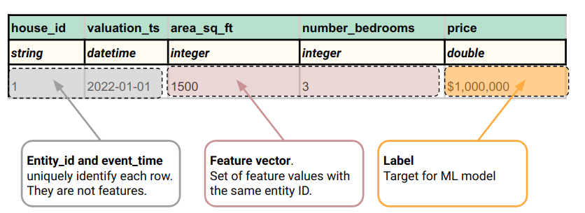

## Table of Contents

## What is a feature vector in the context of machine learning?

A feature vector in machine learning is a way to represent data in a mathematical form that a computer can understand and process. Imagine you have information about different fruits, like their weight, color, and size. A feature vector would take these characteristics and turn them into numbers. For example, if you're describing an apple, the feature vector might include the apple's weight in grams, a number representing its color, and its size in centimeters. This way, the computer can use these numbers to learn patterns and make predictions.

In more technical terms, a feature vector is an ordered list of numbers that represents an object or data point in a multi-dimensional space. Each number in the list is called a feature, and together, these features describe the object's properties. For instance, if you have a dataset of houses, each house's feature vector might include its number of bedrooms, square footage, and age. Mathematically, if you have $$ n $$ features, the feature vector for an object can be written as $$ \mathbf{x} = [x_1, x_2, ..., x_n] $$. This representation allows machine learning algorithms to analyze and find relationships within the data.

## How is a feature vector different from a regular vector in mathematics?

A feature vector is a special kind of vector used in machine learning and data analysis. It's like a regular vector in math, which is just a list of numbers, but it has a specific purpose. In a feature vector, each number represents a characteristic or "feature" of an object or data point. For example, if you're describing a car, the feature vector might include numbers for its speed, weight, and fuel efficiency. These numbers help a computer understand and work with the data.

The main difference between a feature vector and a regular vector is their use and context. A regular vector in math can represent anything, like forces in physics or coordinates in geometry. It's just a way to organize numbers in a list or an arrow in space. On the other hand, a feature vector is specifically used to describe data for machine learning algorithms. It's designed to help computers learn patterns and make predictions based on the characteristics of the data. So, while both are lists of numbers, a feature vector has a more focused and practical application in the world of data science.

## What are the components of a feature vector?

The components of a feature vector are the individual elements that make up the vector. Each component represents a specific characteristic or feature of the object or data point being described. For example, if you're using a feature vector to describe a house, the components might include the number of bedrooms, the square footage, and the age of the house. Each of these components is a number that helps define the house in a way that a computer can understand and use for analysis.

In mathematical terms, if you have a feature vector with $$ n $$ features, it can be written as $$ \mathbf{x} = [x_1, x_2, ..., x_n] $$. Here, $$ x_1, x_2, ..., x_n $$ are the components of the vector. Each $$ x_i $$ represents a different feature of the object. For instance, if $$ x_1 $$ is the number of bedrooms and $$ x_2 $$ is the square footage, then these two components together help to describe the house in a multi-dimensional space. This way, [machine learning](/wiki/machine-learning) algorithms can use these components to find patterns and make predictions based on the data.

## How do you construct a feature vector from raw data?

Constructing a feature vector from raw data involves turning the characteristics of your data into numbers that a computer can understand. Let's say you're working with data about different fruits. You might have information like the fruit's weight, color, and size. To create a feature vector, you need to assign a number to each of these characteristics. For example, you could measure the weight in grams, assign a number to represent the color (like 1 for red, 2 for green, etc.), and measure the size in centimeters. Once you have these numbers, you can put them together into a list, which becomes your feature vector. If you're describing an apple that weighs 150 grams, is red, and is 8 centimeters in size, your feature vector might look like $$ \mathbf{x} = [150, 1, 8] $$.

The process of turning raw data into a feature vector can also involve more complex steps, like normalization or encoding categorical data. For instance, if you're dealing with data about houses, you might have features like the number of bedrooms, the square footage, and the age of the house. You would directly use the number of bedrooms and the age as they are, but you might need to normalize the square footage to fit within a certain range, say between 0 and 1. Additionally, if you have categorical data like the type of house (apartment, house, townhouse), you would need to convert this into numbers using techniques like one-hot encoding. Once all these steps are done, you end up with a feature vector that represents your data in a way that machine learning algorithms can use to learn and make predictions.

## What role do feature vectors play in supervised and unsupervised learning?

In supervised learning, feature vectors are crucial because they help the computer understand the data it's learning from. When you want the computer to predict something, like whether an email is spam or not, you give it examples with their feature vectors. Each feature vector has numbers that describe the email, like the number of words, whether it has attachments, and other details. The computer looks at these feature vectors and the correct answers (like "spam" or "not spam") to find patterns. It then uses these patterns to guess the right answer for new emails. So, feature vectors are the way the computer sees the data and learns from it in supervised learning.

In unsupervised learning, feature vectors are also important, but the computer doesn't get any correct answers to learn from. Instead, it looks at the feature vectors to find patterns or groups in the data all by itself. For example, if you have feature vectors describing different animals, like their weight, height, and diet, the computer might group them into categories like "big animals" and "small animals" without anyone telling it what to do. The feature vectors help the computer understand the similarities and differences between the data points, which it uses to organize or cluster the data. So, in unsupervised learning, feature vectors are the key to letting the computer explore and find structure in the data on its own.

## How does the choice of features impact the performance of a machine learning model?

The choice of features in a machine learning model can greatly affect how well it works. If you pick good features, the model can find important patterns in the data more easily. For example, if you're trying to predict house prices, using features like the number of bedrooms and the size of the house will help the model a lot. But if you use less relevant features, like the color of the front door, the model might get confused and not work as well. So, choosing the right features is like giving the model the best tools to learn from the data.

On the other hand, using too many features can also cause problems. This is called the "curse of dimensionality." When you have too many features, the model might start to see patterns that aren't really there, a problem known as overfitting. It's like trying to find a simple path through a very complicated maze. The model might get lost in the details and not see the big picture. So, it's important to find a balance and choose just the right number of features that help the model learn without overwhelming it.

## What are some common techniques for feature selection and why are they important?

Feature selection is important because it helps make machine learning models work better. By choosing the right features, you can make your model focus on what really matters in the data. This can make your model more accurate and easier to understand. For example, if you're trying to predict if someone will buy a product, using features like their age and how much they've spent before might be more helpful than knowing their favorite color. Good feature selection can also make your model run faster and use less computer power, which is great for big datasets.

There are several common techniques for feature selection. One simple way is called "filter methods." These methods look at the features one by one and pick the ones that seem most important based on some simple tests. Another way is "wrapper methods," which try different combinations of features and see which ones make the model work best. There's also "embedded methods," where the feature selection happens as part of the model building process. For example, some models like decision trees can tell you which features they think are most important as they're being built. Each of these methods has its own way of helping you pick the best features for your model.

Using these feature selection techniques can really help your machine learning model. They make sure you're using the most useful parts of your data, which can lead to better predictions and a simpler, faster model. By focusing on the right features, you can avoid problems like overfitting, where your model gets too complicated and doesn't work well on new data. So, feature selection is a key step in making sure your machine learning project succeeds.

## How can feature scaling affect the performance of algorithms using feature vectors?

Feature scaling is important because it helps make sure all the numbers in your feature vectors are on the same level. Imagine you have features like a person's age and their income. Age might be a small number, like 30, while income could be much bigger, like 50,000. If you don't scale these numbers, the bigger ones might seem more important to the computer, even if they're not. By scaling, you make sure all features have an equal chance to show how important they are. This can make your machine learning model work better because it can see the real patterns in the data more clearly.

Some algorithms, especially those that use distance or gradient-based methods, really need feature scaling to work well. For example, in algorithms like k-nearest neighbors (k-NN) or support vector machines (SVM), the distance between points matters a lot. If one feature has much bigger numbers than another, it can mess up the distance calculations. Scaling helps fix this problem. Techniques like normalization, where you make all features fit between 0 and 1, or standardization, where you make the features have a mean of 0 and a standard deviation of 1, are common ways to do this. By using feature scaling, you can help your model find the best patterns and make better predictions.

## What are sparse feature vectors and when are they used?

Sparse feature vectors are special kinds of feature vectors where most of the numbers are zero. Imagine you have a list of numbers describing something, but instead of every number being important, only a few of them matter, and the rest are zeros. For example, if you're describing a book by the words it contains, most words won't be in the book, so their numbers would be zero. This makes the vector "sparse" because it's mostly empty.

Sparse feature vectors are used when you're dealing with data where most features don't apply to most items. They're really helpful in areas like text analysis, where you might be looking at which words are in a document. If you have a big list of all possible words, most of them won't be in any one document, so the feature vector for that document would be mostly zeros. Using sparse vectors can save a lot of computer memory and make calculations faster because you only need to keep track of the non-zero numbers.

## Can you explain the concept of feature engineering in relation to feature vectors?

Feature engineering is all about making your data better so that your machine learning model can learn from it more easily. When you have raw data, it might not be in the best shape for a computer to understand. So, you turn that raw data into feature vectors, which are lists of numbers that describe your data in a way the computer can use. Feature engineering is the process of creating these feature vectors by choosing which characteristics, or features, are important and figuring out how to turn them into numbers. For example, if you're predicting house prices, you might decide to use the number of bedrooms and the size of the house as features. You then turn these into numbers, like $$ \mathbf{x} = [3, 1500] $$ for a house with 3 bedrooms and 1500 square feet.

Sometimes, the raw data isn't enough, and you need to create new features that might help the model learn better. This is also part of feature engineering. For instance, you might combine the number of bedrooms and the size of the house into a new feature, like "bedrooms per square foot," which could be more useful for predicting house prices. By doing this, you're trying to find the best way to describe your data so that the machine learning model can find important patterns and make good predictions. Feature engineering is a key step because it can make a big difference in how well your model works.

## How do dimensionality reduction techniques like PCA relate to feature vectors?

Dimensionality reduction techniques like Principal Component Analysis (PCA) help make feature vectors simpler and more useful. Imagine you have a lot of features in your data, like the weight, height, and age of people. Each person's data can be shown as a feature vector, but if you have too many features, it can be hard for a computer to find patterns. PCA helps by finding new ways to describe the data using fewer features, called principal components. These new features are combinations of the old ones that capture the most important information. So, instead of using all the original features, you can use these new, simpler ones, which makes your model work better and faster.

When you use PCA, you start with your original feature vectors and transform them into a new set of vectors that have fewer dimensions. For example, if your original feature vector is $$ \mathbf{x} = [x_1, x_2, ..., x_n] $$, PCA will turn it into a new vector $$ \mathbf{y} = [y_1, y_2, ..., y_m] $$ where $$ m $$ is smaller than $$ n $$. These new vectors still represent your data, but they focus on the most important parts. By doing this, you can get rid of features that don't help much and keep the ones that do. This makes it easier for your machine learning model to learn from the data and make good predictions.

## What advanced methods exist for creating and optimizing feature vectors in deep learning?

In [deep learning](/wiki/deep-learning), creating and optimizing feature vectors often involves using neural networks to learn complex patterns from raw data. One advanced method is using convolutional neural networks (CNNs) for tasks like image recognition. CNNs can automatically extract important features from images, turning them into feature vectors that capture details like edges and textures. For example, if you're trying to identify different types of animals in photos, a CNN can learn to focus on features like the shape of ears or the pattern of fur, creating feature vectors that help the model tell one animal from another. Another method is using recurrent neural networks (RNNs) for sequential data like text or time series. RNNs can process data over time, learning to create feature vectors that capture the context and relationships between different parts of the sequence.

Optimization of feature vectors in deep learning often involves techniques like transfer learning and fine-tuning. Transfer learning is when you use a pre-trained model, like one trained on a large dataset of images, and then adjust it for your specific task. For example, if you have a model trained on general images and you want to use it to recognize specific types of flowers, you can take the feature vectors the model has learned and fine-tune them on your flower dataset. This helps because the model already knows how to extract useful features from images, so you can focus on making those features better for your specific needs. Fine-tuning involves adjusting the weights of the [neural network](/wiki/neural-network) to improve the feature vectors for your task, often using techniques like backpropagation to minimize the error in your predictions. By doing this, you can create and optimize feature vectors that are tailored to your specific deep learning problem.

## References & Further Reading

[1]: Bishop, C. M. (2006). ["Pattern Recognition and Machine Learning"](https://www.cs.uoi.gr/~arly/courses/ml/tmp/Bishop_book.pdf). Springer.

[2]: Géron, A. (2019). ["Hands-On Machine Learning with Scikit-Learn, Keras, and TensorFlow: Concepts, Tools, and Techniques to Build Intelligent Systems"](https://www.amazon.com/Hands-Machine-Learning-Scikit-Learn-TensorFlow/dp/1098125975). O'Reilly Media.

[3]: Hastie, T., Tibshirani, R., & Friedman, J. (2009). ["The Elements of Statistical Learning: Data Mining, Inference, and Prediction"](https://link.springer.com/book/10.1007/978-0-387-84858-7). Springer.

[4]: Murphy, K. P. (2012). ["Machine Learning: A Probabilistic Perspective"](https://www.cs.ubc.ca/~murphyk/MLbook/pml-toc-1may12.pdf). MIT Press.

[5]: Pedregosa, F., Varoquaux, G., Gramfort, A., Michel, V., Thirion, B., Grisel, O., ... & Duchesnay, É. (2011). ["Scikit-learn: Machine Learning in Python"](https://dl.acm.org/doi/10.5555/1953048.2078195). Journal of Machine Learning Research, 12, 2825-2830.

[6]: Goodfellow, I., Bengio, Y., & Courville, A. (2016). ["Deep Learning"](https://www.deeplearningbook.org/). MIT Press.

[7]: Witten, I. H., Frank, E., Hall, M. A., & Pal, C. J. (2016). ["Data Mining: Practical Machine Learning Tools and Techniques"](https://www.sciencedirect.com/book/9780123748560/data-mining-practical-machine-learning-tools-and-techniques). Morgan Kaufmann.

[8]: Pearl, J. (2009). ["Bayesian Networks: A Model of Self-Activated Memory for Evidential Reasoning"](https://escholarship.org/uc/item/0vr7830n). Artificial Intelligence Journal.

[9]: ["Feature Selection for Machine Learning"](https://www.ibm.com/think/topics/feature-selection) by Jason Brownlee, Machine Learning Mastery.

[10]: Van der Maaten, L., & Hinton, G. (2008). ["Visualizing Data using t-SNE"](https://jmlr.org/papers/v9/vandermaaten08a.html). Journal of Machine Learning Research, 9, 2579-2605.