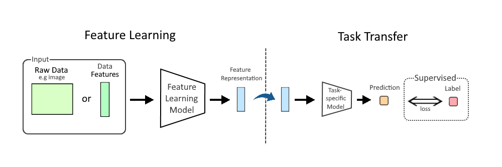

## Table of Contents

## What is a feature in the context of machine learning?

In machine learning, a feature is a piece of information or attribute that is used to describe an object or event. Think of it as a characteristic that helps the machine learning model understand and learn from the data. For example, if you're trying to predict house prices, features could include the number of bedrooms, the size of the house, and its location. Each feature provides a different piece of information that the model can use to make better predictions.

Features are crucial because they directly affect how well a model can perform. If you choose good features, your model will be able to learn patterns and make accurate predictions. On the other hand, if your features are not relevant or are poorly chosen, the model might struggle to find useful patterns. For instance, when predicting whether an email is spam, features like the presence of certain words or the sender's email address can be very helpful. The process of selecting and preparing features is called feature engineering, which is a key step in building effective machine learning models.

## Why are features important in machine learning models?

Features are really important in machine learning because they help the model understand and learn from the data. Imagine you're trying to guess how much a house will cost. You would look at things like how big the house is, how many bedrooms it has, and where it's located. These are all features. The better the features you choose, the better the model can learn to make good guesses. If you pick bad features, like the color of the house, the model might not be able to learn well because those features don't help much in figuring out the price.

Choosing the right features is called feature engineering, and it's a big part of making a good machine learning model. When you use good features, the model can find patterns and make accurate predictions. For example, if you're trying to tell if an email is spam, looking at things like certain words in the email or who sent it can be really helpful. If you don't pick good features, the model might get confused and not work well. So, picking the right features is key to making sure your machine learning model does its job well.

## How do you identify relevant features for a machine learning project?

To identify relevant features for a [machine learning](/wiki/machine-learning) project, you start by thinking about what information might help the model make good predictions. For example, if you're trying to predict house prices, you might think about features like the number of bedrooms, the size of the house, and its location. These are things that people usually consider when buying a house. You can also look at the data you have and see if there are any patterns or relationships between different pieces of information. This can help you figure out which features might be important.

Once you have some ideas about which features might be relevant, you can test them out. You can use techniques like correlation analysis to see how different features relate to what you're trying to predict. For example, you might find that the size of the house has a strong relationship with its price. You can also use methods like feature importance from models like decision trees or random forests to see which features the model finds most useful. By trying out different features and seeing how they affect the model's performance, you can figure out which ones are the most important for your project.

Sometimes, you might need to create new features by combining or transforming existing ones. This is called feature engineering. For example, if you have the size of the house in square feet and the price, you might create a new feature like price per square foot, which could be more useful for predicting house prices. By experimenting with different features and seeing how they help the model, you can identify the most relevant ones for your machine learning project.

## What is feature engineering and why is it necessary?

Feature engineering is the process of creating new features or changing existing ones to make them more useful for a machine learning model. It's like preparing the ingredients before cooking a meal. You might combine different pieces of information or transform them in a way that helps the model understand the data better. For example, if you're trying to predict house prices, you might create a new feature like price per square foot by dividing the price by the size of the house. This new feature could be more helpful for the model than just using the price and size separately.

Feature engineering is necessary because it can make a big difference in how well a machine learning model performs. By choosing and creating the right features, you help the model find patterns and make better predictions. Without good features, even the best model might struggle to learn from the data. For instance, if you're trying to predict whether an email is spam, just looking at the sender's email address might not be enough. But if you create a feature that counts how many times certain words appear in the email, the model might be able to tell the difference between spam and non-spam emails much better. So, feature engineering is all about making the data more useful for the model, which leads to better results.

## Can you explain the difference between feature selection and feature extraction?

Feature selection and feature extraction are two different ways to improve the features you use in a machine learning model. Feature selection is like [picking](/wiki/asset-class-picking) the best apples from a basket. You look at all the features you have and choose the ones that are most important or useful for your model. This means you keep some features and throw away others. For example, if you're trying to predict house prices, you might choose features like the number of bedrooms and the size of the house, but not the color of the house because it's not as important. By selecting the right features, you can make your model simpler and faster without losing much information.

Feature extraction, on the other hand, is like making a new recipe from the apples you have. Instead of just picking the best features, you create new ones by combining or transforming the ones you already have. This can help your model understand the data in a different way. For example, if you're still predicting house prices, you might create a new feature like price per square foot by dividing the price by the size of the house. This new feature could be more useful for your model than the original ones. Feature extraction can help you reduce the number of features you need while still keeping the important information, which can make your model more efficient and sometimes more accurate.

Both feature selection and feature extraction are important parts of feature engineering. They help you make the data more useful for your machine learning model. Feature selection is about choosing the best features from what you have, while feature extraction is about creating new features that might be even better. By using these techniques, you can improve how well your model works and make it easier to understand the data.

## What are some common techniques used for feature selection?

Feature selection is about picking the best pieces of information to use in a machine learning model. One common way to do this is by looking at how much each feature relates to what you're trying to predict. This is called correlation analysis. For example, if you're trying to predict house prices, you might find that the size of the house has a strong relationship with the price, so you would choose to use that feature. Another technique is called the filter method, where you use simple [statistics](/wiki/bayesian-statistics) to see which features are most important. For instance, you might look at the variance of each feature to see which ones change a lot and might be more useful.

Another popular technique is the wrapper method, which involves trying out different combinations of features and seeing how well the model performs with each set. This can be done using techniques like forward selection, where you start with no features and add them one by one, or backward elimination, where you start with all features and remove them one by one. The embedded method is another approach, where the feature selection is built into the model itself. For example, decision trees and random forests can tell you which features are most important by looking at how they split the data. By using these techniques, you can pick the best features for your model and make it work better.

Sometimes, you might use more advanced methods like the Lasso (Least Absolute Shrinkage and Selection Operator) technique, which can automatically select features by shrinking some of their coefficients to zero. The Lasso method can be described with the formula $$ \text{Lasso}(\beta) = \sum_{i=1}^{n} (y_i - \sum_{j=1}^{p} x_{ij} \beta_j)^2 + \lambda \sum_{j=1}^{p} |\beta_j| $$, where $$ \lambda $$ is a tuning parameter that controls the strength of the penalty. By using these different techniques, you can find the most important features for your machine learning project and make your model more accurate and efficient.

## How does dimensionality reduction relate to feature engineering?

Dimensionality reduction is a part of feature engineering that helps make the data simpler and easier to work with. It's like trying to pack a suitcase with fewer but more important items. By reducing the number of features, you can make your machine learning model faster and sometimes even more accurate. There are two main ways to do this: feature selection and feature extraction. Feature selection is about picking the best features from what you have, while feature extraction is about creating new, simpler features from the ones you already have. Both methods help you get rid of unimportant information and focus on what really matters.

One common technique for dimensionality reduction is Principal Component Analysis (PCA). PCA takes all your features and combines them into new ones called principal components. These new components are made to capture as much of the important information as possible while using fewer features. The formula for PCA can be described as $$ \text{PCA}(X) = U \Sigma V^T $$, where $X$ is the original data matrix, $U$ and $V$ are matrices of eigenvectors, and $\Sigma$ is a diagonal matrix of eigenvalues. By using PCA, you can reduce the number of features while keeping the most important information, which makes your model easier to understand and work with.

## What are the challenges of working with high-dimensional data in feature space?

Working with high-dimensional data in feature space can be tough because it makes everything more complicated. Imagine trying to find a friend in a crowd of people. It's hard enough in a small group, but if you're in a huge crowd, it's even harder. The same thing happens with data. When you have a lot of features, it's harder for the machine learning model to find the important patterns. This is called the curse of dimensionality. It can make the model slower and less accurate because it has to deal with so much information at once.

Another challenge is that high-dimensional data can lead to overfitting. This happens when the model learns the training data too well, including the random noise, and doesn't work well on new data. It's like memorizing a whole book instead of understanding the main ideas. When you have a lot of features, the model might start to pay attention to the small, unimportant details instead of the big picture. To avoid this, you might need to use techniques like dimensionality reduction, which can help simplify the data. For example, Principal Component Analysis (PCA) can be used to reduce the number of features while keeping the important information, using the formula $$ \text{PCA}(X) = U \Sigma V^T $$, where $X$ is the original data matrix, $U$ and $V$ are matrices of eigenvectors, and $\Sigma$ is a diagonal matrix of eigenvalues.

## How do you evaluate the impact of features on model performance?

Evaluating the impact of features on model performance is important to see which pieces of information help the model make better predictions. One way to do this is by looking at how changing the features affects how well the model works. For example, you can try removing one feature at a time and see how the model's accuracy changes. If the model does worse without a certain feature, that feature is probably important. Another way is to use feature importance scores, which some models like decision trees or random forests can give you. These scores tell you which features the model thinks are most useful for making predictions.

Another method to evaluate feature impact is through techniques like permutation importance. This involves randomly shuffling the values of one feature and seeing how it affects the model's performance. If shuffling a feature makes the model do worse, that feature is likely important. You can also use cross-validation to test different sets of features and see which ones lead to the best results. For example, you might use a formula like $$ \text{Cross-Validation Score} = \frac{1}{k} \sum_{i=1}^{k} \text{Score}_i $$ where $k$ is the number of folds and $\text{Score}_i$ is the performance metric for each fold. By trying out different features and seeing how they affect the model, you can figure out which ones are the most helpful for making good predictions.

## What is the role of domain knowledge in feature engineering?

Domain knowledge is really important when you're doing feature engineering. It's like knowing the rules of a game before you start playing. When you understand the field you're working in, you can pick the right pieces of information, or features, that will help your machine learning model make good guesses. For example, if you're trying to predict how much a house will cost, knowing that things like the number of bedrooms and the size of the house matter a lot can help you choose the best features. Without this knowledge, you might pick features that don't help much, like the color of the house, and your model might not work well.

Using domain knowledge also helps you create new features that might be even better for your model. For instance, if you know that people often look at the price per square foot when buying a house, you can create a new feature by dividing the price by the size of the house. This new feature could help your model understand the data better and make more accurate predictions. By combining what you know about the field with the data you have, you can make your machine learning model smarter and more useful.

## How can you handle categorical features in machine learning models?

Categorical features are pieces of information that don't have numbers but are instead groups or labels, like colors or types of animals. To use these in a machine learning model, you need to change them into numbers. One common way to do this is called one-hot encoding. Imagine you have a feature for the color of a house, and the colors can be red, blue, or green. You would create three new features: one for red, one for blue, and one for green. If a house is red, the red feature gets a 1, and the other two get a 0s. This way, the model can understand the different colors as numbers.

Another way to handle categorical features is label encoding, where you give each category a number. For example, if you have the same color feature, you might give red a 1, blue a 2, and green a 3. This method is simpler but can sometimes confuse the model because it might think that 3 (green) is more than 2 (blue), which isn't true for colors. To fix this, you can use techniques like ordinal encoding if there's a natural order to the categories, or you can use more advanced methods like target encoding, where you use the average of the target variable for each category. By changing categorical features into numbers, you help the machine learning model use them to make better predictions.

## What advanced techniques exist for feature engineering in deep learning?

In [deep learning](/wiki/deep-learning), feature engineering often happens automatically inside the model, but there are still advanced techniques you can use to make your features better. One technique is called transfer learning. This is when you take a model that was trained on a big dataset, like pictures of cats and dogs, and use it to help your new model learn faster. For example, if you're trying to recognize different types of flowers, you can start with a model that already knows how to recognize shapes and colors from the cat and dog pictures. This saves time and helps your model learn the important features of flowers more quickly.

Another advanced technique is called autoencoders. Autoencoders are special kinds of neural networks that can learn how to make new features from the ones you already have. They do this by trying to copy the input data as closely as possible, but with fewer features. This forces the model to find the most important information and create new features that capture that information well. For example, if you have a lot of different measurements about a car, like its size, weight, and speed, an autoencoder can create new features that summarize these measurements in a way that's easier for your model to understand. By using these advanced techniques, you can help your deep learning model find and use the best features for making good predictions.

## References & Further Reading

[1]: Bishop, C. M. (2006). ["Pattern Recognition and Machine Learning."](https://www.cs.uoi.gr/~arly/courses/ml/tmp/Bishop_book.pdf) Springer.

[2]: Géron, A. (2019). ["Hands-On Machine Learning with Scikit-Learn, Keras, and TensorFlow: Concepts, Tools, and Techniques to Build Intelligent Systems."](https://www.academia.edu/43840124/Hands_On_Machine_Learning_with_Scikit_Learn_Keras_and_TensorFlow_SECOND_EDITION_Concepts_Tools_and_Techniques_to_Build_Intelligent_Systems) O'Reilly Media.

[3]: Domingos, P. (2012). ["A Few Useful Things to Know About Machine Learning."](https://courses.cs.duke.edu/spring20/compsci527/papers/Domingos.pdf) Communications of the ACM, 55(10), 78-87.

[4]: Guyon, I., & Elisseeff, A. (2003). ["An Introduction to Variable and Feature Selection."](https://dl.acm.org/doi/10.5555/944919.944968) Journal of Machine Learning Research, 3, 1157-1182.

[5]: Kuhn, M., & Johnson, K. (2019). ["Feature Engineering and Selection: A Practical Approach for Predictive Models."](http://www.feat.engineering/) CRC Press.

[6]: Bengio, Y., Courville, A., & Vincent, P. (2013). ["Representation Learning: A Review and New Perspectives."](https://arxiv.org/abs/1206.5538) IEEE Transactions on Pattern Analysis and Machine Intelligence, 35(8), 1798-1828.

[7]: Friedman, J., Hastie, T., & Tibshirani, R. (2001). ["The Elements of Statistical Learning: Data Mining, Inference, and Prediction."](https://link.springer.com/book/10.1007/978-0-387-84858-7) Springer Series in Statistics.