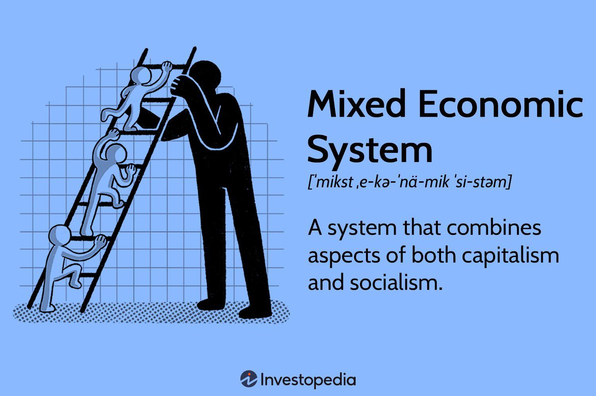

## Table of Contents

## What is a mixed economic system?

A mixed economic system is a type of economy that combines elements of both capitalism and socialism. In this system, the government and private businesses both play important roles. The government might own some key industries, like utilities or transportation, while private companies can operate in other areas. This blend allows the economy to benefit from the efficiency of private businesses and the fairness of government oversight.

In a mixed economy, the government can step in to regulate businesses and protect consumers. For example, it can set rules to make sure workplaces are safe and that products are not harmful. At the same time, people are free to start their own businesses and make money. This system tries to balance individual freedom with the need to look after everyone in society. Many countries, including the United States and Canada, use a mixed economic system.

## How does a mixed economic system differ from pure capitalism and socialism?

A mixed economic system is different from pure capitalism and socialism because it mixes parts of both. In pure capitalism, the government does not control the economy at all. Businesses can do whatever they want to make money, and there are few rules. People can start their own companies and keep all the profits. But this can lead to big differences between rich and poor people. On the other hand, in socialism, the government owns and runs all the businesses. The idea is to make sure everyone has what they need, but it can make it hard for new ideas and businesses to grow.

In a mixed economy, the government and private businesses work together. The government can own some important businesses, like those that provide electricity or water, to make sure everyone has access to them. At the same time, people are still free to start their own companies and make money. The government can also make rules to protect workers and consumers, like setting safety standards or making sure products are safe. This way, a mixed economy tries to balance the freedom of capitalism with the fairness of socialism.

Many countries use a mixed economic system because it can take the best parts of both capitalism and socialism. It tries to create a balance where people can start businesses and make money, but the government also helps to make sure everyone is treated fairly. This can lead to a more stable and fair society, where both the economy and the people can grow and thrive.

## What are the key features of a mixed economic system?

A mixed economic system has some important features that make it different from other types of economies. One key feature is that both the government and private businesses play a role in the economy. The government might own and run some important businesses, like those that provide electricity or water, to make sure everyone has access to these services. At the same time, people are free to start their own companies and make money. This mix allows the economy to benefit from the efficiency of private businesses and the fairness of government oversight.

Another important feature is that the government can make rules to protect workers and consumers. For example, the government can set safety standards for workplaces and make sure products are safe to use. This helps to create a fair environment where businesses can operate, but they also have to follow certain rules to protect people. In a mixed economy, the government also tries to balance the needs of everyone in society, not just those who own businesses. This can lead to a more stable and fair society where both the economy and the people can grow and thrive.

## Can you provide examples of countries with mixed economies?

Many countries around the world use mixed economies. One example is the United States. In the U.S., people can start their own businesses and make money, but the government also has rules to protect workers and consumers. The government owns some important services, like the postal service, but most businesses are run by private companies. This mix helps the economy grow while trying to make sure everyone is treated fairly.

Another example is Canada. In Canada, the government and private businesses both play important roles in the economy. The government runs some services, like healthcare, to make sure everyone can get the care they need. At the same time, people are free to start their own companies and make money. The government also makes rules to protect workers and the environment, which helps create a fair and stable society.

Other countries with mixed economies include France, Germany, and Sweden. In these countries, the government and private businesses work together to balance the needs of the economy and the people. The government might own some key industries, but private companies can also operate and grow. This mix helps these countries have strong economies while also looking after their citizens.

## How do government and private sectors interact in a mixed economy?

In a mixed economy, the government and private sectors work together to make the economy run smoothly. The government can own and run some important businesses, like those that provide electricity or water. This helps make sure everyone has access to these services. At the same time, people are free to start their own companies and make money. The private sector can be very good at coming up with new ideas and making things efficiently. So, the government lets private businesses operate in many areas of the economy.

The government also makes rules to protect workers and consumers. For example, it can set safety standards for workplaces and make sure products are safe to use. This helps create a fair environment where businesses can operate, but they also have to follow certain rules to protect people. The government can also step in to help the economy during tough times, like by giving money to people who lose their jobs or by helping businesses that are struggling. This mix of government and private sector involvement helps the economy grow while trying to make sure everyone is treated fairly.

## What role does the government play in regulating the economy?

In a mixed economy, the government plays a big role in regulating the economy. It makes rules to make sure businesses treat people fairly and safely. For example, the government can set rules about how clean the air and water should be, and it can make sure workplaces are safe for workers. It also checks that the products people buy are safe to use. This helps keep everyone safe and makes sure businesses follow the law.

The government also helps the economy during tough times. If people lose their jobs, the government can give them money to help them get by. It can also help businesses that are struggling by giving them loans or other support. This can help keep the economy stable and stop it from getting worse. By doing these things, the government tries to balance the needs of the economy and the people, making sure everyone has a chance to do well.

## How are resources allocated in a mixed economic system?

In a mixed economic system, resources are allocated through a mix of government and private sector decisions. The government can own some important businesses, like those that provide electricity or water. This means the government decides how to use these resources to make sure everyone has access to them. At the same time, private businesses can start and run their own companies. They decide how to use their resources to make money. This mix helps the economy grow while trying to make sure everyone is treated fairly.

The government also makes rules to guide how resources are used. For example, it can set rules to protect the environment or make sure workplaces are safe. These rules help make sure resources are used in a way that is good for everyone, not just the people who own businesses. The government can also step in to help during tough times, like by giving money to people who lose their jobs or by helping businesses that are struggling. This way, the government helps make sure resources are shared fairly and the economy stays stable.

## What are the advantages of a mixed economic system?

A mixed economic system has many advantages. One big advantage is that it balances the freedom of capitalism with the fairness of socialism. In this system, people can start their own businesses and make money, which can lead to new ideas and growth. At the same time, the government makes rules to protect workers and consumers, making sure everyone is treated fairly. This mix helps the economy grow while also looking after everyone in society.

Another advantage is that the government can step in to help during tough times. If the economy is struggling, the government can give money to people who lose their jobs or help businesses that are having a hard time. This can keep the economy stable and stop things from getting worse. By working together, the government and private businesses can make the economy strong and fair for everyone.

## What are the potential disadvantages or challenges of a mixed economy?

One challenge with a mixed economy is that it can be hard to find the right balance between government control and private freedom. If the government makes too many rules, it might slow down businesses and make it harder for them to grow. On the other hand, if the government doesn't do enough, some people might not be treated fairly, and the economy might not be as stable. It's a tricky balance to get right, and different countries might struggle with this in different ways.

Another potential disadvantage is that having both the government and private businesses involved can lead to disagreements and conflicts. For example, private companies might want to make more money, while the government might want to make sure everyone has what they need. These different goals can cause problems and slow down decision-making. It can also be hard for the government to keep an eye on all the different businesses and make sure they're following the rules, which can lead to some businesses not being fair or safe.

## How does a mixed economy address income inequality?

In a mixed economy, the government tries to help reduce income inequality by making rules and programs to support people who don't have much money. For example, the government might give money to people who lose their jobs or help pay for healthcare and education. This way, everyone has a chance to get the things they need, even if they don't earn a lot. By doing this, the government tries to make sure the gap between rich and poor people isn't too big.

At the same time, private businesses in a mixed economy can create jobs and help the economy grow. This can give more people a chance to earn money and improve their lives. But the government also makes rules to make sure businesses pay workers fairly and treat them well. By working together, the government and private businesses can help make the economy more fair for everyone. Even though it's hard to completely get rid of income inequality, a mixed economy tries to make things better for everyone.

## What impact does a mixed economic system have on economic growth and stability?

A mixed economic system can help the economy grow and stay stable. The government and private businesses work together to make this happen. Private businesses can come up with new ideas and make things efficiently, which helps the economy grow. At the same time, the government can make rules to make sure businesses are fair and safe. It can also help during tough times by giving money to people who lose their jobs or helping businesses that are struggling. This mix helps the economy stay strong and stable.

But finding the right balance between government control and private freedom can be hard. If the government makes too many rules, it might slow down businesses and make it harder for them to grow. On the other hand, if the government doesn't do enough, the economy might not be as stable, and some people might not be treated fairly. So, it's important for the government and private businesses to work together well to keep the economy growing and stable.

## How do policies in a mixed economy adapt to global economic changes?

In a mixed economy, the government and private businesses work together to adapt to changes in the global economy. When the world economy changes, like during a global financial crisis, the government can step in to help. It might give money to people who lose their jobs or help businesses that are struggling. This can keep the economy stable and stop things from getting worse. At the same time, private businesses can change what they do to meet new global demands. They might start making new products or find new ways to sell things in other countries.

The government also makes rules to help the economy adapt to global changes. For example, if other countries start making certain products cheaper, the government might help local businesses by giving them money or changing the rules to make it easier for them to compete. It can also make trade deals with other countries to help businesses sell their products around the world. By working together, the government and private businesses can make sure the economy stays strong and can handle changes in the global market.

## References & Further Reading

[1]: Bergstra, J., Bardenet, R., Bengio, Y., & Kégl, B. (2011). ["Algorithms for Hyper-Parameter Optimization."](https://papers.nips.cc/paper/4443-algorithms-for-hyper-parameter-optimization) Advances in Neural Information Processing Systems 24.

[2]: ["Advances in Financial Machine Learning"](https://www.amazon.com/Advances-Financial-Machine-Learning-Marcos/dp/1119482089) by Marcos Lopez de Prado

[3]: ["Evidence-Based Technical Analysis: Applying the Scientific Method and Statistical Inference to Trading Signals"](https://www.amazon.com/Evidence-Based-Technical-Analysis-Scientific-Statistical/dp/0470008741) by David Aronson

[4]: ["Machine Learning for Algorithmic Trading"](https://github.com/stefan-jansen/machine-learning-for-trading) by Stefan Jansen

[5]: ["Quantitative Trading: How to Build Your Own Algorithmic Trading Business"](https://www.amazon.com/Quantitative-Trading-Build-Algorithmic-Business/dp/1119800064) by Ernest P. Chan