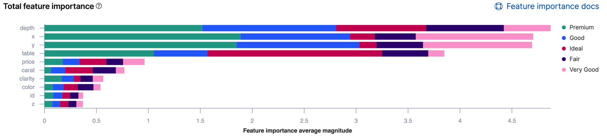

## Table of Contents

## What is feature stacking importance?

Feature stacking importance is a way to figure out which pieces of information, or features, are most helpful when making predictions or decisions using a machine learning model. Imagine you're trying to guess if it will rain. You might look at the humidity, temperature, and wind speed. Feature stacking importance helps you understand if humidity is more important than temperature or wind speed in making that guess accurately.

This method works by adding or removing features one by one and seeing how much the model's performance changes. If taking away humidity makes the model much worse at predicting rain, then humidity is very important. But if removing wind speed doesn't change much, then wind speed might not be as useful. By doing this, you can focus on the most important features and make your model simpler and more effective.

## Why is feature stacking important in data analysis?

Feature stacking importance is crucial in data analysis because it helps us figure out which pieces of information are most useful for making predictions or decisions. When you have a lot of data, not all of it might be equally important. By understanding which features matter the most, you can focus on those and make your analysis more efficient. This is like knowing which ingredients are essential for a recipe; you don't need to use all the spices in your kitchen if only a few really make a difference.

Using feature stacking importance also helps in making your models simpler and easier to understand. If you can identify that only a few features are driving your predictions, you can build a model that's less complex but still effective. This is important because simpler models are easier to explain to others and are less likely to overfit, which means they perform better on new data. In the end, knowing which features are most important can save time and resources, and lead to better decision-making.

## How does feature stacking differ from feature selection?

Feature stacking and feature selection both help us understand which pieces of information are most important, but they do it in different ways. Feature selection is like [picking](/wiki/asset-class-picking) the best players for a sports team. You look at all the players and choose the ones who will help you win the game. In data analysis, this means looking at all your features and choosing the ones that will help your model make the best predictions. You might use different methods to decide which features to keep, like seeing how well the model does with or without them.

Feature stacking, on the other hand, is more like trying out different combinations of players to see which team works best. Instead of just picking the best features one by one, you stack them up in different ways and see how the model's performance changes. This means you might start with a basic model and keep adding features, or you might start with all the features and start removing them one by one. By doing this, you can see not just which features are important on their own, but also how they work together to make your model better.

## What are the basic steps to implement feature stacking?

To implement feature stacking, you start by building a simple model using just one feature. You then add more features one at a time, and each time you add a feature, you check how the model's performance changes. For example, if you're trying to predict house prices, you might start with just the size of the house. Then you add the number of bedrooms and see if that makes your predictions better. You keep doing this, adding one feature at a time, until adding more features doesn't help the model anymore.

Another way to do feature stacking is to start with all the features and then start taking them away one by one. You begin with a model that uses all the features you have, like size, number of bedrooms, and location of the house. Then you remove one feature, like location, and see if the model's performance gets worse. If it does, that feature is important. You keep removing features until you're left with just the ones that really help the model make good predictions. This way, you can see which features are the most important and how they work together.

## Can you explain a simple example of feature stacking in a machine learning model?

Imagine you're trying to predict how much a student will score on a math test. You have three pieces of information, or features: how many hours they studied, how many hours they spent playing video games, and whether they attended a math tutoring session. To use feature stacking, you start with just one feature, like the number of hours studied, and build a simple model to predict the test score. Then, you add the next feature, the hours spent playing video games, to see if it improves the model's predictions. If it does, you keep it; if not, you might not use it. Finally, you add whether they attended a math tutoring session and check again if the model's predictions get better.

By adding features one at a time and checking how the model's performance changes, you can see which pieces of information are most important for predicting the test score. In this example, you might find that the number of hours studied is the most important feature, and adding the hours spent playing video games doesn't help much. But adding whether they attended a math tutoring session might improve the predictions a lot. This way, you can focus on the most useful features and make your model simpler and more effective.

## What are the common tools or libraries used for feature stacking?

For feature stacking, many people use Python because it's easy to learn and has lots of tools that can help. One popular library for feature stacking is scikit-learn. It has many tools that let you build models, add features one by one, and see how the model changes. With scikit-learn, you can use functions like `SequentialFeatureSelector` to add or remove features and see how your model does. It's like trying different ingredients in a recipe to see which ones make the dish taste better.

Another tool that's good for feature stacking is the MLxtend library. It works well with scikit-learn and has a tool called `SequentialFeatureSelector` too. This tool helps you add or take away features step by step, and it's easy to use because it fits right into the way you work with scikit-learn. Both of these libraries make it simpler to try out different combinations of features and see which ones help your model the most.

## How can feature stacking improve model performance?

Feature stacking helps improve model performance by figuring out which pieces of information, or features, are most important for making good predictions. When you start with just one feature and add more one at a time, you can see which ones really help the model get better. For example, if you're trying to guess how much a house will sell for, you might start with just the size of the house. Then, you add the number of bedrooms and see if that makes your guess more accurate. By doing this, you can focus on the features that matter most and leave out the ones that don't help much.

This method also makes your model simpler and easier to understand. When you know which features are the most important, you can build a model that uses just those features. Simpler models are easier to explain to others and are less likely to overfit, which means they work better on new data. In the end, using feature stacking can help you make better predictions and save time and resources by focusing on what really matters.

## What are the challenges faced when applying feature stacking?

One challenge with feature stacking is that it can take a lot of time and computing power. When you add or remove features one by one and check how the model changes, you might have to run the model many times. This can be slow, especially if you have a lot of data or a lot of features to try. It's like trying different combinations of ingredients in a recipe; it can take a while to find the best mix.

Another challenge is that feature stacking might not always find the best set of features. Sometimes, a feature that seems unimportant on its own can be very helpful when combined with other features. If you add or remove features one at a time, you might miss these important combinations. It's like missing a great team because you only looked at each player by themselves, not how they work together.

Lastly, feature stacking can lead to overfitting if not done carefully. Overfitting happens when a model works really well on the data you used to build it but not as well on new data. If you keep adding features until the model fits the training data perfectly, it might not work well on new data. It's like memorizing a test instead of learning the material; you might do well on that one test but not on others.

## How do you evaluate the effectiveness of feature stacking in a model?

To evaluate the effectiveness of feature stacking in a model, you look at how well the model predicts things as you add or remove features. You start by building a model with just one feature and then keep adding more, checking the model's performance each time. You can use measures like accuracy, which tells you how often the model gets the right answer, or mean squared error, which shows how far off the model's guesses are on average. If adding a new feature makes the model's performance better, then that feature is important. But if it doesn't change much, you might not need that feature.

One way to make sure you're evaluating feature stacking correctly is to use a separate set of data to test the model. This is called a validation set. You build and change your model using one set of data, called the training set, and then see how well it does on the validation set. This helps you avoid overfitting, where the model works well on the data you used to build it but not on new data. If the model's performance on the validation set keeps getting better as you add features, then feature stacking is working well. But if the performance starts to get worse, it might be time to stop adding features.

## What advanced techniques can be used to optimize feature stacking?

One advanced technique to optimize feature stacking is using cross-validation. Cross-validation is like testing your model in different ways to make sure it works well. Instead of just splitting your data into a training set and a validation set, you split it into many smaller parts and use different parts to train and test the model over and over. This helps you see if adding or removing features really makes the model better, not just on one set of data but on many different sets. By doing this, you can be more sure that the features you choose will help the model work well on new data too.

Another technique is using ensemble methods, which means combining different models to make a better one. You can build several models, each with a different set of features, and then combine their predictions. This can help you see which features are important in different ways. For example, one model might use the size of a house and the number of bedrooms, while another uses the location and the age of the house. By seeing how these models work together, you can figure out which features are most helpful and make a final model that uses the best features from all of them. This can make your predictions more accurate and reliable.

## How does feature stacking interact with other ensemble methods?

Feature stacking can work well with other ensemble methods by helping to pick the best features for each model in the ensemble. Imagine you're making a team of models, each one good at different things. Feature stacking helps you figure out which pieces of information, or features, each model should use to do its job best. For example, one model might use the size and age of a house to predict its price, while another model might use the location and number of bedrooms. By using feature stacking, you can find the best features for each model and then combine their predictions to make a final guess that's more accurate and reliable.

When you use feature stacking with other ensemble methods like Random Forests or Gradient Boosting, it can make the whole group of models even better. Random Forests, for example, build many small decision trees, each using different features. Feature stacking can help you choose which features go into each tree, making the forest stronger overall. With Gradient Boosting, you add models one at a time, each one trying to fix the mistakes of the last one. Feature stacking can help you pick the best features for each new model, so they can fix those mistakes more effectively. This way, the whole group of models works together more smoothly and makes better predictions.

## What are the latest research trends in feature stacking importance?

The latest research in feature stacking importance is focusing on making the process faster and more accurate. One big trend is using machine learning to help with feature stacking. Researchers are using techniques like [deep learning](/wiki/deep-learning) and neural networks to figure out which features are most important. These methods can look at a lot of data at once and find patterns that might be hard for people to see. They're also trying to make feature stacking work better with big data, so it can handle more information without taking too long.

Another trend is looking at how feature stacking can be used in different areas, like health care and finance. In health care, researchers are using feature stacking to find out which pieces of information are most important for predicting diseases or how well a treatment will work. In finance, they're using it to figure out which factors are best for predicting stock prices or credit risk. By understanding which features matter most in these fields, researchers can make better models and help make more accurate decisions.

## How can Feature Stacking be Implemented in Trading Algorithms?

To implement feature stacking in trading algorithms, the process begins with selecting a diverse array of models that are specifically designed to encapsulate different facets of the financial markets. This diversity among models is crucial because it enables the capturing of various market signals and dynamics, which in turn, enhances the robustness and accuracy of the resultant trading strategy.

Once the suitable models have been identified, they are trained individually on historical data. Each model's primary goal is to extract unique insights and patterns from the data set. This step lays down the foundation for creating an ensemble of models that, when combined, offer a comprehensive view of market behavior.

After the individual models have been trained, their outputs are collected and utilized to train the meta-learner. The meta-learner serves as an aggregator, processing and synthesizing the predictions from each constituent model. The task of the meta-learner is to discern how to effectively combine these predictions to enhance overall prediction accuracy. Formally, if we denote the predictions of the individual models as $\hat{y}_1, \hat{y}_2, \ldots, \hat{y}_n$, the meta-learner's function can be represented as:

$$
\hat{y}_{\text{final}} = g(\hat{y}_1, \hat{y}_2, \ldots, \hat{y}_n)
$$

where $g$ is the function learned by the meta-learner to provide the final prediction $\hat{y}_{\text{final}}$.

Python's [machine learning](/wiki/machine-learning) libraries, such as scikit-learn, provide tools to implement stacking. Here is a simplified example of how one might set up such a stacking ensemble:

```python
from sklearn.ensemble import RandomForestRegressor
from sklearn.linear_model import LinearRegression
from sklearn.svm import SVR
from sklearn.ensemble import StackingRegressor
from sklearn.model_selection import train_test_split

# Example data split
X_train, X_test, y_train, y_test = train_test_split(X, y, test_size=0.2, random_state=42)

# Define the base models
base_models = [
    ('rf', RandomForestRegressor(n_estimators=10, random_state=42)),
    ('svr', SVR())
]

# Define the meta-learner
meta_learner = LinearRegression()

# Create the stacking model
stacked_regressor = StackingRegressor(estimators=base_models, final_estimator=meta_learner)

# Train the stacking model
stacked_regressor.fit(X_train, y_train)

# Predict and evaluate
predictions = stacked_regressor.predict(X_test)
```

After implementing the stack of models, it is imperative to backtest the combined strategy to validate its effectiveness. Backtesting involves applying the stacking model to historical market data to assess its performance. This step is crucial to ensure that the model is not only theoretically sound but also practically viable. It involves simulating trades using past data to evaluate predicted outcomes against actual market behavior.

Backtesting must be meticulously conducted to measure key performance metrics such as accuracy, precision, recall, and any other relevant trading performance indicators. This simulation will highlight the model's strengths and weaknesses before it is deployed in a live trading environment. Only after rigorous testing and validation should the stacking model be considered for live deployment, ensuring its predictions are reliable and its implementation fruitful.

## References & Further Reading

[1]: Breiman, L. (1996). ["Stacked Regressions."](https://link.springer.com/article/10.1023/A:1018046112532) Machine Learning, 24(1), 49-64.

[2]: Wolpert, D.H. (1992). ["Stacked Generalization."](https://www.sciencedirect.com/science/article/abs/pii/S0893608005800231) Neural Networks, 5(2), 241-259.

[3]: ["Advances in Financial Machine Learning"](https://www.amazon.com/Advances-Financial-Machine-Learning-Marcos/dp/1119482089) by Marcos Lopez de Prado

[4]: ["Machine Learning for Algorithmic Trading"](https://github.com/stefan-jansen/machine-learning-for-trading) by Stefan Jansen

[5]: Gonçalves, T., & Horta, N. (2017). ["Stacking Machine Learning Classifiers to Identify Trading Opportunities in Financial Markets."](https://www.nature.com/articles/s41598-024-75526-7) Expert Systems with Applications, 85, 195-210.

[6]: Zhou, Z.H. (2012). ["Ensemble Methods: Foundations and Algorithms."](https://www.taylorfrancis.com/books/mono/10.1201/b12207/ensemble-methods-zhi-hua-zhou) Chapman and Hall/CRC.