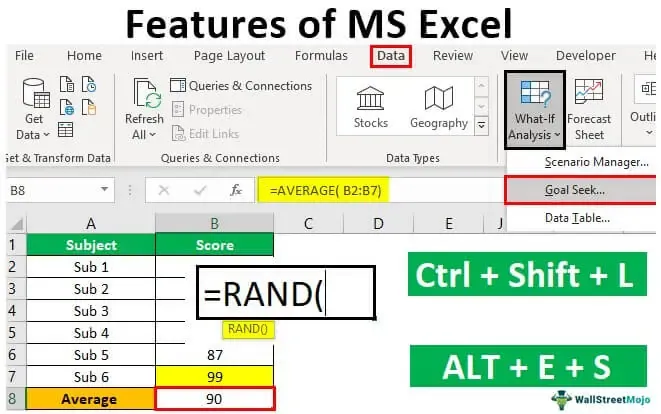

In algorithmic trading, leveraging advanced techniques to enhance prediction accuracy is crucial. As financial markets grow increasingly complex and data-driven, the demand for sophisticated models that can interpret these vast data sets becomes more pronounced. One method that garners significant attention for improving model performance is feature stacking. This technique holds potential because it optimally combines predictions from multiple models, thereby capturing intricate patterns and dependencies within the data that individual models might overlook.

Feature stacking is pivotal in refining the predictive accuracy and robustness of trading algorithms. By integrating outputs from various models, an ensemble approach is created that ultimately leads to more reliable trading decisions. This aggregation of model predictions enables the identification and exploitation of subtle market signals, reducing the risk associated with potential model errors or biases. In particular, feature stacking helps address overfitting and underfitting — common pitfalls in model development — by balancing the strengths and weaknesses of different algorithms.



This article explores the importance and impact of feature stacking in algorithmic trading. It will dissect its main components, illustrating how this method enhances model performance. Furthermore, practical aspects of applying feature stacking in trading strategies are examined, outlining a roadmap for financial professionals seeking to harness this advanced technique. By understanding and implementing feature stacking, traders can significantly boost their ability to navigate the complexities of modern financial markets, ultimately facilitating more optimized and profitable trading outcomes.

## Table of Contents

## Understanding Feature Stacking

Feature stacking, also known as stacked generalization, is an advanced ensemble learning technique that enhances prediction accuracy by integrating predictions from multiple models. This approach leverages the strengths of individual models while mitigating their weaknesses, resulting in a more robust and comprehensive forecasting tool.

The process of feature stacking involves two primary layers. The first layer is composed of several base models, which are independently trained on the same dataset. These models can be diverse, ranging from decision trees, support vector machines, to neural networks. Each of these models captures varied aspects and patterns of the data, and their predictions serve as inputs for the next stage of the stacking process.

The second layer involves the training of a meta-model or meta-learner, which synthesizes the predictions from the base models. The meta-learner’s primary function is to identify patterns in the predictions of the base models and provide a more accurate final output. The choice of a meta-learner is crucial to the success of feature stacking. Common choices include linear regression, logistic regression, or more complex models like gradient boosting machines (GBM). The meta-learner is typically trained on a separate validation dataset to prevent overfitting and ensure generalization to unseen data.

Mathematically, if $h_1(x), h_2(x), \ldots, h_n(x)$ represent the predictions from $n$ base models for an input $x$, then the meta-learner $H$ synthesizes these predictions into a final prediction $H(h_1(x), h_2(x), \ldots, h_n(x))$. The aim is to optimize the function $H$ to minimize prediction errors, thus improving overall model performance.

By capturing complex nuances in the data and leveraging diverse perspectives from various models, feature stacking yields enhanced generalization capabilities. It is particularly effective in complex prediction tasks where simple models individually may fail to deliver optimal accuracy. This technique is widely applied in data-rich tasks such as [algorithmic trading](/wiki/algorithmic-trading), image recognition, and natural language processing, where accuracy is critical and model diversity can significantly bolster predictive performance.

In practice, implementing feature stacking requires careful consideration of model diversity and the optimal allocation of data for training the base models and the meta-learner. The potential of feature stacking to enhance accuracy relies heavily on selecting complementary models and the effective training of the meta-learner to synergize their individual predictions.

## The Role of Feature Stacking in Algo Trading

In algorithmic trading, feature stacking is instrumental in enhancing the precision and agility of trading strategies. This method excels by integrating the outputs of various predictive models, allowing traders to harness a spectrum of data insights. By doing so, it minimizes the limitations inherent in relying on a single model.

The core advantage of feature stacking lies in its ability to amalgamate diverse model outputs. Each model in the stack might focus on different market indicators or patterns. For instance, while one model may specialize in capturing short-term price movements through technical indicators, another might be adept at identifying long-term trends using fundamental data. The aggregated predictions from these models lead to a more comprehensive understanding of market dynamics and thus improve decision-making.

In practice, this multi-model approach boosts the adaptability of trading algorithms to fluctuating market conditions. Single models often suffer from overfitting, where they're too tailored to historical data and thus perform poorly under different market scenarios. By contrast, feature stacking provides a form of ensemble averaging, reducing overfitting and enhancing the robustness of predictions.

Moreover, feature stacking aids in executing trading strategies with heightened precision. For example, if a trader employs a trading strategy that relies on forecasted price movements, the decision to buy or sell a particular asset becomes more informed when grounded in the consensus of several models. This results in strategies that can better anticipate market changes, mitigate losses, and optimize profits.

Overall, by employing feature stacking, traders can effectively navigate the intricacies and volatilities of financial markets, surpassing the capabilities of standalone models. Through enhanced prediction accuracy and strategic execution, feature stacking becomes an indispensable tool in the arsenal of algorithmic trading professionals.

## Benefits of Using Feature Stacking

Feature stacking offers numerous benefits for algorithmic trading, among which are reduced model bias, enhanced predictive capability, and improved generalization to new data sets. By combining predictions from multiple models, feature stacking can help traders exploit the strengths of different algorithms, while minimizing the weaknesses typically associated with relying on a single predictive model.

One of the primary advantages of feature stacking is its ability to reduce model bias. Individual models may have inherent biases due to their specific structures or the types of data they are most effective at handling. By aggregating the predictions of a diverse set of models, traders can balance these biases, resulting in a more neutral and accurate prediction. This approach leverages the principle that errors made by different models are often uncorrelated, allowing the ensemble to achieve a higher precision than any standalone model.

Enhanced predictive capability is another significant benefit that stems from the diverse insights captured through feature stacking. Different models may excel in identifying specific patterns or trends within market data, such as sudden price shifts or long-term trends. By stacking features from various models, it is possible to fuse these distinct insights into a cohesive prediction, thereby capturing a wide spectrum of market signals. This collective intelligence approach enhances the robustness of trading algorithms, making them capable of handling the complexity and dynamism inherent in financial markets.

Feature stacking also promotes better generalization to new data, addressing a common challenge in model performance. A single model may overfit to the historical data it was trained on, failing to perform well on unseen data. In contrast, an ensemble built through feature stacking can generalize more effectively, as it synthesizes information from various models that may react differently to new data distributions. This diversity acts as a guard against overfitting, ensuring that the trading strategy remains viable as market conditions evolve.

Moreover, by consolidating the predictions of various models, traders are not compelled to depend solely on any single model that might be flawed or overly sensitive to specific data features. This aggregation acts as a risk mitigation strategy, expanding the reliability and stability of predictions. For instance, if one model fails to account for a market anomaly, others in the ensemble might adjust for this oversight, contributing to a more balanced and resilient decision-making framework.

In practice, implementing feature stacking can be achieved by training a meta-learner on the outputs of base models, as illustrated by the following conceptual outline:

```python
from sklearn.model_selection import train_test_split
from sklearn.ensemble import RandomForestClassifier, GradientBoostingClassifier
from sklearn.linear_model import LogisticRegression
from sklearn.datasets import make_classification
from sklearn.metrics import accuracy_score

# Sample Data
X, y = make_classification(n_samples=1000, n_features=20, n_informative=2, n_redundant=10)
X_train, X_meta, y_train, y_meta = train_test_split(X, y, test_size=0.5, random_state=42)

# Base models
base_model_1 = RandomForestClassifier(n_estimators=100, random_state=42)
base_model_2 = GradientBoostingClassifier(n_estimators=100, random_state=42)

# Train base models
base_model_1.fit(X_train, y_train)
base_model_2.fit(X_train, y_train)

# Generate predictions for stacking
meta_features = np.column_stack((base_model_1.predict_proba(X_meta)[:, 1],
                                 base_model_2.predict_proba(X_meta)[:, 1]))

# Meta learner
meta_learner = LogisticRegression()
meta_learner.fit(meta_features, y_meta)

# Evaluate performance
stacked_predictions = meta_learner.predict(meta_features)
accuracy = accuracy_score(y_meta, stacked_predictions)
print(f'Stacked Model Accuracy: {accuracy:.2f}')
```

This example demonstrates how predictions from different classifiers can be combined using a meta-learner to potentially improve trading decisions. By effectively integrating varied model insights, feature stacking stands as a robust technique to enhance the accuracy and dependability of algorithmic trading systems.

## Implementing Feature Stacking in Trading Algorithms

To implement feature stacking in trading algorithms, the process begins with selecting a diverse array of models that are specifically designed to encapsulate different facets of the financial markets. This diversity among models is crucial because it enables the capturing of various market signals and dynamics, which in turn, enhances the robustness and accuracy of the resultant trading strategy.

Once the suitable models have been identified, they are trained individually on historical data. Each model's primary goal is to extract unique insights and patterns from the data set. This step lays down the foundation for creating an ensemble of models that, when combined, offer a comprehensive view of market behavior.

After the individual models have been trained, their outputs are collected and utilized to train the meta-learner. The meta-learner serves as an aggregator, processing and synthesizing the predictions from each constituent model. The task of the meta-learner is to discern how to effectively combine these predictions to enhance overall prediction accuracy. Formally, if we denote the predictions of the individual models as $\hat{y}_1, \hat{y}_2, \ldots, \hat{y}_n$, the meta-learner's function can be represented as:

$$
\hat{y}_{\text{final}} = g(\hat{y}_1, \hat{y}_2, \ldots, \hat{y}_n)
$$

where $g$ is the function learned by the meta-learner to provide the final prediction $\hat{y}_{\text{final}}$.

Python's [machine learning](/wiki/machine-learning) libraries, such as scikit-learn, provide tools to implement stacking. Here is a simplified example of how one might set up such a stacking ensemble:

```python
from sklearn.ensemble import RandomForestRegressor
from sklearn.linear_model import LinearRegression
from sklearn.svm import SVR
from sklearn.ensemble import StackingRegressor
from sklearn.model_selection import train_test_split

# Example data split
X_train, X_test, y_train, y_test = train_test_split(X, y, test_size=0.2, random_state=42)

# Define the base models
base_models = [
    ('rf', RandomForestRegressor(n_estimators=10, random_state=42)),
    ('svr', SVR())
]

# Define the meta-learner
meta_learner = LinearRegression()

# Create the stacking model
stacked_regressor = StackingRegressor(estimators=base_models, final_estimator=meta_learner)

# Train the stacking model
stacked_regressor.fit(X_train, y_train)

# Predict and evaluate
predictions = stacked_regressor.predict(X_test)
```

After implementing the stack of models, it is imperative to backtest the combined strategy to validate its effectiveness. Backtesting involves applying the stacking model to historical market data to assess its performance. This step is crucial to ensure that the model is not only theoretically sound but also practically viable. It involves simulating trades using past data to evaluate predicted outcomes against actual market behavior.

Backtesting must be meticulously conducted to measure key performance metrics such as accuracy, precision, recall, and any other relevant trading performance indicators. This simulation will highlight the model's strengths and weaknesses before it is deployed in a live trading environment. Only after rigorous testing and validation should the stacking model be considered for live deployment, ensuring its predictions are reliable and its implementation fruitful.

## Challenges and Considerations

Feature stacking, while advantageous for enhancing algorithmic trading models, poses several challenges that must be carefully considered. One primary challenge is the increased computational complexity associated with the technique. Because feature stacking involves training multiple base models followed by a meta-learner, the computational resources needed can be significantly greater than for single-model approaches. This complexity necessitates robust computational infrastructure and may lead to longer training times and higher costs.

Additionally, careful model selection is crucial in feature stacking. The effectiveness of the stacked model largely depends on the diversity and quality of the base models used. If the base models are too similar or do not capture various data intricacies, the ensemble's ability to improve prediction accuracy may be limited. Consequently, traders must selectively choose models that complement each other by capturing different aspects of the market.

The choice of meta-learner also plays a critical role in the success of feature stacking. The meta-learner is responsible for synthesizing the predictions from the base models, and its ability to accurately combine these predictions is essential for achieving improved performance. Various algorithms can be used as meta-learners, including linear regression, decision trees, or more complex models like neural networks. The selection should be informed by the specific characteristics of the trading environment and the nature of the data available.

Finally, traders must balance the potential performance improvements offered by feature stacking against the increased complexity and resource demands. While the technique can enhance predictive accuracy and strategy robustness, the added layers of complexity may not be justified in all scenarios. Evaluating the ratio of performance gain to resource investment is essential to determine whether feature stacking aligns with the trader’s strategic objectives and operational capabilities.

In summary, while feature stacking offers notable advantages for trading algorithms, it presents several challenges such as computational demands, model selection intricacies, and the critical role of the meta-learner. Traders need to assess these factors thoughtfully to leverage feature stacking effectively.

## Conclusion

Feature stacking represents a formidable strategy in elevating the efficiency of trading algorithms. By amalgamating predictions from a series of diverse models, feature stacking effectively synthesizes varied market insights, leading to substantial improvements in both prediction accuracy and trading results. This technique leverages the strengths of multiple models, offering a comprehensive approach that single-model forecasts often lack.

For trading professionals, the integration of feature stacking into their strategies demands a careful assessment of its advantages and potential hurdles. The ability of feature stacking to diminish model bias, enhance predictive performance, and broaden generalization capabilities makes it an appealing option for traders aiming to optimize their algorithmic trading systems. However, these benefits must be weighed against the challenges, such as the increased computational demand and the necessity for meticulous model and meta-learner selection.

Traders should evaluate whether the potential enhancements in trading efficiency justify the complexity and resource investment required for feature stacking. By doing so, they can make informed decisions that align with their strategic objectives, ultimately leading to more robust and versatile trading methodologies.

## References & Further Reading

[1]: Breiman, L. (1996). ["Stacked Regressions."](https://link.springer.com/article/10.1023/A:1018046112532) Machine Learning, 24(1), 49-64.

[2]: Wolpert, D.H. (1992). ["Stacked Generalization."](https://www.sciencedirect.com/science/article/abs/pii/S0893608005800231) Neural Networks, 5(2), 241-259.

[3]: ["Advances in Financial Machine Learning"](https://www.amazon.com/Advances-Financial-Machine-Learning-Marcos/dp/1119482089) by Marcos Lopez de Prado

[4]: ["Machine Learning for Algorithmic Trading"](https://github.com/stefan-jansen/machine-learning-for-trading) by Stefan Jansen

[5]: Gonçalves, T., & Horta, N. (2017). ["Stacking Machine Learning Classifiers to Identify Trading Opportunities in Financial Markets."](https://www.nature.com/articles/s41598-024-75526-7) Expert Systems with Applications, 85, 195-210.

[6]: Zhou, Z.H. (2012). ["Ensemble Methods: Foundations and Algorithms."](https://www.taylorfrancis.com/books/mono/10.1201/b12207/ensemble-methods-zhi-hua-zhou) Chapman and Hall/CRC.