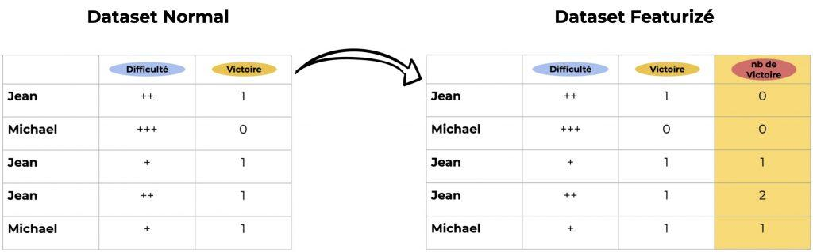

## Table of Contents

## What is featurization in machine learning?

Featurization in machine learning is the process of transforming raw data into a set of features that can be used by machine learning algorithms. This step is crucial because it helps in making the data more understandable and usable for the models. For instance, if you have a dataset of text reviews, featurization might involve converting the text into numerical values that represent the presence or frequency of certain words, which can then be used as input for a model.

One common method of featurization is called one-hot encoding, which is used for categorical data. Imagine you have a feature called "color" with possible values "red", "green", and "blue". One-hot encoding would transform this feature into three new binary features: one for each color. If the original color is "red", the new features would be $$[1, 0, 0]$$; if it's "green", they would be $$[0, 1, 0]$$, and so on. This way, the machine learning model can work with numerical data instead of dealing directly with categorical labels.

Another example of featurization is feature scaling, which is important for algorithms that are sensitive to the scale of the input features, like gradient descent-based methods. Feature scaling adjusts the values of the features to a common range, often between 0 and 1, to prevent any single feature from dominating the model's learning process. For example, if you have features like "age" ranging from 0 to 100 and "income" ranging from 0 to 100,000, scaling them to the same range helps the model learn more effectively.

## Why is featurization important in machine learning models?

Featurization is important in machine learning because it helps turn raw data into a format that machine learning models can understand and use. Imagine you have a bunch of text reviews. By themselves, these words don't mean much to a computer. But if you turn those words into numbers, like counting how often certain words appear, the computer can start to make sense of the data. This process of changing data into numbers is called featurization, and it's key to making sure the model can learn from the data.

Another reason featurization is important is that it can make the learning process easier and more effective for the model. Some models work better when all the data is on the same scale. For example, if you have one feature that ranges from 0 to 100 and another that ranges from 0 to 1,000,000, the model might focus too much on the bigger numbers. By scaling these features to the same range, like between 0 and 1, you help the model learn more evenly from all the data. This is called feature scaling, and it's a type of featurization that can really improve how well a model works.

## What are the common types of features used in machine learning?

In [machine learning](/wiki/machine-learning), features are the pieces of information that a model uses to make predictions. There are several common types of features, and one of them is numerical features. These are numbers that can be used directly by the model, like a person's age or the temperature outside. Another type is categorical features, which are like labels or categories, such as colors or types of fruits. To use these in a model, you often need to change them into numbers using methods like one-hot encoding. For example, if you have a feature called "color" with values "red", "green", and "blue", you can turn it into three new features: one for each color. If the color is "red", the new features would be $$[1, 0, 0]$$; if it's "green", they would be $$[0, 1, 0]$$, and so on.

Another important type of feature is text features. These are used when you have data like reviews or comments. To turn text into something a model can use, you might count how often certain words appear or use more advanced methods like word embeddings, which turn words into vectors that capture their meaning. There are also image features, which come from pictures. To use images in machine learning, you often break them down into smaller parts called pixels, and then use these pixel values as features. Finally, there are time-series features, which are used when you have data that changes over time, like stock prices or weather data. These features can be tricky because they often need special techniques to handle the time aspect of the data.

## How does one convert raw data into features suitable for machine learning?

Converting raw data into features suitable for machine learning involves transforming the data into a format that a model can understand and use effectively. For example, if you have text data like customer reviews, you might count how often certain words appear or use more advanced methods like word embeddings, which turn words into vectors that capture their meaning. If you have categorical data, like colors or types of fruits, you might use one-hot encoding to turn these categories into numbers. For instance, if you have a feature called "color" with values "red", "green", and "blue", one-hot encoding would transform this into three new binary features: one for each color. If the original color is "red", the new features would be $$[1, 0, 0]$$; if it's "green", they would be $$[0, 1, 0]$$, and so on.

Another important aspect of converting raw data into features is feature scaling, which adjusts the values of the features to a common range. This is crucial for algorithms that are sensitive to the scale of the input features, like those using gradient descent. For example, if you have features like "age" ranging from 0 to 100 and "income" ranging from 0 to 100,000, scaling them to the same range, often between 0 and 1, helps the model learn more effectively. This way, no single feature dominates the learning process just because its values are larger. By applying these techniques, you can ensure that your machine learning model can work with the data in a meaningful and efficient way.

## What are the differences between manual and automated featurization?

Manual featurization means you, the person, decide how to turn raw data into features that a machine learning model can use. For example, if you have customer reviews, you might count how many times certain words appear or create new features based on the length of the review. This approach gives you control over what features are created, and you can use your knowledge of the data to make smart choices. However, it can be time-consuming and might not be practical for large datasets or when you don't have a clear idea of what features might be useful.

Automated featurization, on the other hand, uses computer programs to turn raw data into features without you having to do it yourself. These programs can look at the data and automatically create features that might be useful for the model. For instance, they might use techniques like one-hot encoding for categorical data or scaling for numerical data. Automated featurization can save a lot of time and can be very helpful when dealing with big datasets or when you're not sure which features to create. However, it might not always create the best features for your specific problem, and you might need to check and adjust the results.

Both methods have their place in machine learning. Manual featurization can be very effective when you have a good understanding of the data and the problem you're trying to solve. Automated featurization, on the other hand, is great for exploring data quickly and efficiently, especially when you're dealing with a lot of information. In practice, you might use a combination of both, starting with automated methods to get a broad set of features and then manually refining them based on your knowledge and the model's performance.

## Can you explain feature scaling and normalization in the context of featurization?

Feature scaling and normalization are important parts of featurization in machine learning. They help make sure all the features in your data are on the same level, so no single feature can dominate the model just because its values are bigger. For example, if you have one feature that goes from 0 to 100 and another that goes from 0 to 1,000,000, the model might focus too much on the bigger numbers. By scaling these features to the same range, like between 0 and 1, you help the model learn more evenly from all the data.

Normalization is a specific type of feature scaling. It changes the values of the features so they have a mean of 0 and a standard deviation of 1. This is done using the formula $$ z = \frac{x - \mu}{\sigma} $$, where $$ x $$ is the original value, $$ \mu $$ is the mean, and $$ \sigma $$ is the standard deviation. This way, all the features are centered around zero and spread out in a similar way, which can help some machine learning algorithms work better. Both scaling and normalization make the data easier for the model to understand and use, leading to better predictions.

## What are feature engineering techniques and how do they enhance model performance?

Feature engineering techniques are ways to create new features or change existing ones to make them more useful for machine learning models. For example, if you have a dataset with dates, you might create new features like the day of the week or the month. This can help the model understand patterns in the data that it might miss otherwise. Another technique is to combine features, like creating a new feature that's the ratio of two existing ones. This can capture relationships between the features that the model can use to make better predictions. Feature engineering also includes methods like one-hot encoding for categorical data, where you turn categories into numbers, and scaling for numerical data, where you adjust the values to a common range.

These techniques enhance model performance by making the data easier for the model to understand and use. For instance, scaling features to the same range, often between 0 and 1, helps algorithms that are sensitive to the scale of the input, like those using gradient descent. This is done using formulas like $$ z = \frac{x - \mu}{\sigma} $$ for normalization, where $$ x $$ is the original value, $$ \mu $$ is the mean, and $$ \sigma $$ is the standard deviation. By doing this, you make sure no single feature dominates the model just because its values are bigger. Also, creating new features can help the model capture more information from the data, leading to better predictions. For example, if you're predicting house prices, creating a feature that's the ratio of the house size to the number of bedrooms might help the model understand the value of space better than just using the size alone.

## How do dimensionality reduction techniques like PCA relate to featurization?

Dimensionality reduction techniques like Principal Component Analysis (PCA) are a part of featurization in machine learning. They help simplify the data by turning a bunch of features into a smaller set of new features, called principal components. These new features are combinations of the original ones and capture the most important information in the data. For example, if you have data about people's height, weight, and age, PCA might combine these into new features that still describe the data well but are easier for the model to use.

Using PCA can make the data easier to work with and can help the model learn better. By reducing the number of features, you make the model simpler and faster to train. This is especially useful when you have a lot of features, some of which might not be very important for the model's predictions. PCA does this by finding the directions in the data where the variation is the largest, and these directions become the new features. The formula for the first principal component, for example, might look like $$ PC1 = a \times height + b \times weight + c \times age $$, where $$ a $$, $$ b $$, and $$ c $$ are numbers that PCA figures out to capture the most variation in the data.

## What challenges are commonly faced during the featurization process?

One common challenge during the featurization process is dealing with missing or incomplete data. When you have gaps in your data, it can be hard to turn it into useful features. For example, if you're trying to predict house prices and some houses are missing information about the number of bedrooms, you need to decide how to handle those missing values. You might fill them in with average values or guess them based on other information, but this can affect how well your model works.

Another challenge is figuring out which features are important. With a lot of data, it can be tough to know which pieces of information will help your model make good predictions. You might end up with too many features, which can make the model slow and hard to understand. Techniques like Principal Component Analysis (PCA) can help by turning many features into a smaller set of new features that capture the most important information. For example, PCA might combine features like height, weight, and age into new features using a formula like $$ PC1 = a \times height + b \times weight + c \times age $$, where $$ a $$, $$ b $$, and $$ c $$ are numbers that PCA figures out.

Lastly, scaling and normalizing features can be tricky. Some machine learning algorithms work better when all the features are on the same scale. For instance, if one feature ranges from 0 to 100 and another from 0 to 1,000,000, the model might focus too much on the bigger numbers. You can use scaling to adjust the values to a common range, like between 0 and 1, using a formula like $$ z = \frac{x - \mu}{\sigma} $$, where $$ x $$ is the original value, $$ \mu $$ is the mean, and $$ \sigma $$ is the standard deviation. Getting this right can take some trial and error to see what works best for your model.

## How can domain knowledge be incorporated into the featurization process?

Domain knowledge can be really helpful when you're turning raw data into features for machine learning. If you know a lot about the area you're working in, you can create features that make sense for that specific problem. For example, if you're trying to predict house prices, you might know that the number of bedrooms and the size of the house are important. So, you could create a new feature that's the ratio of the house size to the number of bedrooms. This new feature might help the model understand the value of space better than just using the size alone. By using your knowledge of the field, you can make sure the features you create are meaningful and useful for the model.

Incorporating domain knowledge can also help you decide how to handle tricky parts of the data, like missing values or outliers. For instance, if you're working with medical data and some patients are missing blood pressure readings, you might use your knowledge to guess those values based on other health information. Or, if you know that certain values are just mistakes, you can clean up the data before turning it into features. This can make your model more accurate and reliable. By combining your understanding of the data with featurization techniques, you can create a model that works better and gives more useful predictions.

## What advanced featurization techniques are used in deep learning?

In [deep learning](/wiki/deep-learning), advanced featurization techniques often involve using neural networks to automatically learn and create features from raw data. One popular method is using Convolutional Neural Networks (CNNs) for image data. CNNs can automatically detect important patterns and features in images, like edges and shapes, without needing to manually define them. This is done by applying filters to the image data and learning which filters are most useful for the task at hand. For example, if you're trying to recognize different types of animals in photos, the CNN might learn to focus on features like the shape of ears or the pattern of fur.

Another advanced technique used in deep learning is word embeddings for text data. Word embeddings turn words into vectors that capture their meaning and relationships to other words. This helps the model understand the context and semantics of the text. For instance, if you're analyzing customer reviews, word embeddings can help the model see that words like "good" and "great" are similar, and that "not" can change the meaning of the words around it. These embeddings are often learned using models like Word2Vec or GloVe, which look at how words appear together in large amounts of text to figure out their meanings.

Recurrent Neural Networks (RNNs) and their more advanced versions, like Long Short-Term Memory (LSTM) networks, are used for time-series data and sequences. These networks can learn features that capture patterns over time, which is important for tasks like predicting stock prices or understanding spoken language. For example, an LSTM network might learn to focus on recent price changes when predicting future stock prices, or it might learn to recognize the sequence of words that make up a sentence. By using these advanced featurization techniques, deep learning models can automatically extract and use complex features from raw data, leading to better performance on a wide range of tasks.

## How do you evaluate the effectiveness of your featurization strategy?

To evaluate the effectiveness of your featurization strategy, you can start by looking at how well your model performs after you've turned your data into features. One way to do this is by using a metric like accuracy, which tells you how often your model's predictions are correct. For example, if you're trying to predict whether a customer will buy a product, you can see how many times your model gets it right. Another way is to use a confusion matrix, which shows you how your model's predictions match up with the actual outcomes. This can help you see if your model is making certain kinds of mistakes more often, like always predicting "no" when the answer is "yes."

You can also use cross-validation to check your featurization strategy. Cross-validation means splitting your data into different parts and training your model on some parts while testing it on others. This helps you see if your features are helping the model learn well across different sets of data. If your model does well on all the different parts, it's a good sign that your featurization is working. Another thing to try is comparing different sets of features. You might create one set of features one way and another set a different way, then see which set helps your model perform better. By trying out different approaches and seeing which one leads to the best results, you can figure out if your featurization strategy is effective.