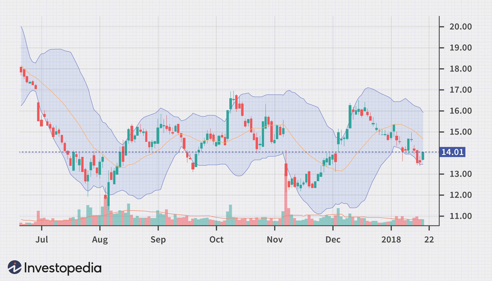

The stock market has always been characterized by periods of highs and lows, but the events of February 2018 marked a particularly unusual episode known as 'Volmageddon.' During this period, the financial world witnessed an unprecedented spike in market volatility, largely influenced by the mechanics of algorithmic trading. This significant shift from the stability experienced in the preceding year raised pertinent questions about the role of technology-driven trading strategies in exacerbating market upheavals.

Algorithmic trading has been transformative for financial markets, harnessing the power of computing to achieve rapid execution of trades, often exploiting small price differentials for profit. However, its scale and speed can sometimes contribute to severe market fluctuations. This article examines how such trading methods intensified the market crash of February 2018, influencing both technical aspects and broader market implications. We'll look into how algorithms, which often mimic herding behavior by reacting to the same predictive signals, can result in sudden surges in trading volumes and volatility.

A significant consequence of this volatility was the downfall of specific financial instruments designed to capitalize on a stable market environment. One such instrument, the XIV (VelocityShares Daily Inverse VIX Short-Term note), experienced a catastrophic collapse. The XIV was intended to allow investors to bet against volatility. As the Volatility Index (VIX) spiked, the XIV's underlying assumptions were upended, leading to severe financial losses and subsequent legal scrutiny.

This analysis seeks to provide an in-depth understanding of 'Volmageddon', highlighting the dual-edged nature of algorithmic trading—its ability to streamline operations can also precipitate chaos. The aftermath sparked legal action against entities like Credit Suisse, emphasizing the need for regulatory bodies to address the complexities introduced by advanced trading technologies. This episode serves as a reminder to investors and policymakers of the potential systemic risks posed by an increasingly automated financial landscape.

## Table of Contents

## The Volmageddon Phenomenon

February 5, 2018, became a significant day in financial history as it saw one of the most drastic surges in market volatility, an event now popularly referred to as "Volmageddon." The Cboe Volatility Index (VIX), often termed the "fear gauge," experienced an unprecedented spike. Throughout 2017, the market had enjoyed a prolonged period of calm with consistently low volatility levels; however, this tranquility was abruptly shattered as the VIX surged.

This unexpected escalation in volatility was not only a result of traditional market factors but was exacerbated by algorithmic trading patterns. Automated trading systems, relying on complex algorithms to execute trades at high speeds, contributed significantly to the panic selling that ensued. These systems are designed to react to market signals, and during periods of increasing volatility, they can initiate large-scale sell-offs, further intensifying market fluctuations. 

As a direct consequence of these activities, investors faced a steep decline in equity values. This sell-off triggered substantial financial repercussions, affecting markets globally. Many market participants, including retail and institutional investors, found themselves grappling with considerable losses as asset values plummeted in response to the chaos.

The Volmageddon event underscored the complexities and potential pitfalls of modern trading mechanisms like [algorithmic trading](/wiki/algorithmic-trading), which, while designed to optimize and streamline market activities, can also amplify market stressors, leading to widespread disruption.

## Failure of the XIV

The XIV, or VelocityShares Daily Inverse VIX Short-Term note, experienced a dramatic collapse on February 5, 2018, directly impacted by a sudden spike in the Cboe Volatility Index (VIX). This financial vehicle was designed to offer the opposite return of the VIX, which is a popular measure of market [volatility](/wiki/volatility-trading-strategies) and investor sentiment. As such, when the VIX surged more than two-fold in a single day, short-sellers of volatility who heavily invested in the XIV suffered significant losses. 

The XIV's value plummeted drastically, with its assets falling from approximately $1.9 billion to just $63 million within a short period. This catastrophic loss manifestly demonstrated the vulnerabilities and risks inherent in inverse volatility products, especially during periods of unexpected market fluctuations. 

Following this financial debacle, Credit Suisse, which issued the XIV, was compelled to announce an accelerated termination of the product. The abrupt closure of the XIV incited widespread discussions and scrutiny regarding the viability and safety of similar inverse volatility instruments. It highlighted the potential systemic risks such instruments could pose under extreme market conditions, which were underestimated by investors banking on continued low volatility.

The downfall of the XIV underscored the critical need for more comprehensive risk assessments and investor awareness related to complex financial instruments. As a result, it called into question the mechanisms by which such products are marketed and the adequacy of existing regulatory frameworks in mitigating the associated risks.

## Impact of Algorithmic Trading

Algorithmic trading refers to the use of computer programs to automatically execute trades in financial markets based on predefined criteria. During the stock market upheaval in February 2018, known as "Volmageddon," algorithmic trading significantly impacted market dynamics. Automated trading strategies played a crucial role in amplifying market sell-offs as they responded to various market triggers by executing rapid and substantial trades. These reactions often escalated into a "poisonous feedback loop," resulting in intensified volatility.

As the market experienced a rapid increase in the Cboe Volatility Index (VIX), algorithmic systems often acted on predefined rules that suggested selling off assets to minimize perceived risks. This action was markedly swift, resulting in further declines in asset prices, which in turn triggered additional programmatic sell orders from other algorithms. This cascading effect contributed to the volatility spike as more algorithm-driven trades reacted in synchronization, rather than buffering the market through a tempered human response. The automated nature of these trades emphasizes speed and efficiency, potentially overlooking broader market sentiments that might otherwise modulate extreme price movements.

Critics highlight that algorithmic trading systems, although designed to optimize trading outcomes, inherently remove the nuanced emotional responses humans may exhibit during turbulent market conditions. While human traders may instinctively gauge market sentiment and exercise discretion, algorithmic systems are bound to their programmed instructions. This lack of flexibility and human intuition may exacerbate price swings, leading to heightened volatility.

In conclusion, the events of February 2018 demonstrated that despite the benefits of algorithmic trading in terms of efficiency and execution speed, its inherent design can sometimes contribute to market chaos. As debates continue regarding its role and influence, the financial sector is tasked with balancing these sophisticated trading tools against the potential risks posed to market stability. Understanding these dynamics remains crucial as markets become increasingly automated.

## Litigation Against Credit Suisse

Following the market turbulence on February 5, 2018, Credit Suisse found itself under legal scrutiny for its role in the events surrounding 'Volmageddon.' The focus of the litigation was the bank's involvement with the VelocityShares Daily Inverse VIX Short-Term note (XIV), a financial instrument that saw its value plummet precipitously during this period of heightened market volatility.

An aggrieved investor initiated a lawsuit against Credit Suisse, asserting that the bank had engaged in manipulative practices concerning futures pricing. The claim centered on allegations that the bank's hedging operations had a direct impact on the drastic decline in the value of XIV. This financial product was engineered to move inversely to the VIX, a measure of market volatility; thus, as the VIX surged, XIV's value diminished dramatically. Specifically, the investor argued that Credit Suisse's actions could have exacerbated the fall in XIV's price through strategic hedging that influenced the futures market.

The initial court ruling dismissed the lawsuit on grounds deemed insufficient to establish a direct causal link between Credit Suisse's actions and the losses suffered by investors. However, the case took a significant turn when it was later reopened upon appeal. This decision underscored the complexities inherent in financial litigation, particularly in cases involving sophisticated trading strategies and the interpretation of their impact during periods of extreme market conditions.

The revival of the lawsuit emphasized the critical need for improved regulatory measures and transparency in institutional trading practices. It highlighted concerns over the adequacy of existing financial oversight mechanisms, especially in the context of algorithmic trading and advanced financial products. The developments from this case suggested that clearer guidelines and disclosures might be necessary to ensure that investors are adequately informed about the risks associated with such instruments and trading strategies. 

In conclusion, the legal proceedings against Credit Suisse during 'Volmageddon' reflect broader regulatory and oversight challenges faced by the financial industry in accommodating advanced trading technologies. The case serves as an important reminder of the ongoing need for regulation that protects market integrity while fostering innovation.

## Conclusion

The events of February 2018 underscore the complex interplay between market volatility and advanced trading technologies. In particular, 'Volmageddon' highlights the dual nature of algorithmic trading as both a tool designed to enhance market efficiency and a [factor](/wiki/factor-investing) that can potentially exacerbate market instability. Algorithmic trading, while offering unparalleled speed and accuracy in executing trades, has the capacity to amplify market movements during periods of stress, as evidenced by the February 2018 market disruption.

The financial community continues to debate the impact of algorithmic trading. On one hand, it provides benefits such as increased [liquidity](/wiki/liquidity-risk-premium) and reduced transaction costs, facilitating smoother market operation. On the other hand, the same automated processes can introduce systemic risks, creating self-reinforcing cycles of volatility. The challenge remains in quantifying these effects and devising strategies to mitigate the adverse outcomes.

As markets evolve with technological advancements, regulatory frameworks may need to adapt to address the unique challenges posed by algorithmic trading. This evolution could involve implementing more rigorous algorithm testing, enhancing transparency in trading strategies, or establishing limits on trading activities during periods of high volatility to prevent cascading sell-offs.

Ultimately, understanding past events like Volmageddon is crucial for investors and policymakers. It serves as an important lesson in navigating an increasingly automated financial landscape. By integrating historical insights with technological and regulatory considerations, market participants can better prepare for similar events, aiming to harness the benefits of advanced trading technologies while minimizing their risks.

## References & Further Reading

[1]: Kirilenko, A. A., Kyle, A. S., Samadi, M., & Tuzun, T. (2017). ["The Flash Crash: The Impact of High Frequency Trading on an Electronic Market."](https://onlinelibrary.wiley.com/doi/abs/10.1111/jofi.12498) The Journal of Finance, 72(3), 967-981.

[2]: Gu, S., Kelly, B., & Xiu, D. (2020). ["Empirical Asset Pricing via Machine Learning."](https://www.nber.org/papers/w25398) The Journal of Finance, 75(4), 2199-2245.

[3]: Covel, M. (2009). ["Trend Following: Learn to Make Millions in Up or Down Markets."](https://www.amazon.com/Trend-Following-Updated-Millions-Markets/dp/013702018X) FT Press.

[4]: Easley, D., López de Prado, M. M., & O'Hara, M. (2012). ["The Volume Clock: Insights into the High-Frequency Paradigm."](https://papers.ssrn.com/sol3/papers.cfm?abstract_id=2034858) The Journal of Portfolio Management, 39(1), 19-29.

[5]: Aldridge, I. (2013). ["High-Frequency Trading: A Practical Guide to Algorithmic Strategies and Trading Systems."](https://onlinelibrary.wiley.com/doi/pdf/10.1002/9781119203803.fmatter) Wiley.