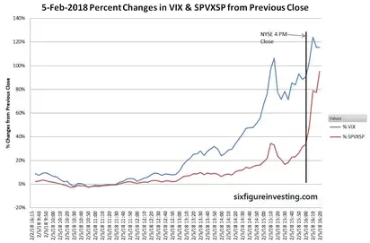

## Table of Contents

## What was the February 2018 Stock Market Volatility Event?

The February 2018 Stock Market Volatility Event was a sudden and sharp drop in stock market prices that happened in early February of that year. Before this event, the stock market had been doing well for a long time, and many people were not expecting such a big change. On February 5, the Dow Jones Industrial Average, which is a big measure of the stock market, dropped by over 1,100 points in one day. This was the biggest single-day point drop in the history of the Dow Jones at that time.

The main reason for this event was a rise in interest rates. The U.S. government had been slowly increasing interest rates, and this made borrowing money more expensive. When borrowing becomes more expensive, it can slow down the economy, which can make stock prices go down. Also, many investors had been using a lot of borrowed money to buy stocks, and when the market started to fall, they had to sell their stocks quickly to pay back their loans. This selling made the market drop even more. After a few weeks, the market calmed down, but the event reminded investors that the stock market can be unpredictable.

## What were the main causes of the February 2018 market volatility?

The main cause of the February 2018 market volatility was a sudden increase in interest rates. The U.S. government had been slowly raising interest rates, which made borrowing money more expensive. When borrowing costs go up, it can slow down the economy because businesses and people have less money to spend. This can make stock prices drop because investors worry about lower profits in the future.

Another big reason for the volatility was that many investors had been using a lot of borrowed money to buy stocks. This is called "leverage." When the market started to fall, these investors had to sell their stocks quickly to pay back their loans. This selling made the market drop even more, creating a cycle of selling and falling prices. The combination of higher interest rates and the need to pay back loans caused a sharp and sudden drop in the stock market, leading to the volatility event in February 2018.

## How did the volatility in February 2018 affect major stock indices like the S&P 500 and Dow Jones?

The volatility in February 2018 had a big impact on major stock indices like the S&P 500 and the Dow Jones Industrial Average. On February 5, the Dow Jones dropped by over 1,100 points in one day, which was the biggest single-day point drop in its history at that time. The S&P 500 also fell sharply, dropping by about 4.1% on the same day. These big drops showed how quickly the market could change and how nervous investors were.

After the initial drop, the market continued to be up and down for a few weeks. The S&P 500 and the Dow Jones both went through more ups and downs before they started to calm down. By the end of February, the S&P 500 had lost about 3.6% for the month, while the Dow Jones was down about 4.5%. Even though the market eventually recovered, the event in February 2018 reminded everyone that the stock market can be unpredictable and can change quickly.

## What role did the VIX index play during the February 2018 volatility event?

The VIX index, also known as the "fear gauge," measures how much people expect the stock market to move around in the future. During the February 2018 volatility event, the VIX index jumped a lot. Before the event, the VIX was at very low levels, which meant that people thought the market would stay calm. But when the market started to drop quickly on February 5, the VIX shot up from around 17 to over 37 in one day. This big jump showed that people suddenly became very worried about the market and expected more big changes.

The spike in the VIX index during the February 2018 event was important because it showed how nervous investors were. When the VIX goes up a lot, it often means that people are selling their stocks and trying to protect their money. This can make the market drop even more. The high VIX also affected some financial products that were linked to it, causing more selling and adding to the volatility. So, the VIX played a big role in showing and even adding to the market's ups and downs during that time.

## How did the rise in interest rates contribute to the stock market volatility in February 2018?

The rise in interest rates was a big reason for the stock market volatility in February 2018. The U.S. government had been slowly increasing interest rates, which made it more expensive for people and businesses to borrow money. When borrowing costs go up, it can slow down the economy because people have less money to spend. This can make investors worried about lower profits in the future, which can cause stock prices to drop. In February 2018, the sudden increase in interest rates made investors nervous, leading to a sharp drop in the stock market.

Another way the rise in interest rates affected the market was through something called "leverage." Many investors had been using a lot of borrowed money to buy stocks. When interest rates went up and the market started to fall, these investors had to sell their stocks quickly to pay back their loans. This selling made the market drop even more, creating a cycle of selling and falling prices. So, the rise in interest rates not only made people worried about the economy but also forced many investors to sell their stocks, which added to the volatility in February 2018.

## What were the impacts of the February 2018 volatility on individual investors?

The February 2018 volatility event had a big impact on individual investors. Many people who had money in the stock market saw their investments lose value quickly. If they had invested a lot of money in stocks, they might have seen their savings go down a lot in just a few days. This was especially hard for people who were close to retiring or who needed their money soon because they didn't have time to wait for the market to go back up.

The event also made many individual investors feel nervous and unsure about the stock market. Before February 2018, the market had been doing well for a long time, and many people thought it would keep going up. But the sudden drop showed that the market could change quickly and without warning. This made some people decide to take their money out of the stock market and put it in safer places, like savings accounts or bonds. Others decided to keep their money in the market but were more careful about how they invested after the volatility event.

## How did institutional investors and hedge funds react to the February 2018 volatility?

Institutional investors and hedge funds reacted to the February 2018 volatility in different ways. Some of them had been using a lot of borrowed money to buy stocks, and when the market started to drop, they had to sell their stocks quickly to pay back their loans. This selling made the market drop even more. Other hedge funds and institutional investors saw the volatility as a chance to make money. They used special strategies to bet on the market going down, which helped them make money when the market was falling.

After the initial drop, many institutional investors and hedge funds started to be more careful. They looked at their investments more closely and made changes to protect their money. Some of them decided to put less money in stocks and more in safer investments like bonds. The February 2018 volatility event reminded everyone in the market that things can change quickly, and it made many institutional investors and hedge funds think more about how to handle risk in the future.

## What were the long-term effects of the February 2018 volatility on the stock market?

The February 2018 volatility event had some long-term effects on the stock market. After the sharp drop in February, the market did recover, but it made investors more careful. Many people started to think more about the risks of investing in stocks. They realized that the market could change quickly and without warning, so they paid more attention to how they were investing their money. This event also made some investors decide to put less money in stocks and more in safer places like bonds. They wanted to protect their money from big drops in the future.

Another long-term effect was that the February 2018 event changed how some investors used borrowed money to buy stocks. Before the event, many people had been using a lot of leverage, which means borrowing money to invest. But after the market dropped so quickly, many investors decided to use less borrowed money. They learned that using too much leverage could be risky if the market suddenly went down. Overall, the February 2018 volatility event made the stock market more cautious and focused on managing risk.

## How did regulatory bodies respond to the February 2018 volatility event?

After the February 2018 volatility event, regulatory bodies like the U.S. Securities and Exchange Commission (SEC) and the Financial Industry Regulatory Authority (FINRA) took a close look at what happened. They wanted to understand why the market dropped so quickly and how they could stop it from happening again. They looked at things like how interest rates affected the market and how investors were using borrowed money to buy stocks. The regulators wanted to make sure that the market was fair and safe for everyone.

The SEC and FINRA also started to think about new rules that could help make the market more stable. They talked about ways to control how much money investors could borrow to buy stocks. They also thought about making it easier for people to know what was happening in the market so they could make better choices. Even though the market calmed down after a few weeks, the February 2018 event made regulators more focused on keeping the market safe and fair for everyone in the long run.

## What lessons can investors learn from the February 2018 volatility event?

The February 2018 volatility event taught investors that the stock market can change quickly and without warning. Before the event, the market had been doing well for a long time, and many people thought it would keep going up. But when the market suddenly dropped, it showed that even when things seem calm, big changes can happen. Investors learned to be ready for surprises and to not put all their money in one place. They realized that it's important to have a plan for what to do if the market goes down.

Another lesson from the February 2018 event is about using borrowed money to buy stocks. Many investors had been using a lot of leverage, which means borrowing money to invest. When the market dropped, they had to sell their stocks quickly to pay back their loans, which made the market drop even more. This taught investors to be careful about how much they borrow and to think about the risks. It's better to use less borrowed money and to have a plan for what to do if the market goes down. Overall, the event reminded investors to be careful and to always think about how to protect their money.

## How did the February 2018 volatility event influence market volatility strategies and products?

The February 2018 volatility event made people pay more attention to how they could protect their money from big drops in the market. Before the event, many investors thought the market would keep going up and didn't worry much about big changes. But when the market dropped so quickly, it showed that even when things seem calm, big surprises can happen. After the event, more people started to use strategies and products that could help them if the market went down. They wanted to be ready for surprises and to protect their money from big drops.

One big change after the February 2018 event was that more investors started to use things like options and inverse ETFs. These are special products that can make money when the market goes down. Before the event, not many people used these products, but after the big drop, more investors saw them as a way to protect their money. The event also made people think more about how to use borrowed money to buy stocks. Many investors had been using a lot of leverage, which means borrowing money to invest. But after the market dropped, they learned to be more careful about how much they borrowed and to have a plan for what to do if the market went down.

## What are the key academic and financial analyses of the February 2018 volatility event?

The February 2018 volatility event has been studied a lot by academics and financial experts. They looked at why the market dropped so quickly and what it meant for investors. One big reason for the drop was that the U.S. government had been slowly raising interest rates. When interest rates go up, it can make borrowing money more expensive, which can slow down the economy. This made investors worried about lower profits in the future, which caused stock prices to drop. Another reason was that many investors had been using a lot of borrowed money to buy stocks. When the market started to fall, they had to sell their stocks quickly to pay back their loans, which made the market drop even more. The event showed how quickly the market can change and how important it is for investors to be ready for surprises.

Financial analysts also looked at how the February 2018 event affected different parts of the market. The VIX index, which measures how much people expect the market to move around, jumped a lot during the event. This showed that people suddenly became very worried about the market. The event also made more investors use special strategies and products to protect their money from big drops. After the event, more people started to use things like options and inverse ETFs, which can make money when the market goes down. The February 2018 volatility event reminded everyone that the market can be unpredictable and that it's important to have a plan for what to do if the market goes down.

## References & Further Reading

[1]: Kirilenko, A. A., Kyle, A. S., Samadi, M., & Tuzun, T. (2017). ["The Flash Crash: The Impact of High Frequency Trading on an Electronic Market."](https://onlinelibrary.wiley.com/doi/abs/10.1111/jofi.12498) The Journal of Finance, 72(3), 967-981.

[2]: Gu, S., Kelly, B., & Xiu, D. (2020). ["Empirical Asset Pricing via Machine Learning."](https://www.nber.org/papers/w25398) The Journal of Finance, 75(4), 2199-2245.

[3]: Covel, M. (2009). ["Trend Following: Learn to Make Millions in Up or Down Markets."](https://www.amazon.com/Trend-Following-Updated-Millions-Markets/dp/013702018X) FT Press.

[4]: Easley, D., López de Prado, M. M., & O'Hara, M. (2012). ["The Volume Clock: Insights into the High-Frequency Paradigm."](https://papers.ssrn.com/sol3/papers.cfm?abstract_id=2034858) The Journal of Portfolio Management, 39(1), 19-29.

[5]: Aldridge, I. (2013). ["High-Frequency Trading: A Practical Guide to Algorithmic Strategies and Trading Systems."](https://onlinelibrary.wiley.com/doi/pdf/10.1002/9781119203803.fmatter) Wiley.