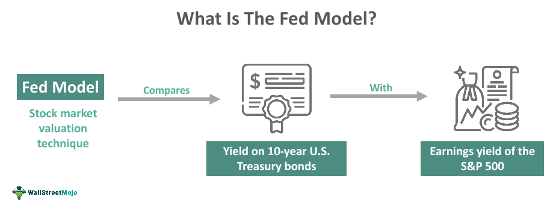

The financial landscape is experiencing a rapid transformation, marked by the increasing integration of technology into traditional investment models and strategies. Among the variety of tools available, the Fed Model, while not officially sanctioned by the Federal Reserve, remains a pivotal framework for gaining insights into market valuation. The model operates by comparing the earnings yield of equities with the yield on long-term government bonds. This comparison allows investors to determine whether stocks are valued appropriately relative to bonds.

In this article, we explore the Fed Model from the perspective of algorithmic trading, a domain where its relevance is continually challenged and reaffirmed by modern technology. Algorithmic trading employs advanced algorithms to make trading decisions, often relying on vast data sets and complex computational techniques. By integrating the Fed Model into this context, traders can enhance their ability to evaluate investment opportunities in today's fast-paced, data-driven markets.



Understanding the principles of the Fed Model equips investors with a straightforward valuation tool to assess whether equities are overvalued or undervalued in comparison to fixed-income securities. Despite its simplicity, the Fed Model provides a crucial snapshot of market sentiment, assisting investors in making informed decisions. As we continue to harness the power of technology in finance, the combination of traditional models like the Fed Model with cutting-edge platforms promises to yield more robust investment strategies. The nuanced understanding of market dynamics offered by the Fed Model is crucial for navigating the complexities of modern financial markets.

## Table of Contents

## Understanding the Fed Model

The Fed Model is a widely used valuation approach that compares the earnings yield of equities with the yield on long-term government bonds. This model is designed to provide a relative valuation between stocks and bonds, helping investors determine whether stocks are overvalued or undervalued in comparison to bonds. 

The core principle of the Fed Model is its straightforward framework, relying on the relationship between stock earnings yields and bond yields. The earnings yield of equities is calculated as the inverse of the price-to-earnings (P/E) ratio, expressed as:

$$
\text{Earnings Yield} = \frac{\text{Earnings per Share (EPS)}}{\text{Price per Share}}
$$

Conversely, the bond yield is typically represented by the current yield on long-term government securities, such as the 10-year Treasury bond. The Fed Model posits that when the earnings yield on equities exceeds the bond yield, stocks may be undervalued relative to bonds. This scenario suggests a potentially lucrative opportunity for investors to allocate more funds to the equity market. Conversely, when the bond yield surpasses the earnings yield, it indicates that stocks could be overvalued.

The Fed Model's simplicity lies in its use of real-time market data, offering investors a snapshot of market sentiment to aid in investment decisions. Despite its ease of use, the Fed Model has faced criticism for relying on the assumption that stock and bond yields should closely align, which may not always hold true in varying economic conditions. Nonetheless, its ability to provide a quick assessment of market valuation makes it a valuable tool for investors in making informed decisions.

## Origins and Evolution of the Fed Model

The Fed Model, a concept that gained popularity in the 1990s largely through Edward Yardeni, explores the comparative relationship between stock earnings yields and bond yields. Yardeni's interpretation brought focus to the potential of using this model as a tool for evaluating market valuations by assessing whether equities are undervalued or overvalued relative to long-term government bonds. Despite its association with Yardeni, the model's foundational ideas extend back to earlier valuation methodologies that underpin traditional financial analysis.

One of the antecedent concepts to the Fed Model is the dividend discount model (DDM), which evaluates the present value of expected future dividends to determine a stock's intrinsic value. The DDM provides a framework that correlates stock valuations to income streams, similar to how the Fed Model parallels the yields from stocks to fixed-income securities. This correlation reflects a fundamental principle in finance: the comparison of expected returns from different asset classes.

The evolution of the Fed Model signifies a synthesis of these traditional valuation principles within the context of modern financial markets. As market dynamics have advanced, so too has the application of these models, adapting to integrate more complex and comprehensive indicators of economic and financial conditions. The Fed Model’s comparison of equity earnings yields with bond yields offers a simplified snapshot that can be contrasted with more sophisticated models, illustrating both its enduring applicability and the conversation it maintains with evolving financial theories.

Through Yardeni's emphasis, the Fed Model gained notoriety not just for its simplicity, but for effectively capturing the interplay between risk and return across disparate asset classes. As financial markets continue to evolve with technological advancements, the Fed Model persists as a tool that, while straightforward, invites deeper investigation and adaptation to fit contemporary economic contexts.

## Using the Fed Model for Investment Evaluation

The Fed Model offers a practical framework for evaluating the relative value of equities and bonds, serving as a guiding tool for investors in making asset allocation decisions. At its core, the model compares the earnings yield of stocks, which is calculated as the inverse of the price-to-earnings (P/E) ratio, against the yield on long-term government bonds. This comparison provides insights into the valuation dynamics between these two primary asset classes.

Mathematically, the earnings yield of equities $(E_y)$ is expressed as:

$$

E_y = \frac{E}{P} 
$$

where:
- $E$ represents the earnings per share,
- and $P$ denotes the market price per share.

In contrast, the yield on long-term government bonds $(B_y)$ is typically provided directly by financial markets.

The Fed Model posits that when the earnings yield of stocks exceeds the bond yield, equities may be undervalued. This scenario suggests potential for stock price appreciation, prompting investors to consider adjusting their portfolios in favor of equities. Conversely, when the earnings yield is lower than the bond yield, stocks might be relatively overvalued. This implies a diminishing relative attractiveness of equities, suggesting a reallocation towards bonds could be prudent.

The formula for yield difference $\Delta Y$ is given by:

$$

\Delta Y = E_y - B_y 
$$

- A positive $\Delta Y$ (i.e., $E_y > B_y$) signals potential undervaluation of stocks.
- A negative $\Delta Y$ (i.e., $E_y < B_y$) indicates overvaluation.

Beyond its use in static assessments, the Fed Model's insights are pivotal for dynamic trading strategies. It provides a lens for interpreting market conditions, enabling investors to adapt to changing financial environments. In practice, the model also supports scenario analysis and macroeconomic assessment, allowing for a robust evaluation of market trends and investment opportunities. This adaptability makes it an invaluable part of the modern investor's toolkit.

## Challenges and Criticisms

Critics of the Fed Model have raised several concerns about its applicability and robustness in financial market analysis. One primary criticism is the variability in the correlation between stock and bond yields over time. Market conditions fluctuate due to numerous factors, including macroeconomic changes, policy shifts, and investor sentiment, leading to an inconsistent relationship between equity earnings yields and bond yields. This inconsistency challenges the reliability of the Fed Model as a stable valuation tool.

Another significant challenge is the blending of real and nominal yields in the Fed Model, especially when considering inflation-adjusted scenarios. The model compares nominal bond yields with stock earnings yields, which may not account for inflationary impacts adequately. In high inflation periods, this can lead to misleading assessments of stock valuations relative to bonds. Adjusting the model to account for inflation requires additional complexity and can dilute its original simplicity.

Furthermore, the Fed Model's reliance on regression-based methodologies has been criticized by proponents of advanced statistical techniques. Cointegration analysis, for example, offers a more sophisticated approach to examining the long-term relationship between stock and bond yields. This method accounts for potential non-stationary data and structural breaks, presenting a challenge to the traditional regression models utilized in the Fed Model framework. The ongoing development of statistical tools continues to prompt reevaluation of the Fed Model's relevancy in contemporary market assessment.

## Algorithmic Trading and the Fed Model

Algorithmic trading represents a significant shift in how financial markets operate, utilizing computational algorithms to automate trading decisions with high precision and speed. Within this advanced trading paradigm, the Fed Model offers a valuable heuristic for comparing earnings yield on stocks to yields on bonds, thereby aiding in the valuation process and portfolio management.

Algorithms utilize the Fed Model by computing the difference between the earnings yield of equities and the yield of long-term government bonds. This calculation allows algorithms to continuously assess whether equities are undervalued or overvalued relative to bonds. The formula used in this approach is straightforward:

$$
\text{Earnings Yield} - \text{Bond Yield} = \Delta
$$

where $\Delta$ represents the yield gap, a crucial indicator in asset allocation decisions. A positive $\Delta$ suggests potential undervaluation of stocks, recommending a shift towards equities, while a negative $\Delta$ indicates possible overvaluation, prompting a move towards bonds.

Python, a robust tool in the [algorithmic trading](/wiki/algorithmic-trading) domain, facilitates the integration of the Fed Model into trading frameworks. By leveraging libraries such as NumPy for numerical operations and Pandas for data manipulation, traders can effectively use the Fed Model in their algorithms. Below is a basic example in Python to compute the yield gap and make rudimentary trading decisions:

```python
import pandas as pd

# Hypothetical data
data = {'Earnings_Yield': [0.06, 0.05, 0.07], 'Bond_Yield': [0.03, 0.04, 0.02]}
df = pd.DataFrame(data)

# Compute the yield gap
df['Yield_Gap'] = df['Earnings_Yield'] - df['Bond_Yield']

# Trading decision based on the Fed Model
df['Decision'] = df['Yield_Gap'].apply(lambda x: 'Buy Equities' if x > 0 else 'Shift to Bonds')

print(df)
```

By implementing the Fed Model algorithmically, traders can automate the analysis of market conditions, enhancing their decision-making process. The dynamic nature of algorithmic trading also allows for real-time adjustments in portfolio composition, responding swiftly to changes in market sentiment indicated by variations in earnings and bond yields.

Moreover, combining the Fed Model with [machine learning](/wiki/machine-learning) techniques enriches its application, enabling more sophisticated models that [factor](/wiki/factor-investing) in broader market dynamics and predictive analytics. This capability underscores the utility of algorithmic trading in optimizing investment strategies, particularly in today's fast-paced financial environment.

## Conclusion

The Fed Model remains a relevant tool within the continually evolving financial landscape, providing investors with an intuitive yet effective approach to market valuation. Despite its origins outside official Federal Reserve endorsements, its application allows market participants to gauge relative investment values between equities and bonds, an essential consideration in modern portfolio management.

By harnessing advanced trading technologies, the Fed Model's utility extends beyond its traditional scope. Algorithmic trading frameworks can integrate this model to dynamically adjust asset allocations, leveraging real-time data processing capabilities for enhanced decision-making. Algorithms can compare earnings yields with long-term government bond yields, empowering investors to respond more swiftly to changing market conditions. The formula underpinning this comparative analysis is straightforward: 

$$
\text{Earnings Yield} = \frac{\text{Earnings Per Share}}{\text{Price Per Share}}
$$

Successful integration of this model in algorithmic trading necessitates effective data handling and analysis. Python and other computational tools facilitate this integration, allowing sophisticated processing of financial data. For instance, libraries such as Pandas and NumPy can manage large datasets efficiently, while machine learning platforms can enhance predictive accuracy for market movements.

As advancements in data processing and machine learning continue, the Fed Model's future applicability promises refinement and expansion, offering broader and more precise analytical capabilities. Enhanced algorithms can better capture and process market signals, improving portfolio performance and providing valuable insights into market trends. Thus, the Fed Model sustains its position as a crucial tool for investors seeking to optimize strategies within a technologically progressive trading environment.

## References & Further Reading

Key articles and papers by Edward Yardeni and others provide foundational insights into the Fed Model. Edward Yardeni's analytical work from the 1990s was crucial in popularizing the Fed Model as a significant valuation framework for comparing stock earnings yields to government bond yields. His writings elaborate on the historical context and practical applications of the model in investment evaluation. 

For those seeking a more comprehensive understanding, [books](/wiki/algo-trading-books) on investment valuation models explore the nuances and methodologies associated with the Fed Model. These resources cover the theoretical underpinnings of financial valuation and the practical integration of models like the Fed Model into broader investment strategies. Works by prominent finance scholars typically include discussions of the Fed Model as part of broader topics such as equity valuation, [interest rate](/wiki/interest-rate-trading-strategies) impacts, and market efficiency.

Numerous educational resources provide valuable insights into the Fed Model's application within modern markets, often emphasizing its relevance in the context of algorithmic trading. Texts on financial econometrics and quantitative finance are particularly useful, as they tend to cover the statistical and computational techniques that can enhance the Fed Model's utility. Python libraries such as NumPy and Pandas offer tools for those interested in implementing the Fed Model in trading algorithms, with practical examples available in financial programming textbooks.

Additionally, academic papers incorporating statistical methods like cointegration analysis challenge and extend the theoretical foundations of the Fed Model, analyzing how it can be adapted to account for changing economic conditions and evolving market dynamics. These studies are invaluable for individuals aiming to deepen their understanding of how traditional valuation models can adapt to contemporary algorithmic trading environments.

