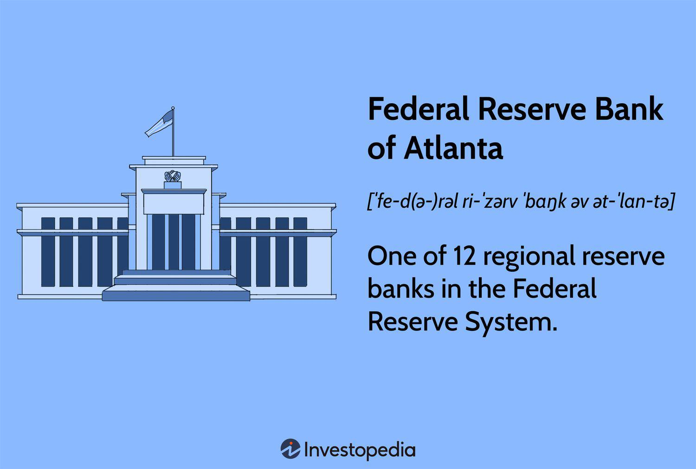

In the rapidly evolving world of financial markets, the role of policy language and communication by central banks is crucial. Central banks, such as the Federal Reserve, employ various strategies to influence market dynamics and guide economic expectations. The Federal Reserve, as the central bank of the United States, plays a pivotal role in shaping not only domestic but also global financial landscapes through its carefully constructed communication strategies.

Algorithmic trading, or algo trading, has become a dominant force in today's financial markets, significantly reliant on the timely and precise dissemination of data and communication cues. These algorithms, which encompass a vast range of strategies, depend heavily on interpretative cues from central bank communications, with the Federal Reserve being a primary focus due to its influence over key economic indicators such as interest rates and monetary policy. The subtle nuances and intentional signals embedded within the Fed's policy language can lead to significant shifts in algorithmic trading strategies, affecting market liquidity and price discovery processes.



This article aims to explore the complex relationship between the Federal Reserve's communication strategies and algorithmic trading. By analyzing the implications of Fed policy language on trading patterns and market reactions, we hope to provide insights that are essential for traders, investors, and economists. Understanding this dynamic interaction is crucial, as it not only impacts immediate trading decisions but also has broader implications for market efficiency and stability. As such, staying attuned to the intricacies of central bank communication is a key component of maintaining a competitive edge in modern financial markets.

## Table of Contents

## Understanding Federal Reserve Communication

The Federal Reserve conveys its monetary policy intentions through several formal channels, the most prominent of which include press releases, meeting minutes, and public speeches by its members. Historically, the language of these communications, often referred to as "Fed speak," was noted for its deliberate ambiguity. This approach, prominently employed by former Federal Reserve Chairman Alan Greenspan, was designed to minimize market speculation by providing open-ended interpretations of monetary policy directions.

Over time, there has been a significant shift in the Fed's communication strategy, largely attributed to the tenure of Ben Bernanke as Chairman. Under Bernanke's leadership, the Federal Reserve began using a tool known as forward guidance. This strategy involved giving clearer indications of future policy actions, thus providing more explicit signals about the central bank's expectations and intentions. Forward guidance was introduced as a mechanism to manage market expectations with greater precision, thereby enhancing economic stability.

The emphasis on transparency and clarity in communication is vital for effectively managing market perceptions. By clearly articulating policy stances and anticipated adjustments, the Federal Reserve aims to foster a stable economic environment, mitigating the risks of unexpected market fluctuations. This approach is crucial in minimizing uncertainties, allowing market participants to make informed decisions based on anticipated monetary policy trajectories. As a result, the evolving nature of Fed communication continues to play a central role in guiding economic forecasting and financial market stability.

## Algorithmic Trading and its Dependence on Data

Algorithmic trading, often referred to as algo trading, leverages computer algorithms to execute trading decisions systematically. These decisions are made based on a set of predefined criteria, which may include timing, price, quantity, or any mathematical model. The primary aim of [algorithmic trading](/wiki/algorithmic-trading) is to capitalize on market inefficiencies with minimal human intervention, allowing for rapid and precise transaction execution.

At the core of algorithmic trading is the dependence on large datasets. The efficiency of these trading algorithms largely hinges on various types of data, including but not limited to news analytics, real-time market trends, and communications from central banks like the Federal Reserve. Algorithms are designed to interpret this data, analyze price fluctuations, and execute trades at optimal times to maximize profitability.

The Federal Reserve plays a critical role in this ecosystem. Its communications, whether in the form of press releases, policy meetings, or speeches, can heavily influence market conditions. Consequently, algorithmic trading systems are programmed to detect cues from the Federal Reserve, which can trigger significant adjustments in trading strategies. However, these systems can be vulnerable to inaccuracies and ambiguities in the data. Misinterpretations arising from unclear or unexpected policy language can lead to erroneous trading decisions, potentially causing market disruptions.

Ensuring that trading algorithms have access to timely and accurate data is essential for maintaining their efficacy. Market inefficiencies and the resultant opportunities are often ephemeral, necessitating rapid response times from these algorithms. High-frequency trading ([HFT](/wiki/high-frequency-trading-strategies)) models, a subset of algorithmic trading, are particularly dependent on low-latency data to maintain their competitive edge.

To enhance the robustness of algorithmic trading, traders must focus on obtaining precise data feeds and real-time updates. Employing advanced data analytics and [machine learning](/wiki/machine-learning) techniques can further optimize trading performance by refining decision-making processes and adapting to evolving market conditions. As the landscape of financial markets continues to evolve, the reliance on high-quality data will remain a cornerstone in the success of algorithmic trading strategies.

## Impact of Fed Policy Language on Algorithmic Trading

Federal Reserve policy announcements often result in significant market movements, thereby exerting substantial influence on algorithmic trading strategies. Algorithmic trading, which includes news analytics and high-frequency trading (HFT), is remarkably sensitive to changes in Fed communication. This is because algorithmic systems rely heavily on speed and data accuracy in responding to market signals, and the Federal Reserve's communications act as one of the primary market indicators. 

For algorithmic traders, the linguistic nuances present in Fed statements can trigger buy or sell signals that are executed at high speeds. The effect is particularly pronounced in HFT, where algorithms are programmed to execute trades in fractions of a second based on the detection of key phrases or shifts in sentiment within policy communications. As a result, even subtle changes in wording can lead to sharp [volatility](/wiki/volatility-trading-strategies) in the markets as algorithms rapidly adjust positions.

The advent of generative AI models has further shaped the landscape of algorithmic trading by enhancing the ability to process and interpret Federal Reserve language. Unlike traditional algorithms, which may rely on predefined keywords, generative models are capable of understanding context and can dynamically adjust trading strategies based on a more nuanced comprehension of policy announcements. For instance, utilizing natural language processing (NLP) techniques, these AI systems can parse textual data to identify sentiment and predictive insights, effectively offering a deeper layer of analysis that optimizes trading responses.

Here is a simple example of how sentiment analysis using Python with libraries such as NLTK or TextBlob can be implemented:

```python
from textblob import TextBlob

def analyze_sentiment(statement):
    analysis = TextBlob(statement)
    return analysis.sentiment.polarity

fed_statement = "The Federal Reserve will maintain the current target range for the federal funds rate."
sentiment_score = analyze_sentiment(fed_statement)
print(f"Sentiment Score: {sentiment_score}")
```

This code snippet calculates the sentiment polarity of a hypothetical Fed statement, providing a basic framework for more sophisticated trading algorithms. A positive score would typically signal a bullish sentiment, potentially triggering buying strategies, while a negative score might indicate bearish sentiment, prompting selling actions.

Understanding the impacts of Federal Reserve communications, therefore, offers substantial opportunities for traders to refine their strategies and enhance market [liquidity](/wiki/liquidity-risk-premium). By aligning algorithmic responses with the intricacies of Fed announcements, traders can minimize risks associated with market volatility and position themselves advantageously. The incorporation of advanced AI technologies presents a promising avenue for achieving greater precision in market navigation, further solidifying the integral link between central bank communication and algorithmic trading.

## Case Study: Fed Policy Announcements and Market Reactions

A review of historical Federal Reserve meetings reveals notable trends in market reactions following policy announcements. These patterns underscore the profound influence that the Federal Reserve's communication can have on financial markets, particularly in terms of volatility and trading strategies.

Unexpected shifts in monetary policy, such as sudden changes in interest rates or adjustments in quantitative easing measures, have historically triggered increased market volatility. For example, the "taper tantrum" in 2013, when then-Chairman Ben Bernanke hinted at the gradual winding down of the Fed's bond-buying program, resulted in significant volatility spikes across global markets. This reaction was primarily due to the unexpected nature of the announcement and the market's recalibration to new policy expectations.

Algorithmic traders, who harness computational power and data analytics to decode Fed communications, often benefit during these volatile periods. By adjusting their trading strategies based on nuanced changes in Fed language, these traders can capitalize on swift market movements. The capacity to process linguistic cues from Fed announcements in real-time allows for more agile decision-making, potentially leading to enhanced performance compared to traditional trading methods.

Analyzing historical data of Fed meetings and subsequent market responses provides valuable insights for developing future trading strategies. For instance, by examining past instances where the Fed made unexpected policy shifts, traders can identify patterns in market reactions, enabling them to anticipate potential outcomes of future announcements. Additionally, tools such as natural language processing (NLP) and machine learning algorithms can be employed to analyze Fed statements, recognizing subtle sentiment changes and their probable market impacts.

Below is a simple example using Python and a basic NLP library to analyze sentiment of past Fed announcements:

```python
from textblob import TextBlob

# Sample past Fed announcement
fed_announcement_text = """
    The Federal Reserve has decided to maintain the target range for the federal funds rate at 0 to 1/4 percent.
    The Federal Reserve is prepared to adjust its plans as appropriate to support the economy.
"""

# Create a TextBlob object
blob = TextBlob(fed_announcement_text)

# Analyze sentiment
sentiment = blob.sentiment.polarity

print(f"Sentiment Polarity: {sentiment}")
```

This basic analysis can be part of a broader strategy where sentiment analysis, combined with historical data patterns, can refine trading models. As these methods advance, they continue to shape the efficacy of algorithmic trading in response to Federal Reserve policy announcements.

## The Future of Fed Communication and Algo Trading

As technology advances, the interface between Federal Reserve communication and algorithmic trading is poised for significant transformation. Generative AI models, a subset of [artificial intelligence](/wiki/ai-artificial-intelligence), offer substantial potential for enhancing the analysis and reaction times to Federal Reserve communications. These models are designed to process natural language, identify complex patterns in data, and make predictions with a level of accuracy that surpasses traditional methods. 

Generative AI models, such as those leveraging [deep learning](/wiki/deep-learning) techniques, can analyze large volumes of textual data from Fed announcements and speeches rapidly. They excel in understanding semantic nuances and contextual implications, thereby enabling algorithmic traders to discern subtle shifts in policy language and tone. This capability not only accelerates decision-making processes but also enhances the precision of trading strategies. For instance, a transformer-based model could be employed to parse speeches and release sentiment scores or key policy indicators in real time.

Increased transparency and real-time data access further bolster trading efficiencies. The Federal Reserve's ongoing commitment to clear and predictable communication facilitates more robust integrations with analytic models. The availability of comprehensive datasets allows algorithms to continuously refine their predictions, adjusting swiftly to new information streams. Enhanced automation in data collection and processing minimizes latency, ensuring that trading strategies remain aligned with the latest economic signals and policy shifts.

Adapting to these innovations necessitates continuous development in trading algorithms and strategies. Algorithm designers must incorporate adaptive learning frameworks that allow systems to evolve in response to changing communication patterns. This might involve incorporating machine learning techniques that enable the system to learn from historical data and improve performance over time. For example, [reinforcement learning](/wiki/reinforcement-learning) can be employed to optimize decision-making by rewarding strategies that align accurately with Fed communications.

As these technologies continue to evolve, they will undoubtedly redefine how algorithmic trading interacts with Federal Reserve communications. Research and development in AI-driven analytics are vital to harness their full potential, ensuring that traders maintain a competitive edge in an increasingly dynamic financial environment.

## Conclusion

The Federal Reserve's communication strategies significantly influence market expectations, directly impacting algorithmic trading. Precise and transparent communication helps traders anticipate market movements and adjust their strategies accordingly, thus maintaining trading efficiencies. As algorithmic trading depends heavily on interpreting vast amounts of data, effective Federal Reserve communications become a crucial determinant of market dynamics.

Integrating AI-driven analytics is transforming how algorithmic trading systems respond to Federal Reserve communications. AI models, particularly those utilizing natural language processing, can quickly parse and interpret central bank statements, offering traders more accurate insights and enabling faster decision-making processes. This advancement promises improved trading accuracy and increased resilience to market volatility. For instance, generative AI models analyze historical data to refine trading algorithms, ensuring they are well-equipped to handle sudden changes reflected in Federal Reserve announcements.

Continued research and innovation in both financial communications and technology are vital. As both sectors evolve, traders and economists must stay informed and adaptive, employing sophisticated algorithms and enhanced analytical tools to maintain a competitive edge. This ongoing advancement will likely lead to an increase in the precision and speed of trading activities, further stabilizing the markets in response to Federal Reserve communications. Embracing these technological developments is essential for future-proofing trading strategies and successfully navigating the intricate landscapes of modern financial markets.

## References & Further Reading

[1]: Yellen, J. (2014). ["Monetary Policy and Financial Stability,"](https://www.federalreserve.gov/newsevents/speech/yellen20140702a.htm) Federal Reserve Board.

[2]: Bernanke, B. S. (2010). ["Central Bank Independence, Transparency, and Accountability."](https://www.bis.org/review/r100527a.pdf) Federal Reserve Board.

[3]: Jansen, S. (2020). ["Machine Learning for Algorithmic Trading."](https://github.com/stefan-jansen/machine-learning-for-trading) Packt Publishing.

[4]: Lopez de Prado, M. (2018). ["Advances in Financial Machine Learning."](https://www.amazon.com/Advances-Financial-Machine-Learning-Marcos/dp/1119482089) Wiley.

[5]: Chan, E. P. (2009). ["Quantitative Trading: How to Build Your Own Algorithmic Trading Business."](https://github.com/ftvision/quant_trading_echan_book) Wiley.

[6]: Aronson, D. (2006). ["Evidence-Based Technical Analysis: Applying the Scientific Method and Statistical Inference to Trading Signals."](https://www.amazon.com/Evidence-Based-Technical-Analysis-Scientific-Statistical/dp/0470008741) Wiley.