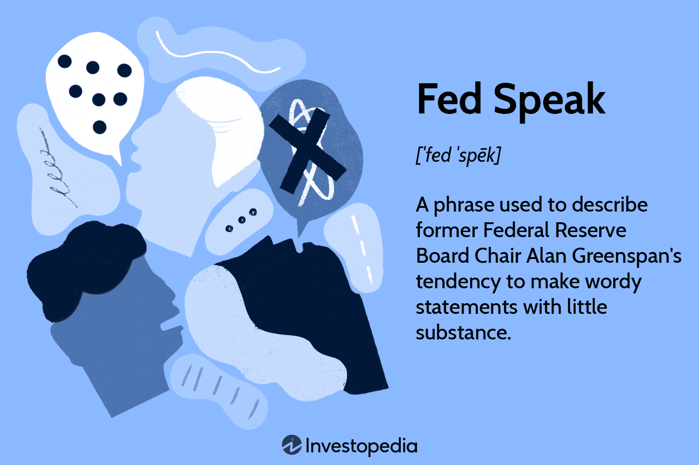

## Table of Contents

## What is a Fed speech?

A Fed speech is when someone from the Federal Reserve, like the chair or a governor, talks to the public. The Federal Reserve is like a big bank that helps control the money in the United States. When these people give speeches, they often talk about the economy, interest rates, and what the Federal Reserve might do next.

These speeches are important because they can give clues about what the Federal Reserve is thinking. People who invest money, like in stocks or bonds, listen closely to these speeches. If the Fed hints at raising interest rates, it might affect how people invest their money. So, a Fed speech can have a big impact on the economy and financial markets.

## Who typically delivers Fed speeches?

Fed speeches are usually given by important people from the Federal Reserve. The most common speakers are the Chair of the Federal Reserve, like Jerome Powell right now, and the members of the Board of Governors. These are the top leaders who make big decisions about the economy.

Sometimes, other people from the Federal Reserve also give speeches. This includes the presidents of the 12 regional Federal Reserve Banks, like the ones in New York or San Francisco. They might talk about what's happening in their specific region or share their views on the national economy. All these speeches help people understand what the Federal Reserve is thinking and planning.

## Why are Fed speeches important?

Fed speeches are important because they give us clues about what the Federal Reserve is thinking. The Federal Reserve is like a big bank that controls the money in the United States. When someone from the Fed, like the chair or a governor, gives a speech, they talk about the economy, interest rates, and what the Fed might do next. This information helps people understand what might happen with money and the economy.

People who invest in things like stocks and bonds listen closely to these speeches. If the Fed hints at raising or lowering interest rates, it can change how people invest their money. For example, if the Fed says they might raise rates, people might decide to invest differently because borrowing money could become more expensive. So, Fed speeches can have a big impact on the economy and financial markets.

## How often do Fed speeches occur?

Fed speeches happen quite often. The Federal Reserve's chair, like Jerome Powell, gives speeches a few times a year. These are important because they talk about big things like the economy and interest rates. Other members of the Board of Governors also give speeches, maybe once or twice a month.

The presidents of the 12 regional Federal Reserve Banks give speeches too. They might speak every few weeks or once a month. These speeches help people understand what's happening in different parts of the country. All these speeches together give us a lot of information about what the Federal Reserve is thinking and planning.

## What is the typical content of a Fed speech?

A Fed speech usually talks about how the economy is doing and what the Federal Reserve might do next. The person giving the speech, like the chair or a governor, will often talk about things like unemployment, inflation, and how fast the economy is growing. They might say if they think the economy is doing well or if there are problems that need to be fixed. They also talk about interest rates, which are important because they affect how much it costs to borrow money.

Sometimes, the speech will focus on specific issues, like what's happening in a certain part of the country or a new policy the Fed is thinking about. The speaker might explain why they think these things are important and what the Fed plans to do about them. These speeches help everyone understand what the Federal Reserve is thinking and planning, which can be really helpful for people who invest money or just want to know about the economy.

## How do Fed speeches influence financial markets?

Fed speeches can have a big impact on financial markets because they give hints about what the Federal Reserve might do next. When the chair or a governor talks about the economy and interest rates, investors listen closely. If the Fed suggests that they might raise interest rates, people might decide to sell stocks or bonds because borrowing money will become more expensive. This can make stock prices go down. On the other hand, if the Fed says they might lower rates, it could make borrowing cheaper, which might encourage people to invest more, pushing stock prices up.

These speeches also affect other parts of the financial markets, like the bond market and the currency market. If the Fed talks about keeping interest rates steady, it might make bonds more attractive because they offer a predictable return. And if the Fed's words make people think the economy is doing well, it could make the U.S. dollar stronger compared to other currencies. Overall, Fed speeches are important because they help investors make decisions, and these decisions can move the whole financial market.

## What is the mechanism through which Fed speeches affect monetary policy?

Fed speeches help shape monetary policy because they let the Federal Reserve tell the public what they are thinking and planning. When the chair or a governor talks, they might give hints about whether they think the economy needs higher or lower interest rates. This is important because interest rates control how much it costs to borrow money. If the Fed thinks the economy is growing too fast and might cause inflation, they might talk about raising rates to slow things down. On the other hand, if they think the economy needs a boost, they might hint at lowering rates to make borrowing cheaper.

These speeches don't directly change monetary policy, but they influence it by setting expectations. When the Fed talks about what they might do, it helps businesses, investors, and regular people plan for the future. If everyone expects the Fed to raise rates, they might start acting like rates are already higher, which can help the Fed reach its goals without actually changing rates yet. So, Fed speeches are a way for the Federal Reserve to guide the economy without making immediate changes to policy.

## Can you explain the difference between forward guidance and other types of Fed communications?

Forward guidance is when the Federal Reserve tells everyone what they plan to do with interest rates in the future. It's like giving a heads-up about their plans. The Fed uses forward guidance to help people know what to expect, so businesses and investors can plan better. For example, if the Fed says they will keep rates low for a long time, people might feel more confident about borrowing money because they know it will stay cheap.

Other types of Fed communications, like speeches and press releases, also talk about the economy and interest rates but in different ways. Speeches might cover a lot of topics, not just interest rates. They can talk about how the economy is doing, what's happening in different parts of the country, or new policies the Fed is thinking about. Press releases are official statements that tell everyone about important decisions the Fed has made, like changing interest rates or announcing new programs. These communications help everyone understand what the Fed is thinking and doing, but they don't always focus on future plans like forward guidance does.

## How do investors and analysts interpret the nuances in Fed speeches?

Investors and analysts listen very closely to Fed speeches because they want to understand what the Federal Reserve might do next. They pay attention to every word and phrase because small changes can mean big things for the economy and their investments. For example, if the Fed says they are "monitoring inflation closely," it might mean they are thinking about raising interest rates soon. If they use words like "patient" or "cautious," it might mean they will wait longer before making any changes. Analysts also look at how the Fed talks about the economy. If the Fed sounds worried about growth, investors might expect the Fed to do something to help the economy.

Analysts also try to read between the lines in Fed speeches. They look for any hints about future plans or changes in the Fed's thinking. If the Fed seems more worried about one thing than before, like unemployment or inflation, it can change how investors think about the future. For example, if the Fed starts talking more about job growth, investors might think the Fed will keep interest rates low to help more people find jobs. By understanding these nuances, investors and analysts can make better guesses about what the Fed will do next and how it might affect their investments.

## What historical examples illustrate the impact of Fed speeches on the economy?

One famous example of how a Fed speech can affect the economy happened in 1994. The Fed chair at the time, Alan Greenspan, gave a speech where he talked about raising interest rates. This was a surprise to a lot of people. Right after his speech, the stock market dropped a lot because investors got worried that borrowing money would become more expensive. This event showed how powerful a Fed speech can be. When the Fed talks about changing interest rates, it can make people change how they invest their money very quickly.

Another example is from 2013, when Ben Bernanke, who was the Fed chair then, talked about slowing down a program called "quantitative easing." This program helped keep interest rates low by buying bonds. When Bernanke said they might slow it down, it caused a big reaction in the markets. People started selling bonds, and the prices of bonds dropped a lot. This event is known as the "taper tantrum" because the markets got upset about the Fed's plans. It shows how important it is for the Fed to be clear about what they are doing because their words can make big waves in the economy.

## How do central banks globally coordinate or react to Fed speeches?

Central banks around the world pay close attention to Fed speeches because the decisions made by the Federal Reserve can affect the whole world's economy. When the Fed talks about raising or lowering interest rates, it can change how much it costs to borrow money everywhere. Other central banks might decide to change their own interest rates to keep their economies stable. For example, if the Fed raises rates, other countries might do the same to stop people from moving their money to the U.S. for better returns. This way, they try to keep their own currency from getting weaker.

Sometimes, central banks also talk to each other before big decisions. They might have meetings or share information to make sure their actions work well together. This coordination helps avoid big surprises that could shake the global economy. For instance, if the Fed is planning to do something big, like change interest rates, other central banks might prepare their own plans so they can react quickly. By working together, central banks try to keep the world's economy running smoothly.

## What advanced analytical tools are used to predict the effects of Fed speeches on economic indicators?

People who study the economy use special computer programs to guess how Fed speeches might affect things like interest rates and stock prices. These programs look at what the Fed said in the past and how the economy reacted. They use math to find patterns and make predictions. One tool they use is called natural language processing, which helps the computer understand the words in the speeches. Another tool is [machine learning](/wiki/machine-learning), which lets the computer learn from old data to make better guesses about the future.

These tools help analysts see how small changes in what the Fed says can make big changes in the economy. For example, if the Fed starts using words like "concerned" or "monitoring," the computer can tell that they might be thinking about changing interest rates soon. By using these advanced tools, people can get a better idea of what might happen next in the economy, which helps them make smarter decisions about investing and planning.

## References & Further Reading

[1]: Yellen, J. (2014). ["Monetary Policy and Financial Stability,"](https://www.federalreserve.gov/newsevents/speech/yellen20140702a.htm) Federal Reserve Board.

[2]: Bernanke, B. S. (2010). ["Central Bank Independence, Transparency, and Accountability."](https://www.bis.org/review/r100527a.pdf) Federal Reserve Board.

[3]: Jansen, S. (2020). ["Machine Learning for Algorithmic Trading."](https://github.com/stefan-jansen/machine-learning-for-trading) Packt Publishing.

[4]: Lopez de Prado, M. (2018). ["Advances in Financial Machine Learning."](https://www.amazon.com/Advances-Financial-Machine-Learning-Marcos/dp/1119482089) Wiley.

[5]: Chan, E. P. (2009). ["Quantitative Trading: How to Build Your Own Algorithmic Trading Business."](https://github.com/ftvision/quant_trading_echan_book) Wiley.

[6]: Aronson, D. (2006). ["Evidence-Based Technical Analysis: Applying the Scientific Method and Statistical Inference to Trading Signals."](https://www.amazon.com/Evidence-Based-Technical-Analysis-Scientific-Statistical/dp/0470008741) Wiley.