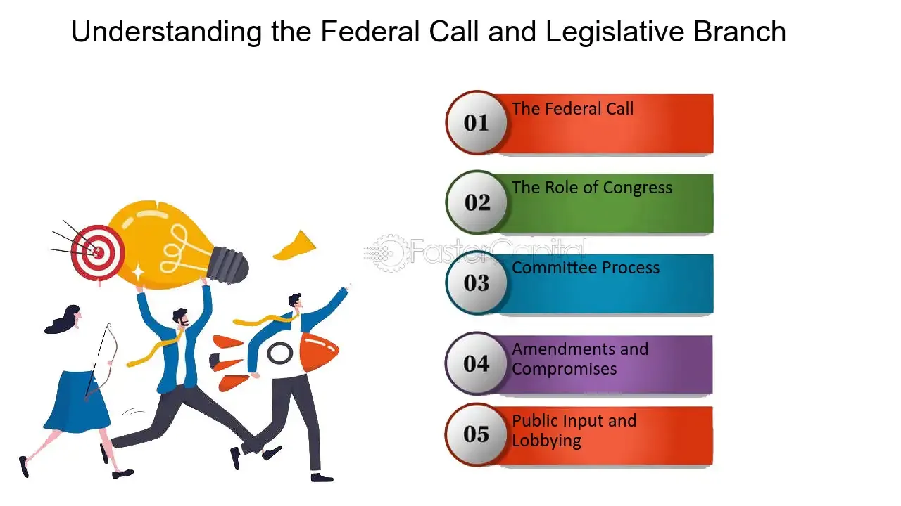

## Table of Contents

## What is a Federal Call?

A Federal Call is when the government asks people to join the military during a time of need, like a war or emergency. It's a way for the country to get more soldiers quickly. The government can do this because they have the power to make it happen, and it's called a Federal Call because it comes from the national government, not a state or local one.

When a Federal Call happens, it can affect a lot of people. Men and women might have to stop what they're doing and join the military. This can be hard because it means leaving family, jobs, and normal life behind. But it's seen as important for helping the country when it's in trouble.

## Who can issue a Federal Call?

A Federal Call can be issued by the President of the United States. The President has the power to do this because they are the leader of the country and the military. When the country needs more soldiers quickly, like during a war or a big emergency, the President can make a Federal Call to get people to join the military.

Sometimes, the President might work with Congress to issue a Federal Call. Congress is a group of people who make laws for the country. If the President and Congress agree that the country needs more soldiers, they can work together to make the Federal Call happen. This shows how the government can come together to help the country in times of need.

## What is the primary purpose of a Federal Call?

The main reason for a Federal Call is to get more people to join the military when the country really needs them. This usually happens during a war or a big emergency. The government wants to make sure they have enough soldiers to keep the country safe and to handle the situation.

When the President or the government makes a Federal Call, it's because they think it's really important for the country. They want people to leave their normal lives and help out. It's a big deal because it means a lot of people might have to change what they're doing to serve the country.

## How does a Federal Call differ from a state or local call?

A Federal Call comes from the national government, usually from the President. It's a big deal because it affects the whole country. When there's a Federal Call, it means the country needs a lot more soldiers fast, like during a war or a big emergency. The President can make this call because they lead the country and the military. It's a way to make sure the country has enough people to keep it safe.

A state or local call, on the other hand, comes from smaller parts of the government, like a state governor or a city mayor. These calls are usually for smaller problems that don't need the whole country's help. For example, a state might need more people to help with a big storm or a local emergency. These calls don't affect as many people as a Federal Call and are more about helping out in a specific area.

The big difference is who makes the call and how many people it affects. A Federal Call is for the whole country and comes from the top leader, while a state or local call is for a smaller area and comes from leaders in that area. Both are important, but they serve different needs and reach different groups of people.

## What are the legal frameworks governing Federal Calls?

The legal framework for Federal Calls is mainly found in the U.S. Constitution and laws made by Congress. The Constitution gives the President the power to be the Commander in Chief of the military. This means the President can call people to serve in the military when the country needs them. Congress also has a big role because they can pass laws that say how and when a Federal Call can happen. These laws help make sure that the President uses this power in a fair and right way.

Another important law is the Selective Service Act. This law lets the government make people sign up for the military if they need to. It's a way to make sure the country has enough soldiers during a war or emergency. The Selective Service Act works with the Constitution and other laws to give the government the tools it needs to call people to serve. Together, these legal frameworks make sure that Federal Calls are done in a way that follows the rules and helps the country when it's in need.

## Can you explain the process of initiating a Federal Call?

When the President thinks the country needs more soldiers, they start the process of a Federal Call. The President talks to their advisors and military leaders to see if it's really needed. They also work with Congress, because Congress can pass laws that help make the Federal Call happen. If everyone agrees it's necessary, the President can use their power as Commander in Chief to make the call official. They might make a big announcement to let everyone know that people are needed to join the military.

Once the Federal Call is made, the Selective Service System comes into play. This system has a list of people who have signed up to be ready to serve if needed. The government can use this list to tell people they need to join the military. People who get called have to stop what they're doing and go serve. It's a big change, but it's important for helping the country during tough times. The whole process is about making sure the country has enough soldiers to stay safe and handle emergencies.

## What are the typical scenarios that might trigger a Federal Call?

A Federal Call usually happens when the country is in a big emergency or at war. The President might see that the military needs more soldiers to keep the country safe. This could be because of a big attack from another country, or because the country is fighting in a war far away. The President talks to their advisors and military leaders to make sure a Federal Call is really needed.

Once everyone agrees, the President can make the call official. They might tell the country about it on TV or in a big speech. Then, the government uses the Selective Service System to find people who have signed up to serve. These people get told they need to join the military right away. It's a big change for them, but it's important for helping the country when it's in trouble.

## How does the public get informed about a Federal Call?

When the President decides to make a Federal Call, they usually tell the public about it in a big way. They might give a speech on TV or use the radio to reach everyone. This is important because it lets people know that the country needs more soldiers to help with a big problem, like a war or an emergency. The President might also use newspapers and the internet to spread the word. They want to make sure everyone hears about the Federal Call so that people can get ready to serve if they need to.

After the President's announcement, the government uses the Selective Service System to find people who have signed up to serve. These people get letters or emails telling them they need to join the military right away. The government might also use social media and other ways to keep everyone updated on what's happening. It's all about making sure the public knows what's going on and what they need to do to help the country during tough times.

## What are the roles and responsibilities of different agencies during a Federal Call?

When a Federal Call happens, the President's office is the one that starts everything. The President talks to their advisors and military leaders to see if the country really needs more soldiers. If they agree, the President makes a big announcement to tell everyone about the Federal Call. They use TV, radio, newspapers, and the internet to make sure everyone knows what's going on. The President's job is to lead the country and make sure it stays safe, so they have to make sure the Federal Call is done the right way.

The Selective Service System is another important agency during a Federal Call. This group keeps a list of people who have signed up to serve if the country needs them. When the President makes the Federal Call, the Selective Service System sends out letters or emails to tell these people they need to join the military right away. They make sure everyone who needs to know gets the message. The Selective Service System helps the government find the soldiers they need to keep the country safe during a big emergency or war.

Congress also plays a role in a Federal Call. They can pass laws that help make the Federal Call happen. These laws tell the President and the Selective Service System how to do things the right way. Congress works with the President to make sure the Federal Call is fair and follows the rules. Together, these agencies help the country get the soldiers it needs when there's a big problem.

## What are the potential impacts of a Federal Call on national security?

A Federal Call can make the country safer by getting more soldiers quickly. When there's a war or a big emergency, the military might need more people to help. By calling people to serve, the government can make sure the military has enough soldiers to protect the country. This can stop bad things from happening and keep everyone safe. It's like having more helpers when you need them the most.

But, a Federal Call can also cause some problems. When people have to leave their jobs and families to join the military, it can be hard for them and the country. It might make it tough for businesses to keep going and for families to stay together. If too many people are called to serve, it could even make the country weaker in other ways. So, the government has to be careful and make sure a Federal Call really helps more than it hurts.

## How is the effectiveness of a Federal Call evaluated?

The effectiveness of a Federal Call is evaluated by looking at how well it helps the country. The government checks if the military gets enough new soldiers quickly. They see if these new soldiers help keep the country safe during a war or emergency. If the military can do its job better because of the Federal Call, then it's seen as effective. The government also listens to what people say about the Federal Call. If most people think it was a good idea and it helped the country, that's another sign it worked well.

But the government also looks at any problems caused by the Federal Call. They see if it made life hard for people who had to leave their jobs and families. If businesses had trouble because too many workers were called to serve, that's something the government thinks about. The government wants to make sure the good things from the Federal Call are bigger than the bad things. They try to find a balance so the country stays safe but doesn't get hurt in other ways.

## What historical examples illustrate the use of Federal Calls and their outcomes?

During World War II, the United States used a Federal Call to get more soldiers. It was called the Selective Service and Training Act of 1940. This law made it so that men had to sign up to serve in the military. A lot of people were called to join the army, navy, and other parts of the military. This helped the country fight in the war and win. The Federal Call made sure the military had enough soldiers to do their job well. It was a big change for a lot of people, but it helped keep the country safe.

Another example is the Vietnam War. The government used a Federal Call to get more soldiers for the war in Vietnam. It was called the draft. A lot of young men were called to serve, but many people didn't like the war. There were big protests and some people even left the country to avoid serving. The Federal Call during the Vietnam War caused a lot of problems. It made the country divided and many people felt it was not fair. In the end, the war did not go well for the United States, and the Federal Call made things even harder for the country.

## References & Further Reading

[1]: ["Securities and Exchange Commission: Regulation T."](https://www.ecfr.gov/current/title-12/chapter-II/subchapter-A/part-220) U.S. Securities and Exchange Commission.

[2]: Aldridge, I. (2013). ["High-Frequency Trading: A Practical Guide to Algorithmic Strategies and Trading Systems."](https://books.google.com/books/about/High_Frequency_Trading.html?id=6l0DDQAAQBAJ) Wiley.

[3]: Kissel, R. (2013). ["The Science of Algorithmic Trading and Portfolio Management."](https://www.sciencedirect.com/book/9780124016897/the-science-of-algorithmic-trading-and-portfolio-management) Academic Press.

[4]: ["Financial Industry Regulatory Authority (FINRA): Algorithmic Trading."](https://www.finra.org/rules-guidance/key-topics/algorithmic-trading) FINRA.

[5]: Cartea, A., Jaimungal, S., & Penalva, J. (2015). ["Algorithmic and High-Frequency Trading."](https://assets.cambridge.org/97811070/91146/frontmatter/9781107091146_frontmatter.pdf) Cambridge University Press.