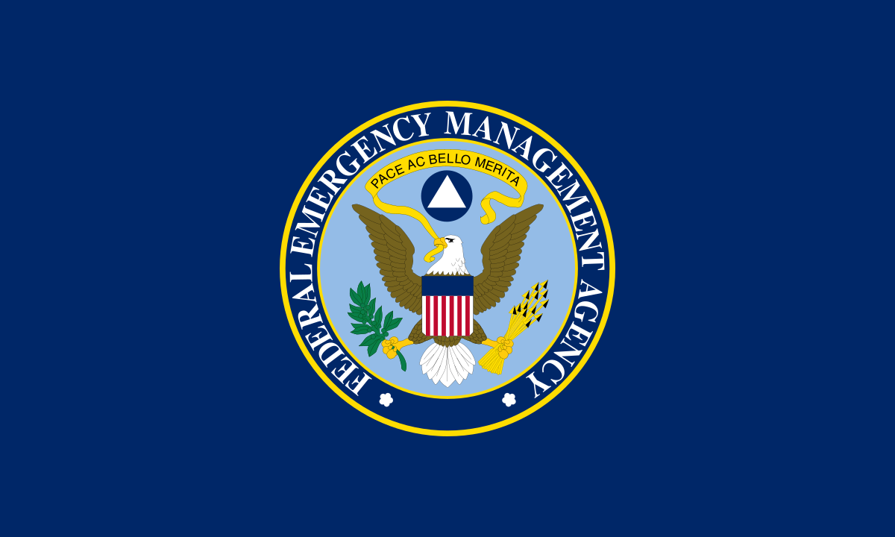

## Table of Contents

## What is the Federal Emergency Management Agency (FEMA)?

The Federal Emergency Management Agency, or FEMA, is a part of the United States government. It helps people before, during, and after emergencies and disasters. FEMA works to make sure that communities are ready for disasters like hurricanes, floods, and earthquakes. They give people information and tools to prepare for these events.

When a disaster happens, FEMA steps in to help. They provide things like food, water, and shelter to people who need it. FEMA also works with other groups to help rebuild communities after a disaster. Their goal is to make sure people can get back to their normal lives as quickly as possible.

## When was FEMA established and why?

FEMA was established on April 1, 1979. It was created because the U.S. government wanted to have one main group to handle emergencies and disasters. Before FEMA, there were many different agencies that dealt with disasters, and it was hard to coordinate everything. By creating FEMA, the government hoped to make things easier and more efficient.

The reason for setting up FEMA was also to help people better prepare for disasters. The government realized that having a single agency could help provide better information and resources to communities. This way, people could be more ready for emergencies and recover faster when disasters struck.

## What are the primary functions of FEMA?

FEMA's main job is to help people before, during, and after disasters. They work to make sure communities are ready for emergencies like hurricanes, floods, and earthquakes. FEMA gives people information and tools to prepare for these events. They also help train emergency workers and set up plans for what to do when a disaster happens.

When a disaster strikes, FEMA steps in to help right away. They provide things like food, water, and shelter to people who need it. FEMA also works with other groups to help fix roads, buildings, and other things that get damaged. Their goal is to make sure people can get back to their normal lives as quickly as possible.

FEMA also helps with long-term recovery. They give money and resources to help rebuild communities. They work with local and state governments to make sure everyone gets the help they need. FEMA's work doesn't stop until the community is back on its feet.

## How does FEMA coordinate with state and local governments during emergencies?

FEMA works closely with state and local governments during emergencies. When a disaster happens, FEMA talks to the leaders in the affected area to find out what help is needed. They set up a plan together to make sure everyone gets the right kind of help. FEMA sends people to work with local teams, so they can all work together smoothly. This way, they can quickly give out food, water, and shelter to people who need it.

FEMA also helps state and local governments with money and resources. They can give money to fix roads, buildings, and other things that got damaged. FEMA works with these governments to make sure the money is used in the best way. They keep talking to each other to see how things are going and what more help might be needed. This teamwork helps communities get back to normal faster.

## What types of disasters does FEMA typically respond to?

FEMA responds to many different types of disasters. They help with natural disasters like hurricanes, tornadoes, floods, and earthquakes. These are events that can cause a lot of damage to homes and buildings. FEMA also helps with wildfires, which can burn large areas of land and destroy communities.

In addition to natural disasters, FEMA also responds to man-made disasters. These can include chemical spills, nuclear accidents, and terrorist attacks. These events can be very dangerous and need quick help. FEMA works to make sure people are safe and get the help they need, no matter what kind of disaster it is.

## What is the National Response Framework and how does FEMA use it?

The National Response Framework, or NRF, is a plan that helps everyone work together during a big emergency. It tells different groups, like the government, businesses, and helpers, what to do when a disaster happens. The NRF makes sure that everyone knows their job and can work together to help people quickly and well.

FEMA uses the NRF to guide how they respond to disasters. When a big emergency happens, FEMA follows the steps in the NRF to make sure they are doing the right things. They work with other groups to give out help like food, water, and shelter. The NRF helps FEMA make sure that everyone is working together and that people get the help they need as fast as possible.

## How does FEMA provide disaster assistance to individuals and households?

FEMA helps people who have been affected by disasters by giving them money and other kinds of help. When a disaster happens, people can apply for help from FEMA. They can get money to fix their homes or to pay for a place to stay if their home is damaged. FEMA also gives money to help with other costs, like fixing a car or buying food and clothes.

FEMA works with other groups to make sure people get the help they need. They have people who go out and talk to those affected to see what they need. FEMA also sets up places where people can go to get help and information. They make sure that everyone knows how to apply for help and what they can get. FEMA's goal is to help people get back to their normal lives as quickly as they can.

## What role does FEMA play in disaster preparedness and mitigation?

FEMA helps people get ready for disasters before they happen. They give out information and tools to help communities prepare for emergencies like hurricanes, floods, and earthquakes. FEMA works with schools, businesses, and local groups to make sure everyone knows what to do in a disaster. They also help train emergency workers and set up plans for what to do when a disaster strikes. By helping people prepare, FEMA hopes to make sure fewer people get hurt and less damage happens.

FEMA also works to stop disasters from causing as much harm. This is called mitigation. They give money and advice to help people make their homes and buildings safer. For example, FEMA might help people build stronger homes in areas where hurricanes often happen. They also work on projects to protect against floods and wildfires. By doing these things, FEMA helps to make sure that when a disaster does happen, it won't be as bad.

## How is FEMA funded and what is its budget?

FEMA gets its money from the U.S. government. Most of its money comes from something called the Disaster Relief Fund. This fund is used to help people after disasters happen. FEMA can also get money from other parts of the government if they need it. They have to ask for this money and explain why they need it.

FEMA's budget changes every year. It depends on how many disasters happen and how much help is needed. For example, in recent years, FEMA's budget has been around $20 to $30 billion. This money helps them be ready for disasters and help people when disasters happen. The budget is important because it makes sure FEMA can do its job well and help as many people as possible.

## What are some notable FEMA responses to major disasters?

FEMA helped a lot during Hurricane Katrina in 2005. This was a big hurricane that hit New Orleans and other places. Many homes were destroyed and lots of people needed help. FEMA gave food, water, and shelter to people who lost their homes. They also worked with other groups to help rebuild the city. It was a hard time, but FEMA did their best to help everyone get back on their feet.

Another big disaster FEMA responded to was Hurricane Sandy in 2012. This hurricane hit the East Coast, especially New York and New Jersey. Many buildings were damaged and lots of people had no power. FEMA gave money to help people fix their homes and find places to stay. They also worked to make sure roads and bridges were fixed quickly. FEMA's help was important in getting the area back to normal.

FEMA also played a big role after the 9/11 attacks in 2001. These attacks were very bad and many people were hurt. FEMA helped by giving money and resources to the people affected. They worked with other groups to clean up and rebuild. FEMA's quick response helped the community start to heal from this terrible event.

## How does FEMA integrate technology and data in its operations?

FEMA uses technology and data to help them do their job better. They use special computer programs to keep track of where disasters happen and what kind of help people need. This helps them send the right kind of help quickly. FEMA also uses maps and satellite pictures to see how bad the damage is and where to focus their efforts. By using technology, FEMA can make sure they are helping as many people as possible in the best way.

FEMA also uses data to learn from past disasters. They collect information about what worked well and what didn't. This helps them get better at helping people in the future. FEMA shares this data with other groups so everyone can work together more effectively. By using technology and data, FEMA can be ready for disasters and help communities recover faster.

## What challenges does FEMA face in effectively managing disaster response and recovery?

FEMA faces many challenges when trying to manage disaster response and recovery. One big problem is that disasters can happen suddenly and be very hard to predict. This means FEMA has to be ready to help at any time, which can be tough. They also need to work with many different groups, like local and state governments, and sometimes it's hard to make sure everyone is working together well. Another challenge is that disasters can be very big and affect a lot of people, so FEMA needs a lot of resources to help everyone. Sometimes, they might not have enough money or people to do everything that's needed.

Another challenge is getting help to people quickly. After a disaster, people need things like food, water, and shelter right away. FEMA has to figure out how to get these things to the right places fast. They also need to make sure the help is fair and reaches everyone who needs it. Sometimes, there can be problems with communication, which makes it harder to know what people need and how to help them. FEMA works hard to solve these problems, but it can be very difficult.

## References & Further Reading

[1]: Bergstra, J., Bardenet, R., Bengio, Y., & Kégl, B. (2011). ["Algorithms for Hyper-Parameter Optimization."](https://papers.nips.cc/paper/4443-algorithms-for-hyper-parameter-optimization) Advances in Neural Information Processing Systems 24.

[2]: ["Advances in Financial Machine Learning"](https://www.amazon.com/Advances-Financial-Machine-Learning-Marcos/dp/1119482089) by Marcos Lopez de Prado

[3]: ["Evidence-Based Technical Analysis: Applying the Scientific Method and Statistical Inference to Trading Signals"](https://www.amazon.com/Evidence-Based-Technical-Analysis-Scientific-Statistical/dp/0470008741) by David Aronson

[4]: ["Machine Learning for Algorithmic Trading"](https://github.com/stefan-jansen/machine-learning-for-trading) by Stefan Jansen

[5]: ["Quantitative Trading: How to Build Your Own Algorithmic Trading Business"](https://www.amazon.com/Quantitative-Trading-Build-Algorithmic-Business/dp/1119800064) by Ernest P. Chan