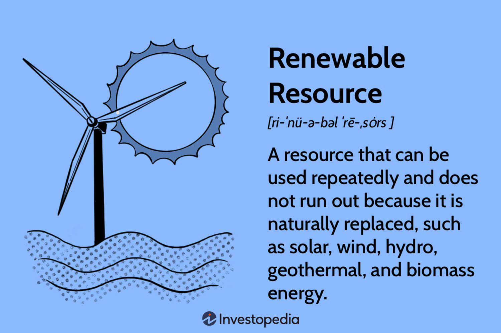

In recent years, the complexity of energy markets has increased significantly due to the integration of advanced technologies, notably algorithmic trading, which plays a crucial role in managing resources efficiently. Algorithmic trading utilizes complex algorithms to execute trades with speed and precision, responding to supply and demand fluctuations rapidly. This technological shift necessitates rigorous oversight by regulatory bodies to prevent market manipulations and ensure fair trading practices.

The Federal Energy Regulatory Commission (FERC) is a key institution in this regulatory landscape, having the authority to regulate interstate electricity, natural gas, and oil transmissions in the United States. FERC's regulatory framework is critical in maintaining the stability and transparency of energy markets. It includes the oversight of trading activities, implementing standards for infrastructure maintenance, and conducting environmental impact assessments. The commission is governed by legal mandates established through legislative acts such as the Federal Power Act and the Natural Gas Act, providing it with a wide range of regulatory powers.

This article examines how FERC's regulatory framework adapts to modern energy market dynamics, including the implications of algorithmic trading. FERC's functions are multifaceted, encompassing the regulation of electric transmission, the setting of wholesale sales rates, and the enforcement of fair trade practices in energy exchanges. Despite its significant regulatory role, FERC faces various criticisms, often from environmental advocacy groups, for its purported inadequacies in assessing the environmental impacts of energy projects. These criticisms underscore the ongoing challenges FERC encounters in balancing its regulatory oversight with the promotion of technological innovation and market growth.

As we progress, we will provide insights into the challenges and responsibilities faced by FERC in this evolving landscape, exploring how its policies and actions impact energy markets. The convergence of regulatory practices and advanced technologies like algorithmic trading is pivotal in shaping the future of energy markets, requiring ongoing adaptation and vigilance to ensure effective regulation and market integrity. This article aims to illuminate these intersections, offering a comprehensive understanding of the evolving dynamics within the energy sector and FERC's central role in this transformation.

## Table of Contents

## Understanding FERC and Its Regulatory Framework

The Federal Energy Regulatory Commission (FERC) is an independent agency tasked with the crucial role of overseeing the interstate transmission of electricity, natural gas, and oil. Its regulatory domain extends over critical components of the energy infrastructure, such as power plants, pipelines, and the markets where these energy commodities are traded. To ensure the integrity and safety of energy transmission systems, FERC establishes standards that encompass environmental compliance and pipeline safety. This regulatory oversight is intended to provide consumers with reliable, efficient, and cost-effective energy services.

FERC's authority is rooted in several significant legislative acts. The Federal Power Act empowers FERC with oversight of electricity transmission and sales, while the Natural Gas Act provides regulatory control over natural gas transportation and sale. The Energy Policy Act grants FERC further jurisdiction over market operations and environmental impact assessments related to energy projects. These legal frameworks collectively underpin FERC's regulatory capabilities and responsibilities.

Politically, the commission is structured to ensure diversity of perspectives and balance. It is composed of five commissioners who are appointed by the President and confirmed by the Senate. Importantly, to maintain political neutrality, no more than three commissioners can be from the same political party. This composition is designed to foster fair and balanced decision-making in complex regulatory matters.

FERC's regulatory actions aim to promote fair trade practices within energy markets, thwart market manipulation, and uphold transparency. These efforts are vital for maintaining market integrity and ensuring that energy trading processes are conducted equitably. Through comprehensive oversight, FERC endeavors to create a predictable and stable environment that benefits both industry participants and consumers alike by minimizing the opportunities for anti-competitive behavior and facilitating open market access.

## FERC's Role in Energy Market Oversight

FERC's core mission in energy market oversight encompasses multiple facets ranging from the regulation of electric transmission and wholesale sales rates to ensuring the safety and operational efficacy of LNG terminals and natural gas pipelines. This regulatory body holds the responsibility for licensing and conducting safety inspections of hydroelectric projects. In addition to its involvement with electricity, FERC supervises the storage of natural gas and the transportation of oil through pipelines, ensuring that these activities comply with the Interstate Commerce Act. This diligence in supervision contributes to the reliability and integrity of the national energy infrastructure.

FERC's oversight extends to monitoring and investigating energy markets to identify and address manipulative practices. Through its enforcement measures, FERC holds companies accountable, utilizing fines and other penalties as deterrents against market manipulation. A salient example of FERC's regulatory prowess is Order 1000, which requires coordinated regional transmission planning and equitable cost allocation. This order facilitates inter-state cooperation, thereby improving grid reliability and enhancing market efficiency.

Despite the comprehensive nature of its regulatory framework, FERC faces criticism, predominantly from environmental advocacy groups, for its handling of environmental assessments for energy projects. These groups argue that FERC's evaluations do not adequately address the environmental impacts, particularly concerning greenhouse gas emissions and other indirect effects. This criticism highlights an ongoing tension between maintaining rigorous regulatory oversight and satisfying environmental concerns, a balance that is crucial in the context of contemporary energy market operations.

FERC's ability to adapt its regulatory practices as technology and market dynamics evolve is crucial for maintaining effective oversight. This adaptation ensures that while fostering innovation and growth in energy markets, the integrity and fairness of these markets remain intact.

## Algorithmic Trading in Energy Markets

Algorithmic trading, commonly known as 'algo trading', employs sophisticated algorithms to automate the trading process within financial markets. These algorithms are designed to optimize trading outcomes by leveraging speed, precision, and the capability to process large datasets. In energy markets, the adoption of [algorithmic trading](/wiki/algorithmic-trading) has significantly enhanced the efficiency of trading operations, facilitating the optimal buying and selling of energy contracts. This has resulted in increased market [liquidity](/wiki/liquidity-risk-premium) and greater overall efficiency.

One of the primary advantages of algorithmic trading in energy markets is the rapid execution of trades. Algorithms can process market data and execute transactions in fractions of a second, allowing market participants to react swiftly to fluctuations in supply and demand. This speed not only reduces transaction costs but also minimizes the market impact of large trades, enabling participants to achieve better pricing.

FERC's regulatory role in overseeing algorithmic trading activities is crucial to ensuring market integrity. The rapid and automated nature of algo trading introduces potential risks, such as market manipulation and unfair trade practices. To mitigate these risks, FERC is tasked with monitoring trading behaviors and adapting its regulatory standards and enforcement mechanisms to technological advancements. This involves implementing policies and guidelines that address the unique challenges presented by automated trading, such as ensuring transparency and preventing manipulative schemes that could distort market operations.

The continuous evolution of trading technologies necessitates FERC's vigilance and adaptability in its regulatory approach. As algorithms become more sophisticated, FERC must ensure that its regulations keep pace with technological developments, safeguarding against risks while promoting innovation. By maintaining this balance, FERC helps to stabilize and sustain the integrity of energy markets, fostering an environment where technological advancements can coexist with robust regulatory oversight.

## Criticism and Challenges Faced by FERC

FERC has faced substantial criticism, predominantly from environmental groups, for allegedly failing to adequately consider the environmental consequences of pipeline projects. These groups argue that FERC's environmental reviews often lack depth, particularly in evaluating the full scope of greenhouse gas emissions and other indirect environmental impacts associated with energy infrastructure projects. This critique is grounded in court cases where FERC's assessment processes were legally contested, demanding more comprehensive evaluations in line with modern environmental standards.

One notable challenge FERC grapples with is the evolving landscape of energy markets, heavily influenced by rapid technological advancements. The rise of algorithmic trading, a mechanism employing sophisticated algorithms for trading energy contracts, adds a layer of complexity to market dynamics. These technological shifts pressure FERC to continuously evolve its regulatory framework to ensure fair market practices while minimizing the risks of exploitation and distortion. The agency must systematically refine its oversight processes, considering the nuanced interplay between innovative trading methodologies and market integrity.

Balancing its dual mandate to foster market growth and upholding strong regulatory oversight remains a formidable task for FERC. It needs to encourage innovation and competitiveness within energy markets while safeguarding against potential malpractices. This equilibrium is crucial in maintaining the trust and functionality of energy markets for all participants, amidst increasing scrutiny from various stakeholders concerned with environmental and ethical governance.

## Key Examples of FERC's Regulatory Actions

FERC's enforcement actions highlight its role in ensuring fairness and integrity within energy markets. A notable example occurred in 2015 when FERC assessed significant penalties against BP America. The Commission found that BP engaged in manipulative trading practices in the natural gas markets, specifically in the aftermath of Hurricane Ike[1]. The violation involved manipulating the market during physical trading at Houston Ship Channel to benefit its financial positions. As a result, FERC ordered BP America to pay approximately $20.16 million in civil penalties and disgorge $207,169 in unjust profits.

Another significant case involved Competitive Energy Services, LLC (CES), which faced FERC's enforcement actions for artificially inflating a client's energy baseline. CES's actions violated agreements under the New England Independent System Operator's (ISO-NE) load response program. This manipulation led to inappropriate financial gains, compelling FERC to impose substantial financial penalties on CES and related parties[2].

These enforcement cases exemplify FERC's dedication to preserving market integrity. By penalizing unlawful activities, FERC aims to deter future violations and ensure a transparent and competitive market environment. Through diligent monitoring and regulatory actions, FERC plays a critical role in maintaining the balance of the energy trading market.

**References**:

1. Federal Energy Regulatory Commission, "Order Assessing Civil Penalties, BP America Inc., et al.", Docket No. IN13-15-000, August 13, 2015.
2. Federal Energy Regulatory Commission, "Order Assessing Civil Penalties Against Competitive Energy Services, LLC et al.", Docket No. IN15-3-000, January 2017.

## Conclusion

The Federal Energy Regulatory Commission (FERC) continues to occupy a central role in the regulation of energy markets, focusing on ensuring that energy transmission and trade are conducted in a manner that is both efficient and equitable. As technology reshapes the landscape of energy trading—particularly through advancements such as algorithmic trading—FERC's capacity to adapt its regulatory framework is crucial. Its efforts to manage these changes reflect a commitment to a balance between facilitating market operations and maintaining rigorous oversight.

FERC's actions and decisions provide a lens through which the future trajectory of energy policy can be observed. As complex trading methodologies develop, the agency's strategies offer insights into how regulatory practices might evolve. Despite facing scrutiny from environmental circles and other stakeholders, FERC's ongoing endeavor to align market innovation with regulatory compliance remains integral to its mission.

As FERC continues addressing the challenges posed by sophisticated trading mechanisms and evolving market dynamics, its regulatory activities are poised to influence the harmony between technological innovation and regulatory obligations. Stakeholders in the energy sector will closely observe FERC's strategies as they look to understand and anticipate shifts in energy regulation practices.

## References & Further Reading

[1]: Federal Energy Regulatory Commission, ["An Overview of FERC's Enforcement Program"](https://www.ferc.gov/enforcement) 

[2]: Federal Energy Regulatory Commission, "Order Assessing Civil Penalties, BP America Inc., et al.", Docket No. IN13-15-000, August 13, 2015. Available at [ferc.gov](https://www.ferc.gov/sites/default/files/2020-06/BP-order.pdf)

[3]: Federal Energy Regulatory Commission, "Order Assessing Civil Penalties Against Competitive Energy Services, LLC et al.", Docket No. IN15-3-000, January 2017. Available at [ferc.gov](https://www.ferc.gov/sites/default/files/2020-04/CES-LLC-order.pdf)

[4]: ["The Federal Energy Regulatory Commission: An Overview"](https://www.ferc.gov/what-ferc/overview-ferc) Congressional Research Service Report for Congress (2017)

[5]: ["Energy Trading and Risk Management: A Practical Approach to Hedging, Trading, and Portfolio Diversification"](https://onlinelibrary.wiley.com/doi/book/10.1002/9781118638286) by Iris Marie Mack

[6]: ["Algorithmic Trading and DMA: An introduction to direct access trading strategies"](https://archive.org/details/algorithmictradi0000john) by Barry Johnson

[7]: ["FERC's Natural Gas Pipeline Certificate Policy Statement: Past Work, Precedent, and Current Stakeholder Perspectives"](https://www.ferc.gov/news-events/news/fact-sheet-updated-pipeline-certificate-policy-statement-pl18-1-000) RAND Corporation

[8]: ["Market Liquidity: Theory, Evidence, and Policy"](https://academic.oup.com/book/55158) by Thierry Foucault, Marco Pagano, and Ailsa Röell