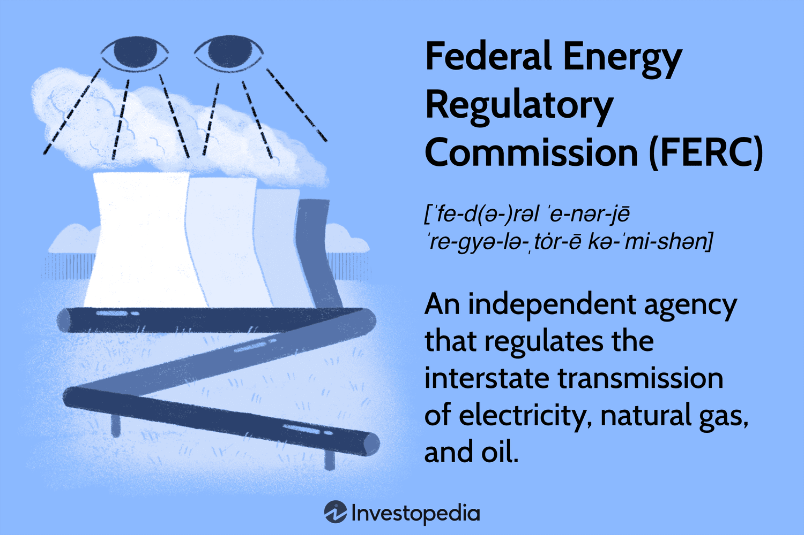

## Table of Contents

## What is the Federal Energy Regulatory Commission (FERC)?

The Federal Energy Regulatory Commission (FERC) is a government agency in the United States that helps make sure energy is safe, reliable, and fairly priced. It oversees the transmission and sale of electricity, natural gas, and oil at the wholesale level. This means FERC makes sure that the companies that produce and move energy across state lines follow the rules and treat customers fairly.

FERC also plays a big role in approving the building of new energy projects, like pipelines and power lines. They look at these projects to make sure they are good for the public and the environment. By doing this, FERC helps balance the need for energy with protecting our surroundings and keeping energy costs reasonable for everyone.

## What are the primary responsibilities of FERC?

FERC's main job is to make sure that the energy we use, like electricity, natural gas, and oil, is safe, reliable, and fairly priced. They do this by watching over how these energy sources are moved and sold across different states. FERC makes sure that the companies that produce and transport energy follow the rules and treat everyone fairly. This means they check that the prices are not too high and that everyone gets the energy they need.

Another big part of FERC's work is deciding if new energy projects, like pipelines and power lines, can be built. They look at these projects carefully to see if they are good for the public and the environment. FERC tries to balance the need for more energy with keeping our surroundings safe and keeping energy costs reasonable for everyone. By doing all these things, FERC helps make sure we have the energy we need in a way that is fair and safe.

## How was FERC established and what is its history?

FERC was created in 1977 when President Jimmy Carter signed the Department of Energy Organization Act. Before FERC, there was an agency called the Federal Power Commission (FPC), which was set up in 1920. The FPC was in charge of regulating electricity and natural gas. But as the country's energy needs grew and changed, people thought a new agency was needed to handle these responsibilities better.

So, FERC was born to take over from the FPC. FERC's job was to oversee the energy industry more effectively, especially as the country started using more energy and faced new challenges. Over the years, FERC has had to adapt to changes in technology, environmental concerns, and the growing demand for energy. Today, FERC continues to play a crucial role in making sure the energy we use is safe, reliable, and fairly priced.

## What types of energy does FERC regulate?

FERC regulates three main types of energy: electricity, natural gas, and oil. They make sure these energies are moved and sold fairly across different states. This means FERC watches over the companies that produce and transport these energies to make sure they follow the rules and don't charge too much.

For electricity, FERC oversees the transmission and wholesale sales, making sure the power grid is reliable and prices are fair. With natural gas, they regulate the pipelines that move gas across state lines and the sales of gas at the wholesale level. For oil, FERC's role is smaller, mainly focusing on the pipelines that transport oil between states. By doing all this, FERC helps keep our energy safe and affordable.

## How does FERC ensure fair energy pricing?

FERC makes sure energy prices are fair by watching over how electricity, natural gas, and oil are sold and moved across different states. They check that the companies selling these energies don't charge too much. FERC does this by setting rules that everyone has to follow. They also look at the prices to make sure they are not too high and that everyone gets treated the same way.

If a company wants to change its prices, they have to ask FERC first. FERC then looks at the request to see if it's fair. They might say no if the new prices would be too high or unfair to customers. By doing all this, FERC helps keep energy costs reasonable for everyone, so people don't have to pay too much for the energy they need.

## What is the role of FERC in promoting energy infrastructure development?

FERC plays a big role in helping build new energy projects like pipelines and power lines. They look at these projects to see if they are good for the public and the environment. If a company wants to build something new, they have to ask FERC for permission. FERC checks the plans carefully to make sure the project will help meet our energy needs without harming the environment too much.

By approving or denying these projects, FERC helps balance the need for more energy with keeping our surroundings safe. They make sure that new energy infrastructure, like pipelines and power lines, is built in a way that is good for everyone. This helps make sure we have enough energy for the future while also protecting our environment.

## Can you explain how FERC handles disputes and enforcement?

FERC handles disputes and enforces rules to make sure everyone follows the law. If people or companies have a disagreement about energy prices or rules, they can go to FERC for help. FERC listens to both sides and then makes a decision. They try to be fair and make sure the rules are followed. If someone breaks the rules, FERC can take action against them. They might make the company pay a fine or change what they are doing to follow the rules.

When FERC finds out about a problem, they start an investigation. They look at all the facts to see if someone did something wrong. If they find that a rule was broken, FERC can decide on a punishment. This could be a fine, or they might tell the company to do something different. By doing this, FERC makes sure that the energy industry stays fair and follows the law.

## What are some key regulatory policies implemented by FERC?

FERC has put in place many important rules to make sure energy is safe, reliable, and fairly priced. One big rule is about how electricity is sold. FERC made a rule called "Order No. 888" that says companies have to let other companies use their power lines to move electricity. This helps make sure everyone can get the electricity they need and keeps prices fair. Another important rule is "Order No. 745," which says that companies that help balance the power grid should get paid for their work. This helps keep the electricity system working well.

FERC also has rules about natural gas. They made "Order No. 636" which changed how natural gas pipelines work. Now, the companies that own the pipelines can't also sell the gas. This helps keep the prices fair and makes sure everyone can use the pipelines. FERC also looks at new projects like pipelines and power lines to make sure they are good for the public and the environment. They have rules to make sure these projects are built in a way that is safe and fair for everyone.

These rules show how FERC works to keep energy safe and affordable. They make sure companies follow the law and treat everyone fairly. By doing this, FERC helps make sure we have the energy we need without paying too much or harming the environment.

## How does FERC interact with state regulatory bodies?

FERC works with state regulatory bodies to make sure energy is safe, reliable, and fairly priced. FERC looks at how energy is moved and sold across different states, while state bodies focus on what happens within their own state. They talk to each other to make sure their rules work well together. For example, if FERC approves a new pipeline that goes through several states, they will work with the state bodies to make sure everyone agrees on how it should be built and used.

Sometimes, FERC and state bodies might not agree on everything. When this happens, they try to find a way to solve the problem. FERC has the final say on things that involve energy moving across state lines, but they still listen to what the states have to say. By working together, FERC and state bodies help make sure that energy rules are fair and good for everyone, no matter where they live.

## What are some notable cases or decisions made by FERC?

One important case FERC handled was about Enron, a big energy company. In the early 2000s, FERC found out that Enron was not playing fair. They were making up fake companies to trade energy and were charging too much money. FERC did a big investigation and made Enron pay a lot of money back to people who were overcharged. This case showed how important it is for FERC to keep an eye on the energy market and make sure companies follow the rules.

Another big decision FERC made was about the Keystone XL Pipeline. This was a plan to build a new pipeline to move oil from Canada to the United States. The company behind the pipeline asked FERC for permission to build it. FERC looked at the plan and said yes, but later on, the project faced a lot of other problems and was stopped. This case showed how FERC has to balance the need for new energy projects with protecting the environment and listening to what people think.

FERC also made a big decision with "Order No. 1000" in 2011. This rule was about planning and paying for new power lines. FERC said that states and companies should work together to plan where to build new lines and how to pay for them. This was important because it helped make sure that new power lines would be built in a way that was good for everyone, not just a few companies. This rule showed how FERC tries to make the energy system fair and efficient for everyone.

## How does FERC contribute to environmental protection and sustainability?

FERC helps protect the environment and promote sustainability by carefully looking at new energy projects. When a company wants to build something like a pipeline or a power line, they have to ask FERC for permission. FERC checks to make sure the project won't harm the environment too much. They look at things like how the project might affect wildlife, water, and air quality. By doing this, FERC helps make sure that new energy projects are built in a way that is good for both people and the planet.

FERC also works on rules that help make the energy industry more sustainable. For example, they have rules about how energy companies can use renewable energy sources like wind and solar power. FERC makes sure these sources can be connected to the power grid so more people can use clean energy. They also encourage companies to find new ways to use energy more efficiently and reduce waste. By doing all these things, FERC helps make sure we can meet our energy needs without hurting the environment too much.

## What are the current challenges and future directions for FERC?

FERC faces several challenges right now. One big challenge is keeping up with new technology in the energy industry. Things like solar panels, wind turbines, and batteries are changing how we use energy. FERC needs to make rules that help these new technologies work well with the old ones. Another challenge is dealing with climate change. People want more clean energy, but building new projects can be hard because of environmental rules and public concerns. FERC has to find a balance between giving people the energy they need and protecting the environment.

In the future, FERC will need to keep working on making the energy system more sustainable. They will likely focus more on renewable energy sources like wind and solar power. FERC might also make new rules to help the power grid use these clean energy sources better. Another direction for FERC could be working more closely with states and other groups to plan for the future of energy. By doing this, FERC can help make sure we have enough energy that is safe, reliable, and good for the planet.

## References & Further Reading

[1]: Federal Energy Regulatory Commission, ["An Overview of FERC's Enforcement Program"](https://www.ferc.gov/enforcement) 

[2]: Federal Energy Regulatory Commission, "Order Assessing Civil Penalties, BP America Inc., et al.", Docket No. IN13-15-000, August 13, 2015. Available at [ferc.gov](https://www.ferc.gov/sites/default/files/2020-06/BP-order.pdf)

[3]: Federal Energy Regulatory Commission, "Order Assessing Civil Penalties Against Competitive Energy Services, LLC et al.", Docket No. IN15-3-000, January 2017. Available at [ferc.gov](https://www.ferc.gov/sites/default/files/2020-04/CES-LLC-order.pdf)

[4]: ["The Federal Energy Regulatory Commission: An Overview"](https://www.ferc.gov/what-ferc/overview-ferc) Congressional Research Service Report for Congress (2017)

[5]: ["Energy Trading and Risk Management: A Practical Approach to Hedging, Trading, and Portfolio Diversification"](https://onlinelibrary.wiley.com/doi/book/10.1002/9781118638286) by Iris Marie Mack

[6]: ["Algorithmic Trading and DMA: An introduction to direct access trading strategies"](https://archive.org/details/algorithmictradi0000john) by Barry Johnson

[7]: ["FERC's Natural Gas Pipeline Certificate Policy Statement: Past Work, Precedent, and Current Stakeholder Perspectives"](https://www.ferc.gov/news-events/news/fact-sheet-updated-pipeline-certificate-policy-statement-pl18-1-000) RAND Corporation

[8]: ["Market Liquidity: Theory, Evidence, and Policy"](https://academic.oup.com/book/55158) by Thierry Foucault, Marco Pagano, and Ailsa Röell