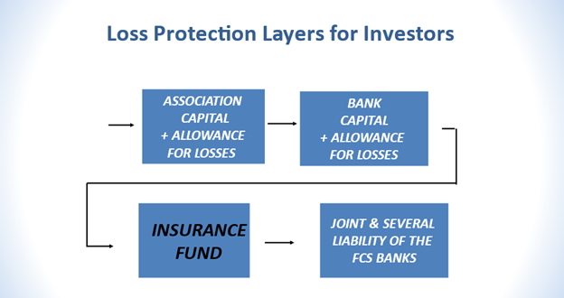

## Table of Contents

## What is the Federal Farm Credit System?

The Federal Farm Credit System, often just called the Farm Credit System, is a group of banks and associations that help farmers, ranchers, and other people in agriculture get loans and other financial services. It was created by the U.S. government a long time ago to make sure that people in farming have a reliable place to get money to buy land, equipment, and other things they need to run their farms.

The Farm Credit System works a bit like a big cooperative. This means that the people who borrow money from it also own part of it. It's made up of different parts, like banks that lend money directly to farmers and other banks that help those banks. This system helps keep farming strong in the United States by giving farmers the money they need to keep their farms going and growing.

## What is the history and evolution of the Federal Farm Credit System?

The Federal Farm Credit System started in 1916 when the U.S. government saw that farmers needed a reliable way to get loans. Before this, farmers often had trouble getting money from regular banks, which made it hard for them to buy land or equipment. So, the government created the Farm Credit System to help. It was set up as a network of banks and associations that would focus just on helping farmers and people in agriculture. This was a big deal because it meant farmers could borrow money more easily and at better rates.

Over the years, the Farm Credit System has changed and grown. In the 1930s, during the Great Depression, the system got bigger and stronger to help farmers even more. Later, in the 1980s, it faced some big challenges because many farmers were having a hard time paying back their loans. This led to some changes in how the system worked, making it more stable and efficient. Today, the Farm Credit System still helps farmers, but it also supports other parts of agriculture, like food processing and farm-related businesses. It continues to evolve to meet the changing needs of the farming community.

## Who can use the services provided by the Federal Farm Credit System?

The Federal Farm Credit System helps farmers, ranchers, and others who work in agriculture. This means if you grow crops, raise animals, or have a business that supports farming, you can use their services. They offer loans and other financial help to make sure you can buy what you need for your farm, like land, equipment, or seeds.

Besides farmers and ranchers, the Farm Credit System also helps people who work in related businesses. This includes people who process food, like turning milk into cheese, or those who sell farm equipment. If your work is connected to farming in some way, you might be able to get help from the Farm Credit System to grow your business.

## What types of loans and financial services does the Federal Farm Credit System offer?

The Federal Farm Credit System offers different kinds of loans to help farmers and people in agriculture. They have loans for buying land, which is really important because land can be very expensive. They also give loans for buying equipment, like tractors or harvesters, which farmers need to do their work. Another type of loan they offer is for operating expenses, which means money to buy seeds, fertilizer, or to pay for other costs that come up while running a farm. These loans help farmers keep their farms going and growing.

Besides loans, the Farm Credit System also provides other financial services. They can help with leasing equipment, which means farmers can use equipment without buying it outright. They also offer financial advice to help farmers plan and manage their money better. This can be really helpful for making sure a farm stays successful over time. By offering these services, the Farm Credit System helps make sure that farmers have what they need to keep farming and to support the agriculture industry.

## How is the Federal Farm Credit System structured and governed?

The Federal Farm Credit System is made up of different parts that work together to help farmers. At the top, there are four big banks called Farm Credit Banks. These banks don't lend money directly to farmers but help other parts of the system. The parts that do lend money directly to farmers are called associations. There are many associations spread out across the country, and each one works with farmers in its area. This setup helps make sure that farmers can get the money they need no matter where they are.

The Farm Credit System is governed by a group called the Farm Credit Administration (FCA). The FCA is like a boss that makes sure the system is working well and following the rules. It checks that the banks and associations are lending money safely and helping farmers the right way. The people who work at the FCA are chosen by the President of the United States and approved by the Senate. This helps make sure that the Farm Credit System is run fairly and keeps helping farmers for a long time.

## What is the role of the Farm Credit Administration in overseeing the Federal Farm Credit System?

The Farm Credit Administration (FCA) is like a supervisor for the Federal Farm Credit System. Its main job is to make sure that the system is working well and following all the rules. The FCA checks that the banks and associations in the Farm Credit System are lending money safely and helping farmers the right way. It does this by setting rules, doing regular check-ups, and making sure everyone is playing by the same rules.

The people who work at the FCA are chosen by the President of the United States and then approved by the Senate. This helps make sure that the FCA is run fairly and keeps the best interests of farmers in mind. By overseeing the Farm Credit System, the FCA helps make sure that farmers across the country can get the money they need to keep their farms going and growing.

## How does the Federal Farm Credit System support rural communities and agriculture?

The Federal Farm Credit System helps rural communities and agriculture by giving farmers and ranchers the money they need to keep their farms running. It offers loans for buying land, equipment, and other things farmers need to grow crops and raise animals. This makes it easier for farmers to start new projects or expand their farms, which helps keep the farming business strong. When farmers can borrow money easily, they can plan better and take care of their farms, which is good for the whole community.

Besides helping farmers directly, the Farm Credit System also supports other businesses that are important to rural areas. It gives loans to people who process food or sell farm equipment, which helps keep these businesses going. When these businesses do well, they create jobs and help the local economy grow. By supporting all parts of agriculture, the Farm Credit System makes sure that rural communities stay strong and can keep farming for a long time.

## What are the benefits of using the Federal Farm Credit System for farmers and ranchers?

Using the Federal Farm Credit System gives farmers and ranchers a lot of help. They can get loans to buy land, which is really important because land can be very expensive. They can also get loans to buy equipment like tractors or to pay for seeds and other things they need to run their farms. This makes it easier for farmers to start new projects or make their farms bigger. The Farm Credit System also gives good advice on how to manage money, which helps farmers plan better and keep their farms successful.

Another big benefit is that the Farm Credit System is set up just for farmers and people in agriculture. This means they understand the special needs of farming and can offer loans that fit those needs. Farmers also feel like they are part of a big team because the Farm Credit System works like a cooperative. This means that the people who borrow money from it also own part of it. This makes farmers feel supported and helps them trust that the system will keep helping them and their communities for a long time.

## How does the Federal Farm Credit System compare to other agricultural lending institutions?

The Federal Farm Credit System is different from other agricultural lending institutions because it was made just for farmers and people in agriculture. It gives loans that are made to fit the special needs of farming, like buying land or equipment. Other banks might not understand farming as well and might not give loans that are as good for farmers. The Farm Credit System also works like a cooperative, which means that the people who borrow money from it also own part of it. This makes farmers feel like they are part of a big team that is there to help them.

Other agricultural lending institutions, like regular banks or credit unions, might also give loans to farmers, but they often have different rules and might not focus only on agriculture. These places might have higher interest rates or need more paperwork, which can be hard for farmers. The Farm Credit System is set up to be easier for farmers to use and offers better terms because it understands the farming business. This makes it a better choice for many farmers who want to grow their farms and keep their communities strong.

## What are the current challenges and future prospects for the Federal Farm Credit System?

The Federal Farm Credit System faces some challenges today. One big challenge is that farming is changing. New technology and ways of farming mean farmers need different kinds of loans and help. The system has to keep up with these changes to stay useful. Another challenge is the economy. Sometimes, when the economy is not doing well, farmers have a harder time paying back their loans. This can make it tough for the Farm Credit System to keep lending money safely. Also, there are always new rules and laws that the system has to follow, which can be hard to keep up with.

Despite these challenges, the future looks bright for the Federal Farm Credit System. It has a strong history of helping farmers and is always working to get better. The system is good at changing with the times and finding new ways to help farmers. For example, it can start offering loans for new kinds of farming, like growing food inside buildings or using robots on farms. As long as the Farm Credit System keeps listening to farmers and understanding their needs, it will keep being a big help to agriculture and rural communities.

## How has the Federal Farm Credit System adapted to changes in agricultural practices and technology?

The Federal Farm Credit System has changed a lot to keep up with new ways of farming and new technology. When farmers started using more machines and computers on their farms, the Farm Credit System started giving loans for buying these things. They also began to offer money for new kinds of farming, like growing food inside buildings or using robots to help with farm work. By doing this, they make sure that farmers can use the latest tools to make their farms better.

The system also helps farmers learn about new technology. They give advice on how to use new machines and computers to plan and manage farms better. This is important because farming is always changing, and farmers need to keep up. By understanding what farmers need and helping them with new technology, the Farm Credit System stays useful and keeps supporting agriculture in new ways.

## What are the financial stability and risk management practices of the Federal Farm Credit System?

The Federal Farm Credit System works hard to stay financially stable and manage risks well. They do this by carefully checking who they lend money to and making sure those people can pay it back. They also keep a close eye on the economy and farming to see if anything might change that could affect their loans. By doing this, they can plan ahead and be ready for any problems that might come up. They also have rules about how much money they can lend and how much they need to keep in reserve, which helps them stay safe and strong.

Another way the Farm Credit System manages risk is by spreading out their loans to different kinds of farming and different areas of the country. This means if something bad happens in one place or with one type of farming, it won't hurt the whole system. They also use something called "stress testing," which is like practicing for hard times to see how they would handle it. By doing all these things, the Farm Credit System stays strong and keeps helping farmers even when times get tough.

## References & Further Reading

[1]: Garcia, P., Irwin, S. H., & Smith, A. (2014). ["The Role of Technology in the Evolving Agricultural Finance Sector."](https://scholar.google.com/citations?user=KjaK3DUAAAAJ&hl=en) Agricultural Finance Review, 74(3), 357-375.

[2]: Marcos López de Prado (2018). ["Advances in Financial Machine Learning."](https://www.amazon.com/Advances-Financial-Machine-Learning-Marcos/dp/1119482089) Wiley.

[3]: Chan, E. (2009). ["Quantitative Trading: How to Build Your Own Algorithmic Trading Business."](https://github.com/ftvision/quant_trading_echan_book) Wiley.

[4]: Jansen, S. (2020). ["Machine Learning for Algorithmic Trading."](https://github.com/stefan-jansen/machine-learning-for-trading) Packt Publishing.

[5]: U.S. Government Accountability Office (GAO). (2021). ["Farm Credit System: Capital Requirements and Standards Have a Limited Impact on Borrowers, but Actions Needed to Monitor Impacts of New Capital Rules."](https://www.gao.gov/products/gao-21-265)

[6]: Aronson, D. R. (2007). ["Evidence-Based Technical Analysis: Applying the Scientific Method and Statistical Inference to Trading Signals."](https://onlinelibrary.wiley.com/doi/book/10.1002/9781118268315) Wiley.

[7]: Keller, K. L. (2018). ["Algorithmic Trading and Artificial Intelligence in the Agricultural Commodity Markets."](https://www.researchgate.net/publication/378548435_Algorithmic_Trading_and_AI_A_Review_of_Strategies_and_Market_Impact) Journal of Agricultural and Resource Economics, 43(2), 315-332.