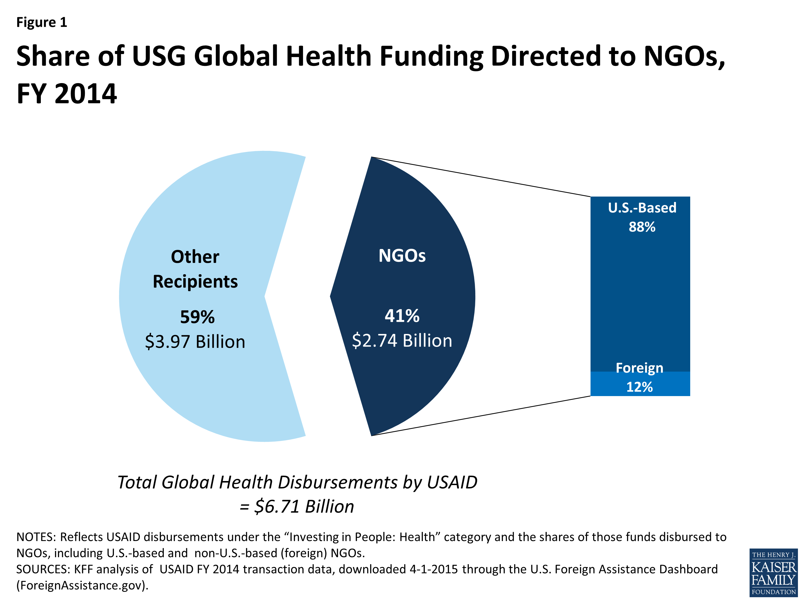

Non-Governmental Organizations (NGOs) serve as a crucial component of civil society, addressing a myriad of social, environmental, cultural, and humanitarian issues worldwide. These organizations operate independently from government establishments, relying primarily on donations, grants, and volunteer efforts to fulfill their mission-driven objectives. NGOs contribute significantly to areas such as poverty alleviation, education, health care, environmental protection, and human rights advocacy, often filling gaps left by governmental and commercial entities.

Governments recognize the indispensable role NGOs play and frequently provide support to these organizations, either directly or indirectly. This support can take various forms, including financial aid, in-kind assistance, regulatory enablement, and collaborative partnerships. In many countries, federal funding mechanisms exist to assist NGOs in their operations, providing them with the necessary resources and infrastructure support to achieve their goals. Such financial backing can often be pivotal, enabling NGOs to expand their impact and sustain their operations during challenging economic times.

The financial landscape for NGOs is continually evolving, with traditional funding approaches being augmented by innovative financial strategies and technologies. Given the competitive nature of grant applications and donor fatigue, NGOs are increasingly exploring diversified funding sources. Algorithmic trading is one such novel approach, emerging as a potential tool for enhancing the financial capacities of NGOs. By engaging in algorithmic trading, NGOs can potentially generate additional revenue streams, thus supplementing their traditional funding avenues. Algorithmic trading leverages sophisticated algorithms to execute trades at speeds and frequencies that are challenging for human traders, thereby offering the possibility of significant returns on investment if properly managed.

This article aims to explore the multifaceted landscape of NGO funding, focusing on the integration of government support, federal funding opportunities, and the innovative application of algorithmic trading. It seeks to provide a comprehensive overview of how these elements can be strategically leveraged to enhance the financial sustainability of NGOs. Through examining case studies and expert insights, this article will offer practical recommendations for NGOs looking to navigate the complexities of modern financial strategies while maintaining their essential mission-driven focus.

## Table of Contents

## Understanding Government Support for NGOs

Government support for Non-Governmental Organizations (NGOs) is a crucial aspect of the nonprofit sector, enabling these entities to operate effectively in areas like health, education, human rights, and the environment. Government support can be defined as any assistance provided by governmental bodies to NGOs, aiming to reinforce their capacity to execute socially beneficial programs. This support ranges from financial aid, such as grants and subsidies, to non-financial assistance, including training programs, tax exemptions, and access to public facilities.

Different types of government assistance are available to NGOs, often tailored to specific needs and goals. Financial aid is the most direct form, including project grants, operation grants, and matching funds earmarked for particular activities or operational costs. Tax incentives, such as deductions and exemptions, help NGOs reduce their operational expenses, allowing them to allocate more resources toward their mission-driven goals. Additionally, governments often provide technical support, which may involve training sessions, workshops, and access to governmental databases and infrastructure.

The importance of government support in sustaining NGO operations cannot be overstated. NGOs often operate in resource-constrained environments, and government support can be a vital lifeline that allows them to maintain and expand their activities. Financial contributions help bridge funding gaps, while non-financial support strengthens institutional capacity and operational effectiveness. This assistance not only improves the NGOs' ability to deliver services but also enhances their credibility and legitimacy, attracting further investment and collaboration from private donors and international organizations.

Several case studies underscore the beneficial impact of government support on NGOs. For instance, the Global Fund’s partnership with various governments has enabled numerous health-focused NGOs to scale up their programs, significantly reducing the prevalence of diseases like malaria and HIV in targeted regions. Similarly, government-backed environmental initiatives have empowered conservation NGOs to undertake more ambitious projects, resulting in better conservation outcomes and increased public awareness of environmental issues.

However, NGOs face several challenges in securing government support. Bureaucratic procedures and complex eligibility criteria can be significant hurdles, particularly for smaller organizations with limited administrative capacity. Additionally, competition for government funding is often intense, with many NGOs vying for limited resources. This environment can lead to compromise and mission drift as organizations may shape their programs to align with funding priorities rather than community needs. Furthermore, political instability and changes in government policy can affect the reliability and continuity of support, posing risks to long-term project planning and sustainability.

In summary, government support is indispensable for many NGOs, providing essential resources that enable them to fulfill their missions effectively. Despite the evident benefits, the route to obtaining such support is fraught with challenges that require strategic navigation to ensure sustained and impactful operations.

## Federal Funding Opportunities for NGOs

Federal funding provides critical support for Non-Governmental Organizations (NGOs) by offering essential financial resources to advance their missions. Federal grants, contracts, and cooperative agreements represent the primary forms of financial assistance available. Federal funding is often allocated through competitive grants, allowing NGOs to access levels of support tied to the organization's capability to meet specific government objectives and outcomes.

**Eligibility Criteria for NGOs to Access Federal Funding**

To qualify for federal funding, NGOs must meet specific eligibility requirements defined by federal agencies. Generally, these criteria involve organizational parameters such as the legal standing of the NGO (e.g., non-profit status), alignment with federal agency objectives, and specific capabilities to execute the proposed project. Agencies may require documentation describing the NGO's governance structure, project execution experience, and financial stability. These formal criteria ensure that only capable and mission-aligned organizations receive federal backing.

**The Process of Applying for and Securing Federal Funds**

The process to apply for federal funding typically involves several key steps, including identifying relevant funding opportunities, preparing a compelling grant proposal, and submitting the application through authorized channels such as Grants.gov. The grant proposal should provide a detailed project description, budget justification, timeline for execution, and evaluation plan. After submission, the application undergoes a rigorous review process usually involving panels of experts who assess the proposal based on technical merit, feasibility, and alignment with agency goals. Award decisions are communicated to applicants who then negotiate agreement terms with the funding agency. 

**Success Stories of NGOs Thriving with Federal Funding**

Numerous NGOs have effectively utilized federal funding to fulfill their missions and enhance their organizational impact. For example, the American Red Cross and Habitat for Humanity have benefited from substantial federal grants that facilitated disaster response initiatives. These organizations demonstrate the transformative potential of federal funding in scaling operations and expanding service delivery. Their success underscores the importance of strategic planning and organizational readiness in maximizing the benefits of federal support.

**Potential Pitfalls and Obstacles in Federal Funding Applications**

Despite the substantial benefits, NGOs face several challenges when accessing federal funding. Common obstacles include complex application processes, stringent compliance requirements, and intense competition for a limited pool of funds. Additionally, NGOs must maintain thorough records and documentation to meet government reporting and audit requirements, which can stretch administrative capacities. To navigate these pitfalls, NGOs often need to invest in organizational capacity building, including staff training on grant writing and compliance.

By understanding the nuances of federal funding, NGOs can better position themselves to secure financial resources that support their critical work, ultimately contributing to societal goals aligned with government priorities.

## Algorithmic Trading as a Financial Tool for NGOs

Algorithmic trading, the process of executing orders using automated and pre-programmed trading instructions, is increasingly being explored by Non-Governmental Organizations (NGOs) as a means to enhance financial resources. Traditionally utilized by financial institutions to maximize profit from stock market fluctuations, [algorithmic trading](/wiki/algorithmic-trading) offers NGOs a method to diversify and potentially increase their funding streams.

Algorithmic trading can supplement traditional funding sources for NGOs by providing an alternative revenue stream that can be less affected by the economic cycles influencing traditional donations or grants. By leveraging the power of modern computing and data analysis, NGOs can make informed decisions and engage in trading activities that bolster their financial standing. This innovative approach could allow NGOs to generate funds independently, reducing dependency on conventional fundraising methods which often involve significant time and effort.

Several NGOs have begun experimenting with algorithmic trading as part of their financial strategy. For instance, certain research-focused NGOs are exploring collaborations with financial experts to create algorithms that align with their ethical standards and organizational goals. This collaboration can yield customized trading strategies that generate revenue while adhering to the values and missions of the NGOs.

However, engaging in algorithmic trading is not without its risks and considerations for NGOs. The [volatility](/wiki/volatility-trading-strategies) of financial markets means that there is always a risk of financial loss, which can be detrimental to organizational stability. NGOs must also consider the ethical implications, ensuring that their trading activities do not conflict with their mission or values. Furthermore, the technical complexity associated with developing and maintaining trading algorithms requires expertise, which can necessitate additional investment in technology and human resources.

Looking ahead, the future prospects of algorithmic trading in NGO financial strategies are promising. With advancements in [artificial intelligence](/wiki/ai-artificial-intelligence) and [machine learning](/wiki/machine-learning), NGOs could potentially enhance their trading algorithms to optimize performance and adapt to market changes in real-time. Moreover, as financial technologies become more accessible, smaller NGOs may take advantage of these innovations, democratizing access to sophisticated financial tools. The integration of algorithmic trading into NGO operations could transform how these organizations sustain themselves financially, fostering a new era of financial independence and resilience. 

In conclusion, while algorithmic trading presents an intriguing opportunity for NGOs to diversify their funding sources, it requires careful consideration and strategic implementation. Balancing the potential financial benefits with associated risks and ethical implications will be crucial in harnessing the full potential of algorithmic trading within the NGO sector.

## Integrating Government Support, Federal Funding, and Algo Trading

Strategies for non-governmental organizations (NGOs) to effectively integrate government support, federal funding, and algorithmic trading are crucial in enhancing their financial stability and operational efficiency. By maximizing each of these distinct but complementary financial sources, NGOs can create a diversified funding portfolio that minimizes risk and maximizes impact.

### Optimizing Government Support and Federal Funding Through Technology

Technological advancements can significantly enhance an NGO's ability to manage and secure government support and federal funding. Financial technology (fintech) solutions offer NGOs the tools to streamline grant applications, improve financial management, and facilitate compliance with reporting requirements. For example, software tools can automate the collection and analysis of financial data, generating insights that can make grant applications more robust.

Furthermore, blockchain technology's potential in transparency can build trust among donors and stakeholders by ensuring that every dollar received and spent is tracked and verified. Blockchain can provide an immutable record of transactions, which is particularly useful when dealing with government contracts and federal funds. For example, smart contracts can automate the execution of donations or grants once predefined conditions are met, reducing administrative overhead and human error.

### Role of Financial Planning in Combining These Avenues Effectively

Effective financial planning is integral to balancing and optimizing the use of government support, federal funding, and algorithmic trading. NGOs should develop comprehensive financial plans that encompass budgeting, forecasting, and investment strategies. By incorporating scenario analysis and stress testing, NGOs can anticipate potential financial challenges and adapt their strategies accordingly. 

Algorithmic trading presents an additional layer to traditional financial planning by offering NGOs the potential to generate returns on existing capital. NGOs can allocate a defined portion of their endowments or reserves to algorithmic trading strategies, supplementing other funding sources. However, it is critical to establish risk management frameworks, such as VaR (Value at Risk) or Monte Carlo simulations, to understand potential losses and ensure alignment with the NGO's financial objectives.

### Case Studies on NGOs Successfully Integrating These Funding Strategies

Various NGOs have successfully combined government support, federal funding, and algorithmic trading to bolster their financial standing. For instance, a hypothetical case study might involve an NGO, "Health for All," leveraging a fintech platform to optimize its grant management process, leading to a 20% increase in successful grant applications. Concurrently, "Health for All" may allocate a part of its assets to algorithmic trading, realizing a 5% annual return that supplements their funding base, allowing for expanded healthcare programs.

### Expert Insights and Recommendations for NGOs

Experts recommend that NGOs prioritize transparency and compliance when integrating diverse funding sources. Establishing a multi-disciplinary team that includes financial analysts, legal advisors, and tech specialists can help NGOs navigate the complexities of these funding avenues. Regular audits and comprehensive reporting are also advised to maintain accountability and trust with stakeholders.

Additionally, experts underscore the importance of targeted training for staff to effectively leverage technology and financial tools. By building internal capacity, NGOs can be more agile and responsive to changing financial landscapes.

In conclusion, by integrating government support, federal funding, and algorithmic trading into a cohesive strategy, NGOs can enhance their financial resilience and operational capacity. Embracing technology and thorough financial planning will be critical to achieving sustainable growth and fulfilling their missions more effectively.

## Challenges and Ethical Considerations

Non-governmental organizations (NGOs) operate at the intersection of social impact and financial management. This dual focus often presents challenges, particularly when analyzing potential conflicts of interest within funding strategies. NGOs must navigate these challenges while maintaining their mission-driven goals and ethical standards.

**Conflicts of Interest in Funding Strategies**

Conflicts of interest may arise when the pursuit of diverse funding sources impacts the impartiality of an NGO's operations. For example, securing funding from entities with specific political or commercial interests can compromise an organization's mission. To mitigate these risks, NGOs should prioritize transparency, adopting conflict-of-interest policies that clearly delineate acceptable funding sources. Such policies should be supported by rigorous due diligence processes and stakeholder consultations.

**Ethical Considerations in Algorithmic Trading**

The integration of algorithmic trading as a financial tool presents unique ethical considerations. Algorithmic trading involves using computer programs to execute trades at high speeds and with minimal human intervention. While this may offer financial benefits, such as enhanced funding through investment gains, it also raises ethical issues related to market fairness and accountability. NGOs must ensure that their trading practices do not contribute to market manipulation or prioritize financial returns over social impact. Developing ethical guidelines that govern investment activities and align them with organizational values is critical.

**Transparency and Accountability**

Transparent reporting mechanisms are essential for maintaining accountability in the use of government and federal funding. NGOs should employ robust financial management systems that track fund allocation and utilization, ensuring that all activities align with the intended purposes. Regular audits and public disclosures enhance trust with donors, beneficiaries, and regulatory bodies. Furthermore, clear communication strategies about how funds are used help build confidence and reinforce the NGO's commitment to its mission.

**Risk Management in Financial Activities**

Adopting new financial technologies necessitates a comprehensive risk management framework. NGOs should conduct thorough risk assessments before implementing advanced financial techniques such as algorithmic trading. This includes evaluating potential technological failures, regulatory compliance issues, and market volatility impacts. Implementing risk mitigation strategies, such as diversified investment portfolios and contingency plans, can minimize potential adverse effects on the organization's financial health.

**Balancing Mission-Driven Goals with Financial Innovation**

NGOs must strike a balance between leveraging financial innovations and maintaining their core mission. While exploring diverse funding avenues can provide financial sustainability, it should not detract from the organization's primary goals. Strategic financial planning should align with the NGO's mission and values, ensuring that innovations in funding methods enhance rather than detract from their societal impact. This approach may include periodic reviews of financial strategies and their alignment with organizational objectives to maintain focus on delivering social value.

In conclusion, as NGOs continue to explore novel financial strategies, addressing potential conflicts of interest and ethical considerations becomes paramount. By implementing transparent, accountable, and ethically sound financial practices, NGOs can effectively balance their mission-driven goals with financial innovation, ensuring long-term sustainability and impact.

## Conclusion

Non-governmental organizations (NGOs) serve as crucial players in society, often addressing issues that government bodies may overlook or lack the resources to tackle independently. In the evolving landscape of NGO funding, government support, federal funding opportunities, and innovative financial strategies such as algorithmic trading have been highlighted as potential avenues to ensure financial sustainability.

Government support provides NGOs with vital backing through grants, subsidies, and policy advocacy, enhancing their ability to implement impactful programs. Similarly, federal funding offers a structured financial channel, supporting NGOs through competitive grant processes, which necessitate a thorough understanding of eligibility criteria and application procedures. While this funding is instrumental, challenges persist, including navigating bureaucratic complexities and meeting stringent accountability standards.

Algorithmic trading emerges as a modern financial tool that can supplement traditional funding sources. By leveraging technology, NGOs have the potential to generate additional revenue, thereby increasing financial resilience. However, this approach requires careful consideration of associated risks and ethical implications, given the volatile nature of trading markets.

As we look toward the future, the integration of diverse funding strategies presents both opportunities and challenges. A holistic approach, combining government support, federal funding, and algorithmic trading, can optimize an NGO's financial portfolio, provided there is robust financial planning and risk management in place. This synergy of traditional and modern funding methods offers a path toward greater sustainability, enabling NGOs to continue their mission-driven work in a rapidly changing world.

For NGOs, the imperative lies in exploring and adapting to these varied financial avenues, ensuring they remain viable amidst fluctuating economic conditions. This necessitates ongoing research and collaboration among stakeholders to refine funding strategies and develop best practices. By embracing innovation while maintaining transparency and accountability, NGOs can strengthen their impact, ultimately contributing to a more equitable and sustainable global society.

## References & Further Reading

[1]: Bergstra, J., Bardenet, R., Bengio, Y., & Kégl, B. (2011). ["Algorithms for Hyper-Parameter Optimization."](https://dl.acm.org/doi/10.5555/2986459.2986743) Advances in Neural Information Processing Systems 24.

[2]: ["Advances in Financial Machine Learning"](https://www.amazon.com/Advances-Financial-Machine-Learning-Marcos/dp/1119482089) by Marcos Lopez de Prado

[3]: ["Evidence-Based Technical Analysis: Applying the Scientific Method and Statistical Inference to Trading Signals"](https://www.amazon.com/Evidence-Based-Technical-Analysis-Scientific-Statistical/dp/0470008741) by David Aronson

[4]: ["Machine Learning for Algorithmic Trading"](https://github.com/stefan-jansen/machine-learning-for-trading) by Stefan Jansen

[5]: ["Quantitative Trading: How to Build Your Own Algorithmic Trading Business"](https://github.com/LucindaYa/quant-resources/blob/master/Quantitative%20Trading%20How%20to%20Build%20Your%20Own%20Algorithmic%20Trading%20Business.pdf) by Ernest P. Chan