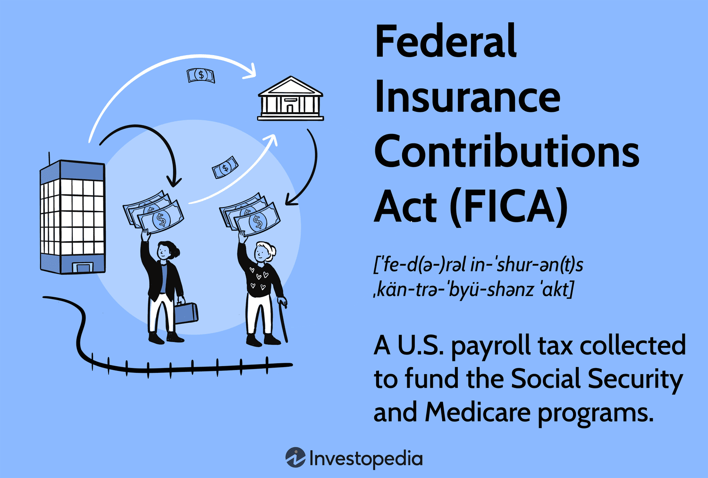

## Table of Contents

## What is the Federal Insurance Contributions Act (FICA)?

The Federal Insurance Contributions Act, or FICA, is a law in the United States that makes workers and their employers pay taxes to fund Social Security and Medicare. Social Security helps people when they retire or if they can't work because of a disability. Medicare helps pay for health care for people who are 65 or older, or who have certain disabilities. When you get a paycheck, you'll see that some money is taken out for FICA. This is usually about 7.65% of your earnings, split between 6.2% for Social Security and 1.45% for Medicare.

Employers also have to pay the same amount as the employee, so for every dollar you earn, a total of 15.3% goes to FICA. This money is sent to the government to help pay for these important programs. There's a limit on how much income is taxed for Social Security each year, but there's no limit for Medicare. If you earn a lot of money, you might have to pay an extra tax for Medicare, called the Additional Medicare Tax, which is 0.9% on earnings above a certain amount.

## What are the main components of FICA taxes?

FICA taxes have two main parts: Social Security and Medicare. Social Security is for helping people when they retire or if they can't work because of a disability. It takes 6.2% of your earnings up to a certain amount each year. This means that once you earn up to that limit, you don't pay Social Security tax on any more money you make that year. Medicare, on the other hand, helps pay for health care for people who are 65 or older, or who have certain disabilities. It takes 1.45% of all your earnings, no matter how much you make.

Both you and your employer pay into FICA. You pay 7.65% of your earnings, and your employer pays the same amount. So, for every dollar you earn, a total of 15.3% goes to FICA. If you earn a lot of money, you might also have to pay an extra tax for Medicare called the Additional Medicare Tax. This is an extra 0.9% on earnings above a certain amount. This helps make sure that Medicare has enough money to help people with their health care.

## Who is required to pay FICA taxes?

FICA taxes are paid by most people who work in the United States. If you have a job and get a paycheck, you will see money taken out for FICA. This includes people who work for someone else and also people who work for themselves, like freelancers or business owners. The money taken out is for Social Security and Medicare. Social Security helps people when they retire or if they can't work because of a disability. Medicare helps pay for health care for people who are 65 or older, or who have certain disabilities.

Both employees and employers have to pay FICA taxes. If you work for someone else, you pay 7.65% of your earnings, and your employer pays the same amount. So, for every dollar you earn, a total of 15.3% goes to FICA. If you work for yourself, you have to pay both parts, which is 15.3% of your earnings. Some people might not have to pay FICA taxes, like certain government workers or people who work in specific jobs. But for most workers, FICA taxes are something they have to pay.

## How are FICA taxes calculated?

FICA taxes are figured out based on how much money you earn. For people who work for someone else, they take out 7.65% of your earnings for FICA. This is split into 6.2% for Social Security and 1.45% for Medicare. Your boss also has to pay the same amount, so for every dollar you earn, a total of 15.3% goes to FICA. The Social Security part only applies up to a certain amount of money each year, called the wage base limit. Once you earn more than that limit, you don't pay Social Security tax on the extra money. But there's no limit for Medicare, so you keep paying that part no matter how much you earn.

If you earn a lot of money, you might have to pay an extra tax for Medicare called the Additional Medicare Tax. This is 0.9% on earnings above a certain amount. People who work for themselves have to pay both parts of FICA, which adds up to 15.3% of their earnings. They can take half of this as a deduction on their taxes, though. So, no matter if you work for someone else or yourself, FICA taxes are based on your earnings and help pay for Social Security and Medicare.

## What is the difference between the Social Security tax and the Medicare tax under FICA?

The Social Security tax and the Medicare tax are both parts of FICA, but they help with different things. The Social Security tax is 6.2% of your earnings and it helps people when they retire or if they can't work because of a disability. There's a limit on how much of your earnings are taxed for Social Security each year. This means once you earn up to that limit, you don't pay Social Security tax on any more money you make that year. This limit changes every year.

The Medicare tax is 1.45% of all your earnings, and it helps pay for health care for people who are 65 or older, or who have certain disabilities. Unlike the Social Security tax, there's no limit on how much of your earnings are taxed for Medicare. If you earn a lot of money, you might also have to pay an extra tax called the Additional Medicare Tax. This is 0.9% on earnings above a certain amount. So, while both taxes are part of FICA, they have different rates and rules.

## What are the current tax rates for Social Security and Medicare?

The current tax rate for Social Security is 6.2%. This means that if you work for someone else, they take out 6.2% of your earnings to help pay for Social Security. Social Security helps people when they retire or if they can't work because of a disability. There's a limit on how much of your earnings are taxed for Social Security each year. For example, in 2023, you only pay Social Security tax on the first $160,200 you earn. Once you earn more than that, you don't pay Social Security tax on the extra money.

The current tax rate for Medicare is 1.45%. This means that if you work for someone else, they take out 1.45% of all your earnings to help pay for Medicare. Medicare helps pay for health care for people who are 65 or older, or who have certain disabilities. Unlike Social Security, there's no limit on how much of your earnings are taxed for Medicare. If you earn a lot of money, you might also have to pay an extra tax called the Additional Medicare Tax. This is 0.9% on earnings above a certain amount.

## Are there any income limits for Social Security taxes?

Yes, there is an income limit for Social Security taxes. This limit is called the wage base limit. It means that you only pay Social Security tax on your earnings up to a certain amount each year. For example, in 2023, the wage base limit is $160,200. This means if you earn more than $160,200, you don't pay Social Security tax on the money you earn above that limit.

There is no income limit for Medicare taxes. No matter how much money you make, you have to pay Medicare tax on all of your earnings. The Medicare tax rate is 1.45%. If you earn a lot of money, you might also have to pay an extra tax called the Additional Medicare Tax. This extra tax is 0.9% on earnings above a certain amount.

## How do employers handle FICA tax withholding?

Employers handle FICA tax withholding by taking money out of their employees' paychecks every pay period. They take out 6.2% of the employee's earnings for Social Security and 1.45% for Medicare. This adds up to 7.65% of the employee's pay. The employer also has to pay the same amount, so for every dollar an employee earns, a total of 15.3% goes to FICA. Employers keep track of these amounts and make sure to send the money to the government on time.

Employers have to follow the rules set by the IRS about how much to withhold and when to send the money. They usually send the withheld taxes to the government either monthly or semi-weekly, depending on how much they owe. Employers also need to report the FICA taxes they withheld on the employee's W-2 form at the end of the year. This helps the employee know how much was taken out of their pay for Social Security and Medicare taxes.

## What happens if an employer fails to withhold or pay FICA taxes?

If an employer fails to withhold or pay FICA taxes, they can get into big trouble with the government. The IRS, which is the part of the government that deals with taxes, can charge the employer with penalties and fines. These penalties can be a lot of money, and they can add up quickly. The employer might also have to pay interest on the money they owe. If the employer keeps not paying, the IRS might take legal action against them, which could mean going to court or even having their business shut down.

The employees might also be affected if their employer doesn't withhold or pay FICA taxes. Even though the employer didn't take the money out of their paychecks, the employees still have to pay their part of the FICA taxes when they file their own taxes. This can be a surprise and a big problem for the employees because they might not have the money set aside to pay these taxes. It's really important for employers to follow the rules and make sure they withhold and pay FICA taxes on time to avoid these problems.

## Can self-employed individuals be subject to FICA taxes, and if so, how?

Yes, self-employed individuals have to pay FICA taxes too. When you work for yourself, you don't have an employer to take out the money for FICA taxes from your paycheck. Instead, you have to pay both the employee part and the employer part of the FICA taxes. This means you pay 15.3% of your earnings for FICA. This includes 12.4% for Social Security and 2.9% for Medicare.

The good news is that self-employed people can take half of what they pay in FICA taxes as a deduction on their income taxes. This can help lower the amount of income tax they have to pay. Self-employed individuals report and pay their FICA taxes when they file their annual tax return, usually on Schedule SE of their Form 1040. It's important for self-employed people to keep good records of their earnings and to pay their FICA taxes on time to avoid penalties from the IRS.

## What are the potential penalties for not complying with FICA tax obligations?

If someone doesn't pay their FICA taxes, they can get into big trouble with the government. The IRS, which handles taxes, can charge them with penalties and fines. These penalties can be a lot of money and can grow quickly. The person might also have to pay interest on the money they owe. If they keep not paying, the IRS might take them to court or even shut down their business.

For employees, if their boss doesn't take out FICA taxes from their paychecks, they still have to pay their part of the FICA taxes when they file their own taxes. This can be a big surprise and a problem because they might not have the money saved up to pay these taxes. It's really important for everyone to follow the FICA tax rules to avoid these problems and keep the Social Security and Medicare programs running smoothly.

## How have FICA tax rates and policies changed historically, and what future changes might be anticipated?

FICA tax rates and policies have changed a few times since they started. When FICA first began in 1937, the Social Security tax rate was just 1% on the first $3,000 of earnings for both the employee and the employer. Over the years, this rate went up, and the amount of earnings that were taxed also grew. By the 1990s, the Social Security tax rate was 6.2% for both employees and employers, and it has stayed the same since then. The Medicare tax started in 1966 at 0.35% on the first $6,600 of earnings. This rate also went up over time, and since 1991, it has been 1.45% on all earnings with no limit. In 2013, they added the Additional Medicare Tax of 0.9% for people who earn a lot of money.

Looking ahead, there might be changes to FICA taxes because of worries about how to keep Social Security and Medicare going strong in the future. As people live longer and the population gets older, more money might be needed to keep these programs running. Some ideas for changes include raising the Social Security tax rate, lifting or getting rid of the wage base limit for Social Security, or increasing the Medicare tax rate. There's also talk about changing the retirement age or how benefits are calculated. Any changes would need to be approved by Congress, so it's hard to say exactly what will happen, but it's important to keep an eye on these discussions because they could affect how much people pay in FICA taxes and what benefits they get.

## References & Further Reading

[1]: ["The Basics of FICA And How It Is Calculated"](https://www.nerdwallet.com/article/taxes/fica-tax-withholding) by Julia Kagan, Investopedia

[2]: ["Algorithmic Trading and its Tax Implications"](https://www.investopedia.com/articles/active-trading/101014/basics-algorithmic-trading-concepts-and-examples.asp) by Green Trader Tax

[3]: ["Algorithmic Trading: Winning Strategies and Their Rationale"](https://www.wiley.com/en-us/Algorithmic+Trading%3A+Winning+Strategies+and+Their+Rationale-p-9781118460146) by Ernest Chan

[4]: ["Social Security: A Comprehensive Guide"](https://www.ssa.gov/pubs/EN-05-10024.pdf) by the Social Security Administration

[5]: ["Federal Income Tax and Social Security and Medicare Tax Withholding"](https://www.thebalancemoney.com/tax-withholding-on-wage-income-3192941) by Internal Revenue Service

[6]: ["Retirement Planning and 401(k)s"](https://www.investopedia.com/articles/retirement/08/401k-info.asp) by Julia Kagan, Investopedia

[7]: ["Machine Learning for Algorithmic Trading"](https://github.com/stefan-jansen/machine-learning-for-trading) by Stefan Jansen