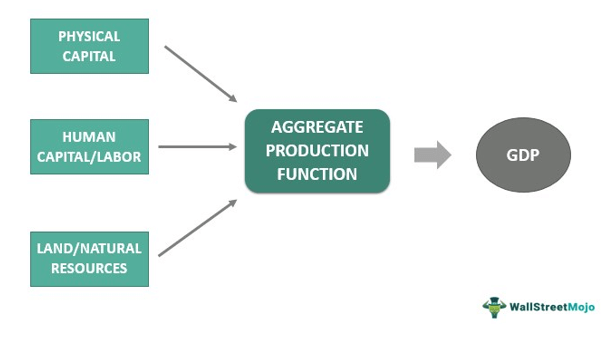

## Table of Contents

## What is the Federal Land Bank?

The Federal Land Bank is a type of bank in the United States that helps farmers and people who own land. It gives them loans to buy land, improve their farms, or pay off debts. These banks are part of the Farm Credit System, which was created to support agriculture and rural communities.

The Federal Land Banks were started in 1916 to help farmers during tough times. They offer long-term loans with lower interest rates than many other banks. This makes it easier for farmers to manage their money and keep their farms running smoothly.

## What is the primary function of the Federal Land Bank?

The main job of the Federal Land Bank is to give loans to farmers and landowners. These loans help them buy land, make their farms better, or pay off other debts. The Federal Land Banks are part of the Farm Credit System, which was set up to help people in farming and rural areas.

These banks started in 1916 to help farmers when times were tough. They offer long-term loans with lower interest rates than many other banks. This makes it easier for farmers to handle their money and keep their farms going strong.

## How does the Federal Land Bank support agriculture?

The Federal Land Bank helps farmers by giving them loans to buy land or improve their farms. These loans have lower interest rates, which means farmers don't have to pay back as much money over time. This makes it easier for farmers to manage their money and keep their farms running well. The Federal Land Bank is part of the Farm Credit System, which was created to help people in farming and rural areas.

These banks started in 1916 when times were tough for farmers. By offering long-term loans, the Federal Land Bank helps farmers plan for the future without worrying too much about immediate debts. This support is important because it allows farmers to focus on growing crops and raising animals, which helps the whole agriculture industry.

## What are the eligibility criteria for borrowing from the Federal Land Bank?

To borrow from the Federal Land Bank, you need to be involved in farming or own land that can be used for farming. This means you could be a farmer, a rancher, or someone who owns land in a rural area. The bank wants to make sure that the money they lend will be used to help agriculture and rural communities.

The Federal Land Bank also looks at your ability to pay back the loan. They will check your financial situation, like your income and any other debts you have. They want to make sure you can handle the loan payments over time. If you meet these criteria, you can apply for a loan to buy land, improve your farm, or pay off other debts.

## How does the loan application process work at the Federal Land Bank?

To apply for a loan at the Federal Land Bank, you first need to gather all your financial information. This includes your income, any other debts you have, and details about the land or farm you want to buy or improve. You can then contact the Federal Land Bank or a local Farm Credit office to start the application process. They will give you an application form to fill out with your personal and financial details.

Once you submit your application, the bank will review it to see if you meet their criteria. They will check your ability to repay the loan by looking at your income and other financial commitments. If everything looks good, they might ask for more documents or even visit your farm to see it in person. If your application is approved, the bank will work with you to finalize the loan terms and get the money to you so you can use it for your farming needs.

## What types of loans does the Federal Land Bank offer?

The Federal Land Bank offers long-term loans to help farmers and landowners. These loans are mainly for buying land or making big improvements on farms. They have lower interest rates than many other banks, which makes it easier for farmers to pay back the money over time. This type of loan is perfect for farmers who need to plan for the future and want to keep their farms growing.

Besides long-term loans for land and improvements, the Federal Land Bank might also offer loans to help farmers pay off other debts. These loans can give farmers some breathing room by combining their debts into one easier-to-manage payment. By doing this, the bank helps farmers focus on their work without worrying too much about their finances.

## How are interest rates determined for Federal Land Bank loans?

The Federal Land Bank decides interest rates based on many things. They look at the overall economy, how much money they can borrow, and what other banks are charging for similar loans. They also think about how risky it is to lend money to a specific farmer. If the farmer has a good history of paying back loans and a strong financial situation, the [interest rate](/wiki/interest-rate-trading-strategies) might be lower. But if the farmer's situation is more risky, the interest rate could be higher to cover that risk.

These interest rates are usually lower than what you would find at regular banks. This is because the Federal Land Bank is part of the Farm Credit System, which is set up to help farmers and rural communities. By offering lower rates, the bank helps farmers save money on their loans. This makes it easier for them to manage their farms and keep their businesses running smoothly.

## What is the role of the Federal Land Bank in rural development?

The Federal Land Bank plays a big role in helping rural areas grow and develop. They do this by giving loans to farmers and landowners. These loans help people buy land or make their farms better. When farmers can get these loans, they can grow more food and make their farms stronger. This helps the whole rural community because a strong farming industry means more jobs and more money flowing into the area.

The bank also helps rural development by offering loans at lower interest rates. This means farmers don't have to pay back as much money over time, which makes it easier for them to keep their farms going. When farms do well, the people in rural areas can build better schools, roads, and other important things. The Federal Land Bank has been doing this since 1916, always working to make life better for people in the countryside.

## How does the Federal Land Bank manage risk and ensure loan repayment?

The Federal Land Bank manages risk and ensures loan repayment by carefully checking the financial situation of each borrower. They look at things like the farmer's income, other debts, and the value of the land or farm they want to buy or improve. If a farmer has a good history of paying back loans and a strong financial situation, the bank feels more confident that the loan will be repaid. They might also visit the farm to see it in person and make sure the plans for using the loan make sense.

To further manage risk, the Federal Land Bank might ask for something called collateral. This means that if the farmer can't pay back the loan, the bank can take the land or other assets to cover the money they lent. By doing this, the bank protects itself from losing money. They also keep an eye on the economy and adjust interest rates to make sure they can lend money safely. All these steps help the bank support farmers while also making sure they get their money back.

## What is the historical performance of the Federal Land Bank in terms of loan defaults and recoveries?

The Federal Land Bank has a good history when it comes to loan defaults and recoveries. Since it started in 1916, the bank has worked hard to make sure farmers can pay back their loans. They do this by checking the farmer's financial situation carefully before giving out a loan. This helps keep the number of loan defaults low. Even when there are defaults, the bank uses the land or other assets as collateral to recover the money they lent. This careful approach has helped the bank maintain a strong record of loan recoveries over the years.

During tough times, like the Great Depression and the farm crisis of the 1980s, the Federal Land Bank faced more challenges with loan defaults. However, the bank was able to adapt by working with farmers to restructure loans and find ways to keep farms running. These efforts helped many farmers stay afloat and eventually pay back their loans. Overall, the Federal Land Bank's focus on supporting agriculture and rural communities has been key to its success in managing loan defaults and ensuring recoveries.

## How does the Federal Land Bank interact with other financial institutions and government agencies?

The Federal Land Bank works closely with other financial institutions and government agencies to help farmers and rural communities. It is part of the Farm Credit System, which is a network of banks and associations that all work together to support agriculture. The Federal Land Bank gets money from investors and other banks to lend to farmers. It also works with the U.S. Department of Agriculture (USDA) to make sure its loans follow the rules and help farmers in the best way possible.

Sometimes, the Federal Land Bank teams up with other banks or government programs to offer special loans or help farmers in tough times. For example, during a drought or a big drop in crop prices, the bank might work with the USDA to give farmers more time to pay back their loans or to get emergency funds. By working together, the Federal Land Bank and these other groups can make sure farmers have the support they need to keep their farms going strong.

## What future challenges and opportunities does the Federal Land Bank face in the evolving agricultural sector?

The Federal Land Bank faces several challenges as the agricultural sector changes. One big challenge is dealing with new technology and farming methods. As farms use more high-tech tools and sustainable practices, the bank needs to understand these changes to keep giving good loans. Another challenge is climate change, which can make farming harder with more droughts or floods. The bank needs to help farmers get through these tough times by offering loans that can handle these new risks. Also, as farms get bigger and more complex, the bank has to make sure its loan processes can keep up with these changes.

But there are also many opportunities for the Federal Land Bank. One big opportunity is helping farmers use new technology to grow more food in a better way. The bank can offer loans for things like smart farming equipment or renewable energy systems on farms. Another opportunity is working with young farmers who want to start their own farms. By giving them loans and support, the bank can help bring new ideas and energy into farming. Overall, by staying flexible and working closely with farmers, the Federal Land Bank can keep helping agriculture grow and change for the better.

## References & Further Reading

[1]: ["A Century of Farm Credit: A History of the Farm Credit System"](https://farmcredit.com/about-us/history/) by Farm Credit Council

[2]: Bergstra, J., Bardenet, R., Bengio, Y., & Kégl, B. (2011). ["Algorithms for Hyper-Parameter Optimization."](https://dl.acm.org/doi/10.5555/2986459.2986743) Advances in Neural Information Processing Systems 24.

[3]: ["Advances in Financial Machine Learning"](https://www.amazon.com/Advances-Financial-Machine-Learning-Marcos/dp/1119482089) by Marcos Lopez de Prado

[4]: ["Evidence-Based Technical Analysis: Applying the Scientific Method and Statistical Inference to Trading Signals"](https://www.amazon.com/Evidence-Based-Technical-Analysis-Scientific-Statistical/dp/0470008741) by David Aronson

[5]: ["Machine Learning for Algorithmic Trading"](https://github.com/stefan-jansen/machine-learning-for-trading) by Stefan Jansen

[6]: ["Quantitative Trading: How to Build Your Own Algorithmic Trading Business"](https://github.com/LucindaYa/quant-resources/blob/master/Quantitative%20Trading%20How%20to%20Build%20Your%20Own%20Algorithmic%20Trading%20Business.pdf) by Ernest P. Chan

[7]: Farm Credit Administration. (n.d.). ["About FCA."](https://www.fca.gov/about/about)