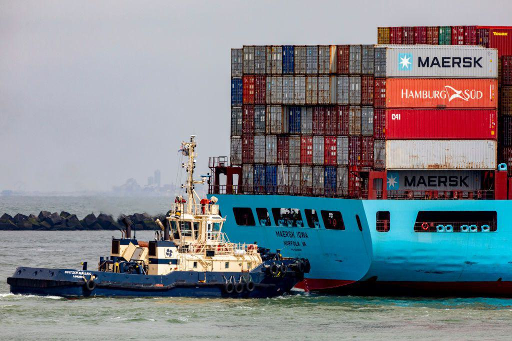

The maritime industry is a cornerstone of global trade and economic vitality, facilitating the movement of goods across the world's oceans. This expansive network is governed by a complex framework of regulations designed to ensure smooth and efficient operations. At the forefront of these regulatory efforts is the Federal Maritime Commission (FMC), a pivotal agency committed to upholding fairness and reliability in ocean transportation. The FMC's role is crucial in safeguarding the interests of U.S. businesses and consumers by promoting a competitive ocean transportation supply system.

The intricacies of maritime law and the impact of various legislative measures offer a comprehensive insight into the FMC's historical evolution and its functions in overseeing the international shipping industry. From its origins rooted in early 20th-century reforms to adapting modern challenges, the FMC has continuously modified its approach in response to evolving industry needs. The emergence of technological advancements, notably algorithmic trading, interlinks with maritime operations, promising to optimize logistics and operational efficiency. These innovations highlight the ever-transforming landscape of international shipping and the necessity for updated regulatory frameworks.

As global commerce progresses, understanding the interplay between regulatory agencies like the FMC and shipping advancements is essential in navigating the challenges and opportunities within the maritime sector. This examination underscores the importance of maintaining robust maritime laws to support a resilient international shipping system.

## Table of Contents

## Understanding the Federal Maritime Commission

The Federal Maritime Commission (FMC) is an independent United States federal agency responsible for regulating international ocean transportation. Established to ensure that U.S. businesses, consumers, and taxpayers benefit from a competitive and efficient ocean transportation supply system, the FMC plays a crucial role in setting and enforcing maritime regulations.

The core mission of the FMC is to protect the interests of U.S. maritime businesses and consumers by promoting fairness and competition within the ocean transportation industry. To achieve these objectives, the FMC operates under the governance of five commissioners. These commissioners are appointed by the President of the United States and serve staggered five-year terms, maintaining a structure that supports bipartisanship and balanced decision-making. This leadership framework ensures that the FMC can effectively govern and react to changes and challenges within the industry.

The FMC's primary responsibilities include reviewing agreements among ocean carriers and marine terminal operators to ensure they do not result in unfair pricing or reduced service quality. By analyzing these agreements, the FMC ensures that competitive practices are upheld, preventing monopolistic behaviors that could harm the market and consumers. Additionally, the FMC manages the resolution of disputes between various parties in the maritime sector. This function is pivotal in maintaining order and reducing litigation instances, contributing to smoother operations and interactions among carriers, operators, and shippers.

Moreover, the FMC possesses the authority to impose penalties on unfair or deceptive practices that adversely affect U.S. shippers. This regulatory power is essential for safeguarding the competitive landscape and ensuring that U.S. shippers are not disadvantaged by unscrupulous activities. By monitoring and mitigating such practices, the FMC upholds a standard of fairness that is crucial for the reliability and stability of the maritime transportation system.

Through these mechanisms and regulatory frameworks, the FMC continues to support and enhance the efficiency, reliability, and competitiveness of ocean transportation, aligning with broader economic interests and international trade standards.

## History of the Federal Maritime Commission

The Federal Maritime Commission (FMC) traces its historical roots back to the World War I era with the establishment of the United States Shipping Board, established under the Shipping Act of 1916. This initial entity was created to address the burgeoning demands of international shipping and regulate the U.S. maritime sector. The Shipping Board's primary mission was to enhance the country's shipping capabilities and expand its merchant fleet during a period characterized by global upheaval.

Over the subsequent decades, the regulatory landscape of maritime activities witnessed substantial transformations. As the shipping industry grew increasingly complex, the need for a more cohesive regulatory framework became evident. This evolution led to the inception of the Federal Maritime Board under the U.S. Department of Commerce. This transition represented an effort to centralize authority and enhance the governance of maritime affairs.

In 1961, a significant shift occurred when President John F. Kennedy established the Federal Maritime Commission as an independent federal agency. This reorganization aimed to sharpen the focus on regulating ocean shipping activities, detaching maritime oversight from the broader commercial interests handled by the Department of Commerce. This move was emblematic of the broader administrative reforms taking place during the Kennedy administration, emphasizing efficiency and specialization.

The period during which the FMC came into existence coincided with the advent of containerization, a groundbreaking development that transformed global trade by significantly enhancing logistical efficiency. Containerization introduced a standardized method for cargo transport, drastically reducing shipping times and costs. By the 1960s, this innovation had begun revolutionizing maritime logistics, necessitating an adaptable regulatory body to manage the industry's rapid transformation.

Since its establishment, the FMC has consistently adapted to significant industry changes, maintaining its pivotal role in fostering fair maritime commerce. Through various legislative and policy reforms, the agency has navigated the challenges posed by technological advancements and shifts in global trade dynamics. Today, the FMC continues to play a crucial role in ensuring a competitive and fair ocean transportation system, aligning its regulatory responsibilities with the ever-evolving needs of the maritime industry.

## Key Statutes and Reforms

The Shipping Act of 1984 significantly modernized maritime laws to better suit evolving shipping practices during a critical period of transformation within the industry. This act facilitated a shift from tightly regulated shipping frameworks to more flexible operational models, introducing crucial concepts such as contract carriage and tariff revitalization. These elements allowed carriers greater freedom to negotiate service contracts directly with shippers, leading to more tailored and efficient service provisioning.

In 1988, the Foreign Shipping Practices Act was enacted to provide the Federal Maritime Commission (FMC) with the authority to counteract unfair practices by foreign shipping entities that affected U.S. carriers. This legislation sought to ensure a level playing field by empowering the FMC to investigate and address restrictive foreign policies that hampered fair competition for American shipping companies, thereby protecting national economic interests.

The Ocean Shipping Reform Act of 1998 marked another pivotal change by further deregulating the industry and promoting competitive practices. This act allowed for private rate negotiations between shippers and carriers, reducing the emphasis on public tariffs and encouraging market-driven pricing mechanisms. This deregulatory approach aimed to enhance efficiency and responsiveness to market demands.

In response to contemporary challenges, recent legislative efforts, exemplified by the Ocean Shipping Reform Act of 2021, have been introduced. This legislation aims to address issues such as supply chain disruptions and unfair international practices that emerged in the context of a globalized trade environment. By focusing on modern challenges, the act reflects the ongoing adaptation of maritime laws to current economic conditions and technological advancements.

Collectively, these legislative measures highlight the dynamic nature of maritime regulation, aimed at fostering a competitive, fair, and resilient ocean transportation system. The constant evolution of these laws underscores the sector's responsiveness to global economic shifts and its commitment to balancing market needs with regulatory oversight.

## Algorithmic Trading and the Maritime Industry

Algorithmic trading, a technique once predominantly associated with financial markets, is increasingly being adopted within the maritime industry to enhance efficiency and optimize logistical operations. By utilizing complex data algorithms, shipping companies can make real-time decisions that improve route planning and reduce operational costs. These sophisticated algorithms analyze vast amounts of data, such as weather conditions, fuel prices, and shipping demand, to devise optimal transportation routes, schedules, and resource allocations. This not only helps in minimizing delays but also in avoiding potential hazards along maritime routes.

The integration of [algorithmic trading](/wiki/algorithmic-trading) approaches within the maritime sector aligns with the Federal Maritime Commission's (FMC) mission to enhance transparency and competition. By facilitating data-driven decision-making, these advancements support more competitive pricing and service offerings among shipping companies, potentially benefiting consumers and U.S. businesses alike by ensuring more reliable and cost-effective ocean transportation services.

However, the adoption of algorithmic solutions within maritime logistics brings forth a series of new regulatory challenges. The complexity and opacity of algorithms make it difficult to ensure compliance with existing maritime laws, and there is concern that without adequate oversight, they could facilitate anti-competitive practices or undermine market fairness. These challenges underscore the pressing need for updated regulatory frameworks. Such frameworks would aim to monitor and guide the use of algorithm-driven tools in the maritime industry, ensuring they operate within the bounds of fair competition regulations while safeguarding the interests of diverse stakeholders.

As the maritime industry continues to evolve with technological advancements, establishing robust guidelines for algorithmic applications becomes critical. This regulatory evolution is essential to harness the full potential of algorithmic trading in maritime logistics while maintaining transparency, competition, and fairness within the sector.

## Conclusion

The Federal Maritime Commission (FMC) is a vital entity in managing the intricate relationships between maritime law and global commerce. With a strong historical foundation, the commission has effectively evolved, continually adapting its strategies and regulations to ensure fair practices and protect the interests of the United States in the ever-changing international shipping landscape. The FMC's adaptability is evident in its response to recent reforms and technological advancements, such as algorithmic trading, which are reshaping the maritime industry. 

Algorithmic trading exemplifies the transformative impact of technology, offering significant improvements in efficiency and transparency within the maritime sector. By leveraging data-driven algorithms, shipping companies can optimize routes, reduce operational costs, and enhance competitiveness. This innovation aligns with the FMC's mission to promote a fair ocean transportation supply system. However, it also introduces new regulatory challenges that require the FMC to continually adjust its policies and frameworks.

As global trade dynamics evolve, the FMC, along with maritime law, will play an increasingly pivotal role in shaping a robust and equitable ocean transportation system. The commission's ability to adapt and reform in the face of rapidly shifting industry trends is crucial for maintaining this balance. Ongoing policy adjustments and regulatory updates will be essential to support the growth and resilience of international shipping, ensuring that it remains fair and beneficial for all stakeholders involved.

## References & Further Reading

[1]: ["The Federal Maritime Commission: Law, Policy, and Politics"](https://www.fmc.gov/) by Peter L. Schuyler

[2]: "An Overview of the Shipping Act of 1984 and 1998 Reforms." Federal Maritime Commission. [Link](https://transportationgo.com/daniel-maffei/)

[3]: "Federal Maritime Commission Report: Annual Update and Industry Overview." Federal Maritime Commission. [Link](https://www.usajobs.gov/job/824886800)

[4]: Rodrigue, J-P., & Notteboom, T. (2010). ["Containerization in Modern Shipping."](https://www.researchgate.net/profile/Theo-Notteboom/publication/5223520_Containerisation_Box_Logistics_and_Global_Supply_Chains_The_Integration_of_Ports_and_Liner_Shipping_Networks/links/0c96052f1e86fb9420000000/Containerisation-Box-Logistics-and-Global-Supply-Chains-The-Integration-of-Ports-and-Liner-Shipping-Networks.pdf) In A Handbook of Transport Economics.

[5]: Francis, L. D. (2021). ["Algorithmic Trading in Real-World Markets: An Overview"](https://www.researchgate.net/publication/378287610_Machine_learning_in_financial_markets_A_critical_review_of_algorithmic_trading_and_risk_management) in The Handbook of Computational Finance and Econometrics. Springer.