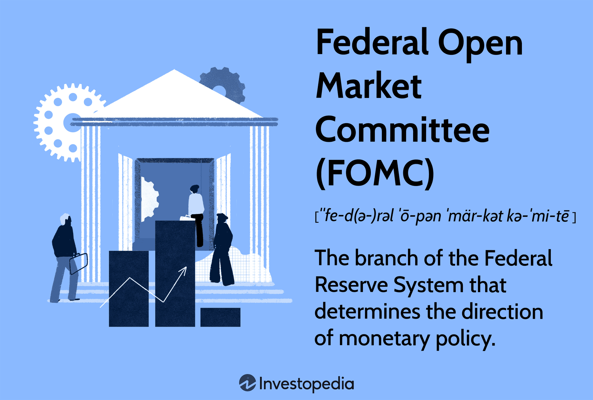

## Table of Contents

## What is the Federal Open Market Committee (FOMC)?

The Federal Open Market Committee (FOMC) is a part of the Federal Reserve System in the United States. It is a group of people who meet regularly to make decisions about the country's monetary policy. The main thing they do is decide how much it should cost banks to borrow money from each other. This cost is called the federal funds rate. By changing this rate, the FOMC can influence the economy, making it grow faster or slower depending on what is needed.

The FOMC meets eight times a year to talk about the economy and decide on the federal funds rate. They look at things like inflation, employment, and how fast the economy is growing. If they think the economy is growing too fast and might cause prices to go up too much, they might raise the federal funds rate to slow things down. If the economy is not doing well, they might lower the rate to help it grow. Their decisions affect everyone, from big businesses to regular people, because changes in the federal funds rate can influence interest rates on loans and savings accounts.

## What is the primary function of the FOMC?

The main job of the Federal Open Market Committee (FOMC) is to set the federal funds rate. This is the interest rate that banks charge each other for overnight loans. By changing this rate, the FOMC can control how much money is flowing through the economy. If they want to slow down the economy and keep prices from rising too fast, they might raise the federal funds rate. If they want to help the economy grow, especially when it's not doing well, they might lower the rate.

The FOMC meets eight times a year to talk about the economy and make decisions. They look at things like inflation, how many people have jobs, and how fast the economy is growing. Based on this information, they decide if they should change the federal funds rate. Their decisions are important because they affect everyone. When the federal funds rate changes, it can change the interest rates on loans and savings accounts that people and businesses use every day.

## Who are the members of the FOMC?

The Federal Open Market Committee (FOMC) has twelve members. Seven of these members are the members of the Board of Governors of the Federal Reserve System. These governors are appointed by the President of the United States and confirmed by the Senate. They serve long terms, usually 14 years, to make sure the Federal Reserve stays independent and can focus on long-term goals for the economy.

The other five members of the FOMC are presidents of the twelve Federal Reserve Banks. But not all of them get to vote at every meeting. Only the president of the Federal Reserve Bank of New York always gets a vote. The other four voting spots rotate among the presidents of the other eleven Federal Reserve Banks. This rotation happens every year, so different bank presidents get a chance to vote and share their views on the economy.

## How often does the FOMC meet?

The FOMC meets eight times a year. These meetings happen about every six weeks. During these meetings, they talk about the economy and decide if they should change the federal funds rate.

At these meetings, the FOMC looks at things like inflation, how many people have jobs, and how fast the economy is growing. They use this information to decide if they need to make the federal funds rate higher or lower. Their decisions can affect everyone because they influence the interest rates on loans and savings accounts.

## What is the significance of the FOMC's interest rate decisions?

The FOMC's [interest rate](/wiki/interest-rate-trading-strategies) decisions are very important because they affect the whole economy. When the FOMC changes the federal funds rate, it changes how much it costs banks to borrow money from each other. This change can make other interest rates go up or down too, like the rates on loans for cars, houses, or credit cards, and the rates on savings accounts. If the FOMC raises the rate, borrowing money becomes more expensive, which can slow down the economy. This might help to stop prices from going up too fast, which is called inflation. On the other hand, if the FOMC lowers the rate, borrowing becomes cheaper, which can help the economy grow faster, especially when it's not doing well.

These decisions by the FOMC don't just affect big businesses or banks; they impact everyday people too. For example, if interest rates go up, people might decide to buy less because loans are more expensive. This can affect how much money people spend and how businesses do. If rates go down, people might feel more confident to borrow money for big purchases like a house or a car, which can help the economy grow. The FOMC tries to balance these effects to keep the economy stable, making sure it grows at a healthy pace without causing too much inflation.

## How does the FOMC influence monetary policy?

The FOMC influences monetary policy mainly by setting the federal funds rate. This is the interest rate that banks charge each other for overnight loans. When the FOMC changes this rate, it affects how much money is moving around in the economy. If they raise the rate, borrowing money becomes more expensive, which can slow down the economy and help control inflation. If they lower the rate, borrowing becomes cheaper, which can help the economy grow faster, especially when it's not doing well.

The FOMC meets eight times a year to talk about the economy and decide on the federal funds rate. They look at things like inflation, how many people have jobs, and how fast the economy is growing. Based on this information, they decide if they need to change the rate to keep the economy stable. Their decisions are important because they affect everyone. When the federal funds rate changes, it can change the interest rates on loans and savings accounts that people and businesses use every day.

## What are the tools used by the FOMC to implement monetary policy?

The FOMC uses several tools to implement monetary policy, with the main one being the setting of the federal funds rate. This is the interest rate that banks charge each other for overnight loans. When the FOMC decides to change this rate, it influences how much money is flowing through the economy. If they raise the rate, borrowing money becomes more expensive, which can slow down the economy and help control inflation. If they lower the rate, borrowing becomes cheaper, which can help the economy grow faster, especially when it's not doing well.

Another tool the FOMC uses is open market operations. This means they buy or sell government securities, like bonds, in the open market. When the FOMC buys securities, it puts more money into the economy, which can help it grow. When they sell securities, they take money out of the economy, which can help slow it down. This tool helps the FOMC control the amount of money in the economy more directly.

The FOMC also uses reserve requirements as a tool. This is the amount of money that banks have to keep on hand and not lend out. By changing these requirements, the FOMC can influence how much money banks can lend. If they lower the reserve requirement, banks can lend more money, which can help the economy grow. If they raise it, banks have to keep more money on hand, which can slow down the economy. These tools together help the FOMC manage the economy and keep it stable.

## How does the FOMC's policy affect the economy?

The FOMC's policy decisions, especially about the federal funds rate, have a big impact on the economy. When the FOMC raises the federal funds rate, it makes borrowing money more expensive for banks. This means banks might charge higher interest rates on loans to people and businesses. Higher interest rates can make people spend less because loans for things like cars or houses become more expensive. This can slow down the economy and help control inflation, which is when prices go up too fast. On the other hand, if the FOMC lowers the rate, borrowing money becomes cheaper. This can encourage people to borrow and spend more, helping the economy grow faster, especially when it's not doing well.

The FOMC also uses other tools like open market operations and reserve requirements to influence the economy. Open market operations mean the FOMC can buy or sell government securities, like bonds. Buying securities puts more money into the economy, which can help it grow. Selling securities takes money out, which can slow things down. Reserve requirements are about how much money banks have to keep on hand and not lend out. If the FOMC lowers these requirements, banks can lend more money, which can help the economy. If they raise them, banks have to keep more money on hand, which can slow the economy down. By using these tools, the FOMC tries to keep the economy stable and growing at a healthy pace.

## What is the difference between the FOMC's policy statement and the minutes?

The FOMC's policy statement is a short document that comes out right after their meeting. It tells everyone what the FOMC decided about the federal funds rate and gives a quick summary of how they see the economy doing. This statement is important because it helps people understand what the FOMC is thinking and what they plan to do next. It's like a quick report card on the economy and the FOMC's actions.

The minutes, on the other hand, are a longer and more detailed report that comes out three weeks after the meeting. They give a full picture of what was discussed during the meeting, including different opinions and the reasons behind the FOMC's decisions. The minutes are like a detailed diary of the meeting, helping people understand all the factors the FOMC considered. While the policy statement is short and to the point, the minutes provide a deeper look into the FOMC's thinking and the economy's situation.

## How does the FOMC coordinate with other parts of the Federal Reserve System?

The FOMC works closely with other parts of the Federal Reserve System to make sure the country's money policies work well. The Board of Governors, which is part of the Federal Reserve, has seven members who also sit on the FOMC. This means they can easily share information and make decisions together. The Board of Governors helps the FOMC by giving them reports and data about the economy, which the FOMC uses to decide on the federal funds rate. They also help [carry](/wiki/carry-trading) out the FOMC's decisions by working with the twelve Federal Reserve Banks.

The twelve Federal Reserve Banks are spread out across the country and help the FOMC by doing things like open market operations, which means buying or selling government securities. The presidents of these banks also sit on the FOMC, with one always voting and the others taking turns. This setup helps make sure that different parts of the country have a say in the FOMC's decisions. By working together, the FOMC and the rest of the Federal Reserve System can keep the economy stable and help it grow in a healthy way.

## What are some historical examples of significant FOMC decisions?

One big FOMC decision happened in 1980 when Paul Volcker was the Chairman of the Federal Reserve. At that time, inflation was very high, and prices were going up a lot. The FOMC decided to raise the federal funds rate a lot to stop inflation. They made the rate go as high as 20%. This made borrowing money very expensive, which slowed down the economy and made a lot of people lose their jobs. But it worked to stop inflation, and prices stopped going up so fast.

Another important decision was in 2008 during the financial crisis. The economy was in big trouble, and many banks were failing. The FOMC decided to lower the federal funds rate to almost zero to help the economy. They also started buying a lot of securities, like bonds, to put more money into the economy. This helped stop the economy from getting worse and helped it start to grow again. It took a long time, but these actions helped the economy recover from the crisis.

## How does the FOMC respond to economic crises?

When there's an economic crisis, the FOMC tries to help the economy by changing the federal funds rate. If the economy is in trouble, like during the 2008 financial crisis, the FOMC might lower the rate a lot. This makes borrowing money cheaper, which can help businesses and people spend more and keep the economy going. In 2008, the FOMC lowered the rate to almost zero to stop the economy from getting worse. They also started buying a lot of securities, like bonds, to put more money into the economy and help it recover.

The FOMC also looks at other things during a crisis, like how many people have jobs and how fast prices are going up. If too many people are losing their jobs, the FOMC might decide to do more to help the economy. They might keep the federal funds rate low for a long time or buy even more securities. The goal is to make sure the economy doesn't get too bad and starts to grow again. By doing these things, the FOMC tries to keep the economy stable and help it get better during tough times.

## References & Further Reading

[1]: FOMC. (n.d.). ["Federal Open Market Committee"](https://www.newyorkfed.org/medialibrary/media/markets/fomc-statement-20240918.pdf?sc_lang=en). Board of Governors of the Federal Reserve System.

[2]: ["Advances in Financial Machine Learning"](https://www.amazon.com/Advances-Financial-Machine-Learning-Marcos/dp/1119482089) by Marcos Lopez de Prado

[3]: Hendershott, T., Jones, C. M., & Menkveld, A. J. (2011). ["Does Algorithmic Trading Improve Liquidity?"](https://onlinelibrary.wiley.com/doi/full/10.1111/j.1540-6261.2010.01624.x) Journal of Finance, 66(1), 1–33.

[4]: Taylor, J. B., & Williams, J. C. (2009). ["A Black Swan in the Money Market"](https://www.frbsf.org/economic-research/wp-content/uploads/sites/4/Taylor-Williams.pdf) Journal of Economic Perspectives, 23(1), 87-102.

[5]: ["Quantitative Trading: How to Build Your Own Algorithmic Trading Business"](https://www.amazon.com/Quantitative-Trading-Build-Algorithmic-Business/dp/1119800064) by Ernest P. Chan