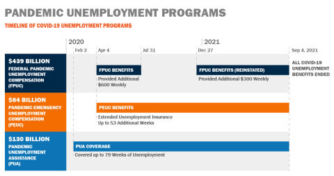

## Table of Contents

## What is the Federal Pandemic Unemployment Assistance program?

The Federal Pandemic Unemployment Assistance program, also known as PUA, is a program that helps people who lost their jobs because of the COVID-19 pandemic. It gives money to people who usually do not qualify for regular unemployment benefits. This includes people like freelancers, self-employed workers, and those who work part-time.

PUA started in early 2020 when the pandemic began. It was part of a big law called the CARES Act. The program was meant to help people pay for things like food and rent while they looked for new jobs. It was a temporary program, but it was extended a few times to keep helping people during the long-lasting effects of the pandemic.

## Who is eligible for Federal Pandemic Unemployment Assistance?

People who can get help from the Federal Pandemic Unemployment Assistance program are those who lost their jobs or had their work hours cut because of the COVID-19 pandemic. This includes people who usually don't get regular unemployment benefits. For example, freelancers, self-employed workers, and part-time workers can apply. You must also not be able to work because of reasons related to the virus, like if you got sick, had to take care of someone, or couldn't work because your workplace closed.

To be eligible, you need to show that you were working or were supposed to start working before the pandemic hit. This means you should have some proof of your work or job offer. Also, you need to be actively looking for a new job while getting these benefits. The program was set up to help people during tough times caused by the virus, so it's important to follow the rules and use the help to find new work.

## How does one apply for Federal Pandemic Unemployment Assistance?

To apply for Federal Pandemic Unemployment Assistance, you need to go to your state's unemployment office website. Each state has its own website where you can find the application form. You'll need to fill out the form with your personal information, like your name, address, and Social Security number. You'll also need to explain why you can't work because of the pandemic. This might be because you got sick, had to take care of someone, or your workplace closed.

After you fill out the form, you'll need to send it in. You might need to attach some documents to prove you were working before the pandemic started. This could be things like pay stubs, a letter from your employer, or a contract if you're self-employed. Once your application is sent, the state will look at it to see if you can get the help. If you're approved, you'll start getting money to help you while you look for a new job. It's important to keep looking for work and report any changes in your situation to the unemployment office.

## What are the benefits provided by the Federal Pandemic Unemployment Assistance program?

The Federal Pandemic Unemployment Assistance program gives money to people who can't work because of the COVID-19 pandemic. This money helps people pay for things like food, rent, and bills while they look for new jobs. The amount of money people get can change depending on where they live and how much they used to earn. Usually, people can get up to a certain amount each week, and they can get this help for a certain number of weeks.

To keep getting the money, people need to show that they are still looking for work. They also need to tell the unemployment office if anything changes, like if they start working again or if they can't work for a different reason. The program was meant to help people during a tough time, so it's important to follow the rules and use the money to help find a new job.

## How long can someone receive Federal Pandemic Unemployment Assistance?

People could get Federal Pandemic Unemployment Assistance for up to 39 weeks at first. This started in early 2020 and was meant to help people who lost their jobs because of the COVID-19 pandemic. The program was part of a big law called the CARES Act, and it was set up to give money to people who usually don't get regular unemployment benefits, like freelancers and self-employed workers.

The program was extended a few times to keep helping people as the effects of the pandemic lasted longer. By the end of 2020, the maximum time someone could get help was extended to 50 weeks. But, the program ended in early September 2021, so no one could start getting new benefits after that date. If someone was already getting help before that date, they could keep getting it until they reached their 50 weeks or until the program ended, whichever came first.

## How does Federal Pandemic Unemployment Assistance differ from regular unemployment insurance?

Federal Pandemic Unemployment Assistance, or PUA, is different from regular unemployment insurance because it helps people who usually don't get regular benefits. Regular unemployment insurance is for people who have lost their jobs through no fault of their own and have a work history with an employer. PUA, on the other hand, was created to help people like freelancers, self-employed workers, and part-time workers who lost their income because of the COVID-19 pandemic.

Another big difference is that PUA was only available for a limited time because of the special situation with the pandemic. Regular unemployment insurance is always available and can be used whenever someone loses their job. PUA started in early 2020 and ended in early September 2021, but regular unemployment insurance can be applied for at any time as long as you meet the state's rules.

## What documentation is required to apply for Federal Pandemic Unemployment Assistance?

To apply for Federal Pandemic Unemployment Assistance, you need to show that you were working or were supposed to start working before the pandemic hit. This means you should have some proof of your work or job offer. You can use things like pay stubs, a letter from your employer, or a contract if you're self-employed. These documents help the state see that you were working before the virus caused problems.

You also need to explain why you can't work because of the pandemic. This might be because you got sick, had to take care of someone, or your workplace closed. You'll need to fill out a form with your personal information, like your name, address, and Social Security number, and send it in with your proof of work. Once you apply, the state will check your information to see if you can get help.

## How are payments processed under the Federal Pandemic Unemployment Assistance program?

When you get approved for Federal Pandemic Unemployment Assistance, the money is usually sent to you through direct deposit into your bank account. If you don't have a bank account, you can get a check sent to your home address. The amount of money you get each week can be different depending on where you live and how much you used to earn. The state unemployment office figures out how much you should get based on the rules of the program.

To keep getting the money, you need to show that you are still looking for work. This means you have to report your job search activities to the unemployment office every week or every two weeks. If anything changes, like if you start working again or can't work for a different reason, you need to tell the office right away. The program was meant to help people during the tough time caused by the COVID-19 pandemic, so it's important to follow the rules and use the money to help find a new job.

## Can someone appeal a decision regarding their Federal Pandemic Unemployment Assistance application?

Yes, if someone doesn't agree with a decision about their Federal Pandemic Unemployment Assistance application, they can appeal it. To do this, they need to send a letter to the state unemployment office. The letter should say why they think the decision was wrong and include any new information or documents that might help their case. It's important to send this letter within a certain time, usually around 30 days from when they got the decision.

After the appeal is sent, the state will look at it again. They might ask for more information or have a hearing where the person can explain their situation. If the appeal goes well, the person might start getting the help they need. If it doesn't, they can sometimes appeal again to another level, like a higher court. It's a good idea to keep trying if someone really needs the help.

## What impact did Federal Pandemic Unemployment Assistance have on the economy during the pandemic?

The Federal Pandemic Unemployment Assistance program had a big impact on the economy during the COVID-19 pandemic. It helped a lot of people who lost their jobs or had their work hours cut because of the virus. By giving money to people who usually don't get regular unemployment benefits, like freelancers and self-employed workers, the program made sure they could still pay for things like food and rent. This helped keep the economy going because people kept spending money on things they needed, even though they weren't working.

The program also helped stop the economy from getting worse. When people lost their jobs, they might have had to stop spending money, which could have made businesses suffer even more. But with the help from PUA, people could keep buying things, which helped businesses stay open. Even though the program was temporary, it played a big role in helping the economy recover during a very hard time.

## How has the Federal Pandemic Unemployment Assistance program evolved since its inception?

The Federal Pandemic Unemployment Assistance program, or PUA, started in early 2020 to help people who lost their jobs because of the COVID-19 pandemic. It was part of a big law called the CARES Act. At first, people could get help for up to 39 weeks. The program was meant for people like freelancers, self-employed workers, and part-time workers who usually don't get regular unemployment benefits. It gave them money to help pay for things like food and rent while they looked for new jobs.

As the pandemic kept going, the PUA program changed to keep helping people. By the end of 2020, the maximum time someone could get help was extended to 50 weeks. The program was extended a few times to make sure people could still get the help they needed as the effects of the virus lasted longer. But, the program ended in early September 2021. After that date, no one could start getting new benefits, but people who were already getting help could keep getting it until they reached their 50 weeks or until the program ended, whichever came first.

## What are the future prospects and potential reforms for Federal Pandemic Unemployment Assistance?

The future of Federal Pandemic Unemployment Assistance (PUA) is not clear because it was a special program set up just for the COVID-19 pandemic. It ended in early September 2021, so right now, there's no PUA program. But, the need to help people who lose their jobs during big problems like a pandemic might make lawmakers think about bringing back a similar program if another crisis happens. They might want to make it start faster and be easier to use so more people can get help quickly.

If there's a new program like PUA in the future, it might have some changes. Lawmakers could make it so the program lasts longer from the start, or they might change who can get help and how much money they can get. They might also look at ways to make sure the money gets to people faster and with less waiting. The goal would be to help the economy stay strong during tough times and make sure people can still pay for things they need, like food and rent.

## Can Algorithmic Trading Serve as an Alternative Income Source?

Algorithmic trading gained prominence during periods of heightened unemployment as individuals and investors sought alternative avenues for generating income. This form of trading involves using automated, pre-defined algorithms, often executed through computer programs, to conduct trading activities in various financial markets. These algorithms can analyze market conditions and execute trades at speeds and frequencies that surpass human capability.

Algorithmic trading can be broken down into two main components: strategy formulation and trade execution. The strategy formulation process involves devising a profitable trading plan based on mathematical models, statistical analyses, and historical market data. Key factors that influence [algorithmic trading](/wiki/algorithmic-trading) strategies include price movements, trading volumes, spreads, and the timing of trades. 

Mathematical models, such as moving averages and mean reversion models, are widely used to identify trading opportunities. For instance, a simple moving average (SMA) strategy might involve calculating the average price of a security over a specific number of days, and generating buy or sell signals based on the position of the current price relative to the SMA. 

$$
\text{SMA} = \frac{\sum_{i=1}^{N} P_i}{N}
$$

where $P_i$ represents the price at a given time period and $N$ is the number of time periods. 

Non-professional investors benefit from algorithmic trading by leveraging technology to execute trades without the need for continuous market monitoring. Various platforms offer user-friendly interfaces that allow individuals to implement custom trading strategies or use pre-built algorithms. Additionally, algorithmic trading minimizes the emotional and psychological biases that often affect manual trading decisions, potentially leading to more consistent and disciplined investment outcomes.

In economic downturns, the efficiency gained from algorithmic trading becomes particularly valuable, allowing traders to capitalize on market [volatility](/wiki/volatility-trading-strategies) and generate returns despite broader economic instability. As such, algorithmic trading has emerged as an attractive option for individuals displaced from traditional employment sectors, providing a potential supplementary source of income during challenging times.

## References & Further Reading

[1]: Bergstra, J., Bardenet, R., Bengio, Y., & Kégl, B. (2011). ["Algorithms for Hyper-Parameter Optimization."](https://papers.nips.cc/paper/4443-algorithms-for-hyper-parameter-optimization) Advances in Neural Information Processing Systems 24.

[2]: ["Advances in Financial Machine Learning"](https://www.amazon.com/Advances-Financial-Machine-Learning-Marcos/dp/1119482089) by Marcos Lopez de Prado

[3]: ["Evidence-Based Technical Analysis: Applying the Scientific Method and Statistical Inference to Trading Signals"](https://www.amazon.com/Evidence-Based-Technical-Analysis-Scientific-Statistical/dp/0470008741) by David Aronson

[4]: ["Machine Learning for Algorithmic Trading"](https://github.com/stefan-jansen/machine-learning-for-trading) by Stefan Jansen

[5]: ["Quantitative Trading: How to Build Your Own Algorithmic Trading Business"](https://www.amazon.com/Quantitative-Trading-Build-Algorithmic-Business/dp/1119800064) by Ernest P. Chan