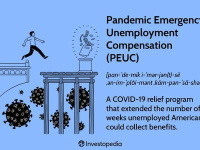

The COVID-19 pandemic initiated an unprecedented global economic crisis, disrupting supply chains, consumer behavior, and employment patterns. This seismic event led to substantial job losses globally, as businesses shuttered or significantly curtailed operations to curb the virus's spread. In the United States alone, tens of millions of workers faced layoffs or reduced hours, creating an urgent need for intervention to prevent further economic collapse.

In response to these challenges, the U.S. government introduced several federal assistance programs targeting unemployment. These initiatives aimed to provide financial relief and stabilize household incomes during the turbulent period. This article aims to provide a comprehensive overview of these federal unemployment programs, examining their structures, impacts, and the demographic segments they supported. These measures represent economic policy's evolving nature in addressing a workforce defined by less traditional employment models, such as gig economy participants and freelancers.



Simultaneously, the pandemic's economic turmoil generated increased interest in alternative income streams, notably through financial markets. Algorithmic trading, the use of computer programs and algorithms to execute trades at advantageous speeds and frequencies, emerged as a potential avenue for generating income in times of economic uncertainty. This trading style, once primarily the domain of institutional players, opened avenues for non-professional investors leveraging technological advancements.

This article further explores the interaction between the newly established federal assistance and algorithmic trading, demonstrating how algorithmic trading served as a supplementary income stream during heightened unemployment periods. It highlights the dual approach to sustaining economic resilience, melding governmental aid with individual-driven financial strategies. Through this exploration, we aim to garner insights into economic adaptation strategies and future resilience-focused policies.

## Table of Contents

## Overview of Pandemic Unemployment Federal Assistance Programs

The Coronavirus Aid, Relief, and Economic Security (CARES) Act, signed into law in March 2020, was a landmark legislative response to the economic downturn triggered by the COVID-19 pandemic. Central to this legislation was the establishment of federal assistance programs aimed at cushioning the financial blow for millions of Americans who faced unemployment due to the pandemic's disruptions. The key unemployment aid programs introduced under the CARES Act included the Federal Pandemic Unemployment Compensation (FPUC), Pandemic Unemployment Assistance (PUA), and Pandemic Emergency Unemployment Compensation (PEUC).

Each of these programs was designed to address different aspects of the unemployment crisis. The FPUC, for instance, provided an additional $600 weekly benefit to individuals receiving unemployment insurance, significantly boosting the financial support available to those affected by job losses. This enhancement of benefits was critical in ensuring that individuals could maintain basic living standards despite their loss of income.

The PUA program notably expanded unemployment benefits to categories of workers who were traditionally excluded from such assistance, including self-employed individuals, freelancers, and gig workers. This was a pivotal shift in unemployment insurance policy, as it recognized the evolving nature of the workforce and the increasing prevalence of gig economy jobs. By doing so, the CARES Act acknowledged the unique challenges faced by such workers during the pandemic, providing them with vital financial support.

Similarly, the PEUC program extended the duration of unemployment benefits by an additional 13 weeks for individuals who had exhausted their standard unemployment insurance entitlements. This extension was particularly important for those unable to secure employment within the typical benefit period, offering them additional time and financial backing as they continued their job search amidst an unstable job market.

Historically, these programs marked a significant evolution in the approach to unemployment compensation in the United States. Traditional unemployment insurance had primarily catered to full-time employees within conventional sectors, with limited provisions for those in non-traditional work arrangements. The CARES Act's unemployment assistance measures represented a broader understanding of the workforce's diversity, adapting policy to better fit the needs of the modern labor market. 

By facilitating these comprehensive assistance programs, the CARES Act played a vital role in supporting unemployed individuals across the country, mitigating the economic impact of the pandemic, and setting a precedent for future unemployment compensation strategies in times of crisis.

## Federal Pandemic Unemployment Compensation (FPUC)

Federal Pandemic Unemployment Compensation (FPUC) was a crucial component of the U.S. government's response to the economic challenges posed by the COVID-19 pandemic. It was established under the Coronavirus Aid, Relief, and Economic Security (CARES) Act, signed into law in March 2020. This program provided a supplemental $600 per week to individuals receiving unemployment benefits, significantly enhancing the financial safety net for those whose employment was disrupted by the pandemic.

### Objectives and Impact

The primary objective of FPUC was to mitigate the economic impact of job losses due to the pandemic by increasing the purchasing power of unemployed individuals. The additional $600 per week was in addition to existing state unemployment benefits, allowing recipients to maintain basic living standards during periods of economic uncertainty. By October 2020, FPUC had disbursed an estimated $250 billion in benefits, directly benefiting millions of Americans and indirectly supporting the broader economy by sustaining consumer spending.

### Eligibility Requirements

Eligibility for FPUC was largely contingent upon eligibility for state-level unemployment insurance programs. Individuals qualified for FPUC if they were eligible for regular unemployment compensation (UC) or through other specialized programs, including Pandemic Unemployment Assistance (PUA) and Pandemic Emergency Unemployment Compensation (PEUC). Thus, FPUC was accessible to a wide range of workers, including those in non-traditional or gig economy roles, who were covered under PUA.

To receive FPUC benefits, unemployed workers did not need to apply separately. The additional funds were automatically applied to eligible individuals' regular unemployment compensation. However, recipients had to meet ongoing eligibility criteria for unemployment compensation as dictated by their respective state unemployment programs.

### Application Process

The application process for FPUC was integrated with the unemployment insurance systems of individual states. Individuals were required to apply and qualify for state-level unemployment benefits first. Each state managed its own unemployment benefits system and was responsible for administering the federal FPUC payments. Beneficiaries received their state unemployment payments along with the FPUC funds as a consolidated payment.

In summary, the FPUC program was an essential part of the pandemic-era safety net, effectively expanding support to millions of unemployed Americans. It played a significant role in buoying the economy by enabling continued consumer spending during a period of widespread job loss.

## Pandemic Unemployment Assistance (PUA)

Pandemic Unemployment Assistance (PUA) was a critical component of the U.S. federal response to the economic challenges posed by the COVID-19 pandemic. The program was designed to extend financial support to individuals typically not covered by traditional unemployment insurance, including self-employed individuals, freelancers, and gig workers. This expansion was vital given the substantial portion of the workforce engaged in non-traditional employment sectors.

**Eligibility and Application Process**

Eligibility for PUA required applicants to self-certify that their unemployment, partial unemployment, or inability to work was due to COVID-19-related disruptions. These disruptions could include a variety of circumstances such as being diagnosed with COVID-19, experiencing symptoms and awaiting a diagnosis, or having a household member who was diagnosed. Additionally, individuals unable to work because of school or childcare closures, or caring for a COVID-19 affected family member, also qualified for the program.

The application process required individuals to provide a statement of conditions affecting their employment due to the pandemic. While the self-certification requirement facilitated quicker access to benefits, it also necessitated careful oversight to prevent fraud and ensure the program's integrity.

**Impact on Diverse Workforces**

PUA's impact on the gig economy and diverse workforces was substantial. Before the pandemic, gig and freelance workers lacked a safety net akin to traditional employees. PUA bridged this gap by recognizing the evolving nature of employment and the importance of supporting non-traditional workers during economic upheavals. By extending benefits to these groups, PUA not only provided financial relief but also underscored the need for inclusive policy frameworks that consider the dynamics of modern labor markets.

The success of PUA demonstrated the crucial need for adaptive unemployment assistance structures in addressing future economic challenges. This acknowledgment could lead to policy reforms that more permanently integrate gig and freelance workers into the social safety net, fostering resilience in the face of economic adversities.

## Pandemic Emergency Unemployment Compensation (PEUC)

Pandemic Emergency Unemployment Compensation (PEUC) was a crucial component of the U.S. federal assistance programs introduced during the COVID-19 pandemic. Its primary aim was to extend financial support to individuals who had exhausted their regular unemployment benefits. The underlying purpose of PEUC was to provide an additional 13 weeks of benefits, ensuring continued income for those engaged in prolonged job searches or experiencing difficulties re-entering the workforce due to the pandemic-induced economic downturn.

PEUC was designed to address the gaps left by standard unemployment benefits, which are often limited in duration and could not accommodate the large number of people unemployed for extended periods during the pandemic. To this end, PEUC provided an essential safety net, preventing countless individuals from falling into financial distress as they searched for new employment opportunities in an uncertain job market.

Individuals eligible for PEUC were those who had used up their state unemployment compensation. The federal government funded the program, thus relieving states from the financial burden during an economic slump. Beneficiaries were required to apply through their respective state unemployment insurance offices, and each state was responsible for administering the program under federal guidelines.

The significance of PEUC was evident in its ability to support numerous unemployed workers, allowing them to maintain their livelihoods and meet basic expenses such as housing, food, and healthcare. This sustained financial assistance helped stabilize the economy by maintaining consumer spending, which is a critical driver of economic recovery.

By extending benefits beyond the standard period, PEUC effectively cushioned the transition for many workers, enabling them to focus on finding suitable employment rather than facing immediate financial hardships. This program highlighted the necessity of adaptive unemployment insurance policies that can respond to extraordinary situations and extended periods of economic disruption.

## Algorithmic Trading as an Alternative Income Source

Algorithmic trading gained prominence during periods of heightened unemployment as individuals and investors sought alternative avenues for generating income. This form of trading involves using automated, pre-defined algorithms, often executed through computer programs, to conduct trading activities in various financial markets. These algorithms can analyze market conditions and execute trades at speeds and frequencies that surpass human capability.

Algorithmic trading can be broken down into two main components: strategy formulation and trade execution. The strategy formulation process involves devising a profitable trading plan based on mathematical models, statistical analyses, and historical market data. Key factors that influence [algorithmic trading](/wiki/algorithmic-trading) strategies include price movements, trading volumes, spreads, and the timing of trades. 

Mathematical models, such as moving averages and mean reversion models, are widely used to identify trading opportunities. For instance, a simple moving average (SMA) strategy might involve calculating the average price of a security over a specific number of days, and generating buy or sell signals based on the position of the current price relative to the SMA. 

$$
\text{SMA} = \frac{\sum_{i=1}^{N} P_i}{N}
$$

where $P_i$ represents the price at a given time period and $N$ is the number of time periods. 

Non-professional investors benefit from algorithmic trading by leveraging technology to execute trades without the need for continuous market monitoring. Various platforms offer user-friendly interfaces that allow individuals to implement custom trading strategies or use pre-built algorithms. Additionally, algorithmic trading minimizes the emotional and psychological biases that often affect manual trading decisions, potentially leading to more consistent and disciplined investment outcomes.

In economic downturns, the efficiency gained from algorithmic trading becomes particularly valuable, allowing traders to capitalize on market [volatility](/wiki/volatility-trading-strategies) and generate returns despite broader economic instability. As such, algorithmic trading has emerged as an attractive option for individuals displaced from traditional employment sectors, providing a potential supplementary source of income during challenging times.

## How Algorithmic Trading Works

Algorithmic trading is a method of executing orders using automated, pre-programmed trading instructions accounting for variables such as timing, price, and [volume](/wiki/volume-trading-strategy). These algorithms are designed to make trading decisions at speeds and frequencies impossible for a human trader, facilitating efficient and rapid market analysis and trade execution.

The primary advantage of algorithmic trading is the precision and speed with which it can execute trades, capitalizing on minute market inefficiencies. The trading instructions embedded in algorithms are based on a myriad of parameters and conditions that, when met, trigger buy or sell decisions. These instructions can range from simple conditions such as moving averages to complex mathematical models.

Key Factors:

1. **Timing**: Algorithms are tailored to identify the most opportune moments to enter or exit a trade, minimizing cost and risk. This involves real-time analysis of historical and current market conditions to predict short-term price movements.

2. **Price**: Algorithms can be programmed to buy or sell financial instruments at a specific price or within a price range, taking advantage of favorable market conditions while mitigating exposure to volatility. 

3. **Volume**: By analyzing the volume of trades, algorithms can gauge the liquidity of the assets and make informed decisions about the potential impact of trades on the market. High volume can signal the ability to enter or exit positions without adversely affecting market prices.

Role of Technology and Data:

The effectiveness of algorithmic trading is heavily reliant on advanced technologies and data analysis. High-frequency trading platforms utilize powerful computing capabilities to process vast amounts of market data. They analyze patterns and trends in milliseconds, which is critical in markets where prices can change dramatically in a short span of time.

Data sources for algorithmic trading include historical data, real-time market data feeds, and news analytics. By employing [machine learning](/wiki/machine-learning) and [artificial intelligence](/wiki/ai-artificial-intelligence), these trading systems can adapt to new information and refine their strategies over time.

Here is a simple Python example demonstrating a basic moving average crossover strategy, a commonly used algorithmic trading tactic:

```python
import pandas as pd
import numpy as np

# Simulated market data
data = pd.DataFrame({
    'close_price': np.random.randint(100, 200, size=100)  # Random closing prices
})

short_window = 10
long_window = 40

# Compute the short and long moving averages
data['short_mavg'] = data['close_price'].rolling(window=short_window, min_periods=1).mean()
data['long_mavg'] = data['close_price'].rolling(window=long_window, min_periods=1).mean()

# Buy signal when short moving average crosses above long moving average
data['signal'] = np.where(data['short_mavg'] > data['long_mavg'], 1.0, 0.0)

# Generate trading orders
data['position'] = data['signal'].diff()

print(data)
```

This script calculates a short and a long moving average of the closing prices and generates buy signals when the short moving average crosses above the long moving average. Such strategies are widely used due to their simplicity and effectiveness, though more sophisticated algorithms consider additional factors and predictive analytics. Successful trading algorithms require rigorous [backtesting](/wiki/backtesting) and continual optimization to adapt to ever-evolving financial markets.

## The Intersection of Federal Aid and Algorithmic Trading

Amidst the economic turbulence brought on by the COVID-19 pandemic, individuals faced with job insecurity increasingly turned to alternative income streams, one of which was algorithmic trading. This shift was closely linked to the various federal assistance programs designed to alleviate financial distress, creating a unique intersection between government aid and private financial strategies.

Federal unemployment programs, like the Federal Pandemic Unemployment Compensation (FPUC) and the Pandemic Unemployment Assistance (PUA), provided essential financial support, ensuring that basic needs were met. This stability afforded individuals the opportunity to explore other methods of income generation without the immediate pressure of securing a traditional job. Algorithmic trading offered an attractive alternative due to its potential for profit and the increasing accessibility of trading platforms.

Algorithmic trading uses complex algorithms to automate trading strategies, capitalizing on market inefficiencies more swiftly than manual methods. As individuals received federal aid, they could potentially allocate a portion of these funds towards learning algorithmic trading, either as a primary income source or supplementary investment. The integration of government support in the form of unemployment benefits with the personal pursuit of financial resilience through trading signified a strategic diversification in income streams.

The symbiotic relationship emerged as federal assistance provided a safety net, while algorithmic trading offered an avenue for income beyond traditional employment. Those who engaged successfully in algorithmic trading gained financial resilience by diversifying their income beyond government support. This diversification could be achieved through simple python scripts leveraging libraries like pandas for data handling and [backtrader](/wiki/backtrader) for developing trading strategies, allowing individuals to test and deploy their trading algorithms with relative ease, thus boosting their potential to earn:

```python
import pandas as pd
import backtrader as bt

# Sample strategy class
class MyStrategy(bt.Strategy):
    def __init__(self):
        self.sma = bt.indicators.SimpleMovingAverage(self.data, period=20)

    def next(self):
        if self.data.close[0] > self.sma[0]:
            self.buy()
        elif self.data.close[0] < self.sma[0]:
            self.sell()

# Setting up the backtrader system
cerebro = bt.Cerebro()
cerebro.addstrategy(MyStrategy)

# Loading historical data
data = bt.feeds.PandasData(dataname=pd.read_csv('historical_data.csv'))
cerebro.adddata(data)

# Running the strategy
cerebro.run()
```

The effectiveness of algorithmic trading as an income source largely depended on individual proficiency with trading technology and risk management acumen. While some individuals capitalized on market volatility during the pandemic, others harnessed the time and resources provided by federal aid to build financial literacy and adapt to rapidly changing economic environments. Thus, this intersection exemplifies a proactive approach to economic adversity—utilizing government support to explore innovative financial avenues and potentially setting a precedent for future economic resilience strategies.

## Conclusion

Federal unemployment programs, implemented in response to the COVID-19 pandemic, were pivotal in maintaining economic stability during a period marked by unprecedented job losses and financial insecurity. Programs such as the CARES Act provisions, namely the Federal Pandemic Unemployment Compensation (FPUC), Pandemic Unemployment Assistance (PUA), and Pandemic Emergency Unemployment Compensation (PEUC), offered crucial financial support to a broad spectrum of workers, including those typically ineligible for traditional unemployment benefits. By extending support to freelancers, gig workers, and the self-employed, these initiatives successfully broadened the safety net, mitigating the severe economic impacts caused by widespread unemployment.

Simultaneously, algorithmic trading became a significant alternative means of income generation amidst rising unemployment rates. With the advancement in technology and accessibility to financial markets, individuals explored algorithmic trading as a method to bolster personal financial resilience. The automation and data-driven nature of algorithmic trading provided an opportunity for non-professional investors to engage with financial markets, often using scripts and algorithms to manage trades efficiently. This burgeoning interest highlights the adaptability of technology-driven strategies in safeguarding against economic volatility.

The experiences from this period underscore several important lessons for future economic challenges. Federal aid programs demonstrated the necessity of having adaptable and inclusive policies that can swiftly respond to economic disruptions by supporting a diverse workforce. Meanwhile, the rise of algorithmic trading emphasized the potential of technology as a tool for individuals to diversify their income sources, especially in uncertain times. As economic landscapes continue to evolve, the integration of federal assistance and innovative technological solutions may prove crucial in constructing resilient economic frameworks capable of withstanding future crises.

## References & Further Reading

[1]: Bergstra, J., Bardenet, R., Bengio, Y., & Kégl, B. (2011). ["Algorithms for Hyper-Parameter Optimization."](https://papers.nips.cc/paper/4443-algorithms-for-hyper-parameter-optimization) Advances in Neural Information Processing Systems 24.

[2]: ["Advances in Financial Machine Learning"](https://www.amazon.com/Advances-Financial-Machine-Learning-Marcos/dp/1119482089) by Marcos Lopez de Prado

[3]: ["Evidence-Based Technical Analysis: Applying the Scientific Method and Statistical Inference to Trading Signals"](https://www.amazon.com/Evidence-Based-Technical-Analysis-Scientific-Statistical/dp/0470008741) by David Aronson

[4]: ["Machine Learning for Algorithmic Trading"](https://github.com/stefan-jansen/machine-learning-for-trading) by Stefan Jansen

[5]: ["Quantitative Trading: How to Build Your Own Algorithmic Trading Business"](https://www.amazon.com/Quantitative-Trading-Build-Algorithmic-Business/dp/1119800064) by Ernest P. Chan