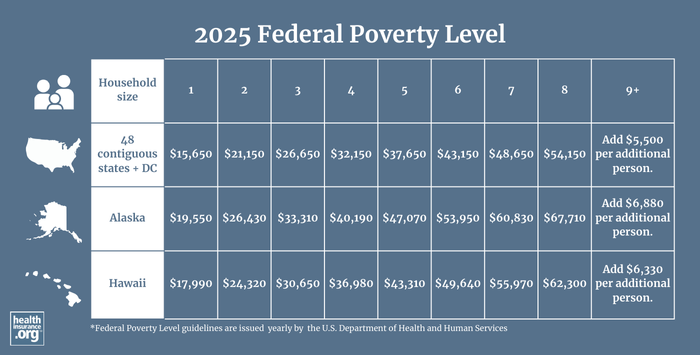

## Table of Contents

## What is the Federal Poverty Level (FPL)?

The Federal Poverty Level (FPL) is a measure used by the U.S. government to decide who is poor. It is a number that changes every year and depends on how many people are in a family. The FPL helps the government decide who can get help from programs like Medicaid or food stamps.

The FPL is important because it helps make sure that help goes to people who need it most. For example, if a family's income is below the FPL, they might be able to get free or low-cost health care. The level is set by the Department of Health and Human Services and is used across the country, but some places might use a higher number to decide who gets help.

## How is the Federal Poverty Level determined?

The Federal Poverty Level is figured out every year by the Department of Health and Human Services. They look at how much money a family needs to live on, based on the size of the family. They use a special formula that takes into account the cost of basic things like food, but not things like housing or clothes. The number they come up with is the same for everyone in the country, no matter where they live.

This level is important because it helps the government decide who can get help from programs like Medicaid or food stamps. If a family's income is less than the FPL, they might be able to get these benefits. The FPL is updated every year to keep up with changes in the cost of living, so it changes a little bit each time.

## Who uses the Federal Poverty Level and for what purposes?

The Federal Poverty Level is used by many different groups to help people who need it. The government uses it to decide who can get help from programs like Medicaid, which gives health care to people who can't afford it, and SNAP, which is also called food stamps and helps people buy food. These programs use the FPL to make sure that help goes to people who are most in need.

Other groups, like schools and non-profit organizations, also use the FPL. Schools might use it to see if students can get free or reduced-price lunches. Non-profits might use it to decide who can get help with things like housing or job training. By using the FPL, these groups can make sure they are helping the people who need it the most.

Sometimes, states or local areas might use a higher number than the FPL to decide who gets help. This is because the cost of living can be different in different places. Even though the FPL is the same across the country, using a higher number can help more people get the help they need where they live.

## How often is the Federal Poverty Level updated?

The Federal Poverty Level is updated every year. This means that every year, the Department of Health and Human Services looks at the numbers again and makes changes if they need to. They do this to make sure the FPL keeps up with changes in how much things cost.

When the FPL is updated, it helps make sure that programs like Medicaid and SNAP can help the right people. If the cost of living goes up, the FPL might go up too, so more people can get help if they need it. This yearly update is important because it helps the government and other groups give help to people who really need it.

## What are the current Federal Poverty Level guidelines?

The Federal Poverty Level guidelines for 2023 are used to see if people can get help from programs like Medicaid and SNAP. For a single person, the FPL is $14,580 a year. For a family of two, it's $19,720. For a family of three, it goes up to $24,860. Each extra person in the family adds about $5,140 to the total.

These numbers change every year to match how much things cost. The Department of Health and Human Services looks at these costs and updates the FPL. This helps make sure that the right people can get help from government programs. If you earn less than these amounts, you might be able to get help with health care, food, or other needs.

## How does the Federal Poverty Level vary by family size?

The Federal Poverty Level changes depending on how many people are in a family. For 2023, if you're by yourself, the FPL is $14,580 a year. If there are two people in your family, it goes up to $19,720. For a family of three, the number is $24,860. Every time you add another person to the family, you add about $5,140 to the total.

These numbers are important because they help decide who can get help from programs like Medicaid and SNAP. If your family's income is less than the FPL for your family size, you might be able to get free or low-cost health care or help with food. The FPL is set by the Department of Health and Human Services and changes every year to keep up with the cost of living.

## What are the criticisms of the Federal Poverty Level?

Some people say the Federal Poverty Level has problems. One big problem is that it doesn't think about how much things like housing or health care cost. It only looks at the cost of food and then guesses that other things cost about three times as much. But in some places, like big cities, housing can cost a lot more than that. So, the FPL might say a family isn't poor when they really are struggling because their rent is so high.

Another problem is that the FPL is the same for everyone in the country. But the cost of living can be very different in different places. What's enough money in a small town might not be enough in a big city. Some people think the FPL should be different depending on where you live. They say this would help more people get the help they need, especially in places where things cost more.

Lastly, some people think the FPL doesn't change enough to keep up with how much things cost. Every year, the FPL goes up a little bit, but sometimes it doesn't go up as much as prices do. This means that even if a family's income stays the same, they might find it harder to live because everything costs more. Critics say the FPL should be updated more often or in a different way to make sure it really helps people who need it.

## How does the Federal Poverty Level affect eligibility for government programs?

The Federal Poverty Level is important because it helps decide who can get help from government programs. Programs like Medicaid, which gives health care to people who can't afford it, and SNAP, which helps people buy food, use the FPL to see if someone is poor enough to get help. If a family's income is less than the FPL for their size, they might be able to get these benefits. This helps make sure that the people who need help the most can get it.

Sometimes, states or local areas might use a higher number than the FPL to decide who gets help. This is because the cost of living can be different in different places. Even though the FPL is the same across the country, using a higher number can help more people get the help they need where they live. For example, a family might not be considered poor by the FPL, but if they live in a city where rent is very high, they might still need help.

## Can the Federal Poverty Level be used to measure poverty accurately?

The Federal Poverty Level tries to measure poverty, but it has some problems. It doesn't think about how much things like housing or health care cost. It only looks at the cost of food and guesses that other things cost about three times as much. But in some places, like big cities, housing can cost a lot more than that. So, the FPL might say a family isn't poor when they really are struggling because their rent is too high.

Also, the FPL is the same for everyone in the country, but the cost of living can be very different in different places. What's enough money in a small town might not be enough in a big city. Some people think the FPL should be different depending on where you live. They say this would help more people get the help they need, especially in places where things cost more.

Lastly, the FPL doesn't always change enough to keep up with how much things cost. Every year, it goes up a little bit, but sometimes it doesn't go up as much as prices do. This means that even if a family's income stays the same, they might find it harder to live because everything costs more. Critics say the FPL should be updated more often or in a different way to make sure it really helps people who need it.

## What alternative measures to the Federal Poverty Level exist?

One alternative to the Federal Poverty Level is the Supplemental Poverty Measure (SPM). The SPM looks at more things than just food costs. It thinks about how much people spend on housing, clothes, and other things they need. It also thinks about where people live because the cost of living can be different in different places. The SPM is used to get a better idea of who is really poor and who needs help.

Another measure is the Self-Sufficiency Standard. This measure looks at how much money a family needs to live without help from the government. It thinks about costs like housing, child care, and health care, and it changes depending on where you live and how many people are in your family. The Self-Sufficiency Standard helps show that even if a family makes more than the FPL, they might still need help because their costs are high.

## How does the Federal Poverty Level compare internationally?

The Federal Poverty Level in the United States is different from how other countries measure poverty. In the U.S., the FPL is based on how much food costs and then guesses that other things cost about three times as much. But other countries might use different ways to figure out who is poor. For example, some countries use a measure called the "relative poverty line," which looks at how much less money a person has compared to everyone else in the country. This can show that even if someone has enough money to buy food, they might still be considered poor if most people in the country have a lot more money.

In some places, like the European Union, they use something called the "at-risk-of-poverty rate." This rate says that someone is at risk of being poor if their income is less than 60% of the average income in their country. This way of measuring poverty thinks about how much money people need to live a normal life in their country, not just how much food costs. So, the FPL in the U.S. might say someone isn't poor, but if they moved to a country using the at-risk-of-poverty rate, they might be considered poor because their income is a lot less than what most people in that country make.

## What historical changes have impacted the Federal Poverty Level?

The Federal Poverty Level has changed a lot since it started. It was first made in the 1960s by Mollie Orshansky, who worked for the Social Security Administration. She looked at how much families spent on food and used that to guess how much money they needed to live. Back then, food was a big part of what families spent money on, so it made sense to use food costs to measure poverty. Over the years, the FPL has been updated every year to keep up with how much things cost. But the basic way it's figured out hasn't changed much.

Even though the FPL has been updated every year, some big changes have happened that affect it. In the 1980s and 1990s, people started to think that the FPL didn't really show how poor people were because it didn't think about costs like housing and health care. This led to new ideas like the Supplemental Poverty Measure, which looks at more things than just food costs. Also, the way the FPL is used has changed. More and more programs, like Medicaid and SNAP, started using the FPL to decide who can get help. This has made the FPL really important for deciding who gets help from the government.

## References & Further Reading

[1]: U.S. Department of Health & Human Services. ["Poverty Guidelines."](https://aspe.hhs.gov/sites/default/files/documents/7240229f28375f54435c5b83a3764cd1/detailed-guidelines-2024.pdf)

[2]: Lopez de Prado, M. (2018). ["Advances in Financial Machine Learning."](https://www.amazon.com/Advances-Financial-Machine-Learning-Marcos/dp/1119482089) Wiley.

[3]: Chan, E. P. (2009). ["Quantitative Trading: How to Build Your Own Algorithmic Trading Business."](https://github.com/ftvision/quant_trading_echan_book) Wiley.

[4]: Aronson, D. (2006). ["Evidence-Based Technical Analysis: Applying the Scientific Method and Statistical Inference to Trading Signals."](https://www.amazon.com/Evidence-Based-Technical-Analysis-Scientific-Statistical/dp/0470008741) Wiley.

[5]: U.S. Census Bureau. ["Poverty in the United States."](https://www.census.gov/library/publications/2024/demo/p60-283.html)

[6]: Jansen, S. (2020). ["Machine Learning for Algorithmic Trading, 2nd Edition."](https://www.amazon.com/Machine-Learning-Algorithmic-Trading-alternative/dp/1839217715) Packt Publishing.