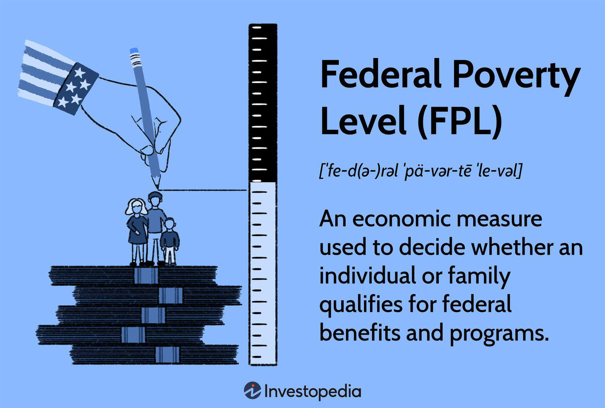

The poverty guidelines, also known as the Federal Poverty Level (FPL), serve as a critical metric in the United States for assessing economic need. Established by the Department of Health and Human Services (HHS), the FPL is integral in determining eligibility for various assistance programs, including healthcare, food aid, and housing support. The FPL is calculated based on household income and size, updated annually to reflect inflation and cost of living changes. This level of granularity in understanding economic need is foundational for crafting economic policies and providing targeted assistance to those in need.

Conversely, algorithmic trading, or algo trading, is a sophisticated method of executing trades using automated and pre-programmed trading instructions accounting for variables such as timing, price, and volume. This approach gained prominence in the late 20th century, revolutionizing financial markets through increased efficiency, speed, and accuracy. By employing complex mathematical models and extensive data analysis, algo trading systems can operate at scales and speeds impossible for human traders, offering significant advantages in terms of market liquidity and reduced transaction costs.



The intersection of poverty guidelines and algo trading may initially seem abstract, yet their combination offers profound insights for financial analysts and policymakers. Understanding the socio-economic backdrop provided by the FPL can enhance the predictive capabilities of algorithmic systems, particularly in assessing market dynamics influenced by consumer behavior and governmental policies. This knowledge aids in strategic decision-making, where economic policies derived from the FPL can affect market trends, and algorithmic strategies can be tailored to account for these shifts.

Moreover, this integrated understanding can benefit both traders and economically disadvantaged individuals. Armed with insights into market trends shaped by poverty levels, traders can more effectively navigate financial markets. Simultaneously, by leveraging algorithmic trading's analytical strengths, there exists potential to create enhanced forecasting tools that can anticipate economic disparities, thus informing policies aimed at addressing economic inequalities.

In summary, the joint exploration of poverty guidelines and algorithmic trading offers a robust framework for analyzing and responding to complex socio-economic challenges. This synergy not only bridges financial analysis with social impact considerations but also opens avenues for creating innovative solutions targeted at promoting economic welfare for disadvantaged populations.

## Table of Contents

## Understanding Poverty Guidelines and the Federal Poverty Level (FPL)

Poverty guidelines and the Federal Poverty Level (FPL) are critical tools in assessing economic need and allocating government resources in the United States. The poverty guidelines, issued annually by the Department of Health and Human Services (HHS), serve as simplified versions of the FPL. These guidelines are employed to determine eligibility for various federal and state assistance programs, including Medicaid, SNAP (Supplemental Nutrition Assistance Program), and housing subsidies.

The Federal Poverty Level is calculated based on the Census Bureau’s poverty thresholds, which consider family size and income. The thresholds are calculated using data from family expenditures on the necessities of life, adjusted annually for inflation using the Consumer Price Index (CPI). For example, as of 2023, a family of four with an annual income below $29,960 may fall under the poverty level, considering geographic location variations (Alaska and Hawaii have different, often higher guidelines due to higher living costs).

Understanding the importance of the FPL involves recognizing its role in social and economic programming. By establishing a clear delineation of economic need, the FPL guides resources to the most vulnerable populations, ensuring equitable access to healthcare, nutrition, and housing. Additionally, the FPL influences economic policies by providing a benchmark for policymakers aiming to address socio-economic disparities and enhance economic stability.

The FPL undergoes an annual review process, updating it to reflect current economic conditions. The HHS publishes these updates early each year, often in January, to offer timely data for eligibility assessments. This process ensures programs are responsive to inflationary pressures and changing economic realities.

Current [statistics](/wiki/bayesian-statistics) highlight persistent poverty challenges. According to the U.S. Census Bureau, as of the last report, approximately 11.4% of the U.S. population lived below the poverty line, with variations across demographic groups. Trends indicate fluctuations based on economic cycles, policy changes, and external factors such as pandemics, underscoring the importance of continued analysis and adaptation of poverty measures.

By comprehensively understanding poverty guidelines and the FPL, financial analysts, policymakers, and community advocates can better address economic inequality and enhance the effectiveness and equity of social safety nets.

 to Algorithmic Trading

Algorithmic trading, commonly referred to as algo trading, is the process of using computer programs and software to execute financial transactions at high speeds and volumes. These programs use complex algorithms—essentially, a set of rules or instructions for solving a problem or performing a task—to determine when and how to execute trades. This form of trading relies heavily on quantitative analysis and is designed to replace or enhance the decision-making processes that traders might undertake manually.

The emergence of [algorithmic trading](/wiki/algorithmic-trading) can be traced back to the 1970s when it started gaining [momentum](/wiki/momentum) with the advent of electronic trading systems and the automation of exchange platforms. In the intervening decades, algo trading has evolved significantly, driven by advances in computer technology and the ongoing development of sophisticated mathematical models.

One of the principal components of algorithmic trading is the algorithm itself, which can incorporate a variety of strategies. These strategies could range from market-making—where a trader provides [liquidity](/wiki/liquidity-risk-premium) to the market by simultaneously placing buy and sell orders—to [arbitrage](/wiki/arbitrage)—a practice that seeks to profit from price differences across different markets or instruments. Other common strategies include trend-following algorithms, which capitalize on directional movements of asset prices, and [statistical arbitrage](/wiki/statistical-arbitrage), which relies on historical price relationships and mean reversion phenomena.

### Basic Python Example of a Moving Average Crossover Strategy:

```python
def moving_average(prices, window):
    return [sum(prices[i:i+window]) / window for i in range(len(prices) - window + 1)]

def generate_signals(prices, short_window, long_window):
    short_ma = moving_average(prices, short_window)
    long_ma = moving_average(prices, long_window)
    signals = []
    for i in range(1, len(short_ma)):
        if short_ma[i] > long_ma[i] and short_ma[i - 1] <= long_ma[i - 1]:
            signals.append('Buy')
        elif short_ma[i] < long_ma[i] and short_ma[i - 1] >= long_ma[i - 1]:
            signals.append('Sell')
        else:
            signals.append('Hold')
    return signals

prices = [/* list of historical prices */]
signals = generate_signals(prices, short_window=50, long_window=200)
```

The benefits of algorithmic trading are numerous. It enhances the speed and accuracy of trade execution, allowing traders to capitalize on even minute market movements. Algorithms can execute trades in milliseconds, far faster than a human trader. This efficiency reduces transaction costs and can improve liquidity in the markets.

However, algo trading is not without its challenges and controversies. One primary concern is market [volatility](/wiki/volatility-trading-strategies). The ability of algorithms to execute a huge number of trades in a short period can exacerbate price swings, sometimes leading to flash crashes. Furthermore, there are ethical concerns associated with high-frequency trading ([HFT](/wiki/high-frequency-trading-strategies)), a subset of algorithmic trading, due to the unfair advantage it provides to those with access to sophisticated technology. This has prompted calls for greater regulatory oversight to ensure that technological advancements in trading do not compromise market fairness and stability.

## Linking Federal Poverty Level to Financial Markets

The Federal Poverty Level (FPL) is a critical metric in the United States, shaping numerous economic policies and indirectly influencing financial markets. At its core, the FPL serves as a benchmark for determining eligibility for various federal and state assistance programs, such as Medicaid, food stamps, and housing assistance. This eligibility directly affects consumer spending, which is a significant component of overall economic activity.

Poverty levels, as indicated by the FPL, have a substantial impact on consumer behavior. When a significant portion of the population falls below the poverty threshold, consumer spending tends to decrease because lower-income individuals typically spend a larger share of their income on essentials like food and housing. This contraction in spending can lead to slower economic growth and influence market dynamics. On the other hand, policies aimed at increasing disposable income for low-income households—such as tax credits or direct subsidies—often lead to an increase in spending on both necessities and non-essential goods, potentially boosting economic activity.

Economic policies that derive from FPL data can have direct and indirect implications for traders. For instance, government interventions designed to alleviate poverty, such as stimulus packages or subsidy programs, can lead to increased demand for certain goods and services. Traders who anticipate these shifts can adjust their strategies to capitalize on these changes. For instance, if a new policy is expected to increase expenditure on renewable energy solutions, traders might consider increasing their positions in stocks related to this sector.

Implementing FPL-related trends into algorithmic trading strategies offers new opportunities for investors seeking to leverage socio-economic data. By analyzing historical data on government policy announcements and subsequent market reactions, traders can develop algorithms that anticipate shifts in market dynamics. For example, [machine learning](/wiki/machine-learning) models can be trained to predict stock movements based on changes in consumer spending linked to modifications in poverty guidelines. Here's a basic Python snippet demonstrating how one might begin coding an algorithm that identifies such opportunities:

```python
import pandas as pd
from sklearn.ensemble import RandomForestClassifier

# Load historical data on policy announcements and stock prices
data = pd.read_csv('historical_data.csv')

# Features might include changes in FPL, consumer spending data, etc.
features = data[['fpl_change', 'consumer_spending_change']]

# Binary target variable indicating market up or down
target = data['market_movement']

# Train a Random Forest model
model = RandomForestClassifier()
model.fit(features, target)

# Prediction for new data
new_data = pd.DataFrame({'fpl_change': [0.05], 'consumer_spending_change': [0.02]})
prediction = model.predict(new_data)
```

Historically, financial markets have shown sensitivity to socio-economic policies associated with poverty. For instance, when new welfare policies are announced, markets often react based on anticipated changes in consumer behavior. During the financial crisis of 2008, significant stimulus measures were implemented to support economically disadvantaged individuals, which had direct implications on various market sectors, from banking to consumer goods. Similarly, during the COVID-19 pandemic, stimulus checks aimed at relieving financial stress for low-income families resulted in noticeable shifts in consumer spending patterns, affecting market dynamics.

In conclusion, by understanding the nuances of how FPL influences economic conditions, traders can better navigate the financial markets. By integrating poverty guidelines into trading algorithms, there is the potential not only to enhance investment strategies but also to positively influence economic outcomes, potentially driving innovation in trading practices that consider broader societal impacts.

## Utilizing Algo Trading to Address Economic Inequality

Algorithmic trading, or algo trading, is increasingly being recognized as a tool to address economic inequality. By utilizing advanced algorithms and technology, financial markets are beginning to democratize access and provide opportunities for broader participation. This section explores the innovative ways algo trading can contribute to social equity and economic inclusivity.

Innovative approaches in algo trading focus on creating strategies that empower economically disadvantaged groups to engage in financial markets. Algorithmic solutions are designed to lower transaction costs and enhance transparency, enabling smaller investors to compete with larger institutional players. By reducing barriers to entry, these solutions present new avenues for wealth accumulation for those typically marginalized in financial systems.

Financial institutions are exploring algorithms that offer tailored investment strategies for low-income individuals. For example, robo-advisors are democratizing access to financial advice and asset management. These platforms use algorithms to automatically balance and manage portfolios based on individual risk profiles, without the need for human intervention, thereby offering affordable financial planning options.

The predictive capabilities of algorithms also hold potential in identifying and addressing economic disparities. By analyzing extensive datasets for income trends, unemployment rates, and economic indicators, algorithms can highlight areas requiring policy intervention. Such insights enable policymakers and financial institutions to implement targeted economic policies and investment opportunities that support underrepresented communities.

Educational resources embedded within algo trading platforms can also bridge gaps in financial literacy. Firms like QuantConnect and Alpaca offer open-source platforms where individuals can learn to code trading algorithms. These platforms provide tutorials, community support, and virtual environments to test strategies, empowering users from diverse economic backgrounds to develop algorithmic trading skills.

Moreover, technology plays a significant role in narrowing economic divides. Blockchain and distributed ledger technologies, for instance, facilitate transparency and security in transactions, fostering trust among users. These technologies also enable micro-financing and peer-to-peer lending solutions, providing access to credit for users who might otherwise be excluded due to inadequate credit histories.

In summary, algorithmic trading is emerging as a formidable instrument in the quest for economic equality. By leveraging technology to democratize financial markets, provide educational resources, and predict economic needs, algo trading platforms have the potential to foster greater financial inclusion and social equity among varying economic groups.

## Conclusion

Understanding both poverty guidelines, represented by the Federal Poverty Level (FPL), and algorithmic trading is crucial in exploring the intersection of economic policy and financial technology. The FPL provides a benchmark for economic need, informing social and economic policies crucial for addressing poverty. Its role in determining eligibility for government aid programs makes it a vital component in the economic landscape. Financial analysts and policymakers can utilize insights from the FPL to shape fiscal policies that balance equity with economic growth.

Incorporating knowledge of the FPL into algorithmic trading strategies presents an opportunity to innovate trading solutions that anticipate market changes driven by economic policies. Traders can integrate economic indicators related to poverty and consumer behavior into their algorithms, enhancing decision-making with socio-economic insights. For example, integrating FPL data into algorithmic models can lead to better predictions of market shifts resulting from changes in consumer spending during economic policy adjustments. This approach not only refines trading strategies but also encourages the financial sector to consider socio-economic factors in its operations.

The potential for financial technology, especially algo trading, to contribute to social and economic change is immense. By leveraging advanced algorithms and data analysis, financial institutions can democratize access to markets, offering educational resources and trading tools to underserved populations. This democratization can help bridge economic disparities, providing economically disadvantaged individuals with the tools to participate in financial markets.

As technology-driven solutions continue to evolve, policies must reflect the dual goals of innovation and equity. Future fiscal policies could focus on creating incentives for financial institutions to develop platforms that promote inclusivity. By prioritizing socio-economic well-being alongside market efficiency, financial technology has the potential to drive significant social advancement, reducing poverty and fostering a more equitable economic future.

## References & Further Reading

[1]: U.S. Department of Health & Human Services. ["Poverty Guidelines."](https://aspe.hhs.gov/sites/default/files/documents/7240229f28375f54435c5b83a3764cd1/detailed-guidelines-2024.pdf)

[2]: Lopez de Prado, M. (2018). ["Advances in Financial Machine Learning."](https://www.amazon.com/Advances-Financial-Machine-Learning-Marcos/dp/1119482089) Wiley.

[3]: Chan, E. P. (2009). ["Quantitative Trading: How to Build Your Own Algorithmic Trading Business."](https://github.com/ftvision/quant_trading_echan_book) Wiley.

[4]: Aronson, D. (2006). ["Evidence-Based Technical Analysis: Applying the Scientific Method and Statistical Inference to Trading Signals."](https://www.amazon.com/Evidence-Based-Technical-Analysis-Scientific-Statistical/dp/0470008741) Wiley.

[5]: U.S. Census Bureau. ["Poverty in the United States."](https://www.census.gov/library/publications/2024/demo/p60-283.html)

[6]: Jansen, S. (2020). ["Machine Learning for Algorithmic Trading, 2nd Edition."](https://www.amazon.com/Machine-Learning-Algorithmic-Trading-alternative/dp/1839217715) Packt Publishing.