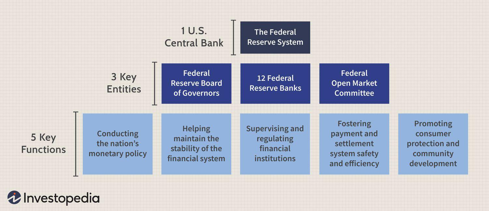

Investment valuation techniques are indispensable in assessing market conditions and determining asset pricing. These techniques, encompassing diverse models and methods, provide investors with insights into the relative value of stocks, bonds, and other financial instruments, which can inform trading and investment decisions. A critical tool among these valuation techniques is the Federal Reserve Model, commonly referred to as the Fed Model. Although unofficial and not endorsed by the Federal Reserve itself, this model plays a significant role in market timing by evaluating the relationship between stock valuations and bond yields.

The Fed Model operates on the principle of comparing the earnings yield of equities to the yield on long-term government bonds. It aims to determine whether equities are overvalued or undervalued compared to bonds, thus providing guidance on where investors might allocate resources. This comparison becomes particularly relevant in fluctuating economic climates, where the perception of relative value between asset classes can shift rapidly.



This article aims to explore the intricacies of the Fed Model, especially as it intersects with advanced investment strategies like algorithmic trading and the analysis of economic indicators. In an era where financial markets are increasingly data-driven, understanding the interplay between traditional valuation models and new technology is crucial for investors seeking to refine their strategies. Algorithmic trading enables the integration of real-time data and empirical models into investment practices, enhancing predictive accuracy and allowing for quicker adaptation to market movements.

As the financial landscape evolves, so too must the tools that investors use. Technological advancements provide opportunities to enhance traditional models, but they also pose new challenges that must be addressed. Throughout this exploration, we will consider the benefits and constraints of the Fed Model, examine the influence of macroeconomic factors on its efficacy, and assess the potential for technological augmentation. In doing so, we aim to equip investors with a comprehensive understanding of these tools, emphasizing the importance of their adaptation in optimizing investment strategies in today's market.

## Table of Contents

## Understanding the Fed Model

The Fed Model, a tool for assessing market valuation, involves comparing the earnings yield of the stock market with the yield on long-term government bonds. This model provides a straightforward method to determine if stocks are overpriced or underpriced relative to bonds, relying on the relationship between these two yield measures. The earnings yield, calculated as the inverse of the price-to-earnings (P/E) ratio, represents the percentage of each dollar invested in the stock market that is earned by investors annually. 

The Fed Model posits that, under normal market conditions, the earnings yield of equities should be comparable to the yield on long-term Treasury bonds. Therefore, when the earnings yield exceeds bond yields, stocks may be considered undervalued. Conversely, if bond yields surpass earnings yields, equities might be regarded as overvalued. This comparison provides a snapshot of market sentiment, with a wide earnings yield-bond yield gap signaling potential buying or selling opportunities.

Economist Ed Yardeni introduced the Fed Model in the 1990s, though it lacks formal endorsement by the Federal Reserve. Despite this, it remains influential, as its simplicity makes it accessible for investors seeking to understand the interplay between stock and bond markets. The model operates on the principle that both equities and bonds are competing investments; hence their yields should be aligned to reflect similar risk-adjusted returns.

While the model provides valuable insights into market valuation, it assumes that the relationship between stock and bond yields is static over time, which may not always hold true. Markets are dynamic, affected by various economic factors such as inflation expectations, [interest rate](/wiki/interest-rate-trading-strategies) changes, and monetary policy adjustments. As such, while the Fed Model can be a useful indicator of market sentiment, it is most effective when used in conjunction with other analytical tools and economic indicators to account for broader market dynamics.

## Economic Indicators and the Fed Model

Economic indicators are crucial in assessing the Fed Model's effectiveness by influencing the relationship between stock market earnings yields and government bond yields. Bond yields, inflation, and interest rates are key components that directly impact this relationship.

1. **Bond Yields and Stock Valuation**: Bond yields serve as a critical benchmark in the Fed Model, setting a comparative baseline for stock earnings yields. When bond yields are low, stocks may appear more attractive as they offer higher potential returns, resulting in the perception that stocks are undervalued. Conversely, higher bond yields can make stocks seem less appealing, suggesting overvaluation. This inverse relationship indicates how shifts in bond yields can alter the stock-bond dynamic, prompting adjustments in the Fed Model's predictions.

2. **Influence of Inflation and Interest Rates**: Inflation and interest rate patterns can modify both bond yields and corporate earnings. High inflation often leads to increased interest rates as central banks attempt to curb inflationary pressures. Elevated rates result in higher bond yields, influencing the relative attractiveness of equities. Conversely, low inflation and interest rates typically result in lower bond yields, potentially boosting stock appeal in the Fed Model. Thus, fluctuations in inflation and interest rates necessitate regular adjustments to maintain the model's effectiveness.

3. **Economic Reports and Data Releases**: Regular economic reports, such as employment figures, GDP growth, and consumer confidence indices, provide data that investors use to fine-tune the Fed Model's output. For instance, a strong jobs report might signal economic expansion, suggesting potential earnings growth for companies, thereby altering stock earnings yield expectations. Similarly, unexpected changes in inflation data can immediately ripple through bond and stock markets, necessitating revisions to the Fed Model's predictions.

4. **Monitoring Economic Changes**: Continuous assessment of these economic indicators is essential for the Fed Model's reliability. Investors must remain vigilant to macroeconomic developments, particularly those affecting interest rates and bond yields, to keep their analyses relevant and actionable. The dynamic nature of economic indicators means the Fed Model's inputs must be consistently updated to provide accurate market assessments.

5. **Real-World Examples**: Historical instances where economic indicators have aligned with or contradicted the Fed Model add valuable context. During the late 1990s, for example, despite the model suggesting overvaluation due to high stock prices, the tech boom resulted in continued stock market gains, highlighting a discrepancy influenced by unprecedented technological advancement and investor optimism. More recently, the low-interest-rate environment post-2008 financial crisis saw bond yields fall, which, according to the Fed Model, indicated undervaluation and aligned with the subsequent bullish trajectory of equity markets. Such cases demonstrate both the model's utility and limitations in capturing complex economic scenarios.

Understanding these economic indicators improves the practical use of the Fed Model, providing investors with a powerful tool for aligning valuation assessments with market conditions, thereby crafting informed investment strategies.

## Algorithmic Trading with the Fed Model

The integration of the Fed Model into [algorithmic trading](/wiki/algorithmic-trading) systems signifies a notable progression in the sphere of investment valuation. By leveraging algorithmic capabilities, the predictive power of the Fed Model can be substantially enhanced through the incorporation of real-time data and complex computational processes.

Algorithms can assimilate vast volumes of data swiftly, making it possible to update and refine predictions as new information becomes available. Such integration allows traders to automate decision-making processes based on the Fed Model's assessments of stock and bond yields. The primary advantage of this method is the ability to react quickly to market changes, ensuring that investment strategies remain aligned with the most recent economic indicators.

Python, a preferred language in financial analysis, can be employed to execute an algorithmic trading strategy incorporating the Fed Model. Below is a simplified Python code example illustrating this process:

```python
import numpy as np
import pandas as pd
from pandas_datareader import data as pdr
import yfinance as yf  # For more datasets, visit: https://paperswithbacktest.com/datasets
yf.pdr_override()

# Fetch stock market and bond data
stock_data = pdr.get_data_yahoo('SPY', start='2020-01-01', end='2023-01-01')
bond_yield = pdr.get_data_yahoo('^TNX', start='2020-01-01', end='2023-01-01')['Close']

# Calculate earnings yield
earnings_yield = 1 / stock_data['Close']

# Implement Fed Model logic
def fed_model_signal(earnings_yield, bond_yield):
    # Generate signals
    signals = np.where(earnings_yield > bond_yield, 1, 0)  # 1 for buy, 0 for sell/hold
    return signals

signals = fed_model_signal(earnings_yield, bond_yield)

# Display signals
print(signals)
```

This algorithm takes financial data for a specific period, calculates the earnings yield based on stock prices, and compares it against bond yields to generate trading signals. The generated signals can be used to automate buy or hold orders, thus optimizing investment strategies.

However, integrating the Fed Model into algorithmic trading systems is not without challenges. In volatile markets, rapid price movements can introduce significant noise into the algorithm's input data, potentially leading to erroneous signals. Moreover, the simplistic nature of the Fed Model might overlook other critical factors influencing market dynamics.

One limitation is the model's reliance on historical data, which may not accurately capture unpredictable economic shifts. Additionally, the model assumes a stable relationship between stock earnings yields and bond yields, which can vary significantly in different economic conditions.

Algorithmic trading strategies using the Fed Model must also account for these potential discrepancies to avoid significant losses. A multi-faceted approach, leveraging other quantitative models alongside the Fed Model, may mitigate some of these risks, potentially enhancing decision-making efficacy.

In summary, the integration of the Fed Model with algorithmic trading offers a dynamic method for refining investment strategies. Although beneficial, investors must be mindful of the model's limitations in volatile markets and consider complementing it with other analytical tools for more robust trading strategies.

## Challenges and Criticisms of the Fed Model

The Fed Model, despite its popularity, has faced considerable scrutiny over its effectiveness, particularly in predicting major market downturns. Critics argue that its simplistic approach might fail under complex market conditions. One significant area of concern is the blending of real and nominal yields. The model assumes direct comparability between stock earnings yields and bond yields without adequately adjusting for inflationary effects, potentially leading to misleading conclusions.

For example, the nominal yield on a bond includes an inflation premium, whereas stock earnings yields are often considered in real terms, leading to inconsistency in the model’s comparisons. This discrepancy can skew the model’s output, especially in volatile inflationary periods. Proper adjustment for inflation would require a more nuanced comparison—typically involving real yields or inflation-adjusted metrics—though the model does not inherently account for these variations.

Additionally, the correlation between stock and bond yields is not static. Historical data shows variability across different economic eras, influenced by macroeconomic factors such as monetary policies and global economic conditions. For instance, periods of high economic uncertainty or changing interest rate environments can alter the typical inverse relationship between bond prices and yields, affecting the model's predictions about stock valuation.

Inflation and shifting macroeconomic conditions further complicate the Fed Model's application. As inflation rises, the real value of fixed income from bonds decreases, potentially making stocks more attractive despite higher nominal yields. However, the model might erroneously suggest overvaluation due to these altered dynamics. As such, relying solely on the Fed Model may lead investors astray during times of significant inflation or economic change.

In response to these criticisms, alternative models have been developed to address the shortcomings of the Fed Model. One approach involves the use of the Equity Risk Premium (ERP), which considers the difference between equity market returns and risk-free rate returns, adjusting for expected inflation. ERP provides a more comprehensive view of stock valuations relative to bonds by factoring in additional risk assessments and expected economic conditions.

Another alternative is the CAPE (Cyclically Adjusted Price Earnings) ratio, which adjusts earnings for inflation over a longer period, offering a more stable and historically contextual benchmark for assessing stock market valuations. These models, while not without their limitations, aim to provide a more robust framework for evaluating market conditions compared to the relatively simplistic Fed Model.

Consequently, financial analysts and investors must weigh the Fed Model’s insight against its limitations and consider integrating more sophisticated models and methods to achieve a more accurate market assessment. Balancing traditional and contemporary approaches to valuation may enhance decision-making effectiveness in the ever-evolving financial landscape.

## Conclusion

The exploration of the Fed Model, alongside economic indicators and algorithmic trading, underscores a multifaceted approach to investment valuation. The Fed Model's ability to compare earnings yields with bond yields offers investors a simplified yet insightful view of market valuation, serving as a tool for assessing whether stocks are relatively overvalued or undervalued. However, this model alone cannot account for the dynamic complexities of financial markets, which is why integrating a nuanced understanding of economic indicators such as inflation and interest rates is essential. These variables significantly influence the interpretation of stock-bond yield relationships, impacting investment decisions and the overall predictive power of the Fed Model.

As financial markets continue to evolve, there is significant potential for advancements in financial modeling and technology integration. Algorithmic trading, for instance, stands to benefit from the inclusion of traditional models like the Fed Model, as algorithms can process vast amounts of data in real-time, offering enhanced predictive capabilities and optimizing investment strategies. This integration allows for adaptive models that respond more accurately to market fluctuations, although challenges exist, especially in terms of managing algorithmic risk in volatile markets.

Despite criticisms and limitations, the Fed Model remains relevant in today's rapidly changing financial landscape. Its continued refinement and adaptation, coupled with algorithmic trading and enriched data analysis, open the door for hybrid models that harness both traditional metrics and modern technological resources. These innovations promise improved decision-making frameworks that align with contemporary market conditions.

Encouraging further research and exploration into hybrid models is vital, as the fusion of traditional valuation techniques with emerging technologies can yield powerful tools for investors. This approach not only enhances the accuracy and reliability of market assessments but also prepares the investment community to navigate future financial challenges with greater resilience and insight.

## References & Further Reading

1. **Key Articles and Papers**:
   - Yardeni, E. (1997). "Fed's Stock Market Model: The Rational Valuation of Equity Securities." Yardeni Research, Inc. This foundational paper explores the rationale behind using stock market earnings and bond yields for valuation.
   - Asness, C. S. (2003). "Fight the Fed Model: The Relationship Between Future Returns and Stock and Bond Market Yields." The Journal of Portfolio Management. This paper critiques the Fed Model and discusses its limitations, providing a counter-perspective to traditional interpretations.

2. **Investment Valuation Models**:
   - Damodaran, A. (2012). *Investment Valuation: Tools and Techniques for Determining the Value of Any Asset*. Wiley Finance. Aswath Damodaran's book is a comprehensive guide covering a range of valuation techniques, including those related to the Fed Model.
   - Penman, S. H. (2012). *Financial Statement Analysis and Security Valuation*. This book offers insights into analyzing financial statements and security valuation, which complement the understanding of models like the Fed Model.

3. **Algorithmic Trading Strategies**:
   - Chan, E. (2009). *Quantitative Trading: How to Build Your Own Algorithmic Trading Business*. Wiley Trading. Ernie Chan's work provides practical insights into building algorithmic trading systems, including integrating traditional models like the Fed Model.
   - Derman, E., & Wilmott, P. (pro.). *The Financial Modeler's Manifesto*. This text discusses the philosophy behind financial modeling, stressing models' importance in algorithmic trading.

4. **Foundational Texts in Financial Analysis**:
   - Fabozzi, F. J. (2000). *Bond Markets, Analysis, and Strategies*. Fabozzi's work is a staple for anyone looking to understand the intricacies of bond markets, crucial for using the Fed Model.
   - Bodie, Z., Kane, A., & Marcus, A. J. (2018). *Investments*. McGraw-Hill Education. This textbook covers a wide range of investment topics, including portfolio theory, which can help understand the Fed Model's context.

5. **Educational Courses and Simulations**:
   - Coursera offers several courses on financial markets and investment strategies, such as "Financial Markets" by Yale University. These courses provide foundational knowledge necessary for understanding and applying models like the Fed Model.
   - Investopedia offers simulations and articles that allow users to practice investment strategies, including applying the Fed Model in a controlled environment. Their stock simulator can be a useful tool for practical application.

These resources serve as a comprehensive guide for anyone interested in exploring the Fed Model further, providing a mix of theoretical and practical insights into investment valuation and algorithmic trading.

