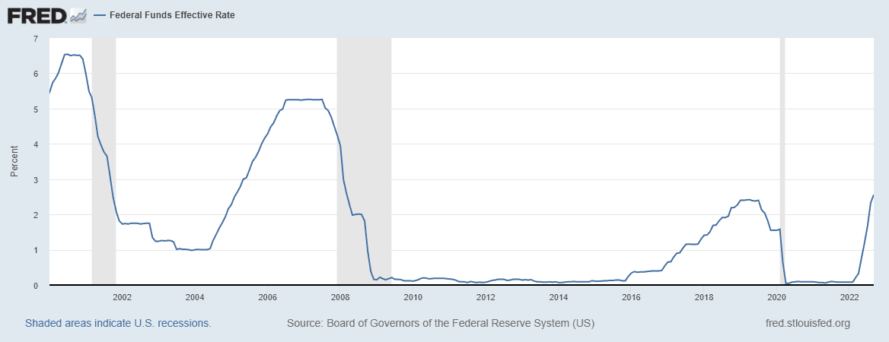

## Table of Contents

## What is the Federal Reserve?

The Federal Reserve, often called the Fed, is the central bank of the United States. It was created in 1913 to provide the nation with a safer, more flexible, and more stable monetary and financial system. The Fed is responsible for managing the country's money supply, setting interest rates, and overseeing the banking system. Its main goals are to control inflation, maintain employment, and ensure the stability of the financial system.

The Federal Reserve is made up of twelve regional banks spread across the country, each serving a specific area. These banks work together under the guidance of the Federal Reserve Board, which is based in Washington, D.C. The Board sets policies and makes key decisions, while the regional banks carry out these policies and provide services to banks in their areas. Together, they help to keep the economy running smoothly by adjusting interest rates and other tools to respond to economic changes.

## What does it mean when the Federal Reserve pivots?

When people say the Federal Reserve pivots, they mean that the Fed is changing its main approach or strategy. Usually, this refers to a shift in how the Fed handles interest rates. For example, if the economy is growing too fast and prices are going up a lot, the Fed might raise interest rates to slow things down. But if they see that the economy is slowing down too much or there's a risk of a recession, they might decide to lower interest rates instead. This change in direction is what people call a pivot.

A pivot can be important because it shows that the Fed is responding to new information about the economy. It's like steering a big ship; when conditions change, the captain might need to turn the wheel to keep the ship on [course](/wiki/best-algorithmic-trading-courses). When the Fed pivots, it can affect borrowing costs for everyone, from big businesses to regular people taking out loans. This can influence how much people spend and invest, which in turn affects the overall economy.

## Why is a Federal Reserve pivot significant for the economy?

A Federal Reserve pivot is important for the economy because it shows that the Fed is changing its main plan to help keep things stable. When the Fed pivots, it usually means they are either raising or lowering interest rates. Interest rates affect how much it costs to borrow money. If the Fed raises rates, borrowing gets more expensive, and people might spend less. If they lower rates, borrowing gets cheaper, and people might spend more. This can help control whether the economy grows too fast or too slow.

The Fed might decide to pivot if they see big changes in the economy, like if prices are going up too fast or if too many people are losing their jobs. By changing interest rates, the Fed tries to keep the economy balanced. For example, if the economy is slowing down and people are worried about losing their jobs, the Fed might lower rates to encourage more spending and investment. On the other hand, if prices are rising too quickly, the Fed might raise rates to cool things down. These changes can have a big impact on businesses, consumers, and the overall health of the economy.

## How can you identify signs of a Federal Reserve pivot?

You can spot signs of a Federal Reserve pivot by paying attention to what the Fed says and does. If the Fed starts talking differently about the economy, like saying they're more worried about inflation or unemployment, that can be a clue. They might also change their predictions about where they think interest rates are headed. For example, if they start saying they might raise or lower rates sooner than they thought, that's a sign they might be getting ready to pivot.

Another way to tell is by watching what the Fed actually does with interest rates. If they start making small changes to rates, like raising or lowering them a little bit, it could mean they're getting ready for a bigger change. Also, look at what the Fed is doing with other tools, like buying or selling government bonds. If they start doing more of this, it might mean they're trying to influence the economy in a new way, which could be part of a pivot.

## What historical examples are there of Federal Reserve pivots?

One famous example of a Federal Reserve pivot happened in the early 1980s. Back then, inflation was really high, and the Fed, led by Paul Volcker, decided to raise interest rates a lot to fight it. This made borrowing very expensive and slowed down the economy. But when inflation started to come down, the Fed realized they needed to change their approach. So, they started lowering interest rates in the mid-1980s. This pivot helped the economy start growing again without inflation getting out of control.

Another example was during the financial crisis in 2008. At first, the Fed was raising interest rates because they thought the economy was doing okay. But when the crisis hit, and banks started failing, the Fed quickly pivoted. They lowered interest rates to almost zero and started buying lots of bonds to put more money into the economy. This big change helped stop the crisis from getting worse and started the long process of recovery.

A more recent example happened in 2019 and 2020. The Fed had been slowly raising interest rates to keep the economy from growing too fast. But when the economy started slowing down more than expected, they pivoted and started cutting rates again. Then, when the COVID-19 pandemic hit, the Fed made another big pivot. They dropped rates to zero and started buying even more bonds to help businesses and people get through the tough times. These moves were crucial in keeping the economy from collapsing during the crisis.

## How do Federal Reserve pivots affect interest rates?

When the Federal Reserve pivots, it means they are changing their main plan for the economy, which often involves changing interest rates. If the Fed thinks the economy is growing too fast and prices are going up too much, they might pivot by raising interest rates. This makes it more expensive for people and businesses to borrow money, which can slow down spending and help control inflation. On the other hand, if the economy is slowing down too much or there's a risk of a recession, the Fed might pivot by lowering interest rates. This makes borrowing cheaper, encouraging people and businesses to spend and invest more, which can help boost the economy.

These changes in interest rates can have a big impact on everyone. When the Fed raises rates, people might see higher costs for things like mortgages, car loans, and credit card debt. Businesses might also borrow less, which can slow down their growth and hiring. When the Fed lowers rates, the opposite happens. Borrowing becomes cheaper, which can lead to more spending on homes, cars, and other big purchases. Businesses might also take out more loans to expand and hire more workers. So, a Federal Reserve pivot can affect the whole economy by changing how much it costs to borrow money.

## What are the implications of a Federal Reserve pivot for investors?

When the Federal Reserve pivots, it can have big effects on investors. If the Fed raises interest rates, borrowing money becomes more expensive. This can slow down the economy and make it harder for companies to grow. As a result, stock prices might go down because investors worry about lower profits. Also, when interest rates go up, bonds and other fixed-income investments start to look more attractive because they offer better returns. So, investors might move their money from stocks to bonds, which can cause stock prices to fall even more.

On the other hand, if the Fed lowers interest rates, borrowing money becomes cheaper. This can help the economy grow faster and make it easier for companies to expand and make more profits. When this happens, stock prices often go up because investors are more optimistic about the future. Lower interest rates can also make bonds less attractive, so investors might move their money back into stocks. This shift can help push stock prices higher. Overall, a Federal Reserve pivot can change where investors put their money and how they feel about the market.

## How do Federal Reserve pivots influence inflation and employment?

When the Federal Reserve pivots and changes interest rates, it can affect inflation. If the Fed raises rates, borrowing money becomes more expensive. This means people and businesses might spend less, which can slow down the economy and help lower inflation. On the other hand, if the Fed lowers rates, borrowing becomes cheaper. This can lead to more spending, which might make prices go up and cause inflation to rise. So, by changing interest rates, the Fed tries to keep inflation under control and make sure prices don't go up too fast.

Federal Reserve pivots also impact employment. If the Fed raises interest rates to fight inflation, it can make it harder for businesses to borrow money. This might cause them to slow down or stop hiring new workers, which can lead to higher unemployment. But if the Fed lowers rates to boost the economy, borrowing becomes cheaper. This can help businesses grow and hire more people, leading to lower unemployment. By adjusting interest rates, the Fed tries to balance the need for a strong job market with the need to control inflation.

## What are the global economic impacts of a Federal Reserve pivot?

When the Federal Reserve pivots and changes interest rates, it can affect the whole world's economy. The US dollar is used a lot in global trade, so when the Fed changes rates, it can make the dollar stronger or weaker. If the Fed raises rates, the dollar might get stronger, making it harder for other countries to buy American goods because they become more expensive. This can slow down their economies. But if the Fed lowers rates, the dollar might get weaker, making American goods cheaper for other countries to buy, which can help their economies grow.

These changes can also affect how much money moves around the world. When the Fed raises rates, investors might want to put their money in the US to get better returns, pulling money away from other countries. This can make it harder for those countries to grow. On the other hand, if the Fed lowers rates, investors might look for better opportunities in other countries, sending more money there and helping their economies. So, a Federal Reserve pivot can have big effects on other countries, depending on whether rates go up or down.

## How do different economic theories interpret Federal Reserve pivots?

Different economic theories have their own ways of looking at Federal Reserve pivots. Keynesian economists believe that the Fed's actions can help smooth out the ups and downs of the economy. They think that when the Fed lowers interest rates, it can boost spending and help the economy grow during tough times. On the other hand, if the Fed raises rates, it can slow down an economy that's growing too fast and help control inflation. Keynesians see the Fed's pivots as important tools for managing the economy and keeping it stable.

Monetarists, however, focus more on the money supply and believe that the Fed's pivots should be more about controlling the amount of money in the economy. They think that changes in interest rates can have big effects on how much money people and businesses have to spend. Monetarists worry that if the Fed pivots too much, it might cause more problems than it solves, like making inflation worse or causing the economy to grow too fast. They believe the Fed should be careful and predictable in its actions to avoid messing up the economy.

## What tools does the Federal Reserve use to execute a pivot?

When the Federal Reserve wants to pivot, it mainly uses interest rates to do it. If the Fed thinks the economy is growing too fast and prices are going up too much, it might raise interest rates. This makes borrowing money more expensive, which can slow down spending and help control inflation. On the other hand, if the economy is slowing down and there's a risk of a recession, the Fed might lower interest rates. This makes borrowing cheaper, encouraging people and businesses to spend and invest more, which can help boost the economy.

Besides interest rates, the Fed also uses other tools like buying or selling government bonds. When the Fed buys bonds, it puts more money into the economy, which can help it grow. When it sells bonds, it takes money out of the economy, which can help slow it down. These actions can be part of a pivot, helping the Fed change its approach to keep the economy balanced. By using these tools, the Fed can influence how much people spend and invest, which affects the overall health of the economy.

## How can predictive models be used to anticipate Federal Reserve pivots?

Predictive models can help guess when the Federal Reserve might pivot by looking at lots of information about the economy. These models use things like interest rates, inflation numbers, unemployment rates, and what the Fed is saying in its reports. By studying these pieces of information, the models can spot patterns and predict when the Fed might decide to change its plan. For example, if inflation is going up a lot and the Fed starts talking more about it, the model might predict that the Fed will raise interest rates soon to cool things down.

These models can also use past data to see how the Fed has acted before in similar situations. By comparing what's happening now to what happened in the past, the models can make good guesses about what the Fed might do next. But, it's important to remember that these models are not perfect. The economy can be tricky, and sometimes things happen that no one expects. Still, predictive models can give investors and businesses a heads-up about possible changes, helping them get ready for what might come next.

## What are the Monetary Policy Tools of the Federal Reserve?

The Federal Reserve employs several key monetary policy tools to manage the U.S. economy, including open market operations, the discount rate, and reserve requirements. These tools form the backbone of the Federal Reserve's ability to influence economic conditions, directing [liquidity](/wiki/liquidity-risk-premium) and shaping interest rates to achieve macroeconomic stability.

**Open Market Operations (OMO)** constitute one of the most frequently used tools by the Federal Reserve. This mechanism involves the buying and selling of government securities in the open market. When the Federal Reserve buys securities, it injects liquidity into the banking system, reducing interest rates and encouraging borrowing and investment. Conversely, selling securities withdraws liquidity, leading to higher interest rates and reduced economic activity. The goal is often to maintain the federal funds rate within a target range, thus influencing overall economic activity and inflation. For instance, targeting a specific federal funds rate can be expressed mathematically as:

$$
i = \frac{1}{M} \cdot \sum_{k} (\text{SECs}_k)
$$

where $i$ is the target interest rate, $M$ is the total money supply, and $\text{SECs}_k$ represents the securities transactions carried out during a period.

The **discount rate** is another critical tool. It is the [interest rate](/wiki/interest-rate-trading-strategies) charged to commercial banks for short-term loans obtained directly from the Federal Reserve's discount window. Changes to the discount rate influence the cost of borrowing for banks and consequently affect the prime rates they offer to customers, impacting consumer loans and business investments. A lower discount rate tends to promote banking activity and economic expansion, while a higher rate can help dampen inflationary pressures by making borrowing more expensive.

Lastly, **reserve requirements** refer to the portion of depositors' balances that banks must have on hand as reserves. This requirement ensures that banks maintain a buffer to meet withdrawal demands, preventing insolvency. By altering these requirements, the Federal Reserve can effectively amplify or reduce the amount of money available for banks to lend. A decrease in reserve requirements encourages lending, increasing money supply; whereas an increase constricts it, helping curb inflation.

These tools, through their ability to influence liquidity and interest rates, are essential in steering the economy toward desired macroeconomic goals, such as stable prices and maximum sustainable employment. The sophisticated use of these instruments showcases the Federal Reserve's role in navigating the complexities of economic policy.

## References & Further Reading

[1]: ["The Federal Reserve System Purposes & Functions"](https://www.federalreserve.gov/aboutthefed/files/pf_1.pdf) by The Federal Reserve System

[2]: Bernanke, B. S. (2020). ["21st Century Monetary Policy: The Federal Reserve from the Great Inflation to COVID-19."](https://wwnorton.com/books/9781324020462) W. W. Norton & Company.

[3]: Aldridge, I. (2013). ["High-Frequency Trading: A Practical Guide to Algorithmic Strategies and Trading Systems"](https://onlinelibrary.wiley.com/doi/pdf/10.1002/9781119203803.fmatter), Wiley.

[4]: Cartea, A., Jaimungal, S., & Penalva, J. (2015). ["Algorithmic and High-Frequency Trading"](https://assets.cambridge.org/97811070/91146/frontmatter/9781107091146_frontmatter.pdf), Cambridge University Press.

[5]: Hendershott, T., & Riordan, R. (2013). ["Algorithmic Trading and Information."](https://www.jstor.org/stable/43303831) The Journal of Finance, 68(1), 1-33. 

[6]: Laughlin, G., Aguirre, A., & Grundfest, J. (2014). ["Information Transmission between Financial Markets in Chicago and New York."](https://arxiv.org/abs/1302.5966) Proceedings of the National Academy of Sciences, 111(45), 15982-15987.