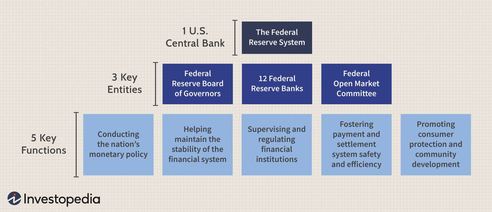

## Table of Contents

## What is the Federal Reserve System?

The Federal Reserve System, often called the Fed, is the central bank of the United States. It was created in 1913 to provide a safer, more flexible, and stable monetary and financial system. The Fed is made up of 12 regional banks spread across the country and a Board of Governors in Washington, D.C. The main job of the Federal Reserve is to manage the country's money supply, which helps control inflation and keep the economy stable.

One key way the Fed does this is by setting interest rates. When the Fed changes these rates, it can make borrowing money cheaper or more expensive. This affects how much people spend and how businesses invest, which in turn impacts the overall economy. The Fed also supervises and regulates banks to make sure they are operating safely and fairly. By doing all these things, the Federal Reserve helps to keep the U.S. economy running smoothly.

## When was the Federal Reserve System established?

The Federal Reserve System was set up in 1913. Before that, the U.S. did not have a central bank to manage the country's money. People wanted a central bank to help stop bank runs and keep the economy stable. So, the government created the Federal Reserve to do just that.

The Federal Reserve, or the Fed, started working on November 16, 1914. It was made to control the amount of money in the country and to make sure banks were safe and sound. The Fed has been helping the U.S. economy ever since by setting interest rates and watching over banks.

## What are the main functions of the Federal Reserve?

The Federal Reserve, or the Fed, has a few big jobs to help keep the U.S. economy running smoothly. One of its main jobs is to control the amount of money in the country. It does this by setting interest rates, which are like the price of borrowing money. When the Fed changes these rates, it can make borrowing cheaper or more expensive. This affects how much people spend and how businesses invest, which helps keep the economy stable and control inflation.

Another important job of the Fed is to watch over banks. It makes sure banks are safe and sound by setting rules and checking that banks follow them. This helps prevent bank failures and keeps people's money safe. The Fed also helps banks when they need money, acting like a backup to make sure the banking system stays strong.

Lastly, the Fed helps the government with money. It issues new money and manages the country's debt. This means the Fed helps the government pay for things like roads and schools by selling bonds and managing how much money the government owes. By doing all these things, the Federal Reserve plays a big role in keeping the U.S. economy healthy.

## How is the Federal Reserve structured?

The Federal Reserve is made up of two main parts: the Board of Governors and 12 regional Federal Reserve Banks. The Board of Governors is in Washington, D.C., and it has seven members who are chosen by the President and approved by the Senate. These members serve long terms to keep the Fed independent from short-term political pressures. The Board sets the rules and policies for the whole Federal Reserve System.

The 12 regional Federal Reserve Banks are spread out across the country, each serving a specific area. These banks work closely with the banks in their region, helping them follow the rules and providing them with money when they need it. Each regional bank has its own president, and these presidents, along with the Board of Governors, make up the Federal Open Market Committee (FOMC). The FOMC is very important because it decides on interest rates and other big policies that affect the whole economy.

Together, the Board of Governors and the regional banks work to keep the U.S. economy stable. They control the amount of money in the country, watch over banks to make sure they're safe, and help the government manage its money. This structure helps the Federal Reserve do its job well and keep the economy running smoothly.

## What is the role of the Federal Open Market Committee (FOMC)?

The Federal Open Market Committee (FOMC) is a very important part of the Federal Reserve. It is made up of the seven members of the Board of Governors and five of the presidents from the 12 regional Federal Reserve Banks. The FOMC meets several times a year to decide on the country's monetary policy, which is all about controlling the amount of money in the economy.

One of the main things the FOMC does is set the target for the federal funds rate, which is the [interest rate](/wiki/interest-rate-trading-strategies) banks charge each other for short-term loans. By changing this rate, the FOMC can make borrowing money cheaper or more expensive. This affects how much people spend and how businesses invest, which helps keep the economy stable and control inflation. The FOMC also decides on other policies like buying or selling government bonds, which can also change how much money is in the economy. By doing these things, the FOMC helps guide the U.S. economy to stay strong and healthy.

## How does the Federal Reserve influence interest rates?

The Federal Reserve influences interest rates mainly through the Federal Open Market Committee (FOMC). The FOMC sets the target for the federal funds rate, which is the interest rate banks charge each other for short-term loans. When the FOMC decides to change this rate, it sends a signal to the whole economy. If the FOMC raises the federal funds rate, borrowing money becomes more expensive. This can slow down spending and help control inflation. If the FOMC lowers the rate, borrowing money becomes cheaper, which can encourage spending and help boost the economy.

Another way the Federal Reserve influences interest rates is through open market operations. This means the Fed buys or sells government bonds. When the Fed buys bonds, it puts more money into the economy, which can lower interest rates. When the Fed sells bonds, it takes money out of the economy, which can raise interest rates. By doing these things, the Federal Reserve can guide the economy to grow at a healthy pace and keep prices stable.

## What tools does the Federal Reserve use to manage monetary policy?

The Federal Reserve uses a few main tools to manage the country's money and keep the economy stable. One big tool is setting the federal funds rate, which is the interest rate banks charge each other for short-term loans. The Federal Open Market Committee (FOMC) decides on this rate. When the FOMC raises the rate, borrowing money becomes more expensive, which can slow down spending and help control inflation. When they lower the rate, borrowing becomes cheaper, which can encourage spending and help the economy grow.

Another important tool is open market operations, which means the Fed buys or sells government bonds. When the Fed buys bonds, it puts more money into the economy, which can lower interest rates and encourage spending. When the Fed sells bonds, it takes money out of the economy, which can raise interest rates and slow down spending. The Fed also uses a tool called the reserve requirement, which is the amount of money banks have to keep on hand. By changing this requirement, the Fed can control how much money banks can lend out, which also affects the economy.

## How does the Federal Reserve regulate and supervise banks?

The Federal Reserve keeps an eye on banks to make sure they are safe and fair. It does this by setting rules that banks have to follow. These rules cover things like how much money banks need to keep on hand and how they should handle their customers' money. The Fed checks that banks are following these rules by doing regular check-ups and reviews. If a bank is not following the rules, the Fed can step in and make the bank fix the problem.

The Fed also helps banks when they need money. It acts like a backup bank, lending money to banks that are in trouble. This helps stop bank runs, where lots of people try to take their money out at the same time. By doing this, the Fed helps keep the whole banking system strong and stable. This way, people can trust that their money is safe in the bank.

## What is the impact of the Federal Reserve's policies on inflation and employment?

The Federal Reserve's policies have a big effect on inflation, which is how fast prices are going up. When the Fed wants to keep inflation under control, it can raise interest rates. This makes borrowing money more expensive, so people and businesses spend less. When people spend less, prices don't go up as fast, and that helps keep inflation in check. On the other hand, if the Fed thinks inflation is too low, it can lower interest rates to make borrowing cheaper. This encourages people and businesses to spend more, which can help push prices up a bit.

The Fed's policies also impact how many people have jobs, which we call employment. When the Fed lowers interest rates, it's easier for businesses to borrow money to grow and hire more workers. This can lead to more jobs and lower unemployment. But if the Fed raises interest rates to fight inflation, borrowing becomes more expensive, and businesses might not grow as much or hire as many people. So, the Fed has to balance its actions to keep both inflation and employment at healthy levels.

## How does the Federal Reserve interact with the U.S. Treasury?

The Federal Reserve and the U.S. Treasury work together but have different jobs. The Federal Reserve is like the country's central bank, and it controls the amount of money in the economy. It does this by setting interest rates and buying or selling government bonds. The U.S. Treasury, on the other hand, is part of the government and is in charge of the country's money. It collects taxes, pays the government's bills, and manages the country's debt by issuing bonds.

When the U.S. Treasury needs to borrow money, it sells bonds. The Federal Reserve can help by buying these bonds, which puts more money into the economy. This can help keep interest rates low and make it easier for the government to borrow. But the Federal Reserve tries to stay independent from the government to make sure its decisions are based on what's best for the economy, not just what the government wants. So, while they work together, they each have their own important roles to play.

## What are some historical examples of Federal Reserve interventions during economic crises?

One big example of the Federal Reserve stepping in during an economic crisis was during the Great Depression in the 1930s. Back then, banks were failing, and people were losing their jobs left and right. The Federal Reserve tried to help by lowering interest rates and buying government bonds to put more money into the economy. But at first, they didn't do enough, and the economy kept getting worse. It wasn't until later, when they took bigger steps, that things started to get better. This showed how important it is for the Fed to act quickly and strongly during tough times.

Another important time was during the 2008 financial crisis. Banks were in big trouble because they had made risky loans that people couldn't pay back. The Federal Reserve stepped in by lowering interest rates to almost zero to make borrowing easier. They also started a big program called "quantitative easing," where they bought lots of bonds to put more money into the economy. This helped stop the crisis from getting worse and helped the economy start to recover. These actions showed how the Fed can use its tools to help during a crisis and get the economy back on track.

## How does the Federal Reserve's policy affect global financial markets?

The Federal Reserve's policies can have a big impact on financial markets all around the world. When the Fed changes interest rates or does something like buying or selling bonds, it affects how much money is in the U.S. economy. This can change how much people and businesses in other countries want to invest in the U.S. If the Fed raises interest rates, it can make U.S. investments more attractive because people can earn more from them. This can lead to more money flowing into the U.S., which can affect exchange rates and make the U.S. dollar stronger. On the other hand, if the Fed lowers rates, it can make U.S. investments less attractive, and money might flow out of the U.S. to other countries.

These changes in the U.S. economy and money flows can also affect how other countries manage their own economies. For example, if the Fed raises rates and the U.S. dollar gets stronger, other countries might find it harder to sell their goods in the U.S. because their products become more expensive for Americans. This can lead to slower growth in those countries. Also, when the Fed makes big moves like it did during the 2008 financial crisis, it can help calm down global financial markets. Other central banks might follow the Fed's lead and take similar actions to help their own economies. So, what the Federal Reserve does can have a ripple effect around the world.

## References & Further Reading

[1]: ["The Federal Reserve System Purposes and Functions"](https://www.federalreserve.gov/aboutthefed/files/pf_1.pdf) by Board of Governors of the Federal Reserve System

[2]: Bernanke, B. S., & Blinder, A. S. (1992). ["The Federal Funds Rate and the Channels of Monetary Transmission."](https://www.jstor.org/stable/2117350) American Economic Review, 82(4), 901-921.

[3]: Carlin, B. I., & Lobo, M. S. (2012). ["Financial Market Complexity and Investor Information Environment."](https://www.anderson.ucla.edu/documents/areas/fac/finance/carlin_liquidation_distress.pdf) Real Estate Economics, 40(2), 367-398.

[4]: "Algorithmic Trading: Winning Strategies and Their Rationale" by Ernie Chan

[5]: Hendershott, T., Jones, C. M., & Menkveld, A. J. (2011). ["Does Algorithmic Trading Improve Liquidity?"](https://onlinelibrary.wiley.com/doi/full/10.1111/j.1540-6261.2010.01624.x) Journal of Finance, 66(1), 1-33.

[6]: Aldridge, I. (2013). ["High-Frequency Trading: A Practical Guide to Algorithmic Strategies and Trading Systems"](https://www.amazon.com/High-Frequency-Trading-Practical-Algorithmic-Strategies/dp/1118343506) Wiley Finance.

[7]: "The Financial Crisis Inquiry Report: Final Report of the National Commission on the Causes of the Financial and Economic Crisis in the United States" by The Financial Crisis Inquiry Commission