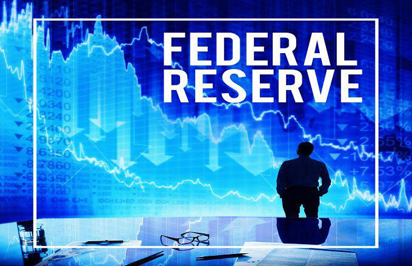

The financial world has witnessed significant transformations over the past few decades, driven by both advancements in technology and evolving monetary policies. Central bank activities, particularly those of the Federal Reserve, have become pivotal in determining market dynamics. One of the fundamental tools employed by the Federal Reserve is tapering, the gradual reduction of asset purchases, which is primarily utilized to manage inflation risks and control liquidity as the economy stabilizes.

Algorithmic trading, or algo trading, has emerged as an indispensable component of modern financial markets, providing unprecedented speed and efficiency in executing trades. This form of trading utilizes complex algorithms to analyze large datasets, allowing for rapid and precise trade execution with minimal human intervention. While algorithmic trading significantly boosts market efficiency, it also poses unique challenges, especially during economic phases characterized by tapering.

This article examines the interaction between Federal Reserve tapering, financial markets, and algorithmic trading, focusing on how these components interact and shape the broader economy. Tapering impacts markets by altering interest rate expectations and asset prices, often leading to heightened volatility as investors adjust their portfolios in response to new information. Algorithmic trading can amplify these market reactions due to its inherent speed and capacity to process and act on vast amounts of data rapidly.

For investors, policymakers, and financial analysts, understanding the implications of tapering and algorithmic trading is crucial. These elements not only influence market stability but also offer insights into future economic trends and regulatory considerations. This exploration aims to shed light on the intricate dynamics of financial markets amid tapering events and assess the role of algorithmic trading in both enhancing and potentially destabilizing market conditions.

## Table of Contents

## Understanding Federal Reserve Tapering

Tapering is the process by which a central bank gradually reduces its asset purchases, particularly in response to signs of economic recovery. This monetary policy tool is employed to adjust the level of monetary stimulus in the economy. The Federal Reserve's tapering strategy is designed to manage inflationary pressures and control liquidity conditions once the immediate need for extraordinary monetary support diminishes post-crisis.

Historically, the Federal Reserve has utilized tapering in significant economic recovery phases. Notable examples include the period following the 2008 financial crisis and the more recent steps taken after the COVID-19 pandemic. In both cases, the Federal Reserve initially adopted expansive monetary measures, such as large-scale purchases of government securities and other assets, to stabilize financial markets and support economic growth. As the economy showed signs of stabilization, the Fed gradually reduced these asset purchases to avoid overheating and manage inflationary risks.

The underlying objective of tapering is to normalize monetary policy. By reducing its asset purchases, the Federal Reserve seeks to prevent asset bubbles from forming and to realign market expectations with its policy intentions. This gradual shift signals to the financial markets that the central bank is confident in the economy's strength and no longer sees the need for extensive monetary support.

Financial markets often respond sensitively to announcements of tapering. Changes in asset purchase levels can lead to shifts in bond yields and stock prices, as investors adjust their portfolios in anticipation of altered [interest rate](/wiki/interest-rate-trading-strategies) prospects. Tapering announcements are closely monitored as they provide insights into the central bank's future policy direction and economic outlook.

A well-communicated tapering strategy helps to manage market expectations, thus minimizing the risk of sudden market disruptions. The Federal Reserve's experience during tapering phases indicates that careful communication and signaling are crucial for ensuring market stability and a smooth transition toward more conventional monetary policy settings.

## Algorithmic Trading: An Overview

Algorithmic trading utilizes computer programs to execute trades based on pre-defined criteria, offering enhanced speed and precision compared to manual trading methods. This form of trading has become prevalent due to its ability to handle large volumes of data and execute orders at speeds impossible for human traders.

Algorithmic trading strategies vary, with some of the most notable being high-frequency trading ([HFT](/wiki/high-frequency-trading-strategies)), [trend following](/wiki/trend-following), and statistical [arbitrage](/wiki/arbitrage). High-frequency trading is characterized by extremely quick transaction times and large volumes, exploiting even the smallest price discrepancies in the market. Trend following, on the other hand, involves algorithms that monitor market data to identify and capitalize on ongoing market trends. Statistical arbitrage uses complex mathematical models to identify and exploit relative price discrepancies between correlated securities.

These algorithms analyze vast datasets to identify market inefficiencies and execute complex trade orders with minimal human intervention. Their capacity to process information at unprecedented speeds allows for more dynamic market engagement, often leading to the discovery of trading opportunities that may not be apparent through traditional means.

The widespread adoption of [algorithmic trading](/wiki/algorithmic-trading) has contributed significantly to market [liquidity](/wiki/liquidity-risk-premium) and operational efficiency. By facilitating more transactions at quicker rates, algorithmic trading provides much-needed liquidity, enabling smoother and more stable market operations. However, it also raises concerns regarding market stability and [volatility](/wiki/volatility-trading-strategies). Instances of rapid and significant market movements, sometimes exacerbated by algorithmic trading, have led to debates over its impact on financial stability.

The mechanics and strategies of algorithmic trading are critical to assess its role in financial markets, especially during tapering events when market conditions can change rapidly. During such periods, understanding how algorithmic trading reacts to new information and market dynamics is vital for investors, policymakers, and analysts aiming to mitigate potential risks while capitalizing on opportunities presented by these advanced trading technologies.

## The Role of Tapering in Financial Markets

Tapering, the process by which central banks gradually reduce the pace of asset purchases, is a significant policy tool used to signal adjustments in monetary policy. It mainly influences financial markets by altering expectations regarding future interest rates and impacting asset valuations. The anticipation or announcement of tapering often leads to market volatility as investors reassess their portfolios based on the shifting monetary landscape.

A notable example of this market reaction is the "taper tantrum" of 2013. During this period, the Federal Reserve hinted at reducing its quantitative easing program, leading to a rapid sell-off in the bond market and a spike in yields. This reaction highlighted how sensitive markets can be to changes in monetary policy, even when actual policy shifts are only suggested rather than implemented. The intention behind tapering is generally to stabilize economic conditions by gradually withdrawing monetary support, thereby averting potential inflationary pressures or asset bubbles.

Central banks, acknowledging the potential for market disruption, often aim to communicate their strategies clearly and in advance to minimize shock. Effective communication can prepare markets for forthcoming changes, reducing the likelihood of drastic shifts in investor behavior. This task requires balancing the need for transparency with maintaining enough flexibility to adjust policies as economic conditions evolve.

Studies of past tapering events reveal patterns in market behavior and inform strategies for investors. Investors typically seek to hedge against interest rate risks or shift towards assets with perceived lower risk. Additionally, historical analyses suggest that gradual and well-telegraphed tapering strategies tend to lead to less volatility, as opposed to abrupt changes that catch markets off guard.

The impact of tapering on financial markets underscores the intricate link between policy decisions and market dynamics. Policymakers must navigate these complexities to maintain economic stability while encouraging growth, taking into account both domestic and global economic conditions. Understanding these interactions is essential for investors and financial analysts aiming to anticipate and respond effectively to monetary policy changes.

## Algorithmic Trading in the Context of Tapering

Algorithmic trading has become a significant force in financial markets, particularly during periods of monetary policy changes such as Federal Reserve tapering. The rapid execution capabilities of algorithmic systems allow them to react almost instantaneously to news and data, thereby potentially magnifying market reactions to tapering announcements. This phenomenon was notably observed during the 2013 taper tantrum when Federal Reserve Chairman Ben Bernanke's indication of a potential reduction in asset purchases led to heightened market volatility. Algorithmic trading systems, programmed to respond to macroeconomic data and news, executed trades that contributed to pronounced fluctuations in asset prices as market participants adjusted their expectations of future monetary policy.

The rapid speed at which algorithmic trading operates can lead to cascading effects in financial markets. This occurs when the automatic execution of large volumes of trades within short time frames drives substantial price movements, further triggering additional algorithmic strategies. As prices rapidly shift, the volatility is amplified, potentially destabilizing markets in the short term. The sheer speed and [volume](/wiki/volume-trading-strategy) of trades executed by algorithms can create a feedback loop, heightening the response to tapering announcements beyond what might occur with human traders alone.

To mitigate the risks associated with algorithmic trading during such periods of market stress, regulatory measures are continually developed and refined. Ensuring the stability of financial markets involves addressing the challenges posed by algorithmic trading, which include implementing circuit breakers to halt trading during extreme volatility and enhancing transparency around algorithmic strategies. Regulators focus on reducing systemic risks by requiring disclosures about the nature and behavior of algorithms to better understand their potential impact on market stability.

The dual role that algorithmic trading plays in providing liquidity and contributing to market volatility underscores the necessity for a well-considered regulatory framework. While these systems facilitate efficient and liquid markets by offering a constant presence of buy and sell orders, their potential to exacerbate volatility necessitates measures that balance innovation with market safety. Policymakers and regulators must continue to assess and adapt regulatory strategies to ensure that the benefits of algorithmic trading can be realized without compromising financial market integrity.

## Regulatory Challenges and Considerations

Regulating algorithmic trading poses significant challenges due to its inherent speed, complexity, and the opacity of proprietary algorithms. These challenges require a multifaceted regulatory approach to ensure both market integrity and stability.

### Ensuring Transparency

One of the primary regulatory focuses is ensuring transparency in algorithmic trading activities. The proprietary nature of many trading algorithms means they are often considered trade secrets, complicating regulatory oversight. Regulators aim to strike a balance between protecting intellectual property and obtaining sufficient information to monitor market activities effectively. Implementing real-time monitoring systems that can analyze trading patterns and detect anomalies is a critical step towards achieving greater transparency.

### Implementing Circuit Breakers

Circuit breakers are mechanisms designed to temporarily halt trading on an exchange to prevent panic-selling and massive price swings. These tools are vital in managing systemic risks, particularly during periods of market stress induced by abrupt news or economic policy shifts like tapering. By pausing trading, circuit breakers provide a necessary buffer, allowing time for information to disseminate and for rational investor behavior to resume.

### Managing Systemic Risks

Algorithmic trading can introduce systemic risks due to its potential to trigger cascading market effects. The rapid execution of algorithmic trades, if not properly regulated, can exacerbate market volatility and lead to flash crashes. Regulators focus on building robust risk management frameworks that include stress testing of algorithmic systems and ensuring that firms have adequate risk controls and governance procedures in place.

### International Cooperation and Harmonized Standards

Given the global nature of financial markets, international cooperation is crucial in addressing cross-border implications of algorithmic trading. Disparities in regulatory standards can lead to arbitrage opportunities and regulatory loopholes. Developing harmonized international standards helps create a level playing field and ensures that market participants adhere to consistent practices, reducing systemic risks on a global scale.

### Balancing Innovation and Market Stability

As financial markets continue to evolve and incorporate advanced trading technologies, regulators face the ongoing challenge of balancing the benefits of innovation with the need for market stability. Encouraging innovation without compromising market safety involves continuous dialogue with industry stakeholders to adapt regulatory frameworks to technological advancements.

### Collaborative Approach

Addressing these regulatory challenges necessitates collaboration among market participants, regulators, and policymakers. Engaging in open dialogues about the potential risks and benefits of algorithmic trading can lead to more informed policy decisions. Collaborative efforts also include developing industry best practices and self-regulatory organizations that can act as effective intermediaries between the industry and regulators.

In conclusion, dealing with the regulatory challenges of algorithmic trading is an ongoing process that requires adaptive strategies and cooperative efforts. By focusing on transparency, risk management, and international cooperation, regulators can better safeguard the financial markets against the complexities introduced by rapid technological advancements.

## Evaluating the Impact of Algorithmic Trading

Algorithmic trading, a cornerstone of modern financial markets, is renowned for its ability to enhance efficiency and liquidity through high-speed execution and data-driven strategies. It allows for the rapid processing of vast datasets to identify market inefficiencies and execute trades with minimal human intervention. This efficiency contributes to tighter bid-ask spreads and increased trading volumes, which are beneficial for overall market liquidity.

However, algorithmic trading is not without its drawbacks. One significant risk is the potential for increased market volatility. Algorithms, particularly those used in high-frequency trading (HFT), can exacerbate price swings by executing large volumes of trades in response to market signals, leading to sudden and sharp movements in asset prices. Furthermore, the opaque nature of proprietary trading algorithms can lead to system failures or "flash crashes," where markets experience dramatic falls in value within a very short time, unsettling confidence among investors.

The "Taper Tantrum" of 2013 offers a pertinent example for examining the influence of algorithmic trading. During this period, the Federal Reserve's announcement of potential tapering of its asset purchase program triggered a rapid sell-off in bond markets, leading to a spike in yields. Algorithmic trading strategies, designed to react to news and market conditions, likely amplified these movements. Such instances highlight the role of algo trading in magnifying market reactions and underscore the need for robust risk management frameworks.

To address these challenges, stakeholders must assess both the advantages and risks associated with algorithmic trading. This understanding can inform strategies to mitigate its potentially destabilizing impacts during market stress events like tapering. Insights gained from analyzing the interaction between tapering events and algo trading can guide the development of more resilient financial systems. Innovations such as implementing predictive analytics for better market forecasts or sophisticated risk management algorithms could enhance the adaptability and stability of financial markets.

Looking ahead, advancements in trading technologies are expected to continuously shape financial markets and influence regulatory approaches. Technologies such as [artificial intelligence](/wiki/ai-artificial-intelligence) and [machine learning](/wiki/machine-learning) could further refine trading strategies, making them more adaptive to changing market conditions. However, as these technologies evolve, ensuring regulatory frameworks keep pace with innovation is crucial to maintain market stability.

In summary, while algorithmic trading offers significant benefits, such as enhanced efficiency and liquidity, it also presents challenges that require careful assessment and management. The refinement of trading algorithms and advancements in technology will undoubtedly impact the future landscape of financial markets, making ongoing evaluation and adaptation essential for stability and growth.

## Conclusion and Future Outlook

The dynamics of financial markets are shaped by intricate interactions between central bank policies, particularly tapering, and technological advances like algorithmic trading. Central bank policies, such as those executed by the Federal Reserve, directly influence market liquidity and investor sentiment. Tapering, the gradual reduction of asset purchases by a central bank, aims to signal a shift towards normalized monetary policy and can lead to volatility in financial markets as participants adjust their expectations and portfolio allocations. 

Algorithmic trading, characterized by the use of computer algorithms to execute trades at high speed and volume, has transformed the landscape of financial markets by improving efficiency and liquidity. However, it also introduces potential risks, such as increased volatility and rapid market movements in response to policy announcements. These risks are especially pronounced during periods of monetary policy shifts, like tapering, where market reactions can be swift and amplified by automated trading systems.

Effective communication and transparency of policy intentions by central banks are crucial in mitigating market disruptions that may arise from tapering announcements. Clear guidance and forward communication from central banks can help anchor market expectations and reduce uncertainty, thus minimizing excessive volatility and fostering a more stable economic environment.

Ongoing research and regulatory adaptations play a pivotal role in managing the risks associated with algorithmic trading. Regulations aim to address concerns such as systemic risks, market manipulation, and the integrity and transparency of trading activities. Developing robust frameworks that balance the benefits of technological advancements with the need for market stability is essential for the health of global financial systems.

Stakeholders, including investors, policymakers, and regulators, must stay informed about the evolving financial landscape to effectively navigate challenges and opportunities. Understanding the nuances of both algorithmic trading and central bank policies is vital for making informed decisions that align with the changing dynamics of financial markets.

Continued advancements in trading technology and innovations in financial practices will shape the future of market operations and regulatory approaches. As technology and monetary policy continue to intersect, comprehending their impact remains essential for maintaining market stability and promoting sustainable economic growth. By embracing both innovation and prudence, stakeholders can foster resilient financial systems adaptable to future economic changes.

## References & Further Reading

[1]: Bernanke, B. S. (2013). ["The Federal Reserve and the Financial Crisis."](https://press.princeton.edu/books/paperback/9780691165578/the-federal-reserve-and-the-financial-crisis) Princeton University Press.

[2]: Fuster, A., & Hebert, B. (2015). ["Taper tantrum or taper noise?"](https://www.federalreserve.gov/econres/notes/feds-notes/u-s-interest-rates-and-emerging-market-currencies-taking-stock-10-years-after-the-taper-tantrum-20231004.html) Economic Policy Review.

[3]: ["The Volatility Machine: Emerging Economies and the Threat of Financial Collapse"](https://www.amazon.com/Volatility-Machine-Emerging-Economics-Financial/dp/0195143302) by Michael Pettis

[4]: Aldridge, I. (2009). ["High-Frequency Trading: A Practical Guide to Algorithmic Strategies and Trading Systems."](https://www.ahmetbeyefendi.com/wp-content/uploads/2020/07/High-Frequency-Trading-Irene-Aldridge.pdf) Wiley.

[5]: Carlin, B. I., & Lobo, M. S. (2010). ["Algorithmic Trading."](https://sci-hub.se/10.1111/j.1540-6261.2007.01274.x) Journal of Financial Markets. 

[6]: ["Market Liquidity: Theory, Evidence, and Policy"](https://academic.oup.com/book/55158) by Thierry Foucault, Marco Pagano, and Ailsa Roëll