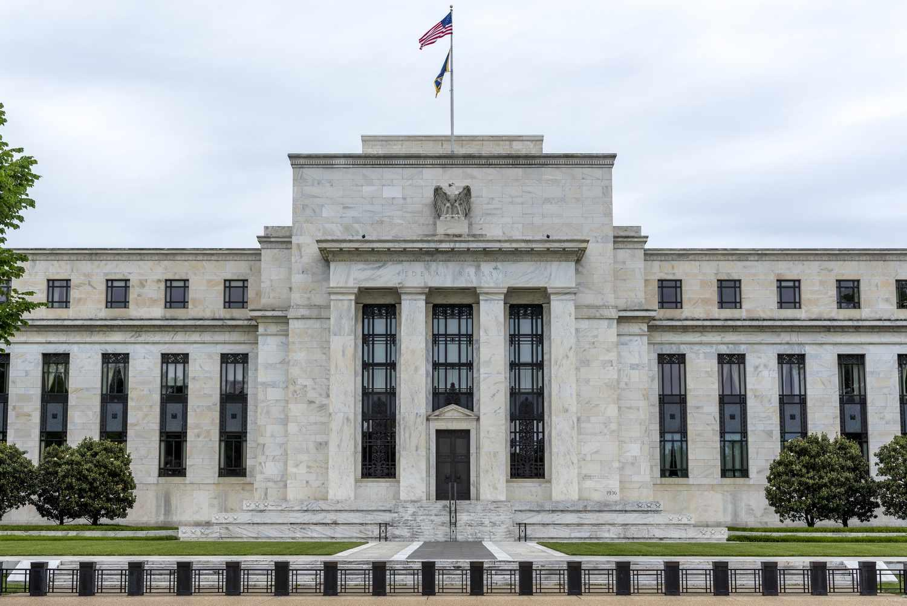

In the financial world, central banks play a crucial role in maintaining the economic stability of a country. The Federal Reserve, as the central bank of the United States, utilizes various monetary policy tools to achieve its economic objectives. Established in 1913, the Federal Reserve is tasked with managing the nation’s currency, money supply, and interest rates to ensure financial stability and foster economic growth. These objectives are pursued through mechanisms such as open market operations, discount rates, and reserve requirements. By adjusting these levers, the Federal Reserve influences economic activities, including consumption, investment, and inflation.

With the advent of technology, the reliance on algorithmic trading has increased significantly. Algorithmic trading, or algo trading, utilizes computer programs to execute trades based on pre-set rules, employing mathematical models and high-frequency trading techniques. This method allows traders to capitalize on fleeting price discrepancies, enhancing market efficiency by increasing transaction speed and liquidity while reducing costs.

This article explores how the Federal Reserve's monetary policy impacts financial markets and how algorithmic trading interacts with these policies. The complex interplay between monetary policy and algorithmic trading means that Federal Reserve announcements, particularly those related to interest rates, can cause significant market movements. Algorithmic trading systems may react instantaneously to these changes, affecting market volatility and trading dynamics.

Understanding the principles of central banking and the role of the Federal Reserve, alongside the effects of their monetary policy decisions on algorithmic trading, is essential. This examination offers investors, policymakers, and financial institutions valuable insights into navigating and optimizing strategies within modern financial markets.

## Table of Contents

## Understanding Central Banking and the Federal Reserve

Central banks, such as the Federal Reserve, are pivotal institutions within the financial system, tasked with managing a nation's currency, regulating its money supply, and setting interest rates. These responsibilities are integral to ensuring financial stability and fostering economic growth. The Federal Reserve, often referred to simply as "the Fed," was established in 1913 in response to a series of financial panics that highlighted the need for a central banking system in the United States. It serves as the central banking system of the United States, overseeing and regulating the banking industry and implementing monetary policy.

The Federal Reserve's structure is a complex system designed to balance various interests. It comprises three key entities: the Board of Governors, the 12 regional Federal Reserve Banks, and the Federal Open Market Committee (FOMC). The Board of Governors, which includes seven members appointed by the President and confirmed by the Senate, acts as the central governing body. It is responsible for guiding the Fed's policies and operations and ensuring that these align with the broader goals of financial stability and economic growth.

The 12 regional Federal Reserve Banks operate across the United States, providing a decentralized component to the system. Each regional bank serves its district and monitors local economic conditions, contributing to the formulation of national monetary policy. This regional approach allows the Federal Reserve to effectively address the unique economic needs and challenges of different areas within the country.

The Federal Open Market Committee (FOMC) is perhaps the most well-known aspect of the Federal Reserve, tasked with overseeing open market operations, which are the Fed's primary tool for implementing monetary policy. The FOMC consists of the seven members of the Board of Governors and five Reserve Bank presidents, with the president of the Federal Reserve Bank of New York serving as a permanent member. The remaining four seats are filled on a rotating basis by the other 11 regional bank presidents. This committee meets regularly to set target interest rates and examine the nation's economic outlook, ultimately dictating the direction of U.S. monetary policy.

A key feature of the Federal Reserve is its independence, which allows it to execute monetary policy without direct authorization from the government. This independence is crucial for maintaining monetary policy's credibility and ensuring decisions are made based on economic merits rather than political pressures. However, this does not mean the Fed is entirely unaccountable. The President appoints members of the Board of Governors, and the institution must report to Congress, thus maintaining a level of oversight and accountability within the governmental framework.

Overall, the Federal Reserve's structure and responsibilities ensure it can effectively manage the U.S. economy's monetary aspects. Through its regulatory and policy-setting functions, the Fed aims to maintain financial stability, promote sustainable economic growth, and ensure the resilience of the financial system in times of economic fluctuations.

## Monetary Policy Tools of the Federal Reserve

Monetary policy tools devised by the Federal Reserve serve as fundamental mechanisms to regulate the money supply and steer the economy toward desired objectives. To achieve this, the Federal Reserve primarily utilizes open market operations, discount rates, and reserve requirements.

Open market operations involve the strategic buying and selling of government securities in the open market. This process is central to influencing the amount of cash in the banking system. When the Federal Reserve buys government securities, it injects [liquidity](/wiki/liquidity-risk-premium) into the financial system, effectively increasing the cash available to banks. Conversely, selling government securities withdraws liquidity from the banking system, thus decreasing the available cash. These transactions are decisive in setting the federal funds rate, which is the rate at which banks lend to each other overnight. The operations are conducted by the Federal Open Market Committee (FOMC), which plays a vital role in implementing U.S. monetary policy.

The discount rate is another crucial tool. It is the [interest rate](/wiki/interest-rate-trading-strategies) charged to commercial banks and other depository institutions on short-term loans obtained from the lending facilities of the Federal Reserve Banks, known as the discount window. Adjustments to the discount rate influence the cost of borrowing for banks, which in turn affects the rates these banks charge their customers. A lower discount rate encourages banks to borrow more, increasing their ability to extend credit to businesses and consumers, while a higher rate has the opposite effect.

Reserve requirements refer to the mandates imposed by the Federal Reserve on the minimum amount of reserves a bank must hold against its deposits. These requirements are instrumental in ensuring the liquidity and solvency of banks. By altering reserve requirements, the Federal Reserve can directly impact the lending capacity of banks; reducing reserve requirements increases the potential for banks to lend, thereby expanding the money supply, whereas increasing reserve requirements restricts lending and contracts the money supply.

Each of these tools plays a distinct yet interconnected role in guiding economic policy and maintaining monetary stability, and their effective implementation is crucial for sustaining economic growth and controlling inflation.

## Impact of Federal Reserve's Monetary Policy on Financial Markets

Federal Reserve policies exert a profound influence on financial markets by shaping liquidity, interest rates, and the broader economic environment. One of the primary instruments through which the Federal Reserve influences these factors is the federal funds rate, manipulated largely by the Federal Open Market Committee (FOMC). Adjustments to this rate have direct repercussions on borrowing costs for both consumers and businesses. 

A primary tool in the Federal Reserve's arsenal is the modulation of interest rates to either stimulate or cool down the economy. When the Federal Reserve adopts a loose monetary policy, it lowers interest rates, which encourages borrowing and investment. Lower interest rates reduce the cost of borrowing, thereby incentivizing businesses to invest in expansion and consumers to spend on big-ticket items like homes and cars. This increase in spending and investment fosters economic growth and can drive up asset prices, creating a wealth effect that further stimulates spending.

Conversely, a tight monetary policy is deployed to control inflation by raising interest rates and curbing the money supply. Higher interest rates increase the cost of borrowing, thus discouraging consumer spending and business investment. As a result, demand across the economy contracts, putting downward pressure on inflation. However, this can also result in higher unemployment and decreased economic growth in the short term as companies and individuals adjust to the higher cost of capital.

The dynamic interplay between these monetary strategies underscores the significant role of the Federal Reserve in stabilizing the economy while responding to evolving financial conditions. The impact of these policies is further amplified by technology and financial innovations, such as [algorithmic trading](/wiki/algorithmic-trading), which can react instantaneously to changes in monetary policy, altering market liquidity and [volatility](/wiki/volatility-trading-strategies), as they navigate the economic signals emitted by the Federal Reserve’s policy decisions.

## Algorithmic Trading: An Overview

Algorithmic trading employs advanced mathematical models and bespoke software to execute trading decisions at high speeds and frequencies, often without direct human intervention. This approach allows traders to exploit transient price discrepancies that can exist for only milliseconds. The use of algorithms in trading precisely times, prices, and quantifies trades, leading to more efficient financial operations.

The genesis of algorithmic trading can be traced back to the increasing complexity and velocity of financial markets, which called for more sophisticated tools than those traditionally employed. By using mathematical models and algorithms, traders can execute large orders systematically, minimizing the risk of human error and achieving consistency in responses to market stimuli.

One defining feature of algorithmic trading is its ability to enhance market efficiency. By facilitating quick trades, it ensures that price discrepancies are rapidly corrected, thereby improving price discovery. Algorithms can be programmed to react to specific market triggers, such as price fluctuations or volumes, executing trades when certain conditions are met. This kind of programming reduces transaction costs by optimizing the timing and size of trades, a strategy that can be partly attributed to minimizing market impact and taking advantage of liquidity dynamics.

Furthermore, algorithmic trading has proven pivotal in increasing market liquidity. As these algorithms execute trades at optimal times based on real-time data analysis, they contribute to a more active trading environment. Their presence ensures that buyers and sellers are matched more efficiently, which can tighten bid-ask spreads and reduce volatility over time.

Algorithmic trading also supports various strategies, including [market making](/wiki/market-making), statistical [arbitrage](/wiki/arbitrage), and [trend following](/wiki/trend-following). In market making, algorithms submit simultaneous buy and sell orders to capitalize on bid-ask spreads. Statistical arbitrage uses sophisticated models to identify trading opportunities across multiple securities. Trend-following algorithms analyze market data to detect and capitalize on market trends.

Python is commonly used in developing algorithmic trading systems due to its flexibility and comprehensive libraries tailored to data analysis and financial modeling. For example, the `pandas` library is employed for data manipulation, while `numpy` supports mathematical functions. Libraries like `TA-Lib` provide technical analysis functions, facilitating [backtesting](/wiki/backtesting) and strategy development.

In conclusion, algorithmic trading has revolutionized financial markets, offering unparalleled efficiency, reduced transaction costs, and enhanced liquidity. As technology continues to evolve, the potential for algorithmic trading to further transform financial landscapes remains significant.

## Intersection of Federal Reserve Policy and Algorithmic Trading

Federal Reserve announcements, particularly those related to interest rate decisions, are known to cause significant fluctuations in financial markets. Algorithmic trading systems are designed to respond swiftly to such announcements, thereby capitalizing on these rapid market movements. The speed and precision of algorithmic trading allow traders to optimize their trading strategies, resulting in increased profitability.

Algorithmic trading algorithms often incorporate models that predict market behavior based on various inputs, including economic indicators and central bank announcements. For example, when the Federal Reserve changes interest rates, algorithms can assess the potential market impact and adjust trading positions in milliseconds. This capability enables traders to exploit short-term price movements that may arise from shifts in investor sentiment or liquidity.

The correlation between Federal Reserve policies and market volatility, as influenced by algorithmic trading, remains a subject of active research. The potential causation of increased volatility due to the swift execution of trades by algorithms is an ongoing concern. While these trading strategies have been credited with enhancing market liquidity by providing continuous buying and selling pressure, they also introduce complexities that need careful management, particularly during periods of monetary policy adjustment.

Risk management strategies must be adaptive to cope with the volatility generated by algorithmic trading around Federal Reserve announcements. Effective risk management includes having robust systems in place to handle large volumes of trades and implementing controls to mitigate the risks associated with high-frequency trading. Institutions often use stress testing and scenario analysis to prepare for potential market shocks resulting from unexpected policy changes.

As market participants and regulators continue to scrutinize the intersection of monetary policy and algorithmic trading, the evolution of regulatory frameworks and trading strategies is essential. The aim is to optimize the advantages offered by algorithmic trading while minimizing the systemic risks associated with its rapid proliferation in financial markets.

## Risks and Challenges of Algorithmic Trading in the Context of Monetary Policy

Algorithmic trading, while advantageous in terms of efficiency and liquidity, presents notable risks and challenges, especially within the context of monetary policy changes enacted by central banks like the Federal Reserve. These challenges primarily stem from the speed and complexity of automated trading systems, which can exacerbate market volatility and create systemic risks.

One significant risk arises from the ability of algorithmic trading systems to respond rapidly to unexpected policy changes. When the Federal Reserve announces a sudden shift in interest rates or other monetary policy tools, the resultant market reactions can be swift and pronounced. Algorithmic systems, designed to exploit small price discrepancies, can amplify these reactions, leading to spikes in volatility. This phenomenon is often observed during periods when market signals are interpreted simultaneously by numerous algorithms, potentially leading to cascading effects and flash crashes.

Ensuring that algorithmic trading systems are resilient against such market shocks is a core challenge. Traders and firms must implement robust risk management protocols to mitigate potential adverse impacts. For instance, circuit breakers and volatility controls may be deployed to temporarily halt trading under extreme conditions, preventing rapid price swings and maintaining market stability.

Regulatory bodies have increasingly turned their attention to systemic risks posed by algorithmic trading. They emphasize the need for comprehensive oversight and risk management frameworks that can effectively govern the fast-paced trading environment. This includes scrutinizing algorithmic strategies for fairness and functionality, as well as ensuring that they comply with existing financial regulations.

Collaboration between regulatory authorities and market participants is essential to optimizing the benefits of algorithmic trading while mitigating its inherent risks. Joint efforts could focus on developing standards and practices that enhance transparency and accountability within trading systems. By fostering a cooperative approach, the financial industry can balance the innovative advantages of algorithmic trading with the necessity for orderly and stable markets, even in the face of evolving monetary policies.

## Conclusion

Central banking and algorithmic trading are pivotal elements in today's financial ecosystem, each shaping the dynamics of global markets. The Federal Reserve's monetary policy decisions are fundamental drivers of market behavior and remain central to the formulation of trading strategies. Changes in interest rates and other policy measures by the Fed can lead to significant market movements, providing both challenges and opportunities for market participants.

Algorithmic trading, with its capacity for high-speed execution and analysis, delivers numerous efficiencies and advantages such as enhanced market liquidity, reduced transaction costs, and improved market efficiencies. However, it also introduces challenges that necessitate a continuous evolution in regulatory practices and trading strategies. The rapid execution capabilities of algorithmic systems can exacerbate market volatility, especially in response to unexpected policy changes. Ensuring resilience and robustness of trading platforms to withstand these shocks is of paramount importance.

Effective risk management frameworks and regulatory oversight are crucial to harnessing the benefits of algo trading while mitigating systemic risks. Collaboration between regulators and market participants is essential to maintain fair and orderly markets. It is vital for investors, policymakers, and financial institutions to comprehend the intricate relationship between monetary policy and algorithmic trading. This understanding enables them to navigate the complexities of modern financial markets with greater efficacy, ensuring stability and promoting sustained economic growth.

## References & Further Reading

[1]: ["Advances in Financial Machine Learning"](https://www.amazon.com/Advances-Financial-Machine-Learning-Marcos/dp/1119482089) by Marcos Lopez de Prado

[2]: ["Algorithmic Trading: Winning Strategies and Their Rationale"](https://www.wiley.com/en-us/Algorithmic+Trading%3A+Winning+Strategies+and+Their+Rationale-p-9781118460146) by Ernest P. Chan

[3]: ["Evidence-Based Technical Analysis: Applying the Scientific Method and Statistical Inference to Trading Signals"](https://www.amazon.com/Evidence-Based-Technical-Analysis-Scientific-Statistical/dp/0470008741) by David Aronson

[4]: ["Machine Learning for Algorithmic Trading"](https://github.com/stefan-jansen/machine-learning-for-trading) by Stefan Jansen

[5]: Woodford, M. (2003). ["Interest and Prices: Foundations of a Theory of Monetary Policy."](https://www.jstor.org/stable/j.ctv30pnvmf) Princeton University Press

[6]: ["Federal Reserve Board - Monetary Policy"](https://www.federalreserve.gov/monetarypolicy.htm) - Official website of the Federal Reserve Board

[7]: Biais, B., Foucault, T., & Moinas, S. (2011). ["Equilibrium High Frequency Trading."](https://www.semanticscholar.org/paper/Equilibrium-Fast-Trading-Biais-Foucault/49aa851da956573b88c13c9148ea43567bf8b86f) Journal of Financial Economics

[8]: Aldridge, I. (2013). ["High-Frequency Trading: A Practical Guide to Algorithmic Strategies and Trading Systems"](https://www.wiley.com/en-us/High+Frequency+Trading%3A+A+Practical+Guide+to+Algorithmic+Strategies+and+Trading+Systems-p-9780470579770) by Irene Aldridge

[9]: Bernanke, B. (2020). ["21st Century Monetary Policy: The Federal Reserve from the Great Inflation to COVID-19"](https://www.amazon.com/21st-Century-Monetary-Policy-Inflation/dp/1324020466) by Ben S. Bernanke